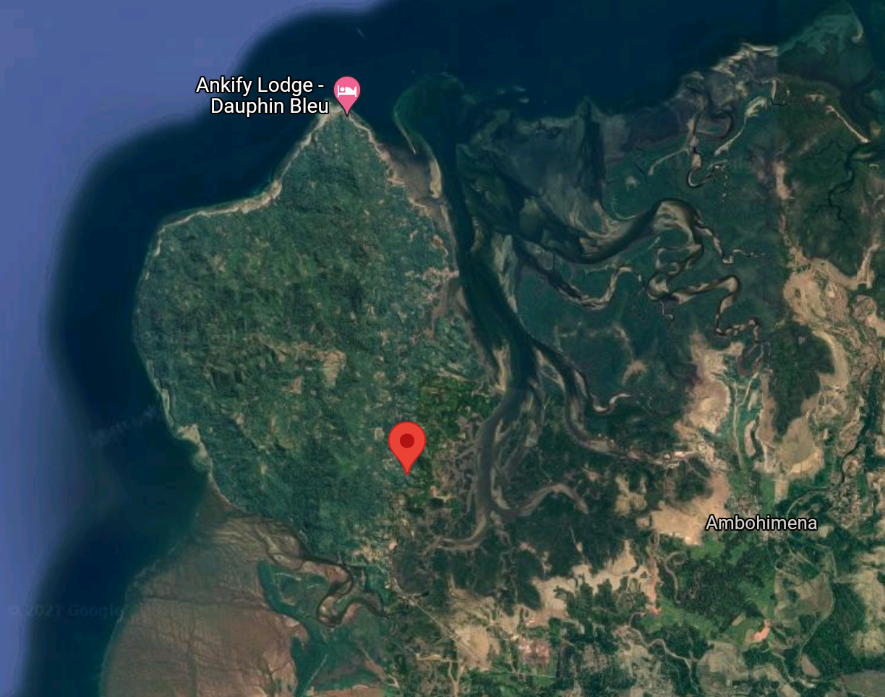

Panther Chameleons (Furcifer pardalis) display an amazing variety of colors within distinct locales that are physically separated by mountains, oceans, rivers and mangrove forests. The Panther Chameleon hobby has never had a reliable way to test animals for locale origin, and we have had to rely on import labels, guessing locale based off of male phenotypes, or what the breeder one gen upstream said. However, females do not display their phenotype and have always been "proven out" by breeding with a male from an assumed locale and observing their offspring to determine if they look like we would expect. There is significant overlap among phenotypes across locales, and it requires expert knowledge to determine an animal's true locale. It may even be impossible without good lineage information. This has resulted in a lot of locale crosses in captive breeding projects. Some locale crosses have had sterility issues and many hobbyists would prefer to work with pure locale animals. Other hobbyists would just like to know the locale breakdown in a given animal that they would like to breed.

**This genetic test could fundamentally change our hobby and give us scientifically-backed evidence of locale lineage for the first time!** 

## Funding Tiers:

Tier 1 ($150)

- 1x free test during R&D phase

Tier 2 ($300)

- 2x free tests during R&D phase

Tier 3 ($500)

- Listed as a platinum sponsor (below)
- 3x free tests

# Quick Primer

Mitochondrial DNA (mtDNA) is inherited from the female and not recombined with nuclear (nuDNA) from the male during sexual reproduction. Therefore, any changes to the mtDNA can be directly attributed to a mutation somewhere up the maternal ancenstry tree because it is inherited from the female. These mutations occur roughly once every couple hundred generations, and neither the USA nor the EU have produced enough generations of Furcifer pardalis in captivity to expect more than one mtDNA mutation away from their wild ancestors. Maternal haplogroups are a very good way of looking back in time to a common ancestor and placing our captive animals in a specific location in the wild. [Here](https://ase.tufts.edu/chemistry/hhmi/documents/Protocols/Maternal%20Ancestry_Introduction_Reworked_Aug_25_2011.pdf) is a decent intro if you want to read more.

**Haplotype**: a combination of alleles or a set of single nucleotide polymorphisms present on the same chromosome that are passed along generations from a single parent.

**Haplogroup**: a group of similar haplotypes that share a common ancestor

# Test Methodology

*We've done our best to translate Grbic et al. 2015 into trade-relevant language with locale names instead of haplogroups, but it is pretty technical. Feel free to jump on the comment thread below and let us know if you have any questions.*
 
This test will compare each submission to baseline data collected in 2011 from 324 wild specimens in Madagascar, sequenced and geo-coded by [Grbic et al, 2015](https://onlinelibrary.wiley.com/doi/full/10.1111/mec.13241). We expect the test's requirement to be a piece of shed skin the size of a quarter or larger, but we will need to run a few examples to see if the genetic material found in chameleon skin is sufficient (it is for many lizard species). 

We will examine both the mtDNA and nuDNA in the sample and match it with the 11 haplogroups identified in Grbic et al. Wild Furcifer pardalis populations are isolated enough that locales have a minumum of 6 unique genetic mutations that are not shared by any other population. As we discussed earlier, that genetic distance is much larger than any cb line could have developed in captivity. There are a lot more than 11 locales listed on [MadCham](https://www.madcham.de/en/category/chamaeleons-habitatsdaten/lokalformen-von-furcifer-pardalis/), so there will be gaps in the initial test. See the haplogroup Key below for details.

In their paper, Grbic et al. created these **genealogical UMP networks** to map out the mutations that define the haplogroups:

<small>*Panther chameleon mtDNA genealogical UMP (Cassens et al. 2005) network*. Haplotypes are represented with coloured circles, the sizes of which are proportional to the number of individuals (smallest = 1, largest = 72). Inferred missing haplotypes are shown as small black dots, and each line indicates a mutational change (numbers of mutations >1 are shown inside larger black dots). Haplotypes are grouped into colour-coded haplogroups; sub-haplogroups 1a and 1b correspond to samples from the northwest coast and the island Nosy Komba, respectively. Haplotypes in white with grey border circles correspond to animals from Reunion (R) and the pet market (L1–L3). (Grbic et al., 2015)</small>

### Haplogroup Key
|Locale  | Haplogroup |
|------------------ | -------------:|
|Ambanja  | 1a |
|Nosy Komba  | 1b |
|Nosy Be   |   2 |
|Ambilobe East | 3 |
|Ankify | 4* |
|Ambilobe East, Antsiranana (Diego Suarez) | 5 |
|Amber Mountain | 6 |
|Ambilobe West, Daraina | 7 |
|Vohemar | 8 |
|East Coast, Nosy Boraha | 9 |
|Andapa, Sambava, Antalaha | 10 |
|Between Sambava and Vohemar | 11** |
<small>
\* 1 sample
** 2 samples
</small>

---

<small>*Panther chameleon nuDNA network* produced with the median-joining approach (Bandelt et al. 1999). RAG1 alleles are represented with circles the sizes of which are proportional to the number of individuals bearing the corresponding allele. Each allele is labeled following the colour-code of the mt haplotype of the corresponding individual. When an allele is found in individuals exhibiting different mt haplotypes, the proportions of individuals with different haplotypes are indicated in the form of a pie chart. Inferred missing alleles are shown as small black dots and each line indicates a mutational change (numbers of mutations >1 are shown inside larger black dots). Haplotypes in white with grey border circles correspond to animals from Reunion (R) and the pet market (93 – 101).</small>

### RAG1 Allele 1 & 2 Key
|Locale  | Alleles |
|------------------ | -------------:| 
|Ambanja  | A2, A4, A8, A10, A14, A22, A27, A44-A47, A51  |
|Nosy Komba  | A2, A4, A5, A9, A31, A32, A50 |
|Nosy Be   |   A2, A4, A9, A10, A16, A28-A30, A48, A49 |
|Ambilobe East | A2, A5, A8-A10, A22, A29, A52 |
|Ankify | A10* |
|Amber Mountain, Ambilobe East, Antseranana (Diego Suarez) | A2-A5, A8, A10, A12, A24-A26, A33-A34, A37-A38, A66-A70 |
|Amber Mountain | A2, A5-A6, A8, A11-A13, A17, A19, A23, A25, A33, A35, A36, A39, A53-A65, A71-A74 |
|Ambilobe West, Daraina | A1, A2, A5, A11-A13, A20, A23, A34, A40, A75-A82 |
|Vohemar | A1-A3, A5-A6, A15, A19-A20, A36, A38, A40-A42, A88-A90 |
|Andapa, Sambava, Antalaha | A1-A3, A5-A7,  A15, A18, A21, A41, A83-A87 |
|East Coast, Nosy Boraha | A1, A3, A43, A91 |
<small>
\* 1 sample
</small>

---

### Ambilobe

We usually think of Ambilobe as a coherent locale. However, this analysis shows that the western population between Ambilobe and Sirama is quite different from the eastern population found along the road towards Daraina. There is a mountain range that runs from the northeast of Ambilobe down to the southwest, and my guess is that is why there is this east-west divide. The eastern population is also at a much higher elevation, so there probably is some level of local adaptation occurring there. Our test could help identify the animals that could benefit from some cooler nighttime temps like their higher elevation ancestors if they're in haplogroup 7 vs the lowland haplogroup 3 group. I'm very curious to see how my Ambilobe shake out!

### Ankify
I looked up the exact coordinates of the pink dot (haplogroup 4). That sample was taken just north of the mangrove forest that separates Ambanja from Ankify, in Ankify!

 

haplogroup 4 only had 1 individual in it, but this is initial evidence that the Ankify population does not breed with other Ambanja in the wild because there was a noticeable genetic separation of 21 unique mutations relative to the main Ambanja haplogroup. Interestingly, Ankify split off the tree before Ambilobe. There are a number of other "sub-locales" or small distinct populations along the northwest coast between Ambanja and Ambilobe as well as within the Ambanja range. It would be amazing if we could get better data on some of those populations.

### Andapa, Antalaha, and Sambava
Grbic et al. identified a single haplogroup that includes what we would commonly consider three distinct locales. If you look at the light green, haplogroup 10, in the UMP network (above), you will see it is one of the largest samples. There are very few mutations separating each node, but lots of nodes. That means that there is enough movement and interbreeding among these three locales that a genetic test will probably not be able to distinguish between them. We'll see if there is an identifying mutation as we get more samples, but initially the test will just report haplogroup 10 for all three.

# Test Results

We will report the mtDNA haplogroup match for each available haplogroup followed nuDNA RAG1 allele 1 & 2 matches. There are a few popular locales that Grbic et al. did not sequence (Tamatave, Ankaramy, etc), so those will be gaps that we need to fill in future iterations of the test.

## Post-R&D Cost
After we finish developing the test, they should be available to the general public @ [Rare Genetics, Inc.](https://raregeneticsinc.com/)

- ~$75 per test

# Sponsors

Huge thanks to everyone who pitched in! I'm extremely happy to see how many people dug into their pockets during this holiday season and supported this project.

Donald Hedger, Stephanie Payne, Debbie Tobar, Erik Flores (Hill Country Chameleons), Julie Mokry, Leigh Hrutkay (Cloud9Chameleons), Corey Zetterman, Nicole Park, Isaac Martin Giacobone Schwartz, Sean Fogarty, Emily Lunsford, Jake Dynnis (Eye Candy Chameleons), Nathan Boyd, Bill Strand (Dragonstrand), Greg Meehan, Elliot Imler, Jason Townsend, King Chams, Adam James (Lonestar Panthers), Sarah Kelehear

## Tier 1

Heather Hallen-Adams, Jennifer Betz (Chamelicious Chameleons), Chris Young, Zachary Williford, Robert Hill

## Tier 2

Christian Schmidt (Monterey Chameleons)

## Platinum Sponsors

These platinum sponsors are companies that decided to step up and improve the science of chameleon keeping in a big way. Everyone who benefits from this new capability will be able to look back and recognize their historic contribution to the hobby, and I seriously hope you give them the props (and sales) they deserve!

1. [Spectrum Chameleon Co.](https://spectrumchameleonco.com/)
2. [West Coast Chameleon Brothers](https://www.chameleonbros.com/)
3. [FramsChams Chameleon Breeders](https://framschams.com/)
4. [iPardalis](https://ipardalis.com)
5. [Coastal Camden Chameleons]()
6. [Nature's Van Gogh](https://www.instagram.com/naturesvangogh/)
7. [McZoo Exotics](https://mczooexotics.com/)
8. [Roberson Reptiles](https://www.robersonreptiles.com)