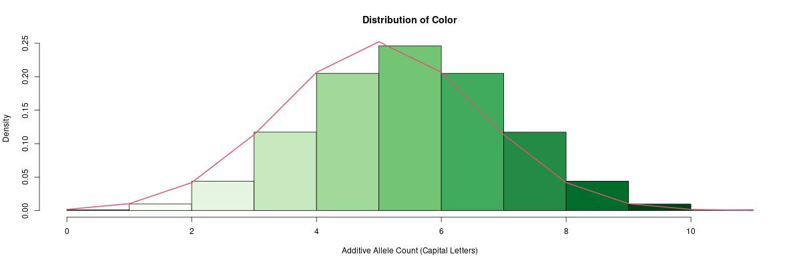

```{r setup, include=FALSE}
knitr::opts_chunk$set(echo = FALSE)
require(gt)
require(genetics)
require(RColorBrewer)
require(dplyr)
require(tidyr)
require(stringr)
require(rmarkdown)
source("helpers.R")
```

# TLDR;

1.  Most individuals have multiple body colors because the complete absence of a color is extremely rare. If a color is found in that locale, you usually can find at least some of it somewhere on every individual's body from that locale.
2.  Offspring can have more of a given color than either of their parents (just like a human child can be taller than BOTH parents)
3.  Environmental factors, like being raised in groups vs raised individually, can have a significant impact on the color of the animal, just like height, eye color and disease resistance in humans (those are polygenic traits, too!)
4.  There are no dominant or recessive genes that control color in Furcifer pardalis (Panther Chameleons), just contributing alleles and non-contributing alleles. They have an additive affect and create a continuous distribution, not a discrete outcome. This means there are no alleles which skip a generation and express themselves when combined with a second recessive allele. They either contribute a color or they don't.
5.  This article purposely avoids discussing traits like red rain, color changes based on mood, and what I call a "sheen" (when one color melts into another color and appears to be a third color from a distance). Furcifer pardalis are complicated...

------------------------------------------------------------------------

# Introduction

Furcifer pardalis do not exhibit simple dominant, co-dominant or recessive trait inheritance of their body color. As you can see from our [past clutches](https://ipardalis.com/categories/past-clutches/), every single individual is completely unique. They all lie on a spectrum with a huge variety of outcomes.

In humans, a good example of a polygenic trait is height. It is why a child can be taller than BOTH parents, but they're usually around the same range. Many polygenic traits, like height, are also extremely sensitive to environmental factors. Polygenic traits force us to talk about distributions of possibilities instead of discrete outcomes. Given that I breed panther chameleons, but I work as a data scientist, I am excited to write about probability and distributions of color!

The following theory about how body color is inherited in Furcifer pardalis (Panther Chameleons) will hopefully help dispel a few common myths about where their body color comes from. We will purposely avoid color changes which occur during excitement, relaxation, basking, mating, sleeping etc. However, it is safe to say those have a genetic component, and we could dig into it at some point. It should be noted that body color is not a pigment in the skin but instead is produced by specialized organs called chromatophores. When we talk about a body color we are referring to the ability to produce that color, not a pigment.

# Why not use Mendelian Traits?

Gregor Mendel did some of the earliest genetics experiments by hybridizing pea plants in the 1800s (check out [this explanation](https://en.wikipedia.org/wiki/Mendelian_inheritance) for more detail). He discovered that there was a clear pattern to various traits such as flower color and the height of the plants. Mendel purposely created a hybrid generation of plants and then crossed those hybrids to see what traits were present in subsequent generations. Some traits seemed to dominate others with a ratio of 3:1 in the F2 generation whereas others followed a 1:2:1 pattern that he called in-complete dominance (co-dominance).

The Ambilobe locale has 4 body colors: red, orange, yellow and green. Lets say, for the sake of testing a Mendelian trait inheritance pattern, red is `RR`, orange is `OO`, yellow is `YY`, and green is `GG`. Lowercase letters represent animals without red, orange, yellow or green on their bodies and we use double letters to represent different intensity levels of a given color. A heterozygous red (`Rr`) would be less brightly colored than a homozygous red (`RR`).

Let's say we breed a wild caught Ambilobe with bright green, some yellow and orange (`rrOoYyGG`) to a CB with pure yellow (`rrooYYgg`).

## {.tabset}

### Co-dominant trait

```{r, echo=FALSE, message=FALSE}

data.frame(
  Genotype = c("rrOoYYGg", "rrooYYGg", "rrOoYyGg", "rrooYyGg"),
  Description = c("very yellow, some orange and green", "very yellow some green", "some orange, yellow and green", "some yellow and green"),
  Probability = c(.25, .25, .25, .25)
) %>%
  gt() %>%
  fmt_percent(
    columns = Probability
  )
```

The co-dominant theory would have four possible outcomes.

### Dominant trait

```{r, echo=FALSE, message=FALSE}

data.frame(
  Genotype = c("rrOoYYGg, rrOoYyGg", "rrooYYGg, rrooYyGg"),
  Description = c("very orange, yellow and green", "very yellow and green"),
  Probability = c(.5, .5)
) %>%
  gt() %>%
  fmt_percent(
    columns = Probability
  )
```

The dominant/recessive theory would have just two possible outcomes: very orange, yellow and green or very yellow and green.

## {-}

------------------------------------------------------------------------

Both of these theories are not helpful. Sometimes, a very orange bodied animal will be produced by a pairing between a bright green, orange and red animal and a female from a very yellow dam sire. However, the probability of that is 0% if color is the result of the Mendelian trait pattern modeled above. Therefore, describing body color as a co-dominant/dominant/recessive trait is not accurate for Furcifer pardalis. There is a more complex genotype that produces the super green (`GG`) we see.

# Polygenic Inheritance

Polygenic inheritance offers the best explanation for why an extremely green animal **can** sire offspring with a lot of orange, but, on average, they will sire offspring with green bodies. You cannot look at their phenotype and learn anything specific about their genotype. Polygenic traits lie on a continuous spectrum with additive and non-additive alleles. This helps explain why there is a continuous distribution of shades and intensities of a given color instead of discrete outcomes.

Polygenic inheritance also helps explain why when a yellow body is paired with a red body you get a lot of animals with **both** red and yellow but very few with just one or the other color like you would if they were Mendelian traits. That is because their body color is polygenic. Every phenotype is the expression of a collection of genes instead of the dominance of/interaction between one or two genes.

For example, if three genes control the amount of green, we could represent it as `AABBCC` for the most intense and `aabbcc` for none. Each gene has two alleles (`AA`) and a capital letter represents an additive allele. If four genes impact the green color spectrum, `AABBCCDD` and `aabbccdd` would be the extremes and so on. The following tabset models out some genotypes with different gene counts.

## {.tabset}

### 2 Genes

```{r, echo=FALSE, message=FALSE, results='hide'}
gene_palette(2, "Greens")
```


```{r}
generate_poss_outcomes(2) %>% 
  paged_table(options = list(rows.print = 5))
```

### 3 Genes

```{r, echo=FALSE, message=FALSE, results='hide'}
gene_palette(3, "Greens")
```


```{r}
generate_poss_outcomes(3) %>% 
  paged_table(options = list(rows.print = 5))
```

### 4 Genes

```{r, echo=FALSE, message=FALSE, results='hide'}
gene_palette(4, "Greens") 
```


```{r}
generate_poss_outcomes(4) %>% 
  paged_table(options = list(rows.print = 5))
```

### 5 Genes

```{r, echo=FALSE, message=FALSE, results='hide', warning=FALSE}
gene_palette(5, "Greens") 
```



```{r}
generate_poss_outcomes(5) %>% 
  paged_table(options = list(rows.print = 5))
```

### 6 Genes

```{r, echo=FALSE, message=FALSE, results='hide', warning=FALSE}
gene_palette(6, "Greens") 
```


```{r}
generate_poss_outcomes(6) %>% 
  paged_table(options = list(rows.print = 5))
```

## {-}

We do not know exactly how many genes contribute to a given color spectrum, but these polygenic genotypes more accurately describe what we see. The species has no known discrete recessive traits which dictate color, and there are no colors which dominate within a given locale. This continuous color distribution is encoded for every major color found in the body of each locale. Each animal can produce some of each color along that spectrum instead of discretely producing it or not.

As we add more genes to a given polygenic genotype, the probability that we actually have a "pure" color at the tail of the distribution approaches zero. And it is **only** a pure color at the very edge of the distribution that can guarantee that color in the next gen (kind of like a homogeneous co-dominant/super genotype in a Mendelian trait).

## Why does this matter?

What I have found as a breeder is: once you mix the paint, it is hard to unmix it, and it is very difficult to consistently produce an extreme outcome, like pure red or pure yellow without any other color in the mix. Polygenic traits are fun to work with, but they are not a complete mystery. It gives us a huge area to research, pose hypotheses about and design tests to explore.

In statistics, there is a lot of talk about "regression to the mean." The phrase implies there is a tendency to return to the middle of the distribution, and it is hard to maintain an above average/tail outcome. As you breed Panther Chameleons, it is very easy to end up back in the middle of the distribution of every color.

Even without understanding the exact genotype and number of genes which encode for body color, being able to eliminate Mendelian traits from the mix will help us make better estimates and have the correct expectations for various breeding projects. The process of elimination is a powerful tool!

# Debunked Misconceptions

Knowing that the polygenic inheritance is the best explanation for how body color is determined in Panther Chameleons helps dispel the following myths (feel free to comment in the section below if you can think of more).

1.  **Traits do not skip down the sire side of a pairing.** Grand sires on the sire side are irrelevant to determine body color. Once an animal is at a certain point in the distribution, that position is "sticky". Polygenic traits do not skip generations. They are additive. An individual either has a large number of genes required to produce a color or they don't. If they don't possess the genes required for a specific color, it doesn't matter if their sire did. Their offspring will not be able to unless it comes from the dam side.

2.  Males are not a pure yellow body or pure red body... **every animal lies on a color spectrum** with some small chance of producing a color you don't see (or that you can see when you zoom in).

3.  **The outcome of a pairing is not unknown**, especially for animals that lie close to the tail end of a color spectrum with many additive alleles in their genotype. Those extreme animals are very likely to pass that trait on to their offspring because they possess nearly all of the genes which encode for that trait. Here's what the probabilities look like on a 3 gene polygenic green trait:

    ```{r}
    generate_poss_outcomes(3) %>% 
      group_by(Additive_Alleles) %>% 
      summarise(Probability = 1 - .5^Additive_Alleles, .groups = "keep") %>% 
      distinct() %>% 
      ungroup() %>%
      gt() %>%
      tab_header(
        title = "Probability of passing at least one green Allele",
        subtitle = "3 Gene Polygenic Green"
      ) %>%
      fmt_percent(
        columns = Probability
      )
    ```

4.  The female side of a pairing has two levels of uncertainty: polygenic inheritance **and** an unknown phenotype (female Furcifer pardalis do not express the male traits they carry). People often just look at a female's sire as a proxy for her phenotype. This is a bad estimation method. You really need to see 10+ brothers as well as 3+ sires up her lineage tree to get a decent estimate for her phenotype. Because of how much variety there is in every clutch, you cannot just pick your favorite brother and use him as a proxy for her phenotype. You also need to include the ugliest of the bunch... and average the two for a decent estimate.
