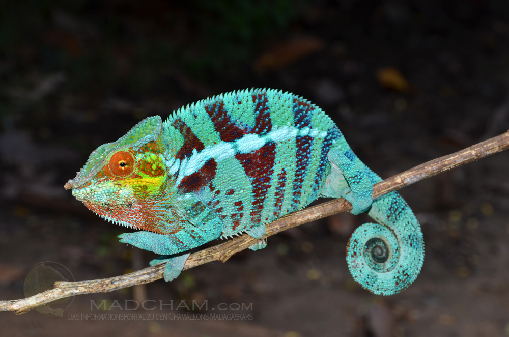
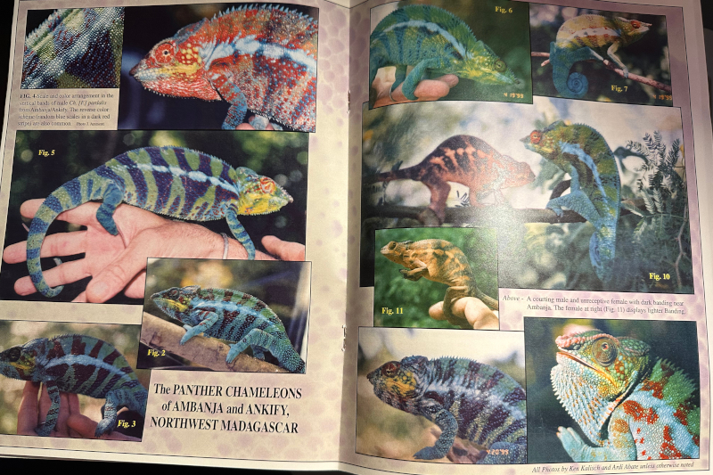
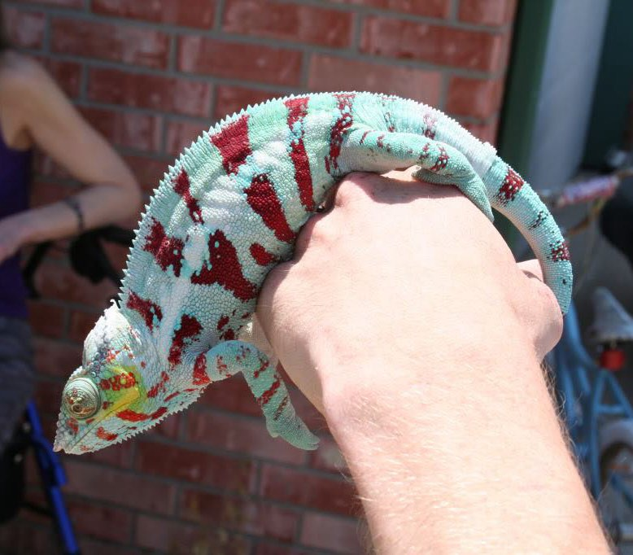
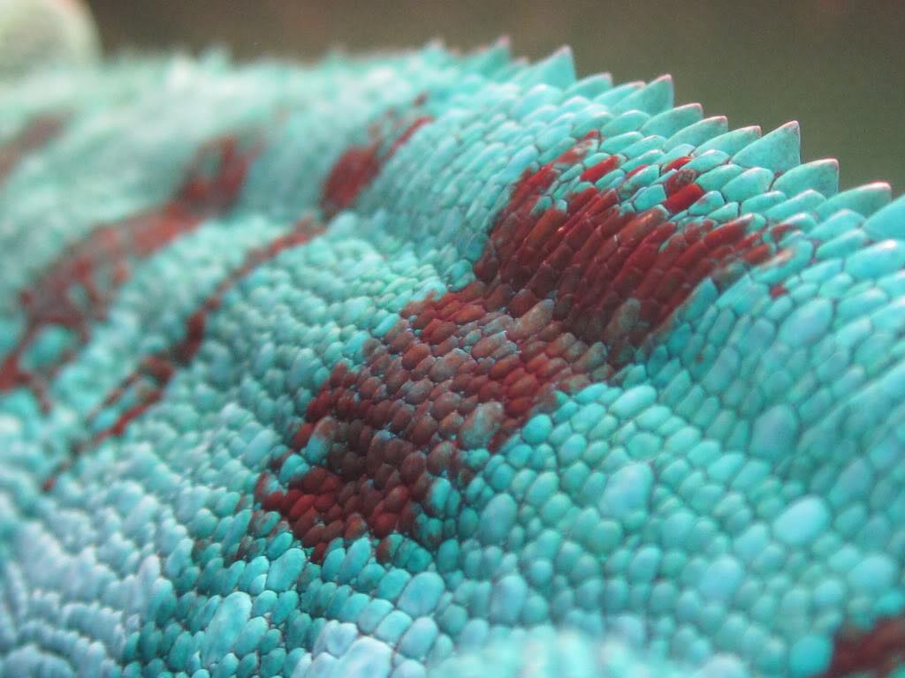
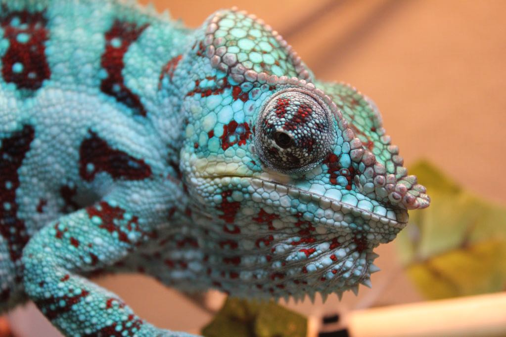
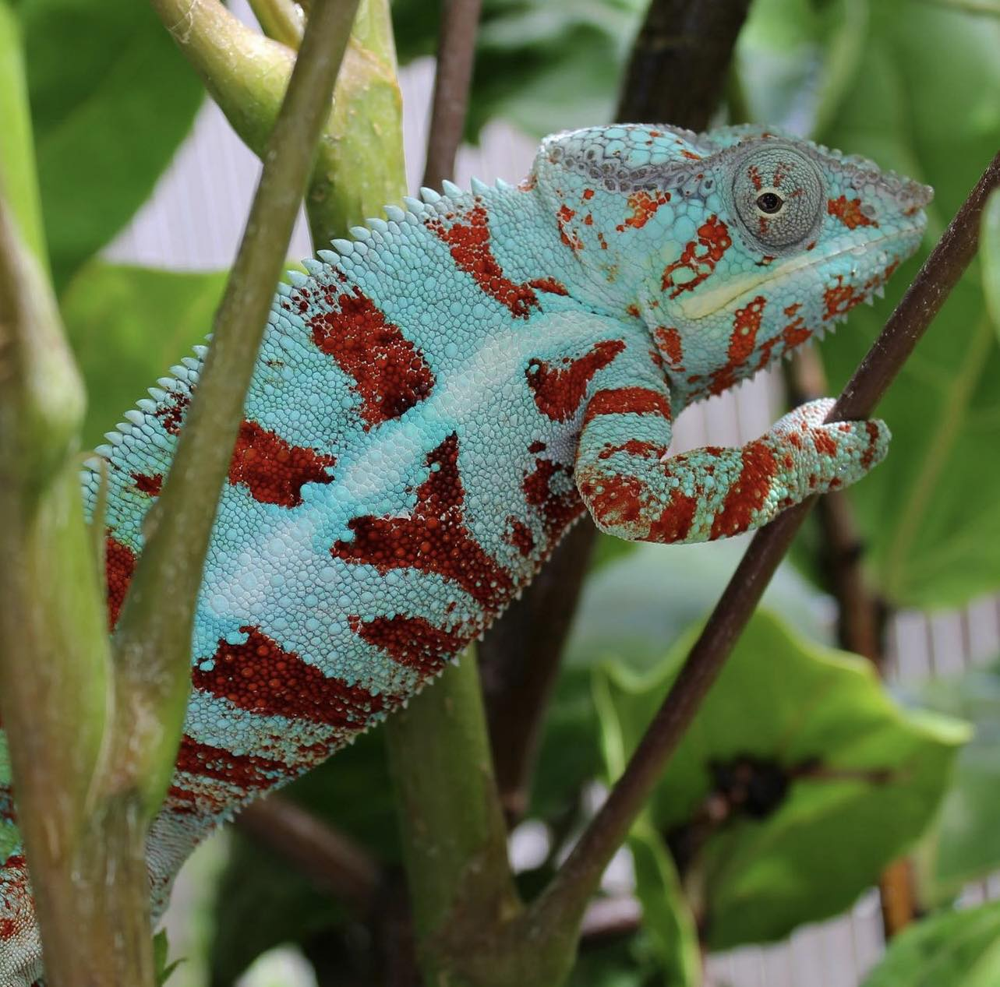
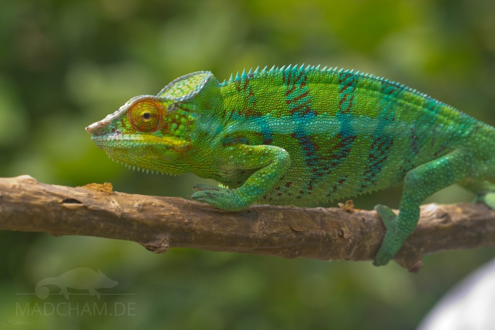
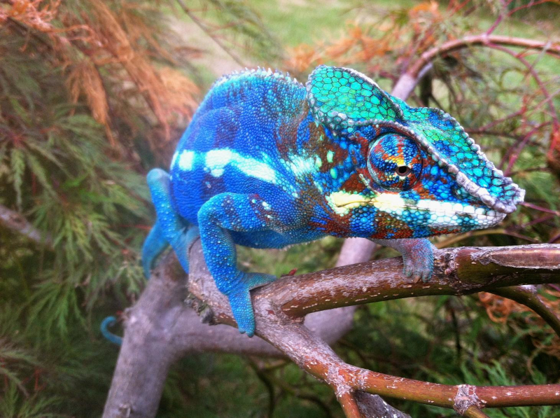

+++
title = "Ambanja Panther Chameleons for sale?"
header_title = "iPardalis | Ambanja Panther Chameleons for sale?"
description = "This article tackles a controversial topic in the Ambanja Panther Chameleon breeding community on what is meant when people say they have an Ambanja Panther Chameleon for sale."
date = "2024-03-03"
categories = ["ethics"]
banner = "img/banners/google_ambanja"
+++

This article tackles a controversial topic in the Ambanja Panther Chameleon breeding community on what is meant when people say they have an Ambanja Panther Chameleon for sale.

## Ambanja on Google
Let's start by googling "Ambanja Panther Chameleon for sale":

<figcaption>Results from Googling 'Ambanja Panther Chameleon for sale'</figcaption>

By my count, only 2, maybe 3, of these 10 images match the wild-type Ambanja phenotype. As anyone in the Panther Chameleon hobby knows, lineage is more important than phenotype in determining an animal's local form. However, I am here to make a controversial argument that phenotype matters. Not for tracking purposes, but to be able to support your claim that a given animal is an Ambanja Panther Chameleon. Even if we are capable of breeding for something new in captivity - and I believe we are - Ambanja is an actual place in Madagascar and the animals in that location have a phenotype which deviates from most of the Ambanja Panthers in the United States.

The other key complication for us here in the United States is the import process. When we say that an animal is Ambanja, we are just repeating what the importer said. However, as Alex Laube, PhD, has pointed out in private conversations, importers usually collect specimens during the wet season when most roads are impassible and the collectors are paid very small sums of money. This can result in many animals from very specific locations which don't necessarily represent the entire region, and there is definitely a bias towards finding (and creating) things we know will sell in the captive market. It also results in many animals being mislabeled by collectors in order to fill out an exporter's requirements from a given region even if the specimen was collected somewhere else. That is much easier than swimming through flood waters to get to the correct spot. This is why we need to focus on Ambanja in Madagascar, not Ambanja on Google.

## Ambanja in Madagascar
Then compare that to pictures of wild specimens from [Madcham.de](https://www.madcham.de/en/lokalform-ambanja/) (I highly recommend you look at every wild, in situ specimen on their website to get a sense for the diversity of the Ambanja local form):

<figcaption>Ambanja Local Form - Madcham.de/en/en/lokalform-ambanja/ </figcaption>

The appearance of Ambanja as described by Madcham.de: 
> The panther chameleons from Ambanja vary a little within the same local form. The most common coloring found around Ambanja in the males is a turquoise green or bluish turquoise all over the body with deep red, broad bands. The red can vary from a deep Bordeaux red to a bright light hydrant red. The eyelids are usually orange. Starting from the eyelids, some animals may show orange or red streaks all over the head area up to the back. Some show turquoise blue spots in the red banding.

And the 33rd edition of The Chameleon Information Network (Fall 1999):

<figcaption>The Chameleon Information Network, No. 33, Fall 1999</figcaption>

According to CIN, Ambanja Panther Chameleons' two consistent features in **all** of the specimens were a "yellow coloration at the commissure of the mouth" and "the downward-turning, flattened rostral projection." They also observed that the vertical bands (bars) on the body are "typically either a deep reddish-maroon with scales of aqua blue scattered randomly in the stripes or a navy blue with reddish and or aqua blue scattered randomly in the stripes" (page 15, No. 33, Fall 1999). These comments have sparked intense debate in the hobby. The yellow at the corners of the mouth seem to be a seasonal change - wet season, yellow, dry season, not yellow. That would be an interesting research topic if someone wants to put a decades-old question to bed. Every other color on their body gets dull during the dry season as well, so context matters; however, that does not open the door to every color in the rainbow. Otherwise, local forms would not exist at all.

So where did this purple panther chameleon come from? And why are some of them so blue? Where did the yellow at the commissure of the mouth go? And why do some Ambanja today have red in weird places (located on their bodies instead of their bars)?

These blue chameleons in the United States, at a minimum, no longer have a phenotype which can, or could ever be, found in Madagascar. So maybe we should remove the Ambanja chameleon from the title and just say blue chameleon for sale or blurple chameleon for sale? It has become very rare to see a classic Ambanja in the USA because most of the lines quickly get crossed with this designer animal.

This story is a long and complex debate with many different perspectives. I get to poke fun from a distance because I have exactly zero interest in breeding the Ambanja local form. It's too hard given how many designer chameleons dominate the USA market, and breeding them has sadly become almost as difficult as some of the rarest Panther Chameleon local forms. How did this happen?

## Ambato and Ankify - all just Ambanja, no?
The first big issue for Ambanja was that importers labelled everything from the town of Ambanja to the coastal plains to the north as "Ambanja." However, if you look at the map (below), there are miles of mangrove forests, large rivers, and mountain ranges which cut off Ankify and Ambato from the mainland populations near the town of Ambanja. Breeders have been repeating what importers say, uncritically, instead of trying to understand if Ankify and Ambato are their own local forms. One of the biggest rumors is that they are "sub-locales" of Ambanja; however, locales are either isolated populations or they interbreed in the wild. There's no such thing as a sub-locale. 


<iframe src="https://www.google.com/maps/embed?pb=!1m14!1m12!1m3!1d155569.31001833983!2d48.46443026855777!3d-13.526964894648092!2m3!1f0!2f0!3f0!3m2!1i1024!2i768!4f13.1!5e1!3m2!1sen!2sus!4v1709528980075!5m2!1sen!2sus" width="400" height="300" style="border:0;" allowfullscreen="" loading="lazy" referrerpolicy="no-referrer-when-downgrade"></iframe>


### Ambato
The Ambato peninsula is less than 1,000 ft from the Island of Nosy Faly - and the animals on the peninsula look surprisingly like animals found on Nosy Faly with some notable differences (below). There's probably a stronger argument that Nosy Faly and Ambato are one local form than the argument that Ambato is part of Ambanja given their proximity and appearance. However, Ambato is a Panther Chameleon locale on its own right. 


<iframe src="https://www.google.com/maps/embed?pb=!1m14!1m12!1m3!1d38899.85439563143!2d48.489935144847635!3d-13.36941188043601!2m3!1f0!2f0!3f0!3m2!1i1024!2i768!4f13.1!5e1!3m2!1sen!2sus!4v1709528289565!5m2!1sen!2sus" width="400" height="300" style="border:0;" allowfullscreen="" loading="lazy" referrerpolicy="no-referrer-when-downgrade"></iframe>


Here is a great post by [Lee Ready](https://readysrainforest.com/) from 2013 on the [chameleonforums](https://www.chameleonforums.com/threads/the-difference-between-ambato-and-ambanja.104788/) describing Ambato and his challenges breeding them in the USA. This gorgeous local form has an off white background with bars which range from royal blue to maroon, often with small dots of the less prevalent color. Their bar colors also tend to stop before reaching the conical scales along their spine.

Here is a summary Lee provided for this article:

> Male Panther Chameleons from Ambato exhibit minimal variation in overall appearance. The prevailing coloration observed in males from Ambato consists of a blue/green body hue, characterized by clean body color without sporadic spots outside the bars. The dominant color phase features striking red bars, with a rare occurrence of some individuals showcasing a blue bar. When engaged in breeding activities, defense, or sunbathing, these chameleons display a notable transformation, transitioning to an ice blue to white body color.

> A distinctive attribute of Ambato males is the absence of color extending from the bars to the uppermost part; it either halts abruptly or fades to no color, seamlessly blending with the body color at the pinnacle of the bar sections and back. Additionally, they boast an extraordinary feature with the most pronounced yellow on the sides of their faces, surpassing that of the other locales in the region (Ambato, Ambanja, Ankify, Nosy Faly). Facial barring can exhibit slight variations, ranging from no barring to heavy barring.

> Moreover, the overall body structure distinguishes them from neighboring locales like Ambanja, with Ambato males presenting a petite size, rounded head, and a more rounded rostral process. This nuanced combination of traits contributes to the unique and fascinating characteristics of the Ambato locale.

<figcaption itemprop="caption">Ambato Panther Chameleons have a beautiful off white background color with bars ranging from blue to maroon</figcaption>

<figcaption itemprop="caption">Ambato Panther Chameleon's bar colors stop before the conical scales along their spine</figcaption>

<figcaption itemprop="caption">Ambato Panther Chameleon</figcaption>

<figcaption itemprop="caption">Ambato Panther Chameleon</figcaption>

### Ankify
The Ankify peninsula is separated from the Ambanja mainland by about 2.5 miles of mangrove forests and it is impassible for chameleons. "Onshore, Ankify is separated from the next local form, Ambanja, by a range of hills and a kilometers broad mangrove belt." (https://www.madcham.de/en/lokalform-ankify/). And as we discussed in the [local test methodology](https://ipardalis.com/blog/2021/12/31/2021-12-31-locale-test/), there is some evidence that the population there is genetically distinct from its neighbors. We just need a larger sample to say that definitively. 

Ankify local form Panther Chameleons as described by Madcham.de:

> The male panther chameleons occurring in Ankify have green-turquoise colors with mainly blue stripes and orange-colored eyes with a yellow corner of the mouth. We have found several times extraordinary huge males. They can be found along the gravel pathway at the coast everywhere in the secondary vegetation.


<iframe src="https://www.google.com/maps/embed?pb=!1m14!1m12!1m3!1d39177.229465959615!2d48.36094930888408!3d-13.573421330631126!2m3!1f0!2f0!3f0!3m2!1i1024!2i768!4f13.1!5e1!3m2!1sen!2sus!4v1709603868951!5m2!1sen!2sus" width="400" height="300" style="border:0;" allowfullscreen="" loading="lazy" referrerpolicy="no-referrer-when-downgrade"></iframe>


<figcaption>Ankify Panther Chameleon from Madcham.de</figcaption>

This guy looks like he could have been included in the CIN spread from 1999! These are some absolutely stunning animals which we should devote the necessary time and dedication to preserving in captivity. However, both Ankify and Ambato have traditionally been crossed into Ambanja in the United States captive breeding community because we have never had enough of each and importers have consistently mislabeled them all as "Ambanja." 

## Enter the blurple "Ambanja"

<figcaption>Blurple 'Ambanja' circa 2012 - https://www.chameleonforums.com/threads/blue-ambanjas-unite.90043/</figcaption>

I often use the term blurple to refer to suspected crosses, but that term out-dates my usage and has been used to describe some wild-type Ambanja phenotypes which have red and blue mixed bars which appear purple. I don't like this "purple" simplification because it is rare for there to be a continuous mix of red and blue resulting in true purple (a continuous blue sheen over a solid red base with reduced bars is much easier to achieve with a true blue Nosy Be body and a red body blue bar Ambilobe). The wild Ambanja phenotype is more often a pixelated red/blue that genetically can throw more red and less blue or more blue and less red in the next generation - similar to Ambilobe bars, but different shades of red and blue and higher degrees of pixelation in Ambanja.

Very early on, 1-2 generations from wild-caught parents, blurples were clearly not wild-type Ambanja. They have more blue than any Ambanja and more red in the body and face than any Ambanja. So please don't tell me they were selectively bred to look that way - it would take more than one or two generations of selective breeding to achieve that result. The best theory I have heard is that they are an F2 cross from a RBBB Ambilobe x Ambanja and a Nosy Be x Ambanja. That is where the red in the body comes from and the extra blue sheen over everything, which creates the appearance of "purple" where the red and blue overlap in an unnatural way. You'll notice that the shade of blue is enhanced by the Ambilobe blue bars but the baby blue body coloring is clearly Nosy Be. There's some Ambanja in there, but it is getting crowded out by the noisy neighbors.

I have never seen a wild-type Ambanja with these traits, nor has anyone who has herped in Madagascar (check out [our conversation](https://youtu.be/VU_HaHR9EyU?si=G_CCf1uswKGnhAai) with Alex Laube, PhD, Lee/Amanda Ready and Thorsten Negro for more discussion on this topic). However, I have met multiple people who said they knowingly crossed RBBB Ambilobe, Nosy Be and Ambanja to produce this phenotype. One of those people claims they sold females to breeders in the United States who kept it hush hush more than 10 years ago, and those got mixed into the founding animals for this designer project. The likelihood that a random mutation simultaneously occurred in a pure Ambanja line which just so happens to create the same polygenic phenotype is essentially zero.

Breeders tend to sell pure locale Panther Chameleons and attempt to preserve wild phenotypes in their breeding programs (we pride ourselves on this). However, this popular designer cross continues to be sold as a pure Ambanja. This common captive phenotype also diverges from all known wild-type Ambanja phenotypes. Perhaps, we should transition from labeling it as an "Ambanja" to recognizing it more accurately as a designer chameleon, beautiful and extremely lucrative given the demand for it.

## Conclusion
There are a lot of stories in the Ambanja breeding community about how Ambanja are "special" and "different from other local forms." Yes, they were traditionally a three-way Ankify, Ambato and Ambanja cross from day 1 - and blurples have thrown Nosy Be and Ambilobe in to make it potentially a 5-way cross combination. That will definitely be hard to predict and exhibit characteristics of other cross locale combinations. There is no genetic explanation for why a species would form consistent local forms in one location and helter skelter rainbow phenotypes somewhere else. We should skeptically view the notion that a local form is "more diverse than any other" - it is much more likely to be multiple local forms combined into one.

There are plenty of projects in which people breed pure Ankify, Ambato and Ambanja. We would make their lives much easier if we stopped new people from repeating the mistakes of the past. At some point, the importation process will not be an option and our captive bred Ambanja will be all that is left for us to continue that phenotype in captivity. I believe we should manage that population well and prepare for a future where we don't have access to fresh, wild-type Ambanja. It is probably just around the corner. Let's try to make sure the chameleons listed under Ambanja Panther Chameleons for sale are in fact Ambanja phenotypes in the future.

