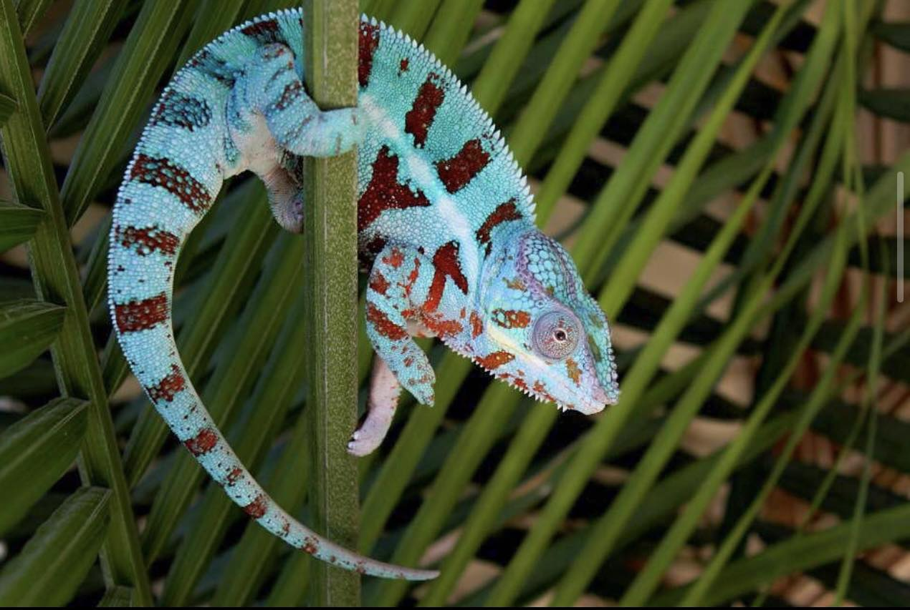

+++
title = "Complete Guide to Ambanja Panther Chameleons"
header_title = "iPardalis | Complete Guide to Ambanja Panther Chameleons"
description = "This guide focuses on the Ambanja Panther Chameleon locality, helping you accurately identify a Panther Chameleon claimed to be from Ambanja, Madagascar."
date = "2024-03-03"
categories = ["ethics", "genetics"]
banner = "img/banners/google_ambanja"
+++

This guide focuses on the Ambanja Panther Chameleon locality, helping you accurately identify a Panther Chameleon claimed to be from Ambanja, Madagascar. It is the first article in a series on the challenges identifying and breeding wild-type local forms of Panther Chameleons. The next one covers the [Ambilobe]() local form. It is because of debates like these that we meticulously document our [Panther Chameleons for sale](). An appeal to authority is not enough, especially as new information and technology are more readily available.

## Ambanja on Google
Let's start by googling "Ambanja Panther Chameleon for sale":

<figcaption>Results from Googling 'Ambanja Panther Chameleon for sale'</figcaption>

By my count, only 2, maybe 3, of these 10 images match the wild-type Ambanja phenotype. Top right two animals are good examples of the F1 cross between Nosy Be and Ambanja. We have some F1 RBBB Ambilobe x Ambanja cross examples below. Those are the two most common locale crosses with Ambanja in the United States, and it is good to learn to recognize them.

As anyone in the Panther Chameleon hobby knows, lineage is more important than phenotype in determining an animal's local form. However, I am here to make a controversial argument that phenotype matters. Not for tracking purposes, but to be able to support your claim that a given animal is an Ambanja Panther Chameleon. Even if we are capable of breeding for something new in captivity - and I believe we are - Ambanja is an actual place in Madagascar and the animals in that location have a phenotypic range which deviates from most of the Ambanja Panthers in the United States. We can't just take any Panther Chameleon in captivity and slap the "Ambanja" tag on it because the pet store said it possesses Ambanja lineage. Phenotype matters.

The other key factor, besides lineage and phenotype, is the export/import process because that is where our captive bred lineage begins. When we say that an animal has Ambanja lineage, we are just repeating what the importer said or what the breeder before us said. However, as Alex Laube, PhD, has pointed out in private conversations, importers usually collect specimens during the wet season when most roads are impassible and the collectors are paid very small sums of money. This can result in many animals from very specific locations which don't necessarily represent the entire region, and there is definitely a bias towards finding (and creating) things we know will sell in the captive market. It also results in many animals being mislabeled by collectors in order to fill out an exporter's requirements from a given region even if the specimen was collected somewhere else. That is much easier than swimming through flood waters to get to the correct spot. 

And in private conversations with Petr Necas about the export/import process: 
> One of my primary concerns is the sourcing of breeding stock, as breeders often do not acquire their Wild-Caught (WC) breeding stock from reliable sources, mainly due to the absence of quality exporters. It is a misconception to assume that when ordering a specific number of Ambanjas, for instance, each chameleon is individually labeled and kept in separate cages throughout the export process. In reality, these reptiles are often placed together in cages, unlabeled, and only identified after removing those that expired during the export process. Consequently, breeders are not dealing with the actual local form they intended but rather with what they believe they have obtained.

> In the case of females, identification is particularly challenging, compounded by the fact that many are already pregnant upon acquisition. Breeding them with a specific male may result in multiple clutches using the sperm of the original (unknown) male, possibly mating in the wild or within the exporter’s facility. This lack of certainty extends to offspring, where the mother is known, but the father remains unidentified, potentially involving mixed stored sperm from multiple males.

> Concerning males, attempting to identify their local form is subjective and unreliable without DNA fingerprinting, a measure that iPardalis is working to establish and offer. While some males may appear typical, the inability to accurately identify certain specimens necessitates reliance on belief rather than certainty. The close proximity of Ambanja, Ankify, Nosy Be, and Nosy Komba further complicates the identification process, as what is commonly considered a true Ankify may actually be Ambanja.

>In light of these uncertainties, the entire debate surrounding chameleon classification gains or loses its meaning. The fundamental challenge lies in the discrepancy between what breeders believe they possess and the actual genetic composition, a determination that currently remains elusive without comprehensive genetic analysis, which, at present, is not feasible. 

Lineage and phenotype information should be used together at all times. Novices will not be able to utilize phenotype given how poorly they understand the phenotypic range for a given local form, so they have to trust their breeder's lineage. However, breeders should do better than simply repeating what someone else told them. We need to start including a phenotypic range, or tolerance zone, for what we are willing to call an Ambanja, regardless of its lineage.

**This is why we need to focus on Ambanja in Madagascar, not Ambanja on Google.**

## Ambanja in Madagascar
Now, let's compare Google images to pictures of wild specimens from [madcham.de](https://www.madcham.de/en/lokalform-ambanja/) (I highly recommend you look at every wild, in situ specimen on their website to get a sense for the diversity of the Ambanja local form) and [chameleons.info](https://www.chameleons.info/en/furcifer-pardalis-2/):

<figcaption>Ambanja Local Form - Madcham.de/en/en/lokalform-ambanja/ </figcaption>

The appearance of Ambanja as described by Madcham.de: 
> The panther chameleons from Ambanja vary a little within the same local form. The most common coloring found around Ambanja in the males is a turquoise green or bluish turquoise all over the body with deep red, broad bands. The red can vary from a deep Bordeaux red to a bright light hydrant red. The eyelids are usually orange. Starting from the eyelids, some animals may show orange or red streaks all over the head area up to the back. Some show turquoise blue spots in the red banding.

And the 33rd edition of The Chameleon Information Network (Fall 1999):

<figcaption>The Chameleon Information Network, No. 33, Fall 1999</figcaption>

According to CIN, Ambanja Panther Chameleons' two consistent features in **all** of the specimens were a "yellow coloration at the commissure of the mouth" and "the downward-turning, flattened rostral projection." They also observed that the vertical bands (bars) on the body are "typically either a deep reddish-maroon with scales of aqua blue scattered randomly in the stripes or a navy blue with reddish and or aqua blue scattered randomly in the stripes" (page 15, No. 33, Fall 1999). These comments have sparked intense debate in the hobby. The yellow at the corners of the mouth seem to be a seasonal change - wet season, yellow, dry season, not yellow. That would be an interesting research topic if someone wants to put a decades-old question to bed. Every other color on their body gets dull during the dry season as well, so context matters; however, that does not open the door to every color in the rainbow. Otherwise, local forms would not exist at all.

So where did this purple panther chameleon come from? And why are some of them so blue? Where did the yellow at the commissure of the mouth go? And why do some Ambanja today have red in weird places (located on their bodies instead of their bars)?

These blue chameleons in the United States, at a minimum, no longer have a phenotype which can, or could ever be, found in Ambanja, Madagascar. So maybe we should remove the Ambanja chameleon from the title and just say blue chameleon for sale or blurple chameleon for sale? It has become very rare to see a classic Ambanja in the USA because most of the lines quickly get crossed with this designer animal.

This story is a long and complex debate with many different perspectives. I get to poke fun from a distance because I have no interest in breeding the Ambanja local form due to its checkered past. The only way I would get involved is with a clean line from WC parents. It's too hard to breed captivebred Ambanja given how many designer chameleons dominate the USA market, falsely labeled "Ambanja", and breeding them has sadly become almost as difficult as some of the rarest Panther Chameleon local forms. How did this happen?

## Ambato and Ankify - all just Ambanja, no?
The first big issue for Ambanja was that importers labelled everything from the town of Ambanja to the coastal plains to the north as "Ambanja." However, if you look at the map (below), there are miles of mangrove forests, large rivers, and mountain ranges which cut off Ankify and Ambato from the mainland populations near the town of Ambanja. Breeders have been repeating what importers say, uncritically, instead of trying to understand if Ankify and Ambato are their own local forms. One of the biggest rumors is that they are "sub-locales" of Ambanja; however, locales are either isolated populations or they interbreed in the wild. There's no such thing as a sub-locale. 


<iframe src="https://www.google.com/maps/embed?pb=!1m14!1m12!1m3!1d155569.31001833983!2d48.46443026855777!3d-13.526964894648092!2m3!1f0!2f0!3f0!3m2!1i1024!2i768!4f13.1!5e1!3m2!1sen!2sus!4v1709528980075!5m2!1sen!2sus" width="400" height="300" style="border:0;" allowfullscreen="" loading="lazy" referrerpolicy="no-referrer-when-downgrade"></iframe>


### Ambato
The Ambato peninsula is less than 1,000 ft from the Island of Nosy Faly - and the animals on the peninsula look surprisingly like animals found on Nosy Faly with some notable differences (below). There's probably a stronger argument that Nosy Faly and Ambato are one local form than the argument that Ambato is part of Ambanja given their proximity and appearance. However, Ambato is a Panther Chameleon locale on its own right. 


<iframe src="https://www.google.com/maps/embed?pb=!1m14!1m12!1m3!1d38899.85439563143!2d48.489935144847635!3d-13.36941188043601!2m3!1f0!2f0!3f0!3m2!1i1024!2i768!4f13.1!5e1!3m2!1sen!2sus!4v1709528289565!5m2!1sen!2sus" width="400" height="300" style="border:0;" allowfullscreen="" loading="lazy" referrerpolicy="no-referrer-when-downgrade"></iframe>


Here is a great post by [Lee Ready](https://readysrainforest.com/) from 2013 on the [chameleonforums](https://www.chameleonforums.com/threads/the-difference-between-ambato-and-ambanja.104788/) describing Ambato and his challenges breeding them in the USA. This gorgeous local form has an off white background with bars which range from royal blue to maroon, often with small dots of the less prevalent color. Their bar colors also tend to stop before reaching the conical scales along their spine.

Here is a summary Lee provided for this article:

> Male Panther Chameleons from Ambato exhibit minimal variation in overall appearance. The prevailing coloration observed in males from Ambato consists of a blue/green body hue, characterized by clean body color without sporadic spots outside the bars. The dominant color phase features striking red bars, with a rare occurrence of some individuals showcasing a blue bar. When engaged in breeding activities, defense, or sunbathing, these chameleons display a notable transformation, transitioning to an ice blue to white body color.

> A distinctive attribute of Ambato males is the absence of color extending from the bars to the uppermost part; it either halts abruptly or fades to no color, seamlessly blending with the body color at the pinnacle of the bar sections and back. Additionally, they boast an extraordinary feature with the most pronounced yellow on the sides of their faces, surpassing that of the other locales in the region (Ambato, Ambanja, Ankify, Nosy Faly). Facial barring can exhibit slight variations, ranging from no barring to heavy barring.

> Moreover, the overall body structure distinguishes them from neighboring locales like Ambanja, with Ambato males presenting a petite size, rounded head, and a more rounded rostral process. This nuanced combination of traits contributes to the unique and fascinating characteristics of the Ambato locale.

<figcaption itemprop="caption">Ambato Panther Chameleons have a beautiful off white background color with bars ranging from blue to maroon</figcaption>

<figcaption itemprop="caption">Ambato Panther Chameleon's bar colors stop before the conical scales along their spine</figcaption>

<figcaption itemprop="caption">Ambato Panther Chameleon</figcaption>

<figcaption itemprop="caption">Ambato Panther Chameleon</figcaption>

### Ankify
The Ankify peninsula is separated from the Ambanja mainland by about 2.5 miles of mangrove forests and it is impassible for chameleons. "Onshore, Ankify is separated from the next local form, Ambanja, by a range of hills and a kilometers broad mangrove belt." (https://www.madcham.de/en/lokalform-ankify/). And as we discussed in the [local test methodology](https://ipardalis.com/blog/2021/12/31/2021-12-31-locale-test/), there is some evidence that the population there is genetically distinct from its neighbors. We just need a larger sample to say that definitively. 

Ankify local form Panther Chameleons as described by Madcham.de:

> The male panther chameleons occurring in Ankify have green-turquoise colors with mainly blue stripes and orange-colored eyes with a yellow corner of the mouth. We have found several times extraordinary huge males. They can be found along the gravel pathway at the coast everywhere in the secondary vegetation.


<iframe src="https://www.google.com/maps/embed?pb=!1m14!1m12!1m3!1d39177.229465959615!2d48.36094930888408!3d-13.573421330631126!2m3!1f0!2f0!3f0!3m2!1i1024!2i768!4f13.1!5e1!3m2!1sen!2sus!4v1709603868951!5m2!1sen!2sus" width="400" height="300" style="border:0;" allowfullscreen="" loading="lazy" referrerpolicy="no-referrer-when-downgrade"></iframe>


<figcaption>Ankify Panther Chameleon from Madcham.de</figcaption>

This guy looks like he could have been included in the CIN spread from 1999! These are some absolutely stunning animals which we should devote the necessary time and dedication to preserving in captivity. However, both Ankify and Ambato have traditionally been crossed into Ambanja in the United States captive breeding community because we have never had enough of each and importers have consistently mislabeled them all as "Ambanja." 

## Enter the Blurple "Ambanja" or Blue "Ambanja"

<figcaption>Blurple 'Ambanja' circa 2012 - https://www.chameleonforums.com/threads/blue-ambanjas-unite.90043/</figcaption>

Many in the chameleon community use the term *blurple panther chameleon* to describe a cross between Nosy Be, Ambilobe, and Ambanja locality Panther Chameleons. However, among dedicated wild-type Ambanja breeders, *blurple* is a derogatory term used to indicate a designer locality cross rather than a pure Ambanja. A *blurple Ambanja* or *blue Ambanja* is not a true, wild-type Ambanja.

As awareness of this distinction grew, some breeders rebranded these hybrids as *blue Ambanja* to differentiate them from the less desirable chameleons circulating in the market. However, don’t be misled—these crosses often display a clashing mix of colors that only occasionally appear deep blue or purple. More often than not, they mature into lower-quality, wholesale-grade adults. While you might invest thousands in a baby chameleon, there’s a high chance you’ll end up disappointed within a year.

A true wild-type Ambanja Panther Chameleon typically exhibits a pixelated blend of red and blue in their bars, but **not** their body section. Genetically, their offspring can lean toward more red or more blue bars, much like the color variations seen in Ambilobe bars—though with different shades and a higher degree of pixelation unique to Ambanja. Both Ambanja and Ambilobe Panther Chameleons have high contrast body and bar markings. If they blend into a monochromatic mess of color, there is a high probability that a monochromatic locality, such as Nosy Be, got mixed in.

Early on—within just one or two generations from wild-caught parents—it was clear that blurple panther chameleons were not true wild-type Ambanja. They exhibit far more blue than any pure Ambanja, along with excessive red in the body and face. The idea that they were selectively bred to look this way doesn’t hold up—achieving such drastic color changes would take far more than one or two generations of selective breeding.

The most plausible theory is that blurples are an F2 cross between an RBBB Ambilobe x Ambanja and a Nosy Be x Ambanja. This mix explains the extra red in the body and the intense blue sheen, which blend to create an unnatural purple appearance where the colors overlap. The Ambilobe influence enhances the blue bar coloration, while the baby blue body is unmistakably Nosy Be. Though some Ambanja genetics remain, they are increasingly diluted by these crosses.

<figcaption>A great example of the blurple panther chameleon layering affect (top image true blue Nosy Be from Living Art by Frank Payne, left image is a known F1 Ambanja x RBBB Ambilobe cross from Miles Sundher's projects in the late 2000s, and right image is an early blurple from the chamforums thread above)</figcaption>

I have never seen a wild-type Ambanja with these traits, nor has anyone who has herped in Madagascar (check out [our conversation](https://youtu.be/VU_HaHR9EyU?si=G_CCf1uswKGnhAai) with Alex Laube, PhD, Lee/Amanda Ready and Thorsten Negro for more discussion on this topic). However, I have met multiple people who said they knowingly crossed RBBB Ambilobe, Nosy Be and Ambanja to produce this phenotype. One of those people sold locale cross females to "Ambanja" breeders in the United States who kept it hush hush more than 10 years ago. Those got mixed into the founding animals for this designer project. They have publicly acknowledged working together, but one party maintains that the designer cross projects downstream of this collaboration are pure Ambanja. Regardless of its true origin, the likelihood that a random mutation simultaneously occurred in a pure Ambanja line and these two known cross locale experiments is essentially [zero](https://sites.nicholas.duke.edu/statsreview/continuous-probability-distributions/). This is why I am certain blurples are the result of a designer cross, not a pure Ambanja phenotype created in captivity.

Regardless of what I think about the origin story, breeders tend to sell pure locale Panther Chameleons and attempt to preserve wild phenotypes in their breeding programs. Blurples and Blue Ambanja continue to be sold as pure Ambanja by breeders in the United States even though the phenotype can't be found in Ambanja, Madagascar. We should call it a designer or cross-locality chameleon, beautiful and extremely lucrative, given the demand for it, but reserve "Ambanja" for wild phenotypes.

## Conclusion
In the Ambanja panther chameleon breeding community, there’s a common belief that Ambanja chameleons are “special” or “different from other local forms.” This likely stems from their traditional lineage—a three-way cross between Ankify, Ambato, and Ambanja locales. However, blurple panther chameleons have likely introduced Nosy Be and Ambilobe genetics, making them a 3-to-5-way cross. Predicting their traits from a breeding standpoint is difficult, as they exhibit characteristics of various cross-locale combinations.

There is no genetic basis for a species developing a semi-consistent phenotype in one location while displaying a chaotic mix of colors elsewhere. When a local form is described as “more diverse than any other,” we should be skeptical—it’s far more likely that multiple locales have been unintentionally combined.

Many breeders are working to preserve pure Ankify, Ambato, and Ambanja bloodlines. We can support these efforts by educating newcomers on the challenges of maintaining wild-type Ambanja genetics and avoiding past breeding mistakes. Eventually, wild imports may no longer be an option, making captive-bred Ambanja our only way to sustain the phenotype in captivity. It’s crucial to manage the captive Ambanja panther chameleon population carefully and prepare for a future where wild-type Ambanja are no longer available.

Moving forward, we should ensure that specimens listed under Ambanja Panther Chameleons for sale truly represent wild-type Ambanja phenotypes.

