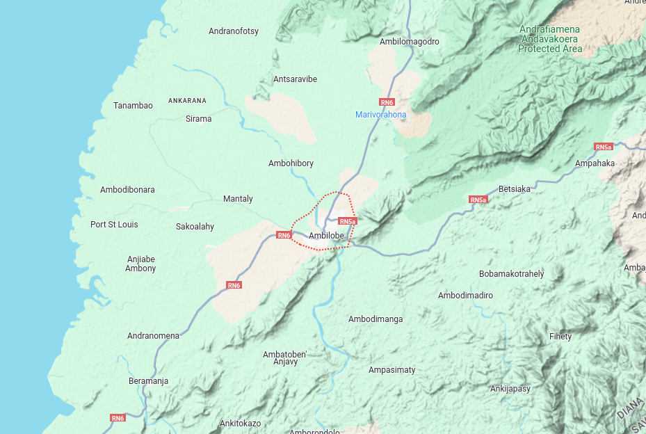
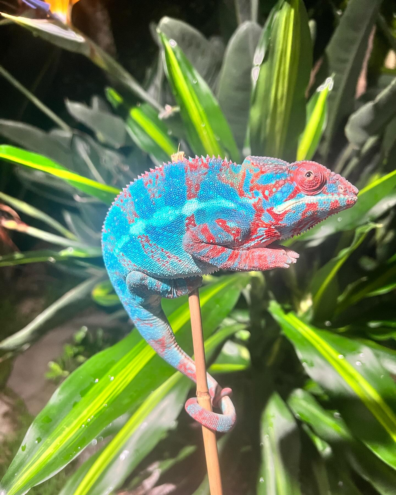
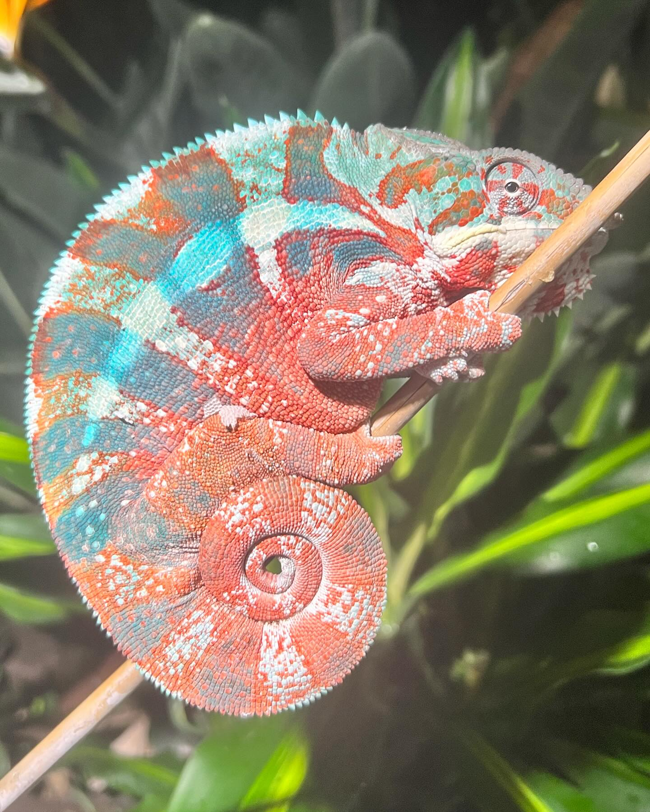

+++
title = "Complete Guide to Ambilobe Panther Chameleons"
header_title = "Complete Guide to Ambilobe Panther Chameleons | iPardalis"
description = "This article discusses captive-bred Ambilobe Panther Chameleons (Furcifer pardalis) in the United States. It is a complex story which begins with 'Picasso' Panther Chameleons in the year 2000."
date = "2024-03-15"
categories = ["ethics", "genetics"]
banner = "img/banners/ambilobe_google"
+++



This article discusses captive-bred Ambilobe Panther Chameleons (Furcifer pardalis) in the United States. It is a complex story which begins with the discovery of 'Picasso' Panther Chameleons by Olaf Pronk in the early 2000s and eventually become known as the Ambilobe local form. It continues with a discussion of the complex geography, phenotypes and genetics of Ambilobe Panther Chameleons. And finishes with a few takeaways for breeders who are interested in working with Ambilobe Panther Chameleons. The article should also provide some useful heuristics we have developed over the past 10 years breeding them. 

But before we get too deep into the weeds of that story, let's start with what we concluded in the [Ambanja article](): 

> We should skeptically view the notion that a local form is "more diverse than any other" - it is much more likely to be multiple local forms combined into one.

Ambanja is sometimes referred to as the original rainbow local form, while Ambilobe is often seen as the new rainbow local form of Furcifer pardalis - both arguing which one is "more diverse than any other." However, both are different contours of the same problem: poorly understood local forms with complex histories. With Ambanja, the wild phenotypes and cross combinations (Ambanja crossed with Ankify, Ambato or 3+ locale designer crosses) are pretty clear, but with Ambilobe, crosses with Sambava, Diego Suarez, Mitsio, Tamatave, Vohemar etc are much less obvious. 

Many of the Ambilobe cross-locale combinations produce phenotypes we observe somewhere in Ambilobe which makes it much more difficult to discern whether an animal is from Ambilobe given its phenotype. That is why phenotype is more useful in breeding wild-type Ambanja than it is in breeding wild-type Ambilobe. The captive-bred lineage in the United States is also incomplete, and our founding [lineage]() is not reliable given how complex the import process is, so we need to make educated decisions with all available information. With Ambilobe, phenotypic information is less helpful and lineage information is not well documented. 

This is why Ambilobe breeders, like iPardalis, are huge supporters of developing a genetic test for Panther Chameleon local forms, and why we meticulously document our [Panther Chameleons for sale]() and all of [our breeders]().

Ambilobe is the problem child, not Ambanja.

## The Picasso Chameleon

Olaf Pronk was the first person to identify and export Ambilobe Panther Chameleons as the "Picasso" local form in 2000-2001. The following images are some of the earliest documented examples from [Adcham.com](https://www.adcham.com/html/taxonomy/pardalismorphs.html):



Olaf did not want other exporters to discover this amazing new locality of Panther Chameleons, so he used the moniker "Picasso," his partners organized private expos to display the animals in the USA/EU, and he promised to provide details in a forthcoming book. However, he never revealed the exact location of origin for his "Picasso" Panther Chameleons - possibly to protect them from poachers. There was a lot of pomp and circumstance in the beginning because Picassos were the next big thing.

This situation led to many guesses (or outright lies) being passed off as Picasso Panther Chameleons because they fetched higher prices, similar to blurple "Ambanja" in today's market. Eventually, it became generally known that real Picassos were collected near Ambilobe, Madagascar, and Ambilobe Panther Chameleons were canonized in the hobby by 2007, if not earlier. Today, Alex Laube, PhD, and Thorsten Negro's best guess is that Olaf's original Picassos were collected along the road between Sirama and Ambilobe, Madagascar. 

## What is an Ambilobe Panther Chameleon?
I highly recommend you start by reading Alex and Thorsten's entire description of the [Ambilobe local form](https://www.madcham.de/en/furcifer-pardalis-ambilobe/). You can also peruse Petr Necas' [gallery](https://www.chameleons.info/en/furcifer-pardalis-2/) at chameleons.info. Madcham.de describes the general appearance of Ambilobe local form of Furcifer pardalis like this: 

> The colors of male panther chameleons near Amiblobe are very various. There are almost orange-colored animals with bright red crossbands as well as classic variations with blue cross bands on red and green ground or red bands on a green ground with red head. In between there is a lot of variations, may it be whiteheads, wine red cross bands or bright green ground colors. For several years, we have been watching that the big range of colors is declining and “extraordinary” specimens are partially lacking completely. We think this has to do with catching and high exports of these chameleons: The more extraordinary the panther chameleon, the higher is an exporter’s interest in it, because allegedly rare animals may fetch higher prices. Again and again, we meet men at the end of the rainy season who collect panther chameleons along the mentioned street.

Ambilobe Panther Chameleons usually have some combination of green, yellow, orange and red in their bodies and some combination of red and blue in their bars. The red is often located at the dermal layer of their body and top or outer edges of their bars. Blue can be found in the dermal layer of their bars, and what I sometimes refer to as "bar dots" meaning their bar pattern presents in a few discontinuous splotches on their bodies. This is an important point because when an Ambilobe Panther Chameleon is crossed with a local form with a blue body color (Nosy Be, Nosy Koomba, Ambato or Ambanja), the blue body splotches do **not** match their bar pattern.

The yellow on their bodies usually begins at the top layer of their chromatophores and works its way down to the dermal layer. It also presents as a vibrant lime to emerald green at rest that can fire bright yellow. There are darker shades of green which can fire to orange or gold. Orange is often found at the intersection of red and yellow, but it does not seem to be an independent heritable trait like yellow and red are. In some rare individuals, red or yellow can take over the majority of their body chromatophores from the dermal layer up to the top creating a clean color. The same is true of their bars for blue and red. 

These rare **clean** color combinations are what we often refer to as the major phenotypes of Ambilobe Panther Chameleons: 

- Yellow Body Blue Bar (YBBB)
- Yellow Body Red Bar (YBRB)
- Red Body Blue Bar (RBBB)
- Orange Body Blue Bar (OBBB)
- Orange Body Red Bar (OBRB)
- etc

Many novice breeders often force classic Ambilobe "Rainbow" phenotypes into one phenotype or another, and given that yellow sits on top of red in most rainbow mixes, they usually default to yellow when it is in fact a mix of colors (not clean yellow). At iPardalis, we try to be very strict on which animals qualify given their unique, clean coloration. We use "Rainbow Ambilobe" to refer to a classic wild-type mix of colors which can be created by any random combination of Ambilobe phenotypes. It doesn't require any skill or selective breeding to produce a Rainbow Ambilobe Panther Chameleon. That is their normal form.

The Diana region has a mountain range which starts in the Andrafiamena Protected Area in the northeast and runs southwest along the eastern edge of the city of Ambilobe, continuing down to Beramanja where a series of rivers run out to the ocean from the mountains. The Mahavavy River also cuts right through Ambilobe but runs south to northwest down to the coast, north of Sirama. This mountain and river combination creates four geographic quadrants with Ambilobe at its intersection: 

<figcaption>This complex series of rivers and mountains helps explain the phenotypic diversity of Furcifer pardalis collected near Ambilobe, Madagascar.</figcaption>

Here is an interactive map you can mess around with yourself:

<iframe src="https://www.google.com/maps/embed?pb=!1m18!1m12!1m3!1d311718.43111361185!2d48.97855683979222!3d-13.203843298314476!2m3!1f0!2f0!3f0!3m2!1i1024!2i768!4f13.1!3m3!1m2!1s0x2214f52f0a812659%3A0x1b97fc64fe096001!2sAmbilobe%2C%20Madagascar!5e1!3m2!1sen!2sus!4v1711046796565!5m2!1sen!2sus" width="600" height="450" style="border:0;" allowfullscreen="" loading="lazy" referrerpolicy="no-referrer-when-downgrade"></iframe>


### Open Questions about Ambilobe as a Local Form
So we have 4 geographic quadrants, [3 genetic haplogroups](https://ipardalis.com/blog/2021/12/31/2021-12-31-locale-test/#ambilobe) *and* 4 major phenotypes (YBBB - Yellow Body Blue Bar, YBRB - Yellow Body Red Bar, OBBB - Orange Body Blue Bar and RBBB - Red Body Blue Bar) in the Ambilobe region. There are even some rare phenotypes like Orange Body Red Bar and Red Body Red Bar Ambilobe Panther Chameleons in the wild. Ambilobe usually have bar/body contrast but a few wild specimens even have a "sheen" of color which spans their entire body/bar area. As I have said before, when I try to generalize about wild-type Ambilobe Panther Chameleon phenotypes, there is always a wild Ambilobe Panther Chameleon (and to a lesser degree a wild Ambanja, Shauna & Jake :sweat_smile:) just waiting to make me look like an ass.

What does this mean? Is Ambilobe even a coherent locale? Is only one of these geographic quadrants containing one of the haplogroups the "true" Ambilobe Panther Chameleon where Olaf Pronk might have collected the first Picassos? Why don't they merge into one dominant phenotype along the road towards Sirama? Do the 4 Ambilobe regions each have the same amount of phenotypic diversity as the population towards Sirama? Are the haplogroups isolated within a single geographic quadrant, or are there behavioral/habitat/sexual preferences that prevent haplogroup mergers within each geographic quadrant respectively? 

In private conversations with some importers, they claim collectors sometimes focus on the population along RN5a, between Ambilobe and Daraina, where genetic samples were classified as haplogroup 7 (Ambilobe East, Daraina) while other collectors go down to the road west of Ambilobe towards Sirama where samples indicate a genetically distinct haplogroup 3 (Ambilobe West-southwest) can be found. Just north of the Mahavavy River is where samples showed a third population of Panther Chameleons in haplogroup 5 (Ambilobe North-Northwest up to Diego Suarez). 

There are dozens of open questions here. And the most important for Ambilobe breeders being - what does it mean to breed "pure" Ambilobe in captivity? As we get started with genetic testing, it will be possible to answer a few of these questions. We will be able to see how much phenotypic diversity there is within a given genetic haplogroup - and then tie that haplogroup to a location using the [Grbic et al. 2015](https://onlinelibrary.wiley.com/doi/full/10.1111/mec.13241) baseline. Our initial genetic testing has shown our YBBB and RBBB mostly come from haplogroups 3 & 5, with the more mixed bar, neon yellow YBBB testing in haplogroup 5.

We believe the original Ambilobe imports were from haplogroup 3 - Ambilobe west-southwest - along the road to Sirama, but these adjacent populations are commonly bred together as if they are one local form similar to Ambato, Ankify and Ambanja. The difference among these Ambilobe populations is that the city of Ambilobe is actually located at the nexus where a mountain range and river intersects, whereas Ambanja is geographically isolated dozens of miles away from Ankify and Ambato. 

The big question we will have to answer in our Ambilobe breeding projects is whether we breed for pure haplogroup 3 animals or accept these adjacent populations as part of the Ambilobe local form. We are leaning towards the purist argument (haplogroup 3 is the true local form), but we haven't finished testing everything and there are still a number of open questions there. It might mean we have to keep those neon yellows (haplogroup 5) off by themselves and call them Diego Suarez as an ode to the time before Ambilobe hit the scene, when all bright yellow Panther Chameleons from the northwest were labelled that way. That actually might be fun.

## Ambilobe on Google
To illustrate my point about the phenotypic diversity in Ambilobe, let's Google "Ambilobe Panther Chameleon for sale" like we did in the previous article with Ambanja and compare it to the Ambilobe/Picasso data from earlier in this article:

<figcaption>Results from Googling 'Ambilobe Panther Chameleon for sale'</figcaption>

By my count, aside from the collage of various locales at the bottom (thanks Bill), all of these images could be a wild-type Ambilobe phenotype, *and* all of them could be a cross locale combination. Welcome to breeding for "pure" CB Ambilobe. 

There are still a few common crosses you can learn to recognize because they fall outside the wide phenotypic range found in and around Ambilobe, Madagascar. Let's take a look at a few of those.

## Common Cross Combinations Found in CB Ambilobe

My personal heuristic for finding Ambilobe crosses is two colors, white or blue, in weird places. After looking at thousands of Ambilobe over the past 10 years, some thousands I have produced myself, watching imports and reviewing all the extant literature I can find, I have never seen an Ambilobe with blue/teal contiguously along its spine or body. I have also not observed a specimen with a white body - if they have white, it starts in the gular/face region and can run down their spine but it shouldn't bleed into their body like an east coast pardalis. 

Another heuristic is Ambanja bars can be blue/red like Ambilobe but in Ambilobe they tend to be blue dominant near their head and fade into red along their tail whereas Ambanja tend to be red dominant near their head and fade into the blues on their tail. This is a great way to catch very subtle Ambilobe-Ambanja cross combinations.

The most famous locale crosses in the captive-bred Ambilobe population in the United States are the RBBB "Ambilobe" which originate from [Charles Yamaguchi's]() lines:



Charles Yamaguchi wasn't a real person. Elizabeth Lawrence scammed people under this persona selling a bunch of Ambilobe x Nosy Be crosses. Her other aliases include: Cami Garden Hat, April Wilcox, Trevor Neufeld, and April Michelle. After using the fictional persona of a Japanese man named Charles Yamaguchi, she refined her technique by pretending to be real individuals who actually did leave the hobby, but who could be vouched for by an unwitting third party. 

If you look closely at these animals - they are the key to recognizing a Nosy Be x Ambilobe cross. Lots of blue in weird places and a degraded body which looks like the blue is creeping in, trying to take over. You will never see that from a wild type Ambilobe Panther Chameleon.

You will start seeing those Yamaguchis everywhere in the CB population of RBBB Ambilobe - once you see it, you can't un-see it. However, the thing that will give you nightmares is how much Nosy Be can be in there while still looking passable as a CB Ambilobe. Here is an example from West Coast Chameleon Brothers with a known cross locale breakdown:

<figcaption itemprop="caption">West Coast Chameleon Brothers: 75% Nosy Be 25% Ambilobe</figcaption>

What I find incredibly interesting about these examples is that most CB RBBB Ambilobe have these intense, creeping blues and degraded bodies. The genetic testing will help us weed out the Nosy Be crosses because I see them everywhere. And I would argue *most* CB Ambilobe have too much blue relative to their wild phenotypes which have more reds, oranges, yellows and greens with a small amount of blue.

On the white side of things, a little goes a long way:

<figcaption itemprop="caption">West Coast Chameleon Brothers: 75% Ambilobe 25% Cap Est</figcaption>

You can usually spot even a small amount of Cap Est, Nosy Boraha or other white bodied locales in the Ambilobe population because whites show up in the body even in low percentage crosses which favor the Ambilobe locale side of it. West Coast Chameleon Brothers is unique in that Mitch is honest about his locality breakdowns, but a lot of these crosses are circulating widely as pure Ambilobe Panther Chameleons.

## Conclusion
There is a belief that nearly every color in the rainbow can be found within the Ambilobe local form of Panther Chameleons (Furcifer pardalis) - and that is almost true - but we need to be extremely skeptical of when those colors drift into the shades and intensity more prevalent outside Ambilobe. We also need to get smart in identifying some of the more obvious cross-locale combinations with a lot of blue or white. Many of those cross-locale combinations are in the captive breeding population of the United States, and Ambilobe crosses are much harder to identify than Ambanja crosses.

Like Ambanja, the Ambilobe origin story is complex with a high likelihood of locale crossing in the founding stock of our CB Ambilobe in the United States. There are plenty of open questions in Ambilobe, whereas we now generally accept that Ankify and Ambato are separate local forms, not part of Ambanja. The drama is probably ahead of us in the Ambilobe breeding community vs behind us in the Ambanja breeding community. Please don't pretend like you know the answer to how anyone else should answer these questions. We will all form our own opinions and make our own choices as we learn more. We certainly will share our opinion - please don't take it the wrong way :wink:. 

We hope this primer on the history, challenges and open questions related to the Ambilobe local form of Furcifer pardalis will help you make informed decisions about your projects. Please reach out if you have any edits or information to add - we would be happy to give you a call out or quote you within this series on the major CB Panther Chameleon locales in the United States. There are many considerations we have to make in responsibly managing our captive bred Ambilobe Panther Chameleons, and I hope people can get started on them with a more thorough understanding now.

