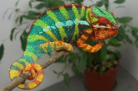
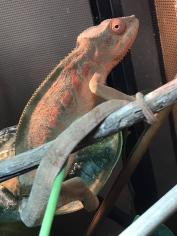
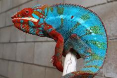
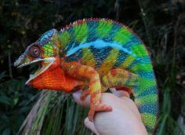
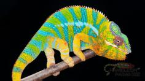

+++
title = "Avana"
date = "2023-01-23"
tags = ["avana", "zozoro", "artalla", "arti", "gold-rush"]
categories = ["ambilobe-dams"]
banner = "img/ambilobe/avana/avana1"
+++



Avana has some great Kammerflage Kreations lineage from her sire, Zozoro, and her dam, Artalla. All of her brothers had yellow bodies and a few had deep blue bars. It will be a lot of fun to prove her out with Zandrin - hoping for those blue bars!



Filial
: *F4-CG14*

Sire
: [Zozoro]()

Dam
: [Artalla]()

---




  

    

      <h1>Ancestral Report for Avana (F4-CG14)</h1>
    

    <h3>Generation 1</h3>
    
    
1. <strong>Avana (F4-CG14). </strong>Avana was born on 2023-01-23 at iPardalis.  She is the daughter of Zozoro (F3-CG13) and Artalla (F4-CG13). 

    <h3>Generation 2</h3>
    
    
2. <strong>Zozoro (F3-CG13). </strong>Zozoro was born on 2021-10-06 at Kammerflage Kreations.  He is the son of Au-mirongatra (Gold Rush) (F9-CG12) and Ankoso-bolamena (Goldie) (F2-CG12). He married Artalla (F4-CG13). 

    
More about Zozoro (F3-CG13):

    
Adopted: 2021-01-28, iPardalis. 

    
    
3. <strong>Artalla (F4-CG13). </strong>Artalla was born on 2021-10-15 at iPardalis.  She is the daughter of Arti (F3-CG12) and Alla (F8-CG11). 

    
Children of Artalla (F4-CG13) and Zozoro (F3-CG13)

    
i. Avana (F4-CG14) [1]. Avana was born on 2023-01-23 at iPardalis.  

    <h3>Generation 3</h3>
    
    
4. <strong>Au-mirongatra (Gold Rush) (F9-CG12). </strong>Au-mirongatra (Gold Rush) was produced by Kammerflage Kreations.  He is the son of Landy (Silk) F8-CG11 and Hamy (Sweetness) F8-CG11. He had a relationship with Ankoso-bolamena (Goldie) (F2-CG12). 

    
5. <strong>Ankoso-bolamena (Goldie) (F2-CG12). </strong>Ankoso-bolamena (Goldie) was produced by Kammerflage Kreations.  She is the daughter of Ihany-drako (My Friend) (F8-CG11) and Hay-vao (Novel) (F1). 

    
Children of Ankoso-bolamena (Goldie) (F2-CG12) and Au-mirongatra (Gold Rush) (F9-CG12)

    
i. Zozoro (F3-CG13) [2]. Zozoro was born on 2021-10-06 at Kammerflage Kreations.  

    
    
6. <strong>Arti (F3-CG12). </strong>Arti was born on 2020-04-05 at Brian Stewart.  He is the son of Artemis (F8-CG11) and Felipe Sanchez's daughter (F2-CG3). He had a relationship with Alla (F8-CG11). He also had a relationship with Daisy (F3-CG4). He also had a relationship with Lilly (F3-CG4). 

    
Children of Daisy (F3-CG4) and Arti (F3-CG12)

    
i. Ghost (F4-CG13). Ghost was born on 2021-10-17 at iPardalis.  

    
Children of Lilly (F3-CG4) and Arti (F3-CG12)

    
i. Artilly (F4-CG13). Artilly was born on 2022-02-03 at iPardalis.  

    
    
7. <strong>Alla (F8-CG11). </strong>Alla was born on 2018-01-30 at Panther Creek Chameleons.  She is the daughter of JJ (F7-CG10) and Blue Bird's daughter. 

    
Children of Alla (F8-CG11) and Jude (F2-CG3)

    
i. Blossom (F3-CG12). Blossom was born on 2019-07-09 at iPardalis.  

    
ii. Clyde (F3-CG12). Clyde was born on 2019-07-09 at iPardalis.  

    
iii. M11. M11 was born on 2019-11-20.  

    
iv. Alfred (F3-CG12). Alfred was born on 2019-10-20 at iPardalis.  

    
v. Jack (F3-CG12). Jack was born on 2019-10-20 at iPardalis.  

    
vi. Button (F3-CG12). Button was born on 2019-07-09 at iPardalis.  

    
vii. Bubbles (F3-CG12). Bubbles (F3-CG12) was born on 2019-07-09 at iPardalis.  

    
viii. Mondrian (F3-CG12). Mondrian was born on 2019-08-16 at iPardalis.  

    
ix. Toby (F3-CG12). Toby was born on 2019-07-09 at iPardalis.  

    
x. Tigravavy (F3-CG12). Tigravavy was born on 2019-12-12 at iPardalis.  

    
Children of Alla (F8-CG11) and Arti (F3-CG12)

    
i. Dehibe (F4-CG13). Dehibe was born on 2021-10-15 at iPardalis.  

    
ii. Artalla (F4-CG13) [3]. Artalla was born on 2021-10-15 at iPardalis.  

    <h3>Generation 4</h3>
    
    
8. <strong>Landy (Silk) F8-CG11. </strong>Landy (Silk) F8-CG11 was born on 2018-02-20 at Kammerflage Kreations.  He is the son of Giga-vony (Old Yeller) and Au-sanga (Goldie Locks). He had a relationship with Hamy (Sweetness) F8-CG11. He also had a relationship with Batata (Sweet Potato). 

    
Children of Batata (Sweet Potato) and Landy (Silk) F8-CG11

    
i. Ingahy-Mahagaga (Mr. Wonderful). Ingahy-Mahagaga (Mr. Wonderful) was produced by Kammerflage Kreations.  

    
    
9. <strong>Hamy (Sweetness) F8-CG11. </strong>Hamy (Sweetness) was produced by Kammerflage Kreations.  She is the daughter of Fantara (Falling Star) (F7-CG10) and Mavo-loha (Blondie). 

    
Children of Hamy (Sweetness) F8-CG11 and Landy (Silk) F8-CG11

    
i. Itso-triombe (Green Giant) F9-CG12. Itso-triombe (Green Giant) was produced by Kammerflage Kreations.  

    
ii. Foxey (F9-CG12). Foxey was produced by Kammerflage Kreations.  

    
iii. Shirley (F9-CG12). Shirley was produced by Kammerflage Kreations.  

    
iv. Au-mirongatra (Gold Rush) (F9-CG12) [4]. Au-mirongatra (Gold Rush) was produced by Kammerflage Kreations.  

    
    
10. <strong>Ihany-drako (My Friend) (F8-CG11). </strong>Ihany-drako (My Friend) was produced by Kammerflage Kreations.  He is the son of Ampiosonga-fantatra (Also Known As) (F7-CG10). He had a relationship with Hay-vao (Novel) (F1). 

    
11. <strong>Hay-vao (Novel) (F1). </strong>Hay-vao (Novel) was produced by Kammerflage Kreations.  She is the daughter of Bakaina (Divergent) (WC) and Goavy (Guava) (F1). 

    
Children of Hay-vao (Novel) (F1) and Ihany-drako (My Friend) (F8-CG11)

    
i. Ankoso-bolamena (Goldie) (F2-CG12) [5]. Ankoso-bolamena (Goldie) was produced by Kammerflage Kreations.  

    
    
12. <strong>Artemis (F8-CG11). </strong>He is the son of Fantara (Falling Star) (F7-CG10) and Zazabodo-manga (Baby Blue). He had a relationship with Felipe Sanchez's daughter (F2-CG3). He also had a relationship with Felipe Sanchez's Daughter (F2-CG3). 

    
Children of Felipe Sanchez's Daughter (F2-CG3) and Artemis (F8-CG11)

    
i. Artemis's Daughter (F3-CG12). Artemis's Daughter was produced by Brian Stewart.  

    
13. <strong>Felipe Sanchez's daughter (F2-CG3). </strong>Felipe Sanchez's daughter was produced by Chromatic Chameleons.  She is the daughter of Felipe Sanchez (F1-CG2) and Snapjacks (F3-CG3). 

    
Children of Felipe Sanchez's daughter (F2-CG3) and Artemis (F8-CG11)

    
i. Arti (F3-CG12) [6]. Arti was born on 2020-04-05 at Brian Stewart.  

    
ii. Amara (F3-CG12). Amara was born on 2020-04-05 at Brian Stewart.  

    
    
14. <strong>JJ (F7-CG10). </strong>JJ was produced by Kammerflage Kreations.  He is the son of Mavo-ra (Yellow Blood) and Tsara-andro (Good Day) (F6-CG9). He had a relationship with Blue Bird's daughter. He also had a relationship with Daisy (F8-CG11). 

    
Children of Daisy (F8-CG11) and JJ (F7-CG10)

    
i. Kromatisk (F8-CG12). Kromatisk was born on 2018-08-26 at Chromatic Chameleons.  

    
ii. JJ's daughter (F8-CG12). 

    
15. <strong>Blue Bird's daughter. </strong>Blue Bird's daughter was produced by Eric Thompson.  She is the daughter of Blue Bird Jr. and Blaze's daughter. 

    
Children of Blue Bird's daughter and JJ (F7-CG10)

    
i. Alla (F8-CG11) [7]. Alla was born on 2018-01-30 at Panther Creek Chameleons.  

    <h3>Generation 5</h3>
    
    
16. <strong>Giga-vony (Old Yeller). </strong>Giga-vony (Old Yeller) was produced by Kammerflage Kreations.  He is the son of Mavo-ra (Yellow Blood) and Tsara-andro (Good Day) (F6-CG9). He had a relationship with Au-sanga (Goldie Locks). He also had a relationship with Fanala-Andriana (Frost Queen). 

    
Children of Fanala-Andriana (Frost Queen) and Giga-vony (Old Yeller)

    
i. Sonny (F8-CG11). 

    
17. <strong>Au-sanga (Goldie Locks). </strong>She is the daughter of Faingana (Quick). 

    
Children of Au-sanga (Goldie Locks) and Giga-vony (Old Yeller)

    
i. Landy (Silk) F8-CG11 [8]. Landy (Silk) F8-CG11 was born on 2018-02-20 at Kammerflage Kreations.  

    
More about Au-sanga (Goldie Locks) and Giga-vony (Old Yeller):

    
Birth: 2018-02-20, Kammerflage Kreations. 

    
    
18. <strong>Fantara (Falling Star) (F7-CG10). </strong>Fantara (Falling Star) was produced by Kammerflage Kreations.  He is the son of Maizina-lanitra (Dark Sky). He had a relationship with Zazabodo-manga (Baby Blue). He also had a relationship with Mavo-loha (Blondie). He also had a relationship with Unknown. 

    
Children of Unknown and Fantara (Falling Star) (F7-CG10)

    
i. Fantara's daughter (F8-CG11). 

    
    
19. <strong>Mavo-loha (Blondie). </strong>Mavo-loha (Blondie) was born on 2016-02-03 at Kammerflage Kreations.  She is the daughter of Mavo-ra (Yellow Blood) and Tsara-andro (Good Day) (F6-CG9). 

    
Children of Mavo-loha (Blondie) and Fantara (Falling Star) (F7-CG10)

    
i. Hamy (Sweetness) F8-CG11 [9]. Hamy (Sweetness) was produced by Kammerflage Kreations.  

    
ii. Ajax (F8-CG11). Ajax was produced by Kammerflage Kreations.  

    
iii. Roa-ony (Two Rivers) (F8-CG11). Roa-ony (Two Rivers) was produced by Kammerflage Kreations.  

    
    
20. <strong>Ampiosonga-fantatra (Also Known As) (F7-CG10). </strong>Ampiosonga-fantatra (Also Known As) was produced by Kammerflage Kreations.  He had a relationship with Unknown. He also had a relationship with Unknown. 

    
Children of Unknown and Ampiosonga-fantatra (Also Known As) (F7-CG10)

    
i. Koa-mbola (And Still!) (F8-CG11). Koa-mbola (And Still!) was produced by Kammerflage Kreations.  

    
Children of Unknown and Ampiosonga-fantatra (Also Known As) (F7-CG10)

    
i. Ihany-drako (My Friend) (F8-CG11) [10]. Ihany-drako (My Friend) was produced by Kammerflage Kreations.  

    
    
22. <strong>Bakaina (Divergent) (WC). </strong>He had a relationship with Goavy (Guava) (F1). He also had a relationship with Unknown. 

    
More about Bakaina (Divergent) (WC):

    
Adopted: Kammerflage Kreations. 

    
Children of Unknown and Bakaina (Divergent) (WC)

    
i. So-Soa (So Beautiful) (F1). So-Soa (So Beautiful) was produced by Kammerflage Kreations.  

    
23. <strong>Goavy (Guava) (F1). </strong>She is the daughter of Fanitso (Herb) (WC). 

    
Children of Goavy (Guava) (F1) and Bakaina (Divergent) (WC)

    
i. Hay-vao (Novel) (F1) [11]. Hay-vao (Novel) was produced by Kammerflage Kreations.  

    
    
24. <strong>Fantara (Falling Star) (F7-CG10). </strong> is the same person as [18].

    
25. <strong>Zazabodo-manga (Baby Blue). </strong>Zazabodo-manga (Baby Blue) was born on 2018-01-01 at Kammerflage Kreations.  She is the daughter of Telo-heny (Triple). 

    
Children of Zazabodo-manga (Baby Blue) and Fantara (Falling Star) (F7-CG10)

    
i. Artemis (F8-CG11) [12]. 

    
    
26. <strong>Felipe Sanchez (F1-CG2). </strong>He is the son of Bolt (WC) and Cowboy's daughter (F1). He had a relationship with Snapjacks (F3-CG3). He also had a relationship with Unknown. He also had a relationship with JJ's daughter (F8-CG12). 

    
Children of Unknown and Felipe Sanchez (F1-CG2)

    
i. Felipe Sanchez's Daughter (F2-CG3). Felipe Sanchez's Daughter was produced by Chromatic Chameleons.  

    
Children of JJ's daughter (F8-CG12) and Felipe Sanchez (F1-CG2)

    
i. Capella (F2-CG13). Capella was produced by Chromatic Chameleons.  

    
27. <strong>Snapjacks (F3-CG3). </strong>She is the daughter of Macho (F2-CG2) and 24k's daughter. 

    
Children of Snapjacks (F3-CG3) and Felipe Sanchez (F1-CG2)

    
i. Emma Frost (F2-CG4). Emma Frost was produced by Chromatic Chameleons.  

    
ii. Felipe Sanchez's daughter (F2-CG4). 

    
iii. Felipe Sanchez's daughter (F2-CG3) [13]. Felipe Sanchez's daughter was produced by Chromatic Chameleons.  

    
    
28. <strong>Mavo-ra (Yellow Blood). </strong>Mavo-ra (Yellow Blood) was produced by Kammerflage Kreations.  He is the son of Mabonika-haboka (Mellow Yellow). He had a relationship with Unknown. He also had a relationship with Tsara-andro (Good Day) (F6-CG9). 

    
Children of Unknown and Mavo-ra (Yellow Blood)

    
i. Vony-reny (Yellow Mother). Vony-reny (Yellow Mother) was produced by Kammerflage Kreations.  

    
    
29. <strong>Tsara-andro (Good Day) (F6-CG9). </strong>Tsara-andro (Good Day) was produced by Kammerflage Kreations.  She is the daughter of Kely-tongotra (Little Foot) (F5-CG8). 

    
Children of Tsara-andro (Good Day) (F6-CG9) and Mavo-ra (Yellow Blood)

    
i. Mavo-loha (Blondie). Mavo-loha (Blondie) was born on 2016-02-03 at Kammerflage Kreations.  

    
ii. Giga-vony (Old Yeller). Giga-vony (Old Yeller) was produced by Kammerflage Kreations.  

    
iii. JJ (F7-CG10) [14]. JJ was produced by Kammerflage Kreations.  

    
    
30. <strong>Blue Bird Jr. </strong>He had a relationship with Blaze's daughter. 

    
31. <strong>Blaze's daughter. </strong>She is the daughter of Blaze. 

    
Children of Blaze's daughter and Blue Bird Jr.

    
i. Blue Bird's daughter [15]. Blue Bird's daughter was produced by Eric Thompson.  

    <h3>Generation 6</h3>
    
    
32. <strong>Mavo-ra (Yellow Blood). </strong> is the same person as [28].

    
    
33. <strong>Tsara-andro (Good Day) (F6-CG9). </strong> is the same person as [29].

    
    
34. <strong>Faingana (Quick). </strong>Faingana (Quick) was produced by Kammerflage Kreations.  He is the son of Kely-tongotra (Little Foot) (F5-CG8). He had a relationship with Unknown. 

    
Children of Unknown and Faingana (Quick)

    
i. Au-sanga (Goldie Locks) [17]. 

    
    
36. <strong>Maizina-lanitra (Dark Sky). </strong>Maizina-lanitra (Dark Sky) was produced by Kammerflage Kreations.  He is the son of Kely-tongotra (Little Foot) (F5-CG8). He had a relationship with Unknown. He also had a relationship with Unknown. 

    
Children of Unknown and Maizina-lanitra (Dark Sky)

    
i. Fantara (Falling Star) (F7-CG10) [24]. Fantara (Falling Star) was produced by Kammerflage Kreations.  

    
Children of Unknown and Maizina-lanitra (Dark Sky)

    
i. Bolitika-zandry (Little Sister). Bolitika-zandry (Little Sister) was produced by Kammerflage Kreations.  

    
    
38. <strong>Mavo-ra (Yellow Blood). </strong> is the same person as [28].

    
    
39. <strong>Tsara-andro (Good Day) (F6-CG9). </strong> is the same person as [29].

    
    
46. <strong>Fanitso (Herb) (WC). </strong>He had a relationship with Jaky-fiposohana. He also had a relationship with Unknown. 

    
Children of Jaky-fiposohana and Fanitso (Herb) (WC)

    
i. Mitselatra (Stormy Weather) F1-CG10. 

    
Children of Unknown and Fanitso (Herb) (WC)

    
i. Goavy (Guava) (F1) [23]. 

    
    
48. <strong>Maizina-lanitra (Dark Sky). </strong> is the same person as [36].

    
    
50. <strong>Telo-heny (Triple). </strong>Telo-heny (Triple) was born on 2015-01-15 at Kammerflage Kreations.  He is the son of Dobo (Double). He had a relationship with Unknown. He also had a relationship with Unknown. He also had a relationship with Unknown. 

    
Children of Unknown and Telo-heny (Triple)

    
i. Triple's daughter. Triple's daughter was produced by Kammerflage Kreations.  

    
Children of Unknown and Telo-heny (Triple)

    
i. Zazabodo-manga (Baby Blue) [25]. Zazabodo-manga (Baby Blue) was born on 2018-01-01 at Kammerflage Kreations.  

    
Children of Unknown and Telo-heny (Triple)

    
i. Telo Heny's daughter. 

    
    
52. <strong>Bolt (WC). </strong>Bolt was produced by Canvas Chameleons.  He had a relationship with Cowboy's daughter (F1). He also had a relationship with Test (F1). 

    
Children of Test (F1) and Bolt (WC)

    
i. Sunkist (F1-CG2). Sunkist was produced by Canvas Chameleons.  

    
53. <strong>Cowboy's daughter (F1). </strong>Cowboy's daughter was produced by Chameleon's Paradise.  She is the daughter of Cowboy (CH). 

    
Children of Cowboy's daughter (F1) and Bolt (WC)

    
i. Felipe Sanchez (F1-CG2) [26]. 

    
    
54. <strong>Macho (F2-CG2). </strong>He is the son of Candy Cane (F1) and Cowboy's daughter (F1). He had a relationship with 24k's daughter. 

    
55. <strong>24k's daughter. </strong>24k's daughter was produced by Chameleon's Paradise.  She is the daughter of 24k. 

    
Children of 24k's daughter and Macho (F2-CG2)

    
i. Wetdream (F3). 

    
ii. Snapjacks (F3-CG3) [27]. 

    
    
56. <strong>Mabonika-haboka (Mellow Yellow). </strong>Mabonika-haboka (Mellow Yellow) was produced by Kammerflage Kreations.  He is the son of Maso-vatomamy (Eye Candy). He had a relationship with Unknown. 

    
Children of Unknown and Mabonika-haboka (Mellow Yellow)

    
i. Mavo-ra (Yellow Blood) [28]. Mavo-ra (Yellow Blood) was produced by Kammerflage Kreations.  

    
    
58. <strong>Kely-tongotra (Little Foot) (F5-CG8). </strong>Kely-tongotra (Little Foot) was produced by Kammerflage Kreations.  He is the son of Hatsikana (Legend). He had a relationship with Unknown. He also had a relationship with Unknown. He also had a relationship with Unknown. He also had a relationship with Eye Candy's daughter. He also had a relationship with Unknown. He also had a relationship with Unknown. He also had a relationship with Unknown. 

    
Children of Unknown and Kely-tongotra (Little Foot) (F5-CG8)

    
i. Little Foot's daughter. Little Foot's daughter was produced by Kammerflage Kreations.  

    
Children of Unknown and Kely-tongotra (Little Foot) (F5-CG8)

    
i. Faingana (Quick). Faingana (Quick) was produced by Kammerflage Kreations.  

    
Children of Unknown and Kely-tongotra (Little Foot) (F5-CG8)

    
i. Little Foot's daughter. Little Foot's daughter was produced by Kammerflage Kreations.  

    
Children of Eye Candy's daughter and Kely-tongotra (Little Foot) (F5-CG8)

    
i. Dio (F6-CG9). 

    
Children of Unknown and Kely-tongotra (Little Foot) (F5-CG8)

    
i. Tsara-andro (Good Day) (F6-CG9) [29]. Tsara-andro (Good Day) was produced by Kammerflage Kreations.  

    
Children of Unknown and Kely-tongotra (Little Foot) (F5-CG8)

    
i. Maizina-lanitra (Dark Sky). Maizina-lanitra (Dark Sky) was produced by Kammerflage Kreations.  

    
Children of Unknown and Kely-tongotra (Little Foot) (F5-CG8)

    
i. Faingana (Quick). Faingana (Quick) was produced by Kammerflage Kreations.  

    
    
62. <strong>Blaze. </strong>He had a relationship with Unknown. 

    
Children of Unknown and Blaze

    
i. Blaze's daughter [31]. 

    <h3>Generation 7</h3>
    
    
64. <strong>Mabonika-haboka (Mellow Yellow). </strong> is the same person as [56].

    
    
66. <strong>Kely-tongotra (Little Foot) (F5-CG8). </strong> is the same person as [58].

    
    
68. <strong>Kely-tongotra (Little Foot) (F5-CG8). </strong> is the same person as [58].

    
    
72. <strong>Kely-tongotra (Little Foot) (F5-CG8). </strong> is the same person as [58].

    
    
76. <strong>Mabonika-haboka (Mellow Yellow). </strong> is the same person as [56].

    
    
78. <strong>Kely-tongotra (Little Foot) (F5-CG8). </strong> is the same person as [58].

    
    
96. <strong>Kely-tongotra (Little Foot) (F5-CG8). </strong> is the same person as [58].

    
100. <strong>Dobo (Double). </strong>He had a relationship with Unknown. 

    
Children of Unknown and Dobo (Double)

    
i. Telo-heny (Triple) [50]. Telo-heny (Triple) was born on 2015-01-15 at Kammerflage Kreations.  

    
    
106. <strong>Cowboy (CH). </strong>Cowboy was produced by Chameleon's Paradise.  He died on 2015-01-01 at Chameleon's Paradise.  He had a relationship with King's daughter. He also had a relationship with Unknown. He also had a relationship with Unknown. He also had a relationship with Unknown. 

    
Children of King's daughter and Cowboy (CH)

    
i. Flash (F1). Flash was born on 2015-01-10 at Chameleon's Paradise.  He died on 2018-06-14 at iPardalis.  

    
Children of Unknown and Cowboy (CH)

    
i. Cowboy's daughter (F1). 

    
Children of Unknown and Cowboy (CH)

    
i. Cowboy's daughter (F1) [53]. Cowboy's daughter was produced by Chameleon's Paradise.  

    
Children of Unknown and Cowboy (CH)

    
i. Cowboy's daughter (F1). 

    
    
108. <strong>Candy Cane (F1). </strong>Candy Cane was produced by Chameleon's Paradise.  He had a relationship with Jake's daughter. He also had a relationship with Cowboy's daughter (F1). He also had a relationship with Unknown. He also had a relationship with Cowboy's daughter (F1). 

    
Children of Jake's daughter and Candy Cane (F1)

    
i. Judy (F2). Judy was born on 2015-02-11 at Chameleon's Paradise.  She died on 2018-02-15 at iPardalis.  

    
Children of Unknown and Candy Cane (F1)

    
i. Candy Cane's Daughter (F2). 

    
Children of Cowboy's daughter (F1) and Candy Cane (F1)

    
i. Candy Cane's daughter (F2). 

    
109. <strong>Cowboy's daughter (F1). </strong>She is the daughter of Cowboy (CH). 

    
Children of Cowboy's daughter (F1) and Candy Cane (F1)

    
i. Macho (F2-CG2) [54]. 

    
    
110. <strong>24k. </strong>24k was produced by Chameleon's Paradise.  He had a relationship with Unknown. 

    
Children of Unknown and 24k

    
i. 24k's daughter [55]. 24k's daughter was produced by Chameleon's Paradise.  

    
    
112. <strong>Maso-vatomamy (Eye Candy). </strong>Maso-vatomamy (Eye Candy) was produced by Kammerflage Kreations.  He had a relationship with Unknown. He also had a relationship with Unknown. 

    
Children of Unknown and Maso-vatomamy (Eye Candy)

    
i. Eye Candy's daughter. Eye Candy's daughter was produced by Kammerflage Kreations.  

    
Children of Unknown and Maso-vatomamy (Eye Candy)

    
i. Mabonika-haboka (Mellow Yellow) [56]. Mabonika-haboka (Mellow Yellow) was produced by Kammerflage Kreations.  

    
    
116. <strong>Hatsikana (Legend). </strong>Hatsikana (Legend) was produced by Kammerflage Kreations.  He had a relationship with Unknown. 

    
Children of Unknown and Hatsikana (Legend)

    
i. Kely-tongotra (Little Foot) (F5-CG8) [58]. Kely-tongotra (Little Foot) was produced by Kammerflage Kreations.  

    <h3>Generation 8</h3>
    
    
128. <strong>Maso-vatomamy (Eye Candy). </strong> is the same person as [112].

    
    
132. <strong>Hatsikana (Legend). </strong> is the same person as [116].

    
    
136. <strong>Hatsikana (Legend). </strong> is the same person as [116].

    
    
144. <strong>Hatsikana (Legend). </strong> is the same person as [116].

    
    
152. <strong>Maso-vatomamy (Eye Candy). </strong> is the same person as [112].

    
    
156. <strong>Hatsikana (Legend). </strong> is the same person as [116].

    
    
192. <strong>Hatsikana (Legend). </strong> is the same person as [116].

    
    
218. <strong>Cowboy (CH). </strong> is the same person as [106].

  



