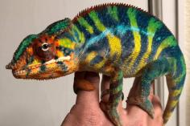
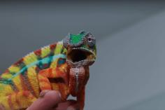
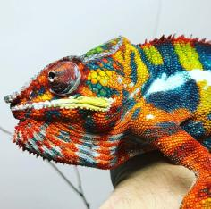

+++
title = "bear"
header_title = "bear | Yellow Body Blue Bar | Ambilobe Panther Chameleon"
date = "2023-12-27"
tags = ["bear", "ghost", "tsara", "arti", "manjaka"]
categories = ["ambilobe-sires"]
banner = "img/ambilobe/bear/bear4"
+++



Bear earned his name because of a little adventure he went on as a juvenile. He escaped for about 3 months and caused a town frenzy on Facebook, just like our town bear. We were very lucky to get him back because he is the perfect flag bearer for his father, Ghost's line. We produced him with a beautiful F2 female from Manjaka, so he is also relatively fresh from a genetic standpoint. He will be a staple of our YBBB project for many years!



Filial
: *F3-CG15*

Sire
: [Ghost]()

Dam
: [Tsara]()

---




  

    

      <h1>Ancestral Report for Bear (F3-CG15)</h1>
    

    <h3>Generation 1</h3>
    
    
1. <strong>Bear (F3-CG15). </strong>Bear was born on 2023-12-27 at iPardalis.  He is the son of Ghost (F4-CG13) and Tsara (F2-CG14). 

    <h3>Generation 2</h3>
    
    
2. <strong>Ghost (F4-CG13). </strong>Ghost was born on 2021-10-17 at iPardalis.  He is the son of Arti (F3-CG12) and Daisy (F3-CG4). He married Tsara (F2-CG14). 

    
    
3. <strong>Tsara (F2-CG14). </strong>Tsara was born on 2022-06-01 at iPardalis.  She is the daughter of Manjaka (F1-CG5) and Lokana (F9-CG13). 

    
Children of Tsara (F2-CG14) and Ghost (F4-CG13)

    
i. Bear (F3-CG15) [1]. Bear was born on 2023-12-27 at iPardalis.  

    <h3>Generation 3</h3>
    
    
4. <strong>Arti (F3-CG12). </strong>Arti was born on 2020-04-05 at Brian Stewart.  He is the son of Artemis (F8-CG11) and Felipe Sanchez's daughter (F2-CG3). He had a relationship with Alla (F8-CG11). He also had a relationship with Daisy (F3-CG4). He also had a relationship with Lilly (F3-CG4). 

    
Children of Alla (F8-CG11) and Arti (F3-CG12)

    
i. Dehibe (F4-CG13). Dehibe was born on 2021-10-15 at iPardalis.  

    
ii. Artalla (F4-CG13). Artalla was born on 2021-10-15 at iPardalis.  

    
Children of Lilly (F3-CG4) and Arti (F3-CG12)

    
i. Artilly (F4-CG13). Artilly was born on 2022-02-03 at iPardalis.  

    
    
5. <strong>Daisy (F3-CG4). </strong>Daisy was born on 2019-06-05 at iPardalis.  She is the daughter of Jude (F2-CG3) and Kako (F2). 

    
Children of Daisy (F3-CG4) and Arti (F3-CG12)

    
i. Ghost (F4-CG13) [2]. Ghost was born on 2021-10-17 at iPardalis.  

    
ii. Cadillac (F4-CG13). Cadillac was born on 2021-10-17 at iPardalis.  

    
    
6. <strong>Manjaka (F1-CG5). </strong>Manjaka (F1-CG5) was born on 2020-12-01 at Colorado Chameleon.  He is the son of Arlo (WC) and Perregrin's daugher (F3-CG4). He had a relationship with Lokana (F9-CG13). He also had a relationship with Parasy (F4-CG13). 

    
More about Manjaka (F1-CG5):

    
Adopted: 2021-03-07, iPardalis. 

    
Children of Parasy (F4-CG13) and Manjaka (F1-CG5)

    
i. Parasi (F2-CG14). Parasi was born on 2022-08-20 at iPardalis.  

    
    
7. <strong>Lokana (F9-CG13). </strong>Lokana was born on 2020-12-02 at Chromatic Chameleons.  She is the daughter of Kromatisk (F8-CG12) and Shirley (F9-CG12). 

    
More about Lokana (F9-CG13):

    
Adopted: 2021-03-15, iPardalis. 

    
Children of Lokana (F9-CG13) and Papafee (F3-CG12)

    
i. Bumble Bee (F4-CG14). Bumble Bee was born on 2022-01-11 at iPardalis.  

    
ii. Vaosary (F4-CG14). Vaosary was born on 2022-01-11 at iPardalis.  

    
iii. Papamavo (F4-CG14). Papamavo was born on 2022-03-01 at iPardalis.  

    
iv. Mami (F4-CG14). Mami was born on 2022-05-11 at iPardalis.  

    
Children of Lokana (F9-CG13) and Manjaka (F1-CG5)

    
i. Tsara (F2-CG14) [3]. Tsara was born on 2022-06-01 at iPardalis.  

    
ii. Tarehy (F2-CG14). Tarehy was born on 2022-05-31 at iPardalis.  

    
iii. Ranoka (F2-CG14). Ranoka was born on 2022-06-05 at iPardalis.  

    <h3>Generation 4</h3>
    
    
8. <strong>Artemis (F8-CG11). </strong>He is the son of Fantara (Falling Star) (F7-CG10) and Zazabodo-manga (Baby Blue). He had a relationship with Felipe Sanchez's daughter (F2-CG3). He also had a relationship with Felipe Sanchez's Daughter (F2-CG3). 

    
Children of Felipe Sanchez's Daughter (F2-CG3) and Artemis (F8-CG11)

    
i. Artemis's Daughter (F3-CG12). Artemis's Daughter was produced by Brian Stewart.  

    
9. <strong>Felipe Sanchez's daughter (F2-CG3). </strong>Felipe Sanchez's daughter was produced by Chromatic Chameleons.  She is the daughter of Felipe Sanchez (F1-CG2) and Snapjacks (F3-CG3). 

    
Children of Felipe Sanchez's daughter (F2-CG3) and Artemis (F8-CG11)

    
i. Arti (F3-CG12) [4]. Arti was born on 2020-04-05 at Brian Stewart.  

    
ii. Amara (F3-CG12). Amara was born on 2020-04-05 at Brian Stewart.  

    
    
10. <strong>Jude (F2-CG3). </strong>Jude was born on 2017-10-17 at iPardalis.  He is the son of Flash (F1) and Judy (F2). He had a relationship with Kako (F2). He also had a relationship with Alla (F8-CG11). 

    
Children of Alla (F8-CG11) and Jude (F2-CG3)

    
i. Blossom (F3-CG12). Blossom was born on 2019-07-09 at iPardalis.  

    
ii. Clyde (F3-CG12). Clyde was born on 2019-07-09 at iPardalis.  

    
iii. M11. M11 was born on 2019-11-20.  

    
iv. Alfred (F3-CG12). Alfred was born on 2019-10-20 at iPardalis.  

    
v. Jack (F3-CG12). Jack was born on 2019-10-20 at iPardalis.  

    
vi. Button (F3-CG12). Button was born on 2019-07-09 at iPardalis.  

    
vii. Bubbles (F3-CG12). Bubbles (F3-CG12) was born on 2019-07-09 at iPardalis.  

    
viii. Mondrian (F3-CG12). Mondrian was born on 2019-08-16 at iPardalis.  

    
ix. Toby (F3-CG12). Toby was born on 2019-07-09 at iPardalis.  

    
x. Tigravavy (F3-CG12). Tigravavy was born on 2019-12-12 at iPardalis.  

    
    
11. <strong>Kako (F2). </strong>Kako was born on 2017-11-21 at Panther Creek Chameleons.  She died on 2020-02-05 at iPardalis at the age of 2 years, 2 months.  She was the daughter of Sparkles (F1) and Leo's daughter. 

    
Children of Kako (F2) and Jude (F2-CG3)

    
i. Nugget (F3-CG4). Nugget was born on 2019-06-05 at iPardalis.  

    
ii. Patch (F3-CG4). Patch was born on 2019-06-05 at iPardalis.  

    
iii. Sunny (F3-CG4). Sunny was born on 2019-06-05 at iPardalis.  

    
iv. Zelda (F3-CG4). Zelda was born on 2019-06-05 at iPardalis.  

    
v. Tonka (F3-CG4). Tonka was born on 2019-06-05 at iPardalis.  

    
vi. Lilly (F3-CG4). Lilly was born on 2019-06-05 at iPardalis.  

    
vii. Daisy (F3-CG4) [5]. Daisy was born on 2019-06-05 at iPardalis.  

    
viii. Padi. Padi was born on 2019-06-05 at iPardalis.  

    
    
12. <strong>Arlo (WC). </strong>He had a relationship with Perregrin's daugher (F3-CG4). 

    
More about Arlo (WC):

    
Adopted: Colorado Chameleon. 

    
13. <strong>Perregrin's daugher (F3-CG4). </strong>Perregrin's daugher was produced by Modern Day Dragons.  She is the daughter of Perregrin (aka Pyro)(F2) and Miss Piggy (F3). 

    
More about Perregrin's daugher (F3-CG4):

    
Adopted: Colorado Chameleon. 

    
Children of Perregrin's daugher (F3-CG4) and Arlo (WC)

    
i. Manjaka (F1-CG5) [6]. Manjaka (F1-CG5) was born on 2020-12-01 at Colorado Chameleon.  

    
ii. Manjaya (F1-CG5). Manjaya was born on 2020-12-01 at Colorado Chameleon.  

    
iii. Manjalla (F1-CG5). Manjalla was born on 2020-12-05 at Colorado Chameleon.  

    
iv. Manjaia (F1-CG5). Manjaia was born on 2020-12-01 at Colorado Chameleon.  

    
    
14. <strong>Kromatisk (F8-CG12). </strong>Kromatisk was born on 2018-08-26 at Chromatic Chameleons.  He is the son of JJ (F7-CG10) and Daisy (F8-CG11). He had a relationship with Jackie (F4). He also had a relationship with Shirley (F9-CG12). He also had a relationship with Xanthos' daughter. 

    
Children of Jackie (F4) and Kromatisk (F8-CG12)

    
i. Loko (F5-CG13). Loko was born on 2020-04-18 at Chromatic Chameleons.  

    
Children of Xanthos' daughter and Kromatisk (F8-CG12)

    
i. Kromatisk's daughter (F9-CG13). 

    
15. <strong>Shirley (F9-CG12). </strong>Shirley was produced by Kammerflage Kreations.  She is the daughter of Landy (Silk) F8-CG11 and Hamy (Sweetness) F8-CG11. 

    
More about Shirley (F9-CG12):

    
Adopted: Chromatic Chameleons. 

    
Children of Shirley (F9-CG12) and Kromatisk (F8-CG12)

    
i. Lokana (F9-CG13) [7]. Lokana was born on 2020-12-02 at Chromatic Chameleons.  

    <h3>Generation 5</h3>
    
    
16. <strong>Fantara (Falling Star) (F7-CG10). </strong>Fantara (Falling Star) was produced by Kammerflage Kreations.  He is the son of Maizina-lanitra (Dark Sky). He had a relationship with Zazabodo-manga (Baby Blue). He also had a relationship with Mavo-loha (Blondie). He also had a relationship with Unknown. 

    
Children of Unknown and Fantara (Falling Star) (F7-CG10)

    
i. Fantara's daughter (F8-CG11). 

    
17. <strong>Zazabodo-manga (Baby Blue). </strong>Zazabodo-manga (Baby Blue) was born on 2018-01-01 at Kammerflage Kreations.  She is the daughter of Telo-heny (Triple). 

    
Children of Zazabodo-manga (Baby Blue) and Fantara (Falling Star) (F7-CG10)

    
i. Artemis (F8-CG11) [8]. 

    
    
18. <strong>Felipe Sanchez (F1-CG2). </strong>He is the son of Bolt (WC) and Cowboy's daughter (F1). He had a relationship with Snapjacks (F3-CG3). He also had a relationship with Unknown. He also had a relationship with JJ's daughter (F8-CG12). 

    
Children of Unknown and Felipe Sanchez (F1-CG2)

    
i. Felipe Sanchez's Daughter (F2-CG3). Felipe Sanchez's Daughter was produced by Chromatic Chameleons.  

    
Children of JJ's daughter (F8-CG12) and Felipe Sanchez (F1-CG2)

    
i. Capella (F2-CG13). Capella was produced by Chromatic Chameleons.  

    
19. <strong>Snapjacks (F3-CG3). </strong>She is the daughter of Macho (F2-CG2) and 24k's daughter. 

    
Children of Snapjacks (F3-CG3) and Felipe Sanchez (F1-CG2)

    
i. Emma Frost (F2-CG4). Emma Frost was produced by Chromatic Chameleons.  

    
ii. Felipe Sanchez's daughter (F2-CG4). 

    
iii. Felipe Sanchez's daughter (F2-CG3) [9]. Felipe Sanchez's daughter was produced by Chromatic Chameleons.  

    
    
20. <strong>Flash (F1). </strong>Flash was born on 2015-01-10 at Chameleon's Paradise.  He died on 2018-06-14 at iPardalis at the age of 3 years, 5 months.  He was the son of Cowboy (CH) and King's daughter. He had a relationship with Judy (F2). 

    
    
21. <strong>Judy (F2). </strong>Judy was born on 2015-02-11 at Chameleon's Paradise.  She died on 2018-02-15 at iPardalis at the age of 3 years, 4 days.  She was the daughter of Candy Cane (F1) and Jake's daughter. 

    
Children of Judy (F2) and Flash (F1)

    
i. Jude (F2-CG3) [10]. Jude was born on 2017-10-17 at iPardalis.  

    
ii. Bane. Bane was born on 2017-10-17.  

    
iii. Nick. Nick was born on 2017-10-17 at iPardalis.  

    
iv. Giant3. Giant3 was born on 2017-10-17 at iPardalis.  

    
    
22. <strong>Sparkles (F1). </strong>Sparkles was produced by Bobby Ruddock.  He was the son of Loki and Unknown - WC. He had a relationship with Leo's daughter. He also had a relationship with Sasha. 

    
23. <strong>Leo's daughter. </strong>Leo's daughter was produced by The Panther Company.  She died on 2018-12-23 at Bobby Ruddock.  She was the daughter of Leo. 

    
Children of Leo's daughter and Sparkles (F1)

    
i. Kako (F2) [11]. Kako was born on 2017-11-21 at Panther Creek Chameleons.  She died on 2020-02-05 at iPardalis.  

    
ii. Amarillo (F2). Amarillo (F2) was produced by Bobby Ruddock.  

    
    
26. <strong>Perregrin (aka Pyro)(F2). </strong>Perregrin (aka Pyro)(F2) was produced by Bobby Ruddock.  He is the son of Sparkles (F1) and Sasha. He had a relationship with Miss Piggy (F3). 

    
More about Perregrin (aka Pyro)(F2):

    
Adopted: Modern Day Dragons. 

    
Adopted: Brightside Chameleons. 

    
27. <strong>Miss Piggy (F3). </strong>Miss Piggy (F3) was produced by Jungle Panthers.  She is the daughter of Higgins and Candy Cane's Daughter (F2). 

    
More about Miss Piggy (F3):

    
Adopted: Modern Day Dragons. 

    
Children of Miss Piggy (F3) and Perregrin (aka Pyro)(F2)

    
i. Perregrin's daugher (F3-CG4) [13]. Perregrin's daugher was produced by Modern Day Dragons.  

    
ii. Astoria. Astoria was produced by Modern Day Dragons.  

    
iii. PJ (F3-CG4). PJ was produced by Modern Day Dragons.  

    
iv. Sunshine (F3-CG4). Sunshine was produced by Modern Day Dragons.  

    
v. Perregrin (aka Pyro)'s daughter (F3-CG4). Perregrin (aka Pyro)'s daughter was produced by Modern Day Dragons.  

    
    
28. <strong>JJ (F7-CG10). </strong>JJ was produced by Kammerflage Kreations.  He is the son of Mavo-ra (Yellow Blood) and Tsara-andro (Good Day) (F6-CG9). He had a relationship with Blue Bird's daughter. He also had a relationship with Daisy (F8-CG11). 

    
Children of Blue Bird's daughter and JJ (F7-CG10)

    
i. Alla (F8-CG11). Alla was born on 2018-01-30 at Panther Creek Chameleons.  

    
29. <strong>Daisy (F8-CG11). </strong>She is the daughter of Seventeen and Dio's daughter (F7-CG10. 

    
Children of Daisy (F8-CG11) and JJ (F7-CG10)

    
i. Kromatisk (F8-CG12) [14]. Kromatisk was born on 2018-08-26 at Chromatic Chameleons.  

    
ii. JJ's daughter (F8-CG12). 

    
    
30. <strong>Landy (Silk) F8-CG11. </strong>Landy (Silk) F8-CG11 was born on 2018-02-20 at Kammerflage Kreations.  He is the son of Giga-vony (Old Yeller) and Au-sanga (Goldie Locks). He had a relationship with Hamy (Sweetness) F8-CG11. He also had a relationship with Batata (Sweet Potato). 

    
Children of Batata (Sweet Potato) and Landy (Silk) F8-CG11

    
i. Ingahy-Mahagaga (Mr. Wonderful). Ingahy-Mahagaga (Mr. Wonderful) was produced by Kammerflage Kreations.  

    
    
31. <strong>Hamy (Sweetness) F8-CG11. </strong>Hamy (Sweetness) was produced by Kammerflage Kreations.  She is the daughter of Fantara (Falling Star) (F7-CG10) and Mavo-loha (Blondie). 

    
Children of Hamy (Sweetness) F8-CG11 and Landy (Silk) F8-CG11

    
i. Itso-triombe (Green Giant) F9-CG12. Itso-triombe (Green Giant) was produced by Kammerflage Kreations.  

    
ii. Foxey (F9-CG12). Foxey was produced by Kammerflage Kreations.  

    
iii. Shirley (F9-CG12) [15]. Shirley was produced by Kammerflage Kreations.  

    
iv. Au-mirongatra (Gold Rush) (F9-CG12). Au-mirongatra (Gold Rush) was produced by Kammerflage Kreations.  

    <h3>Generation 6</h3>
    
    
32. <strong>Maizina-lanitra (Dark Sky). </strong>Maizina-lanitra (Dark Sky) was produced by Kammerflage Kreations.  He is the son of Kely-tongotra (Little Foot) (F5-CG8). He had a relationship with Unknown. He also had a relationship with Unknown. 

    
Children of Unknown and Maizina-lanitra (Dark Sky)

    
i. Fantara (Falling Star) (F7-CG10) [16]. Fantara (Falling Star) was produced by Kammerflage Kreations.  

    
Children of Unknown and Maizina-lanitra (Dark Sky)

    
i. Bolitika-zandry (Little Sister). Bolitika-zandry (Little Sister) was produced by Kammerflage Kreations.  

    
    
34. <strong>Telo-heny (Triple). </strong>Telo-heny (Triple) was born on 2015-01-15 at Kammerflage Kreations.  He is the son of Dobo (Double). He had a relationship with Unknown. He also had a relationship with Unknown. He also had a relationship with Unknown. 

    
Children of Unknown and Telo-heny (Triple)

    
i. Triple's daughter. Triple's daughter was produced by Kammerflage Kreations.  

    
Children of Unknown and Telo-heny (Triple)

    
i. Zazabodo-manga (Baby Blue) [17]. Zazabodo-manga (Baby Blue) was born on 2018-01-01 at Kammerflage Kreations.  

    
Children of Unknown and Telo-heny (Triple)

    
i. Telo Heny's daughter. 

    
    
36. <strong>Bolt (WC). </strong>Bolt was produced by Canvas Chameleons.  He had a relationship with Cowboy's daughter (F1). He also had a relationship with Test (F1). 

    
Children of Test (F1) and Bolt (WC)

    
i. Sunkist (F1-CG2). Sunkist was produced by Canvas Chameleons.  

    
37. <strong>Cowboy's daughter (F1). </strong>Cowboy's daughter was produced by Chameleon's Paradise.  She is the daughter of Cowboy (CH). 

    
Children of Cowboy's daughter (F1) and Bolt (WC)

    
i. Felipe Sanchez (F1-CG2) [18]. 

    
    
38. <strong>Macho (F2-CG2). </strong>He is the son of Candy Cane (F1) and Cowboy's daughter (F1). He had a relationship with 24k's daughter. 

    
39. <strong>24k's daughter. </strong>24k's daughter was produced by Chameleon's Paradise.  She is the daughter of 24k. 

    
Children of 24k's daughter and Macho (F2-CG2)

    
i. Wetdream (F3). 

    
ii. Snapjacks (F3-CG3) [19]. 

    
    
40. <strong>Cowboy (CH). </strong>Cowboy was produced by Chameleon's Paradise.  He died on 2015-01-01 at Chameleon's Paradise.  He had a relationship with King's daughter. He also had a relationship with Unknown. He also had a relationship with Unknown. He also had a relationship with Unknown. 

    
Children of Unknown and Cowboy (CH)

    
i. Cowboy's daughter (F1). 

    
Children of Unknown and Cowboy (CH)

    
i. Cowboy's daughter (F1). Cowboy's daughter was produced by Chameleon's Paradise.  

    
Children of Unknown and Cowboy (CH)

    
i. Cowboy's daughter (F1). 

    
41. <strong>King's daughter. </strong>King's daughter was produced by Chameleon's Paradise.  She died with Chameleon's Paradise.  She was the daughter of King. 

    
Children of King's daughter and Cowboy (CH)

    
i. Flash (F1) [20]. Flash was born on 2015-01-10 at Chameleon's Paradise.  He died on 2018-06-14 at iPardalis.  

    
    
42. <strong>Candy Cane (F1). </strong>Candy Cane was produced by Chameleon's Paradise.  He had a relationship with Jake's daughter. He also had a relationship with Cowboy's daughter (F1). He also had a relationship with Unknown. He also had a relationship with Cowboy's daughter (F1). 

    
Children of Unknown and Candy Cane (F1)

    
i. Candy Cane's Daughter (F2). 

    
Children of Cowboy's daughter (F1) and Candy Cane (F1)

    
i. Candy Cane's daughter (F2). 

    
43. <strong>Jake's daughter. </strong>Jake's daughter was produced by Chameleon's Paradise.  She is the daughter of Jake (F1). 

    
Children of Jake's daughter and Candy Cane (F1)

    
i. Judy (F2) [21]. Judy was born on 2015-02-11 at Chameleon's Paradise.  She died on 2018-02-15 at iPardalis.  

    
    
44. <strong>Loki. </strong>Loki was produced by The Panther Baron.  He is the son of Loza and Flaming River's daughter. He had a relationship with Unknown - WC. 

    
45. <strong>Unknown - WC. </strong>Unknown was produced by Bobby Ruddock.  

    
Children of Unknown - WC and Loki

    
i. Sparkles (F1) [22]. Sparkles was produced by Bobby Ruddock.  

    
    
46. <strong>Leo. </strong>Leo was produced by The Panther Company.  He had a relationship with Unknown. 

    
Children of Unknown and Leo

    
i. Leo's daughter [23]. Leo's daughter was produced by The Panther Company.  She died on 2018-12-23 at Bobby Ruddock.  

    
    
52. <strong>Sparkles (F1). </strong> is the same person as [22].

    
53. <strong>Sasha. </strong>Sasha was produced by Canvas Chameleons.  She is the daughter of Sinister. 

    
More about Sasha:

    
Adopted: Bobby Ruddock. 

    
Children of Sasha and Sparkles (F1)

    
i. Perregrin (aka Pyro)(F2) [26]. Perregrin (aka Pyro)(F2) was produced by Bobby Ruddock.  

    
    
54. <strong>Higgins. </strong>He had a relationship with Unknown. He also had a relationship with Candy Cane's Daughter (F2). He also had a relationship with Bentley's daughter. 

    
Children of Unknown and Higgins

    
i. Higgin's daughter. 

    
Children of Bentley's daughter and Higgins

    
i. Waldo. 

    
55. <strong>Candy Cane's Daughter (F2). </strong>She is the daughter of Candy Cane (F1). 

    
Children of Candy Cane's Daughter (F2) and Higgins

    
i. Miss Piggy (F3) [27]. Miss Piggy (F3) was produced by Jungle Panthers.  

    
    
56. <strong>Mavo-ra (Yellow Blood). </strong>Mavo-ra (Yellow Blood) was produced by Kammerflage Kreations.  He is the son of Mabonika-haboka (Mellow Yellow). He had a relationship with Unknown. He also had a relationship with Tsara-andro (Good Day) (F6-CG9). 

    
Children of Unknown and Mavo-ra (Yellow Blood)

    
i. Vony-reny (Yellow Mother). Vony-reny (Yellow Mother) was produced by Kammerflage Kreations.  

    
    
57. <strong>Tsara-andro (Good Day) (F6-CG9). </strong>Tsara-andro (Good Day) was produced by Kammerflage Kreations.  She is the daughter of Kely-tongotra (Little Foot) (F5-CG8). 

    
Children of Tsara-andro (Good Day) (F6-CG9) and Mavo-ra (Yellow Blood)

    
i. Mavo-loha (Blondie). Mavo-loha (Blondie) was born on 2016-02-03 at Kammerflage Kreations.  

    
ii. Giga-vony (Old Yeller). Giga-vony (Old Yeller) was produced by Kammerflage Kreations.  

    
iii. JJ (F7-CG10) [28]. JJ was produced by Kammerflage Kreations.  

    
    
58. <strong>Seventeen. </strong>He is the son of Paradox. He had a relationship with Dio's daughter (F7-CG10. 

    
59. <strong>Dio's daughter (F7-CG10. </strong>She is the daughter of Dio (F6-CG9). 

    
Children of Dio's daughter (F7-CG10 and Seventeen

    
i. Daisy (F8-CG11) [29]. 

    
    
60. <strong>Giga-vony (Old Yeller). </strong>Giga-vony (Old Yeller) was produced by Kammerflage Kreations.  He is the son of Mavo-ra (Yellow Blood) and Tsara-andro (Good Day) (F6-CG9). He had a relationship with Au-sanga (Goldie Locks). He also had a relationship with Fanala-Andriana (Frost Queen). 

    
Children of Fanala-Andriana (Frost Queen) and Giga-vony (Old Yeller)

    
i. Sonny (F8-CG11). 

    
61. <strong>Au-sanga (Goldie Locks). </strong>She is the daughter of Faingana (Quick). 

    
Children of Au-sanga (Goldie Locks) and Giga-vony (Old Yeller)

    
i. Landy (Silk) F8-CG11 [30]. Landy (Silk) F8-CG11 was born on 2018-02-20 at Kammerflage Kreations.  

    
More about Au-sanga (Goldie Locks) and Giga-vony (Old Yeller):

    
Birth: 2018-02-20, Kammerflage Kreations. 

    
    
62. <strong>Fantara (Falling Star) (F7-CG10). </strong> is the same person as [16].

    
    
63. <strong>Mavo-loha (Blondie). </strong>Mavo-loha (Blondie) was born on 2016-02-03 at Kammerflage Kreations.  She is the daughter of Mavo-ra (Yellow Blood) and Tsara-andro (Good Day) (F6-CG9). 

    
Children of Mavo-loha (Blondie) and Fantara (Falling Star) (F7-CG10)

    
i. Hamy (Sweetness) F8-CG11 [31]. Hamy (Sweetness) was produced by Kammerflage Kreations.  

    
ii. Ajax (F8-CG11). Ajax was produced by Kammerflage Kreations.  

    
iii. Roa-ony (Two Rivers) (F8-CG11). Roa-ony (Two Rivers) was produced by Kammerflage Kreations.  

    <h3>Generation 7</h3>
    
    
64. <strong>Kely-tongotra (Little Foot) (F5-CG8). </strong>Kely-tongotra (Little Foot) was produced by Kammerflage Kreations.  He is the son of Hatsikana (Legend). He had a relationship with Unknown. He also had a relationship with Unknown. He also had a relationship with Unknown. He also had a relationship with Eye Candy's daughter. He also had a relationship with Unknown. He also had a relationship with Unknown. He also had a relationship with Unknown. 

    
Children of Unknown and Kely-tongotra (Little Foot) (F5-CG8)

    
i. Little Foot's daughter. Little Foot's daughter was produced by Kammerflage Kreations.  

    
Children of Unknown and Kely-tongotra (Little Foot) (F5-CG8)

    
i. Faingana (Quick). Faingana (Quick) was produced by Kammerflage Kreations.  

    
Children of Unknown and Kely-tongotra (Little Foot) (F5-CG8)

    
i. Little Foot's daughter. Little Foot's daughter was produced by Kammerflage Kreations.  

    
Children of Unknown and Kely-tongotra (Little Foot) (F5-CG8)

    
i. Tsara-andro (Good Day) (F6-CG9) [57]. Tsara-andro (Good Day) was produced by Kammerflage Kreations.  

    
Children of Unknown and Kely-tongotra (Little Foot) (F5-CG8)

    
i. Maizina-lanitra (Dark Sky) [32]. Maizina-lanitra (Dark Sky) was produced by Kammerflage Kreations.  

    
Children of Unknown and Kely-tongotra (Little Foot) (F5-CG8)

    
i. Faingana (Quick). Faingana (Quick) was produced by Kammerflage Kreations.  

    
68. <strong>Dobo (Double). </strong>He had a relationship with Unknown. 

    
Children of Unknown and Dobo (Double)

    
i. Telo-heny (Triple) [34]. Telo-heny (Triple) was born on 2015-01-15 at Kammerflage Kreations.  

    
    
74. <strong>Cowboy (CH). </strong> is the same person as [40].

    
    
76. <strong>Candy Cane (F1). </strong> is the same person as [42].

    
77. <strong>Cowboy's daughter (F1). </strong>She is the daughter of Cowboy (CH). 

    
Children of Cowboy's daughter (F1) and Candy Cane (F1)

    
i. Macho (F2-CG2) [38]. 

    
    
78. <strong>24k. </strong>24k was produced by Chameleon's Paradise.  He had a relationship with Unknown. 

    
Children of Unknown and 24k

    
i. 24k's daughter [39]. 24k's daughter was produced by Chameleon's Paradise.  

    
    
82. <strong>King. </strong>He had a relationship with Unknown. 

    
Children of Unknown and King

    
i. King's daughter [41]. King's daughter was produced by Chameleon's Paradise.  She died with Chameleon's Paradise.  

    
    
86. <strong>Jake (F1). </strong>Jake was produced by Chameleon's Paradise.  He had a relationship with Unknown. 

    
Children of Unknown and Jake (F1)

    
i. Jake's daughter [43]. Jake's daughter was produced by Chameleon's Paradise.  

    
    
88. <strong>Loza. </strong>Loza was produced by Kammerflage Kreations.  He had a relationship with Flaming River's daughter. 

    
89. <strong>Flaming River's daughter. </strong>Flaming River's daughter was produced by Kammerflage Kreations.  She is the daughter of Flaming River. 

    
Children of Flaming River's daughter and Loza

    
i. Loki [44]. Loki was produced by The Panther Baron.  

    
    
104. <strong>Loki. </strong> is the same person as [44].

    
105. <strong>Unknown - WC. </strong> is the same person as [45].

    
    
106. <strong>Sinister. </strong>Sinister was produced by Canvas Chameleons.  He had a relationship with Unknown. 

    
Children of Unknown and Sinister

    
i. Sasha [53]. Sasha was produced by Canvas Chameleons.  

    
    
110. <strong>Candy Cane (F1). </strong> is the same person as [42].

    
    
112. <strong>Mabonika-haboka (Mellow Yellow). </strong>Mabonika-haboka (Mellow Yellow) was produced by Kammerflage Kreations.  He is the son of Maso-vatomamy (Eye Candy). He had a relationship with Unknown. 

    
Children of Unknown and Mabonika-haboka (Mellow Yellow)

    
i. Mavo-ra (Yellow Blood) [56]. Mavo-ra (Yellow Blood) was produced by Kammerflage Kreations.  

    
    
114. <strong>Kely-tongotra (Little Foot) (F5-CG8). </strong> is the same person as [64].

    
    
116. <strong>Paradox. </strong>Paradox was produced by Tree Candy Chameleons.  He had a relationship with Unknown. 

    
Children of Unknown and Paradox

    
i. Seventeen [58]. 

    
    
118. <strong>Dio (F6-CG9). </strong>He is the son of Kely-tongotra (Little Foot) (F5-CG8) and Eye Candy's daughter. He had a relationship with Zeratul's daughter. He also had a relationship with Unknown. He also had a relationship with Aphrodite. He also had a relationship with Unknown. 

    
Children of Zeratul's daughter and Dio (F6-CG9)

    
i. Stryfe (F7-CG10). Stryfe was produced by Joshua Illencik.  

    
Children of Unknown and Dio (F6-CG9)

    
i. Dio's daughter (F7-CG10 [59]. 

    
Children of Aphrodite and Dio (F6-CG9)

    
i. Dio's daughter (F7-CG10). 

    
Children of Unknown and Dio (F6-CG9)

    
i. Dio's Daughter (F7-CG10). 

    
    
120. <strong>Mavo-ra (Yellow Blood). </strong> is the same person as [56].

    
    
121. <strong>Tsara-andro (Good Day) (F6-CG9). </strong> is the same person as [57].

    
    
122. <strong>Faingana (Quick). </strong>Faingana (Quick) was produced by Kammerflage Kreations.  He is the son of Kely-tongotra (Little Foot) (F5-CG8). He had a relationship with Unknown. 

    
Children of Unknown and Faingana (Quick)

    
i. Au-sanga (Goldie Locks) [61]. 

    
    
124. <strong>Maizina-lanitra (Dark Sky). </strong> is the same person as [32].

    
    
126. <strong>Mavo-ra (Yellow Blood). </strong> is the same person as [56].

    
    
127. <strong>Tsara-andro (Good Day) (F6-CG9). </strong> is the same person as [57].

    <h3>Generation 8</h3>
    
    
128. <strong>Hatsikana (Legend). </strong>Hatsikana (Legend) was produced by Kammerflage Kreations.  He had a relationship with Unknown. 

    
Children of Unknown and Hatsikana (Legend)

    
i. Kely-tongotra (Little Foot) (F5-CG8) [114]. Kely-tongotra (Little Foot) was produced by Kammerflage Kreations.  

    
    
154. <strong>Cowboy (CH). </strong> is the same person as [40].

    
    
178. <strong>Flaming River. </strong>Flaming River was produced by Kammerflage Kreations.  He had a relationship with Unknown. 

    
Children of Unknown and Flaming River

    
i. Flaming River's daughter [89]. Flaming River's daughter was produced by Kammerflage Kreations.  

    
    
208. <strong>Loza. </strong> is the same person as [88].

    
209. <strong>Flaming River's daughter. </strong> is the same person as [89].

    
    
224. <strong>Maso-vatomamy (Eye Candy). </strong>Maso-vatomamy (Eye Candy) was produced by Kammerflage Kreations.  He had a relationship with Unknown. He also had a relationship with Unknown. 

    
Children of Unknown and Maso-vatomamy (Eye Candy)

    
i. Eye Candy's daughter. Eye Candy's daughter was produced by Kammerflage Kreations.  

    
Children of Unknown and Maso-vatomamy (Eye Candy)

    
i. Mabonika-haboka (Mellow Yellow) [112]. Mabonika-haboka (Mellow Yellow) was produced by Kammerflage Kreations.  

    
    
228. <strong>Hatsikana (Legend). </strong> is the same person as [128].

    
    
236. <strong>Kely-tongotra (Little Foot) (F5-CG8). </strong> is the same person as [64].

    
237. <strong>Eye Candy's daughter. </strong>Eye Candy's daughter was produced by Kammerflage Kreations.  She is the daughter of Maso-vatomamy (Eye Candy). 

    
Children of Eye Candy's daughter and Kely-tongotra (Little Foot) (F5-CG8)

    
i. Dio (F6-CG9) [118]. 

    
    
240. <strong>Mabonika-haboka (Mellow Yellow). </strong> is the same person as [112].

    
    
242. <strong>Kely-tongotra (Little Foot) (F5-CG8). </strong> is the same person as [64].

    
    
244. <strong>Kely-tongotra (Little Foot) (F5-CG8). </strong> is the same person as [64].

    
    
248. <strong>Kely-tongotra (Little Foot) (F5-CG8). </strong> is the same person as [64].

    
    
252. <strong>Mabonika-haboka (Mellow Yellow). </strong> is the same person as [112].

    
    
254. <strong>Kely-tongotra (Little Foot) (F5-CG8). </strong> is the same person as [64].

    <h3>Generation 9</h3>
    
    
418. <strong>Flaming River. </strong> is the same person as [178].

    
    
472. <strong>Hatsikana (Legend). </strong> is the same person as [128].

    
    
474. <strong>Maso-vatomamy (Eye Candy). </strong> is the same person as [224].

    
    
480. <strong>Maso-vatomamy (Eye Candy). </strong> is the same person as [224].

    
    
484. <strong>Hatsikana (Legend). </strong> is the same person as [128].

    
    
488. <strong>Hatsikana (Legend). </strong> is the same person as [128].

    
    
496. <strong>Hatsikana (Legend). </strong> is the same person as [128].

    
    
504. <strong>Maso-vatomamy (Eye Candy). </strong> is the same person as [224].

    
    
508. <strong>Hatsikana (Legend). </strong> is the same person as [128].

  



