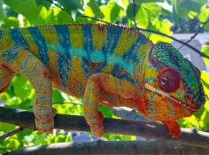

+++
title = "Bleu"
header_title = "Bleu | Yellow Body Blue Bar | Ambilobe Panther Chameleon"
date = "2019-07-15"
tags = ["bleu", "stryfe", "emma frost", "felipe sanchez"]
categories = ["retired pardalis"]
banner = "img/ambilobe/bleu/bleu"
+++



Bleu is a male we picked up from the Stryfe line. He was raised by Jeremy Booker at Brightside Chameleons, and he was a bit of a challenge to work with. We released him in early 2020 and only produced a few clutches with him. We hope to select some nice males from his offspring to bring that line into our project.



Filial
: F3-CG11

Sire
: [Stryfe]()

Dam
: [Emma Frost]()

---




  

    

      <h1>Ancestral Report for Bleu (F3)</h1>
    

    <h3>Generation 1</h3>
    
    
1. <strong>Bleu (F3). </strong>Bleu was born on 2019-07-15 at Brightside Chameleons.  He is the son of Stryfe and Emma Frost (F2). He had a relationship with Patch. 

    
Relationship with: Patch.

    
Patch was born on 2019-06-05 at iPardalis.  She is the daughter of Jude (F2) and Kako (F2). 

    
More about Bleu (F3):

    
Adopted: 2019-12-15, iPardalis.  

    <h3>Generation 2</h3>
    
    
2. <strong>Stryfe. </strong>Stryfe was produced by Joshua Illencik.  He was the son of Dio and Zeratul girl. He had a relationship with Emma Frost (F2). 

    
More about Stryfe:

    
Adopted: Brightside Chameleons.  

    
3. <strong>Emma Frost (F2). </strong>Emma Frost was produced by Chromatic Chameleons.  She died with Brightside Chameleons.  She was the daughter of Felipe Sanchez (F1) and Macho's daughter. 

    
Children of Emma Frost (F2) and Stryfe

    
i. Bleu (F3) [1]. Bleu was born on 2019-07-15 at Brightside Chameleons.  

    <h3>Generation 3</h3>
    
    
4. <strong>Dio. </strong>He died with Joshua Illencik.  He was the son of Kely-tongotra (Little Foot) and Eye Candy's daughter. He had a relationship with Zeratul girl. 

    
5. <strong>Zeratul girl. </strong>She was the daughter of Zeratul and Noki girl. 

    
Children of Zeratul girl and Dio

    
i. Stryfe [2]. Stryfe was produced by Joshua Illencik.  

    
    
6. <strong>Felipe Sanchez (F1). </strong>He is the son of Bolt (WC) and Cowboy's daughter (F1). He had a relationship with Macho's daughter. 

    
7. <strong>Macho's daughter. </strong>She is the daughter of Macho (F2). 

    
Children of Macho's daughter and Felipe Sanchez (F1)

    
i. Emma Frost (F2) [3]. Emma Frost was produced by Chromatic Chameleons.  She died with Brightside Chameleons.  

    
ii. Felipe Sanchez's daughter. 

    <h3>Generation 4</h3>
    
    
8. <strong>Kely-tongotra (Little Foot). </strong>Kely-tongotra (Little Foot) was produced by Kammerflage Kreations.  He died with Kammerflage Kreations.  He had a relationship with Unknown. He also had a relationship with Unknown. He also had a relationship with Unknown. He also had a relationship with Eye Candy's daughter. 

    
Children of Unknown and Kely-tongotra (Little Foot)

    
i. Little Foot's daughter. Little Foot's daughter was produced by Kammerflage Kreations.  She died with Kammerflage Kreations.  

    
Children of Unknown and Kely-tongotra (Little Foot)

    
i. Faingana (Quick). Faingana (Quick) was produced by Kammerflage Kreations.  He died with Kammerflage Kreations.  

    
Children of Unknown and Kely-tongotra (Little Foot)

    
i. Little Foot's daughter. Little Foot's daughter was produced by Kammerflage Kreations.  She died with Kammerflage Kreations.  

    
9. <strong>Eye Candy's daughter. </strong>Eye Candy's daughter was produced by Kammerflage Kreations.  She died with Kammerflage Kreations.  She was the daughter of Maso-vatomamy (Eye Candy). 

    
Children of Eye Candy's daughter and Kely-tongotra (Little Foot)

    
i. Dio [4]. He died with Joshua Illencik.  

    
    
10. <strong>Zeratul. </strong>He died with Joshua Illencik.  He had a relationship with Noki girl. 

    
11. <strong>Noki girl. </strong>She was the daughter of Noki. 

    
Children of Noki girl and Zeratul

    
i. Zeratul girl [5]. 

    
    
12. <strong>Bolt (WC). </strong>Bolt was produced by Canvas Chameleons.  He died with Canvas Chameleons.  He had a relationship with Cowboy's daughter (F1). 

    
13. <strong>Cowboy's daughter (F1). </strong>Cowboy's daughter was produced by Chameleon's Paradise.  She died with Canvas Chameleons.  She was the daughter of Cowboy (CH). 

    
Children of Cowboy's daughter (F1) and Bolt (WC)

    
i. Felipe Sanchez (F1) [6]. 

    
    
14. <strong>Macho (F2). </strong>He is the son of Candy Cane (F1) and Cowboy's daughter (F1). He had a relationship with Unknown. 

    
Children of Unknown and Macho (F2)

    
i. Macho's daughter [7]. 

    <h3>Generation 5</h3>
    
    
18. <strong>Maso-vatomamy (Eye Candy). </strong>Maso-vatomamy (Eye Candy) was produced by Kammerflage Kreations.  He died with Kammerflage Kreations.  He had a relationship with Unknown. He also had a relationship with Unknown. 

    
Children of Unknown and Maso-vatomamy (Eye Candy)

    
i. Eye Candy's daughter [9]. Eye Candy's daughter was produced by Kammerflage Kreations.  She died with Kammerflage Kreations.  

    
Children of Unknown and Maso-vatomamy (Eye Candy)

    
i. Mabonika-haboka (Mellow Yellow). Mabonika-haboka (Mellow Yellow) was produced by Kammerflage Kreations.  He died with Kammerflage Kreations.  

    
    
22. <strong>Noki. </strong>He had a relationship with Unknown. 

    
Children of Unknown and Noki

    
i. Noki girl [11]. 

    
    
26. <strong>Cowboy (CH). </strong>Cowboy was produced by Chameleon's Paradise.  He died on 2015-01-01 at Chameleon's Paradise.  He had a relationship with King's daughter. He also had a relationship with Unknown. He also had a relationship with Unknown. 

    
More about Cowboy (CH):

    
Description: CH - Ambilobe

    
Children of King's daughter and Cowboy (CH)

    
i. Flash (F1). Flash was born on 2015-01-10 at Chameleon's Paradise.  He died on 2018-06-14 at iPardalis.  

    
Children of Unknown and Cowboy (CH)

    
i. Cowboy's daughter (F1). 

    
Children of Unknown and Cowboy (CH)

    
i. Cowboy's daughter (F1) [13]. Cowboy's daughter was produced by Chameleon's Paradise.  She died with Canvas Chameleons.  

    
    
28. <strong>Candy Cane (F1). </strong>Candy Cane was produced by Chameleon's Paradise.  He died with Chameleon's Paradise.  He had a relationship with Jake's daughter. He also had a relationship with Cowboy's daughter (F1). 

    
Children of Jake's daughter and Candy Cane (F1)

    
i. Judy (F2). Judy was born on 2015-02-11 at Chameleon's Paradise.  She died on 2018-02-15 at iPardalis.  

    
29. <strong>Cowboy's daughter (F1). </strong>She was the daughter of Cowboy (CH). 

    
Children of Cowboy's daughter (F1) and Candy Cane (F1)

    
i. Macho (F2) [14]. 

    <h3>Generation 6</h3>
    
    
58. <strong>Cowboy (CH). </strong>Cowboy was produced by Chameleon's Paradise.  He died on 2015-01-01 at Chameleon's Paradise.  He had a relationship with King's daughter. He also had a relationship with Unknown. He also had a relationship with Unknown. 

    
More about Cowboy (CH):

    
Description: CH - Ambilobe

    
Children of King's daughter and Cowboy (CH)

    
i. Flash (F1). Flash was born on 2015-01-10 at Chameleon's Paradise.  He died on 2018-06-14 at iPardalis.  

    
Children of Unknown and Cowboy (CH)

    
i. Cowboy's daughter (F1) [29]. 

    
Children of Unknown and Cowboy (CH)

    
i. Cowboy's daughter (F1). Cowboy's daughter was produced by Chameleon's Paradise.  She died with Canvas Chameleons.  

  


