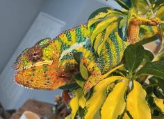
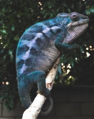
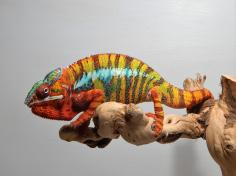
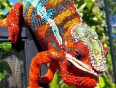

+++
title = "coco"
date = "2020-12-04"
tags = ["coco", "hendrix", "foxey", "landy", "bolt", "gambit"]
categories = ["ambilobe-dams"]
banner = "img/ambilobe/coco/coco"
+++



Coco brings a new WC line from Brightside Chameleon's Gambit into our project via Hendrix/Dante from Ramblin' Exotics! Hendrix is a great mix of two recent WC sires, Gambit and Bolt, and we are very excited to add his daughter to our breeding group. She has phenomenal coloring for a female and has been able to lay and bounce back easily thus far. Very healthy girl!



Filial
: *F3-CG3*

Sire
: [Hendrix]()

Dam
: [Foxey]()

---




  

    

      <h1>Ancestral Report for Coco (F3-CG3)</h1>
    

    <h3>Generation 1</h3>
    
1. <strong>Coco (F3-CG3). </strong>Coco was born on 2020-12-03 at Ramblin' Exotics.  She is the daughter of Hendrix (F2-CG2) and Foxey (F9-CG12). 

    <h3>Generation 2</h3>
    
    
2. <strong>Hendrix (F2-CG2). </strong>Hendrix was produced by Tropical Chameleons.  He is the son of Dante (F1) and Sunkist (F1). He had a relationship with Foxey (F9-CG12). 

    
More about Hendrix (F2-CG2):

    
Adopted: Ramblin' Exotics.  

    
3. <strong>Foxey (F9-CG12). </strong>Foxey was produced by Kammerflage Kreations.  She is the daughter of Landy (Silk) F8-CG11 and Hamy (Sweetness) F8-CG11. 

    
More about Foxey (F9-CG12):

    
Adopted: Ramblin' Exotics.  

    
Children of Foxey (F9-CG12) and Hendrix (F2-CG2)

    
i. Coco (F3-CG3) [1]. Coco was born on 2020-12-03 at Ramblin' Exotics.  

    
ii. Imelda (F3-CG13). Imelda was born on 2020-12-03 at Ramblin' Exotics.  

    <h3>Generation 3</h3>
    
    
4. <strong>Dante (F1). </strong>Dante was produced by Brightside Chameleons.  He is the son of Gambit (WC) and Polaris. He had a relationship with Sunkist (F1). 

    
More about Dante (F1):

    
Adopted: Tropical Chameleons.  

    
5. <strong>Sunkist (F1). </strong>Sunkist was produced by Canvas Chameleons.  She is the daughter of Bolt (WC) and Test. 

    
More about Sunkist (F1):

    
Adopted: Tropical Chameleons.  

    
Children of Sunkist (F1) and Dante (F1)

    
i. Hendrix (F2-CG2) [2]. Hendrix was produced by Tropical Chameleons.  

    
    
6. <strong>Landy (Silk) F8-CG11. </strong>Landy (Silk) F8-CG11 was born on 2018-02-20 at Kammerflage Kreations.  He is the son of Giga-vony (Old Yeller) and Au-sanga (Goldie Locks). He had a relationship with Hamy (Sweetness) F8-CG11. 

    
    
7. <strong>Hamy (Sweetness) F8-CG11. </strong>Hamy (Sweetness) was produced by Kammerflage Kreations.  She is the daughter of Fantara (Falling Star) and Mavo-loha (Blondie). 

    
Children of Hamy (Sweetness) F8-CG11 and Landy (Silk) F8-CG11

    
i. Itso-triombe (Green Giant) F9-CG12. Itso-triombe (Green Giant) was produced by Kammerflage Kreations.  

    
ii. Foxey (F9-CG12) [3]. Foxey was produced by Kammerflage Kreations.  

    
iii. Shirley (F9-CG12). Shirley was produced by Kammerflage Kreations.  

    <h3>Generation 4</h3>
    
    
8. <strong>Gambit (WC). </strong>He had a relationship with Polaris. 

    
More about Gambit (WC):

    
Adopted: Brightside Chameleons.  

    
9. <strong>Polaris. </strong>Polaris was produced by Brightside Chameleons.  She is the daughter of Cyclops and Pheonix. 

    
Children of Polaris and Gambit (WC)

    
i. Dante (F1) [4]. Dante was produced by Brightside Chameleons.  

    
    
10. <strong>Bolt (WC). </strong>Bolt was produced by Canvas Chameleons.  He died with Canvas Chameleons.  He had a relationship with Cowboy's daughter (F1). He also had a relationship with Test. 

    
Children of Cowboy's daughter (F1) and Bolt (WC)

    
i. Felipe Sanchez (F1-CG2). 

    
11. <strong>Test. </strong>She was the daughter of Marley. 

    
Children of Test and Bolt (WC)

    
i. Sunkist (F1) [5]. Sunkist was produced by Canvas Chameleons.  

    
    
12. <strong>Giga-vony (Old Yeller). </strong>Giga-vony (Old Yeller) was produced by Kammerflage Kreations.  He is the son of Mavo-ra (Yellow Blood) and Tsara-andro (Good Day). He had a relationship with Au-sanga (Goldie Locks). 

    
13. <strong>Au-sanga (Goldie Locks). </strong>

    
Children of Au-sanga (Goldie Locks) and Giga-vony (Old Yeller)

    
i. Landy (Silk) F8-CG11 [6]. Landy (Silk) F8-CG11 was born on 2018-02-20 at Kammerflage Kreations.  

    
More about Au-sanga (Goldie Locks) and Giga-vony (Old Yeller):

    
Birth: 2018-02-20, Kammerflage Kreations.  

    
    
14. <strong>Fantara (Falling Star). </strong>Fantara (Falling Star) was produced by Kammerflage Kreations.  He is the son of Maizina-lanitra (Dark Sky). He had a relationship with Zazabodo-manga (Baby Blue). He also had a relationship with Mavo-loha (Blondie). 

    
Children of Zazabodo-manga (Baby Blue) and Fantara (Falling Star)

    
i. Artemis. 

    
    
15. <strong>Mavo-loha (Blondie). </strong>Mavo-loha (Blondie) was born on 2016-02-03 at Kammerflage Kreations.  She is the daughter of Mavo-ra (Yellow Blood) and Tsara-andro (Good Day). 

    
Children of Mavo-loha (Blondie) and Fantara (Falling Star)

    
i. Hamy (Sweetness) F8-CG11 [7]. Hamy (Sweetness) was produced by Kammerflage Kreations.  

    
ii. Ajax. Ajax was produced by Kammerflage Kreations.  

    
iii. Roa-ony (Two Rivers). Roa-ony (Two Rivers) was produced by Kammerflage Kreations.  

    <h3>Generation 5</h3>
    
    
18. <strong>Cyclops. </strong>Cyclops was produced by Brightside Chameleons.  He had a relationship with Pheonix. 

    
19. <strong>Pheonix. </strong>She is the daughter of Zephyros. 

    
Children of Pheonix and Cyclops

    
i. Polaris [9]. Polaris was produced by Brightside Chameleons.  

    
    
22. <strong>Marley. </strong>Marley was produced by Canvas Chameleons.  He had a relationship with Outline's daughter. He also had a relationship with Unknown. 

    
Children of Outline's daughter and Marley

    
i. Marley's daughter. 

    
Children of Unknown and Marley

    
i. Test [11]. 

    
    
24. <strong>Mavo-ra (Yellow Blood). </strong>Mavo-ra (Yellow Blood) was produced by Kammerflage Kreations.  He died with Kammerflage Kreations.  He was the son of Mabonika-haboka (Mellow Yellow). He had a relationship with Unknown. He also had a relationship with Tsara-andro (Good Day). 

    
Children of Unknown and Mavo-ra (Yellow Blood)

    
i. Vony-reny. Vony-reny was produced by Kammerflage Kreations.  She died with Kammerflage Kreations.  

    
    
25. <strong>Tsara-andro (Good Day). </strong>Tsara-andro (Good Day) was produced by Kammerflage Kreations.  She was the daughter of Kely-tongotra (Little Foot). 

    
Children of Tsara-andro (Good Day) and Mavo-ra (Yellow Blood)

    
i. Mavo-loha (Blondie) [15]. Mavo-loha (Blondie) was born on 2016-02-03 at Kammerflage Kreations.  

    
ii. Giga-vony (Old Yeller) [12]. Giga-vony (Old Yeller) was produced by Kammerflage Kreations.  

    
iii. JJ (F7-CG10). JJ  was produced by Kammerflage Kreations.  

    
    
28. <strong>Maizina-lanitra (Dark Sky). </strong>Maizina-lanitra (Dark Sky) was produced by Kammerflage Kreations.  He is the son of Kely-tongotra (Little Foot). He had a relationship with Unknown. 

    
Children of Unknown and Maizina-lanitra (Dark Sky)

    
i. Fantara (Falling Star) [14]. Fantara (Falling Star) was produced by Kammerflage Kreations.  

    
    
30. <strong>Mavo-ra (Yellow Blood). </strong>Mavo-ra (Yellow Blood) was produced by Kammerflage Kreations.  He died with Kammerflage Kreations.  He was the son of Mabonika-haboka (Mellow Yellow). He had a relationship with Unknown. He also had a relationship with Tsara-andro (Good Day). 

    
Children of Unknown and Mavo-ra (Yellow Blood)

    
i. Vony-reny. Vony-reny was produced by Kammerflage Kreations.  She died with Kammerflage Kreations.  

    
    
31. <strong>Tsara-andro (Good Day). </strong>Tsara-andro (Good Day) was produced by Kammerflage Kreations.  She was the daughter of Kely-tongotra (Little Foot). 

    
Children of Tsara-andro (Good Day) and Mavo-ra (Yellow Blood)

    
i. Mavo-loha (Blondie) [15]. Mavo-loha (Blondie) was born on 2016-02-03 at Kammerflage Kreations.  

    
ii. Giga-vony (Old Yeller) [12]. Giga-vony (Old Yeller) was produced by Kammerflage Kreations.  

    
iii. JJ (F7-CG10). JJ  was produced by Kammerflage Kreations.  

    <h3>Generation 6</h3>
    
38. <strong>Zephyros. </strong>Zephyros was produced by Mythical Exotics.  He had a relationship with Unknown. 

    
Children of Unknown and Zephyros

    
i. Pheonix [19]. 

    
    
48. <strong>Mabonika-haboka (Mellow Yellow). </strong>Mabonika-haboka (Mellow Yellow) was produced by Kammerflage Kreations.  He died with Kammerflage Kreations.  He was the son of Maso-vatomamy (Eye Candy). He had a relationship with Unknown. 

    
Children of Unknown and Mabonika-haboka (Mellow Yellow)

    
i. Mavo-ra (Yellow Blood) [30]. Mavo-ra (Yellow Blood) was produced by Kammerflage Kreations.  He died with Kammerflage Kreations.  

    
    
50. <strong>Kely-tongotra (Little Foot). </strong>Kely-tongotra (Little Foot) was produced by Kammerflage Kreations.  He died with Kammerflage Kreations.  He was the son of Hatsikana (Legend). He had a relationship with Unknown. He also had a relationship with Unknown. He also had a relationship with Unknown. He also had a relationship with Eye Candy's daughter. He also had a relationship with Unknown. He also had a relationship with Unknown. 

    
Children of Unknown and Kely-tongotra (Little Foot)

    
i. Little Foot's daughter. Little Foot's daughter was produced by Kammerflage Kreations.  She died with Kammerflage Kreations.  

    
Children of Unknown and Kely-tongotra (Little Foot)

    
i. Faingana (Quick). Faingana (Quick) was produced by Kammerflage Kreations.  He died with Kammerflage Kreations.  

    
Children of Unknown and Kely-tongotra (Little Foot)

    
i. Little Foot's daughter. Little Foot's daughter was produced by Kammerflage Kreations.  She died with Kammerflage Kreations.  

    
Children of Eye Candy's daughter and Kely-tongotra (Little Foot)

    
i. Dio. He died with Joshua Illencik.  

    
Children of Unknown and Kely-tongotra (Little Foot)

    
i. Tsara-andro (Good Day) [31]. Tsara-andro (Good Day) was produced by Kammerflage Kreations.  

    
Children of Unknown and Kely-tongotra (Little Foot)

    
i. Maizina-lanitra (Dark Sky) [28]. Maizina-lanitra (Dark Sky) was produced by Kammerflage Kreations.  

    
    
56. <strong>Kely-tongotra (Little Foot). </strong>Kely-tongotra (Little Foot) was produced by Kammerflage Kreations.  He died with Kammerflage Kreations.  He was the son of Hatsikana (Legend). He had a relationship with Unknown. He also had a relationship with Unknown. He also had a relationship with Unknown. He also had a relationship with Eye Candy's daughter. He also had a relationship with Unknown. He also had a relationship with Unknown. 

    
Children of Unknown and Kely-tongotra (Little Foot)

    
i. Little Foot's daughter. Little Foot's daughter was produced by Kammerflage Kreations.  She died with Kammerflage Kreations.  

    
Children of Unknown and Kely-tongotra (Little Foot)

    
i. Faingana (Quick). Faingana (Quick) was produced by Kammerflage Kreations.  He died with Kammerflage Kreations.  

    
Children of Unknown and Kely-tongotra (Little Foot)

    
i. Little Foot's daughter. Little Foot's daughter was produced by Kammerflage Kreations.  She died with Kammerflage Kreations.  

    
Children of Eye Candy's daughter and Kely-tongotra (Little Foot)

    
i. Dio. He died with Joshua Illencik.  

    
Children of Unknown and Kely-tongotra (Little Foot)

    
i. Tsara-andro (Good Day) [31]. Tsara-andro (Good Day) was produced by Kammerflage Kreations.  

    
Children of Unknown and Kely-tongotra (Little Foot)

    
i. Maizina-lanitra (Dark Sky) [28]. Maizina-lanitra (Dark Sky) was produced by Kammerflage Kreations.  

    
    
60. <strong>Mabonika-haboka (Mellow Yellow). </strong>Mabonika-haboka (Mellow Yellow) was produced by Kammerflage Kreations.  He died with Kammerflage Kreations.  He was the son of Maso-vatomamy (Eye Candy). He had a relationship with Unknown. 

    
Children of Unknown and Mabonika-haboka (Mellow Yellow)

    
i. Mavo-ra (Yellow Blood) [30]. Mavo-ra (Yellow Blood) was produced by Kammerflage Kreations.  He died with Kammerflage Kreations.  

    
    
62. <strong>Kely-tongotra (Little Foot). </strong>Kely-tongotra (Little Foot) was produced by Kammerflage Kreations.  He died with Kammerflage Kreations.  He was the son of Hatsikana (Legend). He had a relationship with Unknown. He also had a relationship with Unknown. He also had a relationship with Unknown. He also had a relationship with Eye Candy's daughter. He also had a relationship with Unknown. He also had a relationship with Unknown. 

    
Children of Unknown and Kely-tongotra (Little Foot)

    
i. Little Foot's daughter. Little Foot's daughter was produced by Kammerflage Kreations.  She died with Kammerflage Kreations.  

    
Children of Unknown and Kely-tongotra (Little Foot)

    
i. Faingana (Quick). Faingana (Quick) was produced by Kammerflage Kreations.  He died with Kammerflage Kreations.  

    
Children of Unknown and Kely-tongotra (Little Foot)

    
i. Little Foot's daughter. Little Foot's daughter was produced by Kammerflage Kreations.  She died with Kammerflage Kreations.  

    
Children of Eye Candy's daughter and Kely-tongotra (Little Foot)

    
i. Dio. He died with Joshua Illencik.  

    
Children of Unknown and Kely-tongotra (Little Foot)

    
i. Tsara-andro (Good Day) [31]. Tsara-andro (Good Day) was produced by Kammerflage Kreations.  

    
Children of Unknown and Kely-tongotra (Little Foot)

    
i. Maizina-lanitra (Dark Sky) [28]. Maizina-lanitra (Dark Sky) was produced by Kammerflage Kreations.  

    <h3>Generation 7</h3>
    
    
96. <strong>Maso-vatomamy (Eye Candy). </strong>Maso-vatomamy (Eye Candy) was produced by Kammerflage Kreations.  He died with Kammerflage Kreations.  He had a relationship with Unknown. He also had a relationship with Unknown. 

    
Children of Unknown and Maso-vatomamy (Eye Candy)

    
i. Eye Candy's daughter. Eye Candy's daughter was produced by Kammerflage Kreations.  She died with Kammerflage Kreations.  

    
Children of Unknown and Maso-vatomamy (Eye Candy)

    
i. Mabonika-haboka (Mellow Yellow) [60]. Mabonika-haboka (Mellow Yellow) was produced by Kammerflage Kreations.  He died with Kammerflage Kreations.  

    
    
100. <strong>Hatsikana (Legend). </strong>Hatsikana (Legend) was produced by Kammerflage Kreations.  He died with Kammerflage Kreations.  He had a relationship with Unknown. 

    
Children of Unknown and Hatsikana (Legend)

    
i. Kely-tongotra (Little Foot) [62]. Kely-tongotra (Little Foot) was produced by Kammerflage Kreations.  He died with Kammerflage Kreations.  

    
    
112. <strong>Hatsikana (Legend). </strong>Hatsikana (Legend) was produced by Kammerflage Kreations.  He died with Kammerflage Kreations.  He had a relationship with Unknown. 

    
Children of Unknown and Hatsikana (Legend)

    
i. Kely-tongotra (Little Foot) [62]. Kely-tongotra (Little Foot) was produced by Kammerflage Kreations.  He died with Kammerflage Kreations.  

    
    
120. <strong>Maso-vatomamy (Eye Candy). </strong>Maso-vatomamy (Eye Candy) was produced by Kammerflage Kreations.  He died with Kammerflage Kreations.  He had a relationship with Unknown. He also had a relationship with Unknown. 

    
Children of Unknown and Maso-vatomamy (Eye Candy)

    
i. Eye Candy's daughter. Eye Candy's daughter was produced by Kammerflage Kreations.  She died with Kammerflage Kreations.  

    
Children of Unknown and Maso-vatomamy (Eye Candy)

    
i. Mabonika-haboka (Mellow Yellow) [60]. Mabonika-haboka (Mellow Yellow) was produced by Kammerflage Kreations.  He died with Kammerflage Kreations.  

    
    
124. <strong>Hatsikana (Legend). </strong>Hatsikana (Legend) was produced by Kammerflage Kreations.  He died with Kammerflage Kreations.  He had a relationship with Unknown. 

    
Children of Unknown and Hatsikana (Legend)

    
i. Kely-tongotra (Little Foot) [62]. Kely-tongotra (Little Foot) was produced by Kammerflage Kreations.  He died with Kammerflage Kreations.  

  



