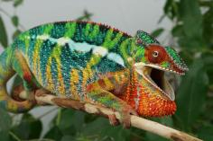
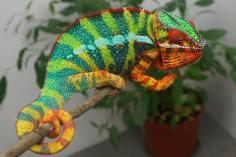
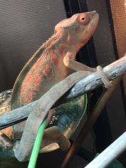
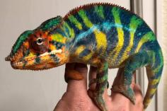

+++
title = "Dehibe"
date = "2021-10-16"
tags = ["dehibe", "arti", "alla", "jj", "artemis"]
categories = ["ambilobe-sires"]
banner = "img/ambilobe/dehibe/dehibe3"
+++



Dehibe is a great YBBB Ambilobe we produced with [Arti]() and [Alla](). He brings some great blue bars and a yellow body, very similar to his sire. He and his sister, Artalla, were the only two babies to survive Alla's last clutch, and they are very special to us. This is a great cb combination without any of our main line in it.



Filial
: *F4-CG13*

Sire
: [Arti]()

Dam
: [Alla]()

---




  

    

      <h1>Ancestral Report for Dehibe (F4-CG13)</h1>
    

    <h3>Generation 1</h3>
    
    
1. <strong>Dehibe (F4-CG13). </strong>Dehibe was born on 2021-10-15 at iPardalis.  He is the son of Arti (F3-CG12) and Alla (F8-CG11). 

    <h3>Generation 2</h3>
    
    
2. <strong>Arti (F3-CG12). </strong>Arti was born on 2020-04-05 at Brian Stewart.  He is the son of Artemis (F8-CG11) and Felipe Sanchez's daughter (F2-CG3). He had a relationship with Alla (F8-CG11). 

    
    
3. <strong>Alla (F8-CG11). </strong>Alla was born on 2018-01-30 at Panther Creek Chameleons.  She is the daughter of JJ (F7-CG10) and Blue Bird's daughter. 

    
Children of Alla (F8-CG11) and Jude (F2-CG3)

    
i. Blossom (F3-CG12). Blossom was born on 2019-07-09 at iPardalis.  

    
ii. Clyde (F3-CG12). Clyde was born on 2019-07-09 at iPardalis.  

    
iii. M11. M11 was born on 2019-11-20.  

    
iv. Alfred (F3-CG12). Alfred was born on 2019-10-20 at iPardalis.  

    
v. Jack (F3-CG12). Jack was born on 2019-10-20 at iPardalis.  

    
vi. Button (F3-CG12). Button was born on 2019-07-09 at iPardalis.  

    
vii. Bubbles (F3-CG12). Bubbles (F3-CG12) was born on 2019-07-09 at iPardalis.  

    
viii. Mondrian (F3-CG12). Mondrian was born on 2019-08-16 at iPardalis.  

    
ix. Toby (F3-CG12). Toby was born on 2019-07-09 at iPardalis.  

    
x. Tigravavy (F3-CG12). Tigravavy was born on 2019-12-12 at iPardalis.  

    
Children of Alla (F8-CG11) and Arti (F3-CG12)

    
i. Dehibe (F4-CG13) [1]. Dehibe was born on 2021-10-15 at iPardalis.  

    
ii. Artalla (F4-CG13). Artalla was born on 2021-10-15 at iPardalis.  

    <h3>Generation 3</h3>
    
    
4. <strong>Artemis (F8-CG11). </strong>He is the son of Fantara (Falling Star) (F7-CG10) and Zazabodo-manga (Baby Blue). He had a relationship with Felipe Sanchez's daughter (F2-CG3). 

    
5. <strong>Felipe Sanchez's daughter (F2-CG3). </strong>Felipe Sanchez's daughter was produced by Chromatic Chameleons.  She is the daughter of Felipe Sanchez (F1-CG2) and Snapjacks (F3-CG3). 

    
Children of Felipe Sanchez's daughter (F2-CG3) and Artemis (F8-CG11)

    
i. Arti (F3-CG12) [2]. Arti was born on 2020-04-05 at Brian Stewart.  

    
ii. Amara (F3-CG12). Amara was born on 2020-04-05 at Brian Stewart.  

    
    
6. <strong>JJ (F7-CG10). </strong>JJ was produced by Kammerflage Kreations.  He is the son of Mavo-ra (Yellow Blood) and Tsara-andro (Good Day) (F6-CG9). He had a relationship with Blue Bird's daughter. He also had a relationship with Daisy (F8-CG11). 

    
Children of Daisy (F8-CG11) and JJ (F7-CG10)

    
i. Kromatisk (F8-CG12). Kromatisk was born on 2018-08-26 at Chromatic Chameleons.  

    
7. <strong>Blue Bird's daughter. </strong>Blue Bird's daughter was produced by Eric Thompson.  She is the daughter of Blue Bird Jr. and Blaze's daughter. 

    
Children of Blue Bird's daughter and JJ (F7-CG10)

    
i. Alla (F8-CG11) [3]. Alla was born on 2018-01-30 at Panther Creek Chameleons.  

    <h3>Generation 4</h3>
    
    
8. <strong>Fantara (Falling Star) (F7-CG10). </strong>Fantara (Falling Star) was produced by Kammerflage Kreations.  He is the son of Maizina-lanitra (Dark Sky). He had a relationship with Zazabodo-manga (Baby Blue). He also had a relationship with Mavo-loha (Blondie). He also had a relationship with Unknown. 

    
Children of Mavo-loha (Blondie) and Fantara (Falling Star) (F7-CG10)

    
i. Hamy (Sweetness) F8-CG11. Hamy (Sweetness) was produced by Kammerflage Kreations.  

    
ii. Ajax (F8-CG11). Ajax was produced by Kammerflage Kreations.  

    
iii. Roa-ony (Two Rivers) (F8-CG11). Roa-ony (Two Rivers) was produced by Kammerflage Kreations.  

    
Children of Unknown and Fantara (Falling Star) (F7-CG10)

    
i. Fantara's daughter (F8-CG11). 

    
9. <strong>Zazabodo-manga (Baby Blue). </strong>Zazabodo-manga (Baby Blue) was born on 2018-01-01 at Kammerflage Kreations.  She is the daughter of Telo-heny (Triple). 

    
Children of Zazabodo-manga (Baby Blue) and Fantara (Falling Star) (F7-CG10)

    
i. Artemis (F8-CG11) [4]. 

    
    
10. <strong>Felipe Sanchez (F1-CG2). </strong>He is the son of Bolt (WC) and Cowboy's daughter (F1). He had a relationship with Snapjacks (F3-CG3). 

    
11. <strong>Snapjacks (F3-CG3). </strong>She is the daughter of Macho (F2-CG2) and 24k's daughter. 

    
Children of Snapjacks (F3-CG3) and Felipe Sanchez (F1-CG2)

    
i. Emma Frost (F2-CG4). Emma Frost was produced by Chromatic Chameleons.  

    
ii. Felipe Sanchez's daughter (F2-CG4). 

    
iii. Felipe Sanchez's daughter (F2-CG3) [5]. Felipe Sanchez's daughter was produced by Chromatic Chameleons.  

    
    
12. <strong>Mavo-ra (Yellow Blood). </strong>Mavo-ra (Yellow Blood) was produced by Kammerflage Kreations.  He is the son of Mabonika-haboka (Mellow Yellow). He had a relationship with Unknown. He also had a relationship with Tsara-andro (Good Day) (F6-CG9). 

    
Children of Unknown and Mavo-ra (Yellow Blood)

    
i. Vony-reny (Yellow Mother). Vony-reny (Yellow Mother) was produced by Kammerflage Kreations.  

    
    
13. <strong>Tsara-andro (Good Day) (F6-CG9). </strong>Tsara-andro (Good Day) was produced by Kammerflage Kreations.  She is the daughter of Kely-tongotra (Little Foot) (F5-CG8). 

    
Children of Tsara-andro (Good Day) (F6-CG9) and Mavo-ra (Yellow Blood)

    
i. Mavo-loha (Blondie). Mavo-loha (Blondie) was born on 2016-02-03 at Kammerflage Kreations.  

    
ii. Giga-vony (Old Yeller). Giga-vony (Old Yeller) was produced by Kammerflage Kreations.  

    
iii. JJ (F7-CG10) [6]. JJ was produced by Kammerflage Kreations.  

    
    
14. <strong>Blue Bird Jr. </strong>He had a relationship with Blaze's daughter. 

    
15. <strong>Blaze's daughter. </strong>She is the daughter of Blaze. 

    
Children of Blaze's daughter and Blue Bird Jr.

    
i. Blue Bird's daughter [7]. Blue Bird's daughter was produced by Eric Thompson.  

    <h3>Generation 5</h3>
    
    
16. <strong>Maizina-lanitra (Dark Sky). </strong>Maizina-lanitra (Dark Sky) was produced by Kammerflage Kreations.  He is the son of Kely-tongotra (Little Foot) (F5-CG8). He had a relationship with Unknown. He also had a relationship with Unknown. 

    
Children of Unknown and Maizina-lanitra (Dark Sky)

    
i. Fantara (Falling Star) (F7-CG10) [8]. Fantara (Falling Star) was produced by Kammerflage Kreations.  

    
Children of Unknown and Maizina-lanitra (Dark Sky)

    
i. Bolitika-zandry (Little Sister). Bolitika-zandry (Little Sister) was produced by Kammerflage Kreations.  

    
    
18. <strong>Telo-heny (Triple). </strong>Telo-heny (Triple) was born on 2015-01-15 at Kammerflage Kreations.  He is the son of Dobo (Double). He had a relationship with Unknown. He also had a relationship with Unknown. He also had a relationship with Unknown. 

    
Children of Unknown and Telo-heny (Triple)

    
i. Triple's daughter. Triple's daughter was produced by Kammerflage Kreations.  

    
Children of Unknown and Telo-heny (Triple)

    
i. Zazabodo-manga (Baby Blue) [9]. Zazabodo-manga (Baby Blue) was born on 2018-01-01 at Kammerflage Kreations.  

    
Children of Unknown and Telo-heny (Triple)

    
i. Telo Heny's daughter. 

    
    
20. <strong>Bolt (WC). </strong>Bolt was produced by Canvas Chameleons.  He had a relationship with Cowboy's daughter (F1). He also had a relationship with Test (F1). 

    
Children of Test (F1) and Bolt (WC)

    
i. Sunkist (F1-CG2). Sunkist was produced by Canvas Chameleons.  

    
21. <strong>Cowboy's daughter (F1). </strong>Cowboy's daughter was produced by Chameleon's Paradise.  She is the daughter of Cowboy (CH). 

    
Children of Cowboy's daughter (F1) and Bolt (WC)

    
i. Felipe Sanchez (F1-CG2) [10]. 

    
    
22. <strong>Macho (F2-CG2). </strong>He is the son of Candy Cane (F1) and Cowboy's daughter (F1). He had a relationship with 24k's daughter. 

    
23. <strong>24k's daughter. </strong>24k's daughter was produced by Chameleon's Paradise.  She is the daughter of 24k. 

    
Children of 24k's daughter and Macho (F2-CG2)

    
i. Wetdream (F3). 

    
ii. Snapjacks (F3-CG3) [11]. 

    
    
24. <strong>Mabonika-haboka (Mellow Yellow). </strong>Mabonika-haboka (Mellow Yellow) was produced by Kammerflage Kreations.  He is the son of Maso-vatomamy (Eye Candy). He had a relationship with Unknown. 

    
Children of Unknown and Mabonika-haboka (Mellow Yellow)

    
i. Mavo-ra (Yellow Blood) [12]. Mavo-ra (Yellow Blood) was produced by Kammerflage Kreations.  

    
    
26. <strong>Kely-tongotra (Little Foot) (F5-CG8). </strong>Kely-tongotra (Little Foot) was produced by Kammerflage Kreations.  He is the son of Hatsikana (Legend). He had a relationship with Unknown. He also had a relationship with Unknown. He also had a relationship with Unknown. He also had a relationship with Eye Candy's daughter. He also had a relationship with Unknown. He also had a relationship with Unknown. He also had a relationship with Unknown. 

    
Children of Unknown and Kely-tongotra (Little Foot) (F5-CG8)

    
i. Little Foot's daughter. Little Foot's daughter was produced by Kammerflage Kreations.  

    
Children of Unknown and Kely-tongotra (Little Foot) (F5-CG8)

    
i. Faingana (Quick). Faingana (Quick) was produced by Kammerflage Kreations.  

    
Children of Unknown and Kely-tongotra (Little Foot) (F5-CG8)

    
i. Little Foot's daughter. Little Foot's daughter was produced by Kammerflage Kreations.  

    
Children of Eye Candy's daughter and Kely-tongotra (Little Foot) (F5-CG8)

    
i. Dio (F6-CG9). 

    
Children of Unknown and Kely-tongotra (Little Foot) (F5-CG8)

    
i. Tsara-andro (Good Day) (F6-CG9) [13]. Tsara-andro (Good Day) was produced by Kammerflage Kreations.  

    
Children of Unknown and Kely-tongotra (Little Foot) (F5-CG8)

    
i. Maizina-lanitra (Dark Sky). Maizina-lanitra (Dark Sky) was produced by Kammerflage Kreations.  

    
Children of Unknown and Kely-tongotra (Little Foot) (F5-CG8)

    
i. Faingana (Quick). Faingana (Quick) was produced by Kammerflage Kreations.  

    
    
30. <strong>Blaze. </strong>He had a relationship with Unknown. 

    
Children of Unknown and Blaze

    
i. Blaze's daughter [15]. 

    <h3>Generation 6</h3>
    
    
32. <strong>Kely-tongotra (Little Foot) (F5-CG8). </strong> is the same person as [26].

    
36. <strong>Dobo (Double). </strong>He had a relationship with Unknown. 

    
Children of Unknown and Dobo (Double)

    
i. Telo-heny (Triple) [18]. Telo-heny (Triple) was born on 2015-01-15 at Kammerflage Kreations.  

    
    
42. <strong>Cowboy (CH). </strong>Cowboy was produced by Chameleon's Paradise.  He died on 2015-01-01 at Chameleon's Paradise.  He had a relationship with King's daughter. He also had a relationship with Unknown. He also had a relationship with Unknown. He also had a relationship with Unknown. 

    
Children of King's daughter and Cowboy (CH)

    
i. Flash (F1). Flash was born on 2015-01-10 at Chameleon's Paradise.  He died on 2018-06-14 at iPardalis.  

    
Children of Unknown and Cowboy (CH)

    
i. Cowboy's daughter (F1). 

    
Children of Unknown and Cowboy (CH)

    
i. Cowboy's daughter (F1) [21]. Cowboy's daughter was produced by Chameleon's Paradise.  

    
Children of Unknown and Cowboy (CH)

    
i. Cowboy's daughter (F1). 

    
    
44. <strong>Candy Cane (F1). </strong>Candy Cane was produced by Chameleon's Paradise.  He had a relationship with Jake's daughter. He also had a relationship with Cowboy's daughter (F1). He also had a relationship with Unknown. He also had a relationship with Cowboy's daughter (F1). 

    
Children of Jake's daughter and Candy Cane (F1)

    
i. Judy (F2). Judy was born on 2015-02-11 at Chameleon's Paradise.  She died on 2018-02-15 at iPardalis.  

    
Children of Unknown and Candy Cane (F1)

    
i. Candy Cane's Daughter (F2). 

    
Children of Cowboy's daughter (F1) and Candy Cane (F1)

    
i. Candy Cane's daughter (F2). 

    
45. <strong>Cowboy's daughter (F1). </strong>She is the daughter of Cowboy (CH). 

    
Children of Cowboy's daughter (F1) and Candy Cane (F1)

    
i. Macho (F2-CG2) [22]. 

    
    
46. <strong>24k. </strong>24k was produced by Chameleon's Paradise.  He had a relationship with Unknown. 

    
Children of Unknown and 24k

    
i. 24k's daughter [23]. 24k's daughter was produced by Chameleon's Paradise.  

    
    
48. <strong>Maso-vatomamy (Eye Candy). </strong>Maso-vatomamy (Eye Candy) was produced by Kammerflage Kreations.  He had a relationship with Unknown. He also had a relationship with Unknown. 

    
Children of Unknown and Maso-vatomamy (Eye Candy)

    
i. Eye Candy's daughter. Eye Candy's daughter was produced by Kammerflage Kreations.  

    
Children of Unknown and Maso-vatomamy (Eye Candy)

    
i. Mabonika-haboka (Mellow Yellow) [24]. Mabonika-haboka (Mellow Yellow) was produced by Kammerflage Kreations.  

    
    
52. <strong>Hatsikana (Legend). </strong>Hatsikana (Legend) was produced by Kammerflage Kreations.  He had a relationship with Unknown. 

    
Children of Unknown and Hatsikana (Legend)

    
i. Kely-tongotra (Little Foot) (F5-CG8) [26]. Kely-tongotra (Little Foot) was produced by Kammerflage Kreations.  

    <h3>Generation 7</h3>
    
    
64. <strong>Hatsikana (Legend). </strong> is the same person as [52].

    
    
90. <strong>Cowboy (CH). </strong> is the same person as [42].

  



