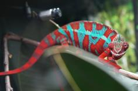
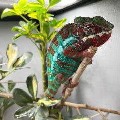
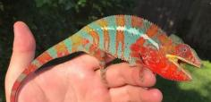
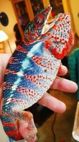
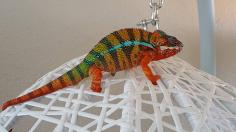

+++
title = "Hong"
header_title = "Hong | Red Body Blue Bar | Ambilobe Panther Chameleon"
date = "2023-10-19"
tags = ["hong", "snoop dog", "optimus prime"]
categories = ["ambilobe-sires"]
banner = "img/ambilobe/hong/hong3"
+++



Hong is the most astonishing Red Body Blue Bar (RBBB) Ambilobe Panther Chameleon I have seen in person. His colors are velvety smooth. He has a deep red body and beautiful sky blue bars. Ryan Roberson produced him with his WC Ambilobe named Snoop Dog and a female from Brenton Schappel's WC Ambilobe over at Chameleons by Design. Achieving that look at the F1 generation with an F1 female is unheard of - absolutely amazing work by Ryan here. We're hoping Hong will be a pillar in our RBBB Ambilobe project given he is not related to Ralph or Kosmo and he brings some phenomenal traits into the mix!



Filial
: *F1-CG2*

Sire
: [Snoop Dog]()

Dam
: [Chameleons By Design Wc's Daughter]()

---




  

    

      <h1>Ancestral Report for Hong (F1)</h1>
    

    <h3>Generation 1</h3>
    
    
1. <strong>Hong (F1). </strong>Hong was born on 2023-10-19 at Roberson Reptiles.  He is the son of Snoop Dog (WC) and Chameleons by Design WC's Daughter (F1). 

    
More about Hong (F1):

    
Adopted: 2024-03-06, iPardalis. 

    <h3>Generation 2</h3>
    
    
2. <strong>Snoop Dog (WC). </strong>He had a relationship with Chameleons by Design WC's Daughter (F1). 

    
More about Snoop Dog (WC):

    
Adopted: Roberson Reptiles. 

    
3. <strong>Chameleons by Design WC's Daughter (F1). </strong>Chameleons by Design WC's Daughter was produced by Chameleon's by Design.  She is the daughter of Chameleon's by Design (WC) and Optimus Prime's Daughter. 

    
Children of Chameleons by Design WC's Daughter (F1) and Snoop Dog (WC)

    
i. Hong (F1) [1]. Hong was born on 2023-10-19 at Roberson Reptiles.  

    <h3>Generation 3</h3>
    
    
6. <strong>Chameleon's by Design (WC). </strong>He had a relationship with Optimus Prime's Daughter. 

    
More about Chameleon's by Design (WC):

    
Adopted: Chameleons by Design. 

    
7. <strong>Optimus Prime's Daughter. </strong>She is the daughter of Optimus Prime and Beastie Boy's Daughter. 

    
Children of Optimus Prime's Daughter and Chameleon's by Design (WC)

    
i. Chameleons by Design WC's Daughter (F1) [3]. Chameleons by Design WC's Daughter was produced by Chameleon's by Design.  

    <h3>Generation 4</h3>
    
    
14. <strong>Optimus Prime. </strong>He had a relationship with Beastie Boy's Daughter. 

    
15. <strong>Beastie Boy's Daughter. </strong>She is the daughter of Beastie Boy. 

    
Children of Beastie Boy's Daughter and Optimus Prime

    
i. Optimus Prime's Daughter [7]. 

    <h3>Generation 5</h3>
    
    
30. <strong>Beastie Boy. </strong>He had a relationship with Unknown. 

    
More about Beastie Boy:

    
Adopted: Chamelicious Chameleons. 

    
Children of Unknown and Beastie Boy

    
i. Beastie Boy's Daughter [15]. 

  



