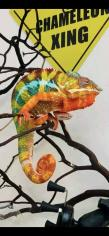
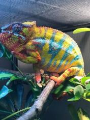

+++
title = "Jiolahy"
date = "2021-07-14"
tags = ["jiolahy", "the don", "perrigrin", "pyro"]
categories = ["ambilobe-dams"]
banner = "img/ambilobe/jiolahy/jiolahy"
+++



Jiolahy is a big F1 female from Chameleons 101's [The Don (WC)](). She brings fresh ybbb genetics combined with a great CB ybbb line created by Modern Day Dragons. We are very lucky to have her in our breeding group.



Filial
: *F1-CG5*

Sire
: [The Don (WC)]()

Dam
: [Perregrin/Pyro's Daughter]()

---




  

    

      <h1>Ancestral Report for Jiolahy (F1-CG5)</h1>
    

    <h3>Generation 1</h3>
    
1. <strong>Jiolahy (F1-CG5). </strong>Jiolahy was born on 2021-07-14 at Eric Thompson.  She is the daughter of The Don (WC) and Perregrin (aka Pyro)'s daughter (F3-CG4). 

    
More about Jiolahy (F1-CG5):

    
Adopted: 2021-11-15, iPardalis. 

    <h3>Generation 2</h3>
    
    
2. <strong>The Don (WC). </strong>He had a relationship with Perregrin (aka Pyro)'s daughter (F3-CG4). 

    
3. <strong>Perregrin (aka Pyro)'s daughter (F3-CG4). </strong>Perregrin (aka Pyro)'s daughter was produced by Modern Day Dragons.  She is the daughter of Perregrin (aka Pyro)(F2) and Miss Piggy (F3). 

    
More about Perregrin (aka Pyro)'s daughter (F3-CG4):

    
Adopted: Eric Thompson. 

    
Children of Perregrin (aka Pyro)'s daughter (F3-CG4) and The Don (WC)

    
i. Jiolahy (F1-CG5) [1]. Jiolahy was born on 2021-07-14 at Eric Thompson.  

    <h3>Generation 3</h3>
    
    
6. <strong>Perregrin (aka Pyro)(F2). </strong>Perregrin (aka Pyro)(F2) was produced by Bobby Ruddock.  He is the son of Sparkles (F1) and Sasha. He had a relationship with Miss Piggy (F3). 

    
More about Perregrin (aka Pyro)(F2):

    
Adopted: Modern Day Dragons. 

    
Adopted: Brightside Chameleons. 

    
7. <strong>Miss Piggy (F3). </strong>Miss Piggy (F3) was produced by Jungle Panthers.  She is the daughter of Higgins and Candy Cane's Daughter (F2). 

    
More about Miss Piggy (F3):

    
Adopted: Modern Day Dragons. 

    
Children of Miss Piggy (F3) and Perregrin (aka Pyro)(F2)

    
i. Perregrin's daugher (F3-CG4). Perregrin's daugher was produced by Modern Day Dragons.  

    
ii. Astoria. Astoria was produced by Modern Day Dragons.  

    
iii. PJ (F3-CG4). PJ was produced by Modern Day Dragons.  

    
iv. Sunshine (F3-CG4). Sunshine was produced by Modern Day Dragons.  

    
v. Perregrin (aka Pyro)'s daughter (F3-CG4) [3]. Perregrin (aka Pyro)'s daughter was produced by Modern Day Dragons.  

    <h3>Generation 4</h3>
    
    
12. <strong>Sparkles (F1). </strong>Sparkles was produced by Bobby Ruddock.  He was the son of Loki and Unknown - WC. He had a relationship with Leo's daughter. He also had a relationship with Sasha. 

    
Children of Leo's daughter and Sparkles (F1)

    
i. Kako (F2). Kako was born on 2017-11-21 at Panther Creek Chameleons.  She died on 2020-02-05 at iPardalis.  

    
ii. Amarillo (F2). Amarillo (F2) was produced by Bobby Ruddock.  

    
13. <strong>Sasha. </strong>Sasha was produced by Canvas Chameleons.  She is the daughter of Sinister. 

    
More about Sasha:

    
Adopted: Bobby Ruddock. 

    
Children of Sasha and Sparkles (F1)

    
i. Perregrin (aka Pyro)(F2) [6]. Perregrin (aka Pyro)(F2) was produced by Bobby Ruddock.  

    
    
14. <strong>Higgins. </strong>He had a relationship with Unknown. He also had a relationship with Candy Cane's Daughter (F2). 

    
Children of Unknown and Higgins

    
i. Higgin's daughter. 

    
15. <strong>Candy Cane's Daughter (F2). </strong>She is the daughter of Candy Cane (F1). 

    
Children of Candy Cane's Daughter (F2) and Higgins

    
i. Miss Piggy (F3) [7]. Miss Piggy (F3) was produced by Jungle Panthers.  

    <h3>Generation 5</h3>
    
    
24. <strong>Loki. </strong>Loki was produced by The Panther Baron.  He is the son of Loza and Flaming River's daughter. He had a relationship with Unknown - WC. 

    
25. <strong>Unknown - WC. </strong>Unknown was produced by Bobby Ruddock.  

    
Children of Unknown - WC and Loki

    
i. Sparkles (F1) [12]. Sparkles was produced by Bobby Ruddock.  

    
    
26. <strong>Sinister. </strong>Sinister was produced by Canvas Chameleons.  He had a relationship with Unknown. 

    
Children of Unknown and Sinister

    
i. Sasha [13]. Sasha was produced by Canvas Chameleons.  

    
    
30. <strong>Candy Cane (F1). </strong>Candy Cane was produced by Chameleon's Paradise.  He had a relationship with Jake's daughter. He also had a relationship with Cowboy's daughter (F1). He also had a relationship with Unknown. He also had a relationship with Cowboy's daughter (F1). 

    
Children of Jake's daughter and Candy Cane (F1)

    
i. Judy (F2). Judy was born on 2015-02-11 at Chameleon's Paradise.  She died on 2018-02-15 at iPardalis.  

    
Children of Cowboy's daughter (F1) and Candy Cane (F1)

    
i. Macho (F2-CG2). 

    
Children of Unknown and Candy Cane (F1)

    
i. Candy Cane's Daughter (F2) [15]. 

    
Children of Cowboy's daughter (F1) and Candy Cane (F1)

    
i. Candy Cane's daughter (F2). 

    <h3>Generation 6</h3>
    
    
48. <strong>Loza. </strong>Loza was produced by Kammerflage Kreations.  He had a relationship with Flaming River's daughter. 

    
49. <strong>Flaming River's daughter. </strong>Flaming River's daughter was produced by Kammerflage Kreations.  She is the daughter of Flaming River. 

    
Children of Flaming River's daughter and Loza

    
i. Loki [24]. Loki was produced by The Panther Baron.  

    <h3>Generation 7</h3>
    
    
98. <strong>Flaming River. </strong>Flaming River was produced by Kammerflage Kreations.  He had a relationship with Unknown. 

    
Children of Unknown and Flaming River

    
i. Flaming River's daughter [49]. Flaming River's daughter was produced by Kammerflage Kreations.  

  



