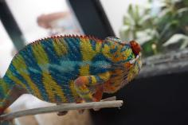
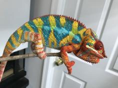
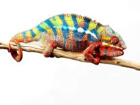

+++
title = "Kiborin"
date = "2021-06-20"
tags = ["kiborin", "blossom", "maitso", "jude", "amarillo"]
categories = ["retired-pardalis"]
banner = "img/ambilobe/kiborin/kiborin4"
+++



Kiborin is our 4th gen HB from Blossom x Maitso. He is Blaitso's brother. These two are just amazing animals and we are excited to see Kiborin's clean yellow with blue. He has less red highlighting that his father and a really clean look! 



Filial
: *F4-CG13*

Sire
: [Blossom]()

Dam
: [Maitso]()

---




  

    

      <h1>Ancestral Report for Kiborin (F4-CG13)</h1>
    

    <h3>Generation 1</h3>
    
    
1. <strong>Kiborin (F4-CG13). </strong>Kiborin was born on 2021-06-19 at iPardalis.  He is the son of Blossom (F3-CG12) and Maitso (F3-CG5). 

    <h3>Generation 2</h3>
    
    
2. <strong>Blossom (F3-CG12). </strong>Blossom was born on 2019-07-09 at iPardalis.  He is the son of Jude (F2-CG3) and Alla (F8-CG11). He had a relationship with Maitso (F3-CG5). 

    
    
3. <strong>Maitso (F3-CG5). </strong>She is the daughter of Amarillo (F2) and Felipe Sanchez's daughter (F2-CG4). 

    
Children of Maitso (F3-CG5) and Blossom (F3-CG12)

    
i. Blaitso (F4-CG13). Blaitso was born on 2021-06-19 at iPardalis.  

    
ii. Kiborin (F4-CG13) [1]. Kiborin was born on 2021-06-19 at iPardalis.  

    <h3>Generation 3</h3>
    
    
4. <strong>Jude (F2-CG3). </strong>Jude was born on 2017-10-17 at iPardalis.  He is the son of Flash (F1) and Judy (F2). He had a relationship with Kako (F2). He also had a relationship with Alla (F8-CG11). 

    
Children of Kako (F2) and Jude (F2-CG3)

    
i. Nugget (F3-CG4). Nugget was born on 2019-06-05 at iPardalis.  

    
ii. Patch (F3-CG4). Patch was born on 2019-06-05 at iPardalis.  

    
iii. Sunny (F3-CG3). Sunny was born on 2019-06-05 at iPardalis.  

    
iv. Zelda (F3-CG4). Zelda was born on 2019-06-05 at iPardalis.  

    
v. Tonka (F3-CG4). Tonka was born on 2019-06-05 at iPardalis.  

    
vi. Lilly (F3-CG4). Lilly was born on 2019-06-05 at iPardalis.  

    
vii. Daisy (F3-CG4). Daisy was born on 2019-06-05 at iPardalis.  

    
viii. Padi. Padi was born on 2019-06-05 at iPardalis.  

    
    
5. <strong>Alla (F8-CG11). </strong>Alla was born on 2018-01-30 at Panther Creek Chameleons.  She is the daughter of JJ (F7-CG10) and Blue Bird's daughter. 

    
Children of Alla (F8-CG11) and Jude (F2-CG3)

    
i. Blossom (F3-CG12) [2]. Blossom was born on 2019-07-09 at iPardalis.  

    
ii. Clyde (F3-CG12). Clyde was born on 2019-07-09 at iPardalis.  

    
iii. M11. M11 was born on 2019-11-20.  

    
iv. Alfred (F3-CG12). Alfred was born on 2019-10-20 at iPardalis.  

    
v. Jack (F3-CG12). Jack was born on 2019-10-20 at iPardalis.  

    
vi. Button (F3-CG12). Button was born on 2019-07-09 at iPardalis.  

    
vii. Bubbles (F3). Bubbles (F3) was born on 2019-07-09 at iPardalis.  

    
viii. Mondrian (F3-CG12). Mondrian was born on 2019-08-16 at iPardalis.  

    
ix. Toby (F3-CG12). Toby was born on 2019-07-09 at iPardalis.  

    
x. Tigravavy (F3-CG12). Tigravavy was born on 2019-12-12 at iPardalis.  

    
    
6. <strong>Amarillo (F2). </strong>Amarillo (F2) was produced by Bobby Ruddock.  He is the son of Sparkles (F1) and Leo's daughter. He had a relationship with Felipe Sanchez's daughter (F2-CG4). 

    
7. <strong>Felipe Sanchez's daughter (F2-CG4). </strong>She is the daughter of Felipe Sanchez (F1-CG2) and Snapjacks (F3-CG3). 

    
Children of Felipe Sanchez's daughter (F2-CG4) and Amarillo (F2)

    
i. Mavokely (F3-CG5). Mavokely was born on 2019-11-12 at Bobby Ruddock.  

    
ii. Maitso (F3-CG5) [3]. 

    <h3>Generation 4</h3>
    
    
8. <strong>Flash (F1). </strong>Flash was born on 2015-01-10 at Chameleon's Paradise.  He died on 2018-06-14 at iPardalis at the age of 3 years, 5 months.  He was the son of Cowboy (CH) and King's daughter. He had a relationship with Judy (F2). 

    
    
9. <strong>Judy (F2). </strong>Judy was born on 2015-02-11 at Chameleon's Paradise.  She died on 2018-02-15 at iPardalis at the age of 3 years, 4 days.  She was the daughter of Candy Cane (F1) and Jake's daughter. 

    
Children of Judy (F2) and Flash (F1)

    
i. Jude (F2-CG3) [4]. Jude was born on 2017-10-17 at iPardalis.  

    
ii. Bane. Bane was born on 2017-10-17.  

    
iii. Nick. Nick was born on 2017-10-17 at iPardalis.  

    
iv. Giant3. Giant3 was born on 2017-10-17 at iPardalis.  

    
    
10. <strong>JJ (F7-CG10). </strong>JJ was produced by Kammerflage Kreations.  He is the son of Mavo-ra (Yellow Blood) and Tsara-andro (Good Day) (F6-CG9). He had a relationship with Blue Bird's daughter. He also had a relationship with Daisy (F8-CG11). 

    
Children of Daisy (F8-CG11) and JJ (F7-CG10)

    
i. Kromatisk (F8-CG12). Kromatisk was born on 2018-08-26 at Chromatic Chameleons.  

    
11. <strong>Blue Bird's daughter. </strong>Blue Bird's daughter was produced by Eric Thompson.  She is the daughter of Blue Bird Jr. and Blaze's daughter. 

    
Children of Blue Bird's daughter and JJ (F7-CG10)

    
i. Alla (F8-CG11) [5]. Alla was born on 2018-01-30 at Panther Creek Chameleons.  

    
    
12. <strong>Sparkles (F1). </strong>Sparkles was produced by Bobby Ruddock.  He was the son of Loki and Unknown - WC. He had a relationship with Leo's daughter. He also had a relationship with Sasha. 

    
Children of Sasha and Sparkles (F1)

    
i. Perregrin (aka Pyro)(F2). Perregrin (aka Pyro)(F2) was produced by Bobby Ruddock.  

    
13. <strong>Leo's daughter. </strong>Leo's daughter was produced by The Panther Company.  She died on 2018-12-23 at Bobby Ruddock.  She was the daughter of Leo. 

    
Children of Leo's daughter and Sparkles (F1)

    
i. Kako (F2). Kako was born on 2017-11-21 at Panther Creek Chameleons.  She died on 2020-02-05 at iPardalis.  

    
ii. Amarillo (F2) [6]. Amarillo (F2) was produced by Bobby Ruddock.  

    
    
14. <strong>Felipe Sanchez (F1-CG2). </strong>He is the son of Bolt (WC) and Cowboy's daughter (F1). He had a relationship with Snapjacks (F3-CG3). 

    
15. <strong>Snapjacks (F3-CG3). </strong>She is the daughter of Macho (F2-CG2) and 24k's daughter. 

    
Children of Snapjacks (F3-CG3) and Felipe Sanchez (F1-CG2)

    
i. Emma Frost (F2-CG4). Emma Frost was produced by Chromatic Chameleons.  

    
ii. Felipe Sanchez's daughter (F2-CG4) [7]. 

    
iii. Felipe Sanchez's daughter (F2-CG3). Felipe Sanchez's daughter was produced by Chromatic Chameleons.  

    <h3>Generation 5</h3>
    
    
16. <strong>Cowboy (CH). </strong>Cowboy was produced by Chameleon's Paradise.  He died on 2015-01-01 at Chameleon's Paradise.  He had a relationship with King's daughter. He also had a relationship with Unknown. He also had a relationship with Unknown. He also had a relationship with Unknown. 

    
Children of Unknown and Cowboy (CH)

    
i. Cowboy's daughter (F1). 

    
Children of Unknown and Cowboy (CH)

    
i. Cowboy's daughter (F1). Cowboy's daughter was produced by Chameleon's Paradise.  

    
Children of Unknown and Cowboy (CH)

    
i. Cowboy's daughter (F1). 

    
17. <strong>King's daughter. </strong>King's daughter was produced by Chameleon's Paradise.  She died with Chameleon's Paradise.  She was the daughter of King. 

    
Children of King's daughter and Cowboy (CH)

    
i. Flash (F1) [8]. Flash was born on 2015-01-10 at Chameleon's Paradise.  He died on 2018-06-14 at iPardalis.  

    
    
18. <strong>Candy Cane (F1). </strong>Candy Cane was produced by Chameleon's Paradise.  He had a relationship with Jake's daughter. He also had a relationship with Cowboy's daughter (F1). He also had a relationship with Unknown. He also had a relationship with Cowboy's daughter (F1). 

    
Children of Unknown and Candy Cane (F1)

    
i. Candy Cane's Daughter (F2). 

    
Children of Cowboy's daughter (F1) and Candy Cane (F1)

    
i. Candy Cane's daughter (F2). 

    
19. <strong>Jake's daughter. </strong>Jake's daughter was produced by Chameleon's Paradise.  She is the daughter of Jake (F1). 

    
Children of Jake's daughter and Candy Cane (F1)

    
i. Judy (F2) [9]. Judy was born on 2015-02-11 at Chameleon's Paradise.  She died on 2018-02-15 at iPardalis.  

    
    
20. <strong>Mavo-ra (Yellow Blood). </strong>Mavo-ra (Yellow Blood) was produced by Kammerflage Kreations.  He is the son of Mabonika-haboka (Mellow Yellow). He had a relationship with Unknown. He also had a relationship with Tsara-andro (Good Day) (F6-CG9). 

    
Children of Unknown and Mavo-ra (Yellow Blood)

    
i. Vony-reny (Yellow Mother). Vony-reny (Yellow Mother) was produced by Kammerflage Kreations.  

    
    
21. <strong>Tsara-andro (Good Day) (F6-CG9). </strong>Tsara-andro (Good Day) was produced by Kammerflage Kreations.  She is the daughter of Kely-tongotra (Little Foot) (F5-CG8). 

    
Children of Tsara-andro (Good Day) (F6-CG9) and Mavo-ra (Yellow Blood)

    
i. Mavo-loha (Blondie). Mavo-loha (Blondie) was born on 2016-02-03 at Kammerflage Kreations.  

    
ii. Giga-vony (Old Yeller). Giga-vony (Old Yeller) was produced by Kammerflage Kreations.  

    
iii. JJ (F7-CG10) [10]. JJ was produced by Kammerflage Kreations.  

    
    
22. <strong>Blue Bird Jr. </strong>He had a relationship with Blaze's daughter. 

    
23. <strong>Blaze's daughter. </strong>She is the daughter of Blaze. 

    
Children of Blaze's daughter and Blue Bird Jr.

    
i. Blue Bird's daughter [11]. Blue Bird's daughter was produced by Eric Thompson.  

    
    
24. <strong>Loki. </strong>Loki was produced by The Panther Baron.  He is the son of Loza and Flaming River's daughter. He had a relationship with Unknown - WC. 

    
25. <strong>Unknown - WC. </strong>Unknown was produced by Bobby Ruddock.  

    
Children of Unknown - WC and Loki

    
i. Sparkles (F1) [12]. Sparkles was produced by Bobby Ruddock.  

    
    
26. <strong>Leo. </strong>Leo was produced by The Panther Company.  He had a relationship with Unknown. 

    
Children of Unknown and Leo

    
i. Leo's daughter [13]. Leo's daughter was produced by The Panther Company.  She died on 2018-12-23 at Bobby Ruddock.  

    
    
28. <strong>Bolt (WC). </strong>Bolt was produced by Canvas Chameleons.  He had a relationship with Cowboy's daughter (F1). He also had a relationship with Test (F1). 

    
Children of Test (F1) and Bolt (WC)

    
i. Sunkist (F1-CG2). Sunkist was produced by Canvas Chameleons.  

    
29. <strong>Cowboy's daughter (F1). </strong>Cowboy's daughter was produced by Chameleon's Paradise.  She is the daughter of Cowboy (CH). 

    
Children of Cowboy's daughter (F1) and Bolt (WC)

    
i. Felipe Sanchez (F1-CG2) [14]. 

    
    
30. <strong>Macho (F2-CG2). </strong>He is the son of Candy Cane (F1) and Cowboy's daughter (F1). He had a relationship with 24k's daughter. 

    
31. <strong>24k's daughter. </strong>24k's daughter was produced by Chameleon's Paradise.  She is the daughter of 24k. 

    
Children of 24k's daughter and Macho (F2-CG2)

    
i. Wetdream (F3). 

    
ii. Snapjacks (F3-CG3) [15]. 

    <h3>Generation 6</h3>
    
    
34. <strong>King. </strong>He had a relationship with Unknown. 

    
Children of Unknown and King

    
i. King's daughter [17]. King's daughter was produced by Chameleon's Paradise.  She died with Chameleon's Paradise.  

    
    
38. <strong>Jake (F1). </strong>Jake was produced by Chameleon's Paradise.  He had a relationship with Unknown. 

    
Children of Unknown and Jake (F1)

    
i. Jake's daughter [19]. Jake's daughter was produced by Chameleon's Paradise.  

    
    
40. <strong>Mabonika-haboka (Mellow Yellow). </strong>Mabonika-haboka (Mellow Yellow) was produced by Kammerflage Kreations.  He is the son of Maso-vatomamy (Eye Candy). He had a relationship with Unknown. 

    
Children of Unknown and Mabonika-haboka (Mellow Yellow)

    
i. Mavo-ra (Yellow Blood) [20]. Mavo-ra (Yellow Blood) was produced by Kammerflage Kreations.  

    
    
42. <strong>Kely-tongotra (Little Foot) (F5-CG8). </strong>Kely-tongotra (Little Foot) was produced by Kammerflage Kreations.  He is the son of Hatsikana (Legend). He had a relationship with Unknown. He also had a relationship with Unknown. He also had a relationship with Unknown. He also had a relationship with Eye Candy's daughter. He also had a relationship with Unknown. He also had a relationship with Unknown. He also had a relationship with Unknown. 

    
Children of Unknown and Kely-tongotra (Little Foot) (F5-CG8)

    
i. Little Foot's daughter. Little Foot's daughter was produced by Kammerflage Kreations.  

    
Children of Unknown and Kely-tongotra (Little Foot) (F5-CG8)

    
i. Faingana (Quick). Faingana (Quick) was produced by Kammerflage Kreations.  

    
Children of Unknown and Kely-tongotra (Little Foot) (F5-CG8)

    
i. Little Foot's daughter. Little Foot's daughter was produced by Kammerflage Kreations.  

    
Children of Eye Candy's daughter and Kely-tongotra (Little Foot) (F5-CG8)

    
i. Dio (F6-CG9). 

    
Children of Unknown and Kely-tongotra (Little Foot) (F5-CG8)

    
i. Tsara-andro (Good Day) (F6-CG9) [21]. Tsara-andro (Good Day) was produced by Kammerflage Kreations.  

    
Children of Unknown and Kely-tongotra (Little Foot) (F5-CG8)

    
i. Maizina-lanitra (Dark Sky). Maizina-lanitra (Dark Sky) was produced by Kammerflage Kreations.  

    
Children of Unknown and Kely-tongotra (Little Foot) (F5-CG8)

    
i. Faingana (Quick). Faingana (Quick) was produced by Kammerflage Kreations.  

    
    
46. <strong>Blaze. </strong>He had a relationship with Unknown. 

    
Children of Unknown and Blaze

    
i. Blaze's daughter [23]. 

    
    
48. <strong>Loza. </strong>Loza was produced by Kammerflage Kreations.  He had a relationship with Flaming River's daughter. 

    
49. <strong>Flaming River's daughter. </strong>Flaming River's daughter was produced by Kammerflage Kreations.  She is the daughter of Flaming River. 

    
Children of Flaming River's daughter and Loza

    
i. Loki [24]. Loki was produced by The Panther Baron.  

    
    
58. <strong>Cowboy (CH). </strong> is the same person as [16].

    
    
60. <strong>Candy Cane (F1). </strong> is the same person as [18].

    
61. <strong>Cowboy's daughter (F1). </strong>She is the daughter of Cowboy (CH). 

    
Children of Cowboy's daughter (F1) and Candy Cane (F1)

    
i. Macho (F2-CG2) [30]. 

    
    
62. <strong>24k. </strong>24k was produced by Chameleon's Paradise.  He had a relationship with Unknown. 

    
Children of Unknown and 24k

    
i. 24k's daughter [31]. 24k's daughter was produced by Chameleon's Paradise.  

    <h3>Generation 7</h3>
    
    
80. <strong>Maso-vatomamy (Eye Candy). </strong>Maso-vatomamy (Eye Candy) was produced by Kammerflage Kreations.  He had a relationship with Unknown. He also had a relationship with Unknown. 

    
Children of Unknown and Maso-vatomamy (Eye Candy)

    
i. Eye Candy's daughter. Eye Candy's daughter was produced by Kammerflage Kreations.  

    
Children of Unknown and Maso-vatomamy (Eye Candy)

    
i. Mabonika-haboka (Mellow Yellow) [40]. Mabonika-haboka (Mellow Yellow) was produced by Kammerflage Kreations.  

    
    
84. <strong>Hatsikana (Legend). </strong>Hatsikana (Legend) was produced by Kammerflage Kreations.  He had a relationship with Unknown. 

    
Children of Unknown and Hatsikana (Legend)

    
i. Kely-tongotra (Little Foot) (F5-CG8) [42]. Kely-tongotra (Little Foot) was produced by Kammerflage Kreations.  

    
    
98. <strong>Flaming River. </strong>Flaming River was produced by Kammerflage Kreations.  He had a relationship with Unknown. 

    
Children of Unknown and Flaming River

    
i. Flaming River's daughter [49]. Flaming River's daughter was produced by Kammerflage Kreations.  

    
    
122. <strong>Cowboy (CH). </strong> is the same person as [16].

  



