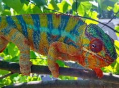

+++
title = "Kintana"
date = "2022-07-31"
tags = ["kintana", "capella", "kromatisk", "jj", "felipe sanchez"]
categories = ["ambilobe-dams"]
banner = "img/ambilobe/kintana/kintana"
+++



Kintana is a line-bred YBBB from Chromatic Chameleons from Capella and Kromatisk. Capella is one of our favorite sires they have produced over the past few years, and Kromatisk is easily one of our favorites over the past decade. We have a decent amount of Felipe Sanchez and JJ/Kromatisk in our existing lines, so we will do our best to avoid those as long as we can. Otherwise, she should bring some more solid genetics from one of the best Ambilobe projects in the USA over at Chromatic Chameleons.



Filial
: *F3-CG14*

Sire
: [Capella]()

Dam
: [Kromatisk's Daughter]()

---




  

    

      <h1>Ancestral Report for Kintana (F3-CG14)</h1>
    

    <h3>Generation 1</h3>
    
    
1. <strong>Kintana (F3-CG14). </strong>Kintana was born on 2022-07-31 at Chromatic Chameleons.  She is the daughter of Capella (F2-CG13) and Kromatisk's daughter (F9-CG13). 

    
More about Kintana (F3-CG14):

    
Adopted: 2022-11-29, iPardalis. 

    <h3>Generation 2</h3>
    
    
2. <strong>Capella (F2-CG13). </strong>Capella was produced by Chromatic Chameleons.  He is the son of Felipe Sanchez (F1-CG2) and JJ's daughter (F8-CG12). He had a relationship with Kromatisk's daughter (F9-CG13). 

    
3. <strong>Kromatisk's daughter (F9-CG13). </strong>She is the daughter of Kromatisk (F8-CG12) and Xanthos' daughter. 

    
Children of Kromatisk's daughter (F9-CG13) and Capella (F2-CG13)

    
i. Kintana (F3-CG14) [1]. Kintana was born on 2022-07-31 at Chromatic Chameleons.  

    <h3>Generation 3</h3>
    
    
4. <strong>Felipe Sanchez (F1-CG2). </strong>He is the son of Bolt (WC) and Cowboy's daughter (F1). He had a relationship with Snapjacks (F3-CG3). He also had a relationship with Unknown. He also had a relationship with JJ's daughter (F8-CG12). 

    
Children of Snapjacks (F3-CG3) and Felipe Sanchez (F1-CG2)

    
i. Emma Frost (F2-CG4). Emma Frost was produced by Chromatic Chameleons.  

    
ii. Felipe Sanchez's daughter (F2-CG4). 

    
iii. Felipe Sanchez's daughter (F2-CG3). Felipe Sanchez's daughter was produced by Chromatic Chameleons.  

    
Children of Unknown and Felipe Sanchez (F1-CG2)

    
i. Felipe Sanchez's Daughter (F2-CG3). Felipe Sanchez's Daughter was produced by Chromatic Chameleons.  

    
5. <strong>JJ's daughter (F8-CG12). </strong>She is the daughter of JJ (F7-CG10) and Daisy (F8-CG11). 

    
Children of JJ's daughter (F8-CG12) and Felipe Sanchez (F1-CG2)

    
i. Capella (F2-CG13) [2]. Capella was produced by Chromatic Chameleons.  

    
    
6. <strong>Kromatisk (F8-CG12). </strong>Kromatisk was born on 2018-08-26 at Chromatic Chameleons.  He is the son of JJ (F7-CG10) and Daisy (F8-CG11). He had a relationship with Jackie (F4). He also had a relationship with Shirley (F9-CG12). He also had a relationship with Xanthos' daughter. 

    
Children of Jackie (F4) and Kromatisk (F8-CG12)

    
i. Loko (F5-CG13). Loko was born on 2020-04-18 at Chromatic Chameleons.  

    
Children of Shirley (F9-CG12) and Kromatisk (F8-CG12)

    
i. Lokana (F9-CG13). Lokana was born on 2020-12-02 at Chromatic Chameleons.  

    
7. <strong>Xanthos' daughter. </strong>Xanthos' daughter was produced by Chromatic Chameleons.  She is the daughter of Xanthos and Sienna. 

    
Children of Xanthos' daughter and Kromatisk (F8-CG12)

    
i. Kromatisk's daughter (F9-CG13) [3]. 

    <h3>Generation 4</h3>
    
    
8. <strong>Bolt (WC). </strong>Bolt was produced by Canvas Chameleons.  He had a relationship with Cowboy's daughter (F1). He also had a relationship with Test (F1). 

    
Children of Test (F1) and Bolt (WC)

    
i. Sunkist (F1-CG2). Sunkist was produced by Canvas Chameleons.  

    
9. <strong>Cowboy's daughter (F1). </strong>Cowboy's daughter was produced by Chameleon's Paradise.  She is the daughter of Cowboy (CH). 

    
Children of Cowboy's daughter (F1) and Bolt (WC)

    
i. Felipe Sanchez (F1-CG2) [4]. 

    
    
10. <strong>JJ (F7-CG10). </strong>JJ was produced by Kammerflage Kreations.  He is the son of Mavo-ra (Yellow Blood) and Tsara-andro (Good Day) (F6-CG9). He had a relationship with Blue Bird's daughter. He also had a relationship with Daisy (F8-CG11). 

    
Children of Blue Bird's daughter and JJ (F7-CG10)

    
i. Alla (F8-CG11). Alla was born on 2018-01-30 at Panther Creek Chameleons.  

    
11. <strong>Daisy (F8-CG11). </strong>She is the daughter of Seventeen and Dio's daughter (F7-CG10. 

    
Children of Daisy (F8-CG11) and JJ (F7-CG10)

    
i. Kromatisk (F8-CG12) [6]. Kromatisk was born on 2018-08-26 at Chromatic Chameleons.  

    
ii. JJ's daughter (F8-CG12) [5]. 

    
    
12. <strong>JJ (F7-CG10). </strong> is the same person as [10].

    
13. <strong>Daisy (F8-CG11). </strong> is the same person as [11].

    
    
14. <strong>Xanthos. </strong>He had a relationship with Sienna. 

    
15. <strong>Sienna. </strong>

    
Children of Sienna and Xanthos

    
i. Xanthos' daughter [7]. Xanthos' daughter was produced by Chromatic Chameleons.  

    <h3>Generation 5</h3>
    
    
18. <strong>Cowboy (CH). </strong>Cowboy was produced by Chameleon's Paradise.  He died on 2015-01-01 at Chameleon's Paradise.  He had a relationship with King's daughter. He also had a relationship with Unknown. He also had a relationship with Unknown. He also had a relationship with Unknown. 

    
Children of King's daughter and Cowboy (CH)

    
i. Flash (F1). Flash was born on 2015-01-10 at Chameleon's Paradise.  He died on 2018-06-14 at iPardalis.  

    
Children of Unknown and Cowboy (CH)

    
i. Cowboy's daughter (F1). 

    
Children of Unknown and Cowboy (CH)

    
i. Cowboy's daughter (F1) [9]. Cowboy's daughter was produced by Chameleon's Paradise.  

    
Children of Unknown and Cowboy (CH)

    
i. Cowboy's daughter (F1). 

    
    
20. <strong>Mavo-ra (Yellow Blood). </strong>Mavo-ra (Yellow Blood) was produced by Kammerflage Kreations.  He is the son of Mabonika-haboka (Mellow Yellow). He had a relationship with Unknown. He also had a relationship with Tsara-andro (Good Day) (F6-CG9). 

    
Children of Unknown and Mavo-ra (Yellow Blood)

    
i. Vony-reny (Yellow Mother). Vony-reny (Yellow Mother) was produced by Kammerflage Kreations.  

    
    
21. <strong>Tsara-andro (Good Day) (F6-CG9). </strong>Tsara-andro (Good Day) was produced by Kammerflage Kreations.  She is the daughter of Kely-tongotra (Little Foot) (F5-CG8). 

    
Children of Tsara-andro (Good Day) (F6-CG9) and Mavo-ra (Yellow Blood)

    
i. Mavo-loha (Blondie). Mavo-loha (Blondie) was born on 2016-02-03 at Kammerflage Kreations.  

    
ii. Giga-vony (Old Yeller). Giga-vony (Old Yeller) was produced by Kammerflage Kreations.  

    
iii. JJ (F7-CG10) [12]. JJ was produced by Kammerflage Kreations.  

    
    
22. <strong>Seventeen. </strong>He is the son of Paradox. He had a relationship with Dio's daughter (F7-CG10. 

    
23. <strong>Dio's daughter (F7-CG10. </strong>She is the daughter of Dio (F6-CG9). 

    
Children of Dio's daughter (F7-CG10 and Seventeen

    
i. Daisy (F8-CG11) [13]. 

    
    
24. <strong>Mavo-ra (Yellow Blood). </strong> is the same person as [20].

    
    
25. <strong>Tsara-andro (Good Day) (F6-CG9). </strong> is the same person as [21].

    
    
26. <strong>Seventeen. </strong> is the same person as [22].

    
27. <strong>Dio's daughter (F7-CG10. </strong> is the same person as [23].

    <h3>Generation 6</h3>
    
    
40. <strong>Mabonika-haboka (Mellow Yellow). </strong>Mabonika-haboka (Mellow Yellow) was produced by Kammerflage Kreations.  He is the son of Maso-vatomamy (Eye Candy). He had a relationship with Unknown. 

    
Children of Unknown and Mabonika-haboka (Mellow Yellow)

    
i. Mavo-ra (Yellow Blood) [24]. Mavo-ra (Yellow Blood) was produced by Kammerflage Kreations.  

    
    
42. <strong>Kely-tongotra (Little Foot) (F5-CG8). </strong>Kely-tongotra (Little Foot) was produced by Kammerflage Kreations.  He is the son of Hatsikana (Legend). He had a relationship with Unknown. He also had a relationship with Unknown. He also had a relationship with Unknown. He also had a relationship with Eye Candy's daughter. He also had a relationship with Unknown. He also had a relationship with Unknown. He also had a relationship with Unknown. 

    
Children of Unknown and Kely-tongotra (Little Foot) (F5-CG8)

    
i. Little Foot's daughter. Little Foot's daughter was produced by Kammerflage Kreations.  

    
Children of Unknown and Kely-tongotra (Little Foot) (F5-CG8)

    
i. Faingana (Quick). Faingana (Quick) was produced by Kammerflage Kreations.  

    
Children of Unknown and Kely-tongotra (Little Foot) (F5-CG8)

    
i. Little Foot's daughter. Little Foot's daughter was produced by Kammerflage Kreations.  

    
Children of Unknown and Kely-tongotra (Little Foot) (F5-CG8)

    
i. Tsara-andro (Good Day) (F6-CG9) [25]. Tsara-andro (Good Day) was produced by Kammerflage Kreations.  

    
Children of Unknown and Kely-tongotra (Little Foot) (F5-CG8)

    
i. Maizina-lanitra (Dark Sky). Maizina-lanitra (Dark Sky) was produced by Kammerflage Kreations.  

    
Children of Unknown and Kely-tongotra (Little Foot) (F5-CG8)

    
i. Faingana (Quick). Faingana (Quick) was produced by Kammerflage Kreations.  

    
    
44. <strong>Paradox. </strong>Paradox was produced by Tree Candy Chameleons.  He had a relationship with Unknown. 

    
Children of Unknown and Paradox

    
i. Seventeen [26]. 

    
    
46. <strong>Dio (F6-CG9). </strong>He is the son of Kely-tongotra (Little Foot) (F5-CG8) and Eye Candy's daughter. He had a relationship with Zeratul's daughter. He also had a relationship with Unknown. He also had a relationship with Aphrodite. He also had a relationship with Unknown. 

    
Children of Zeratul's daughter and Dio (F6-CG9)

    
i. Stryfe (F7-CG10). Stryfe was produced by Joshua Illencik.  

    
Children of Unknown and Dio (F6-CG9)

    
i. Dio's daughter (F7-CG10 [27]. 

    
Children of Aphrodite and Dio (F6-CG9)

    
i. Dio's daughter (F7-CG10). 

    
Children of Unknown and Dio (F6-CG9)

    
i. Dio's Daughter (F7-CG10). 

    
    
48. <strong>Mabonika-haboka (Mellow Yellow). </strong> is the same person as [40].

    
    
50. <strong>Kely-tongotra (Little Foot) (F5-CG8). </strong> is the same person as [42].

    
    
52. <strong>Paradox. </strong> is the same person as [44].

    
    
54. <strong>Dio (F6-CG9). </strong> is the same person as [46].

    <h3>Generation 7</h3>
    
    
80. <strong>Maso-vatomamy (Eye Candy). </strong>Maso-vatomamy (Eye Candy) was produced by Kammerflage Kreations.  He had a relationship with Unknown. He also had a relationship with Unknown. 

    
Children of Unknown and Maso-vatomamy (Eye Candy)

    
i. Eye Candy's daughter. Eye Candy's daughter was produced by Kammerflage Kreations.  

    
Children of Unknown and Maso-vatomamy (Eye Candy)

    
i. Mabonika-haboka (Mellow Yellow) [48]. Mabonika-haboka (Mellow Yellow) was produced by Kammerflage Kreations.  

    
    
84. <strong>Hatsikana (Legend). </strong>Hatsikana (Legend) was produced by Kammerflage Kreations.  He had a relationship with Unknown. 

    
Children of Unknown and Hatsikana (Legend)

    
i. Kely-tongotra (Little Foot) (F5-CG8) [50]. Kely-tongotra (Little Foot) was produced by Kammerflage Kreations.  

    
    
92. <strong>Kely-tongotra (Little Foot) (F5-CG8). </strong> is the same person as [42].

    
93. <strong>Eye Candy's daughter. </strong>Eye Candy's daughter was produced by Kammerflage Kreations.  She is the daughter of Maso-vatomamy (Eye Candy). 

    
Children of Eye Candy's daughter and Kely-tongotra (Little Foot) (F5-CG8)

    
i. Dio (F6-CG9) [54]. 

    
    
96. <strong>Maso-vatomamy (Eye Candy). </strong> is the same person as [80].

    
    
100. <strong>Hatsikana (Legend). </strong> is the same person as [84].

    
    
108. <strong>Kely-tongotra (Little Foot) (F5-CG8). </strong> is the same person as [42].

    
109. <strong>Eye Candy's daughter. </strong> is the same person as [93].

    <h3>Generation 8</h3>
    
    
184. <strong>Hatsikana (Legend). </strong> is the same person as [84].

    
    
186. <strong>Maso-vatomamy (Eye Candy). </strong> is the same person as [80].

    
    
216. <strong>Hatsikana (Legend). </strong> is the same person as [84].

    
    
218. <strong>Maso-vatomamy (Eye Candy). </strong> is the same person as [80].

  



