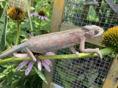
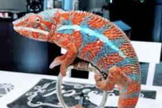

+++
title = "Kosma"
date = "2021-05-02"
tags = ["kosmo", "skyline"]
categories = ["ambilobe-dams"]
banner = "img/ambilobe/kosma/kosma"
+++



Kosma is Kosmo's sister. Kosmo is one of my favorite RBBB Ambilobe produced over the past few years. He was sold as an egg by Eric Thompson, purchased as a juvenile by LA Chams and then we acquired him and his sister, Kosma, so we could have a solid RBBB Ambilobe project with two unrelated lines. However, because of their many homes, their lineage information was not very well maintained. We know they were from Skyline and another Eric Thompson female, so I do not recommend pairing their offspring with anything from Chameleons101.



Filial
: * *

Sire
: [Skyline]()

Dam
: [Eric Thompson Female]()

---




  

    

      <h1>Ancestral Report for Kosma</h1>
    

    <h3>Generation 1</h3>
    
    
1. <strong>Kosma. </strong>Kosma was born on 2021-05-01 at Eric Thompson.  She is the daughter of Skyline and Eric Thompson/Chams101 Female. 

    
More about Kosma:

    
Adopted: iPardalis. 

    <h3>Generation 2</h3>
    
    
2. <strong>Skyline. </strong>Skyline was produced by Eric Thompson.  He had a relationship with Eric Thompson/Chams101 Female. 

    
3. <strong>Eric Thompson/Chams101 Female. </strong>

    
Children of Eric Thompson/Chams101 Female and Skyline

    
i. Kosmo. Kosmo was born on 2021-05-01 at LA Chameleons.  

    
ii. Kosma [1]. Kosma was born on 2021-05-01 at Eric Thompson.  

  



