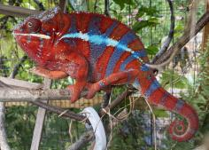
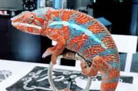

+++
title = "Kosmo"
date = "2021-05-01"
tags = ["kosmo", "skyline"]
categories = ["ambilobe-sires"]
banner = "img/ambilobe/kosmo/kosmo"
+++



Kosmo is one of my favorite RBBB Ambilobe produced over the past few years. He was sold as an egg by Eric Thompson, purchased as a juvenile by LA Chams and then we acquired him so we could have a solid RBBB Ambilobe project with two unrelated lines. However, because of his many homes, his lineage information was not very well maintained. We know he was from Skyline and another Eric Thompson female, so I do not recommend pairing his offspring with anything from Chameleons101.



Filial
: *unknown*

Sire
: [Skyline]()

Dam
: [Eric Thompson Female]()

---




  

    

      <h1>Ancestral Report for Kosmo</h1>
    

    <h3>Generation 1</h3>
    
    
1. <strong>Kosmo. </strong>Kosmo was born on 2021-05-01 at LA Chameleons.  He is the son of Skyline and Eric Thompson/Chams101 Female. 

    <h3>Generation 2</h3>
    
    
2. <strong>Skyline. </strong>Skyline was produced by Eric Thompson.  He had a relationship with Eric Thompson/Chams101 Female. 

    
3. <strong>Eric Thompson/Chams101 Female. </strong>

    
Children of Eric Thompson/Chams101 Female and Skyline

    
i. Kosmo [1]. Kosmo was born on 2021-05-01 at LA Chameleons.  

  



