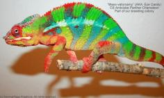

+++
title = "Lelafo"
date = "2021-04-02"
tags = ["lelafo", "vulcan", "odin", "agent orange"]
categories = ["retired-pardalis"]
banner = "img/ambilobe/lelafo/lelafo"
+++



Lelafo is a very different Ambilobe variety that we acquire specifically to keep the fun rolling with the Alfred line! Her Sire, Vulcan, was produced by Chameleons by Design with two very orange WC males and acquired by New England Chameleons who paired him with an amazing female from their orange boy, Odin. She has a ton of orange and red on both sides. Can't wait to prove her out!



Filial
: *F2-CG14*

Sire
: [Vulcan]()

Dam
: [Odin's daughter]()

---




  

    

      <h1>Ancestral Report for Lelafo (F2-CG14)</h1>
    

    <h3>Generation 1</h3>
    
    
1. <strong>Lelafo (F2-CG14). </strong>Lelafo was born on 2021-04-02 at New England Chameleons.  She is the daughter of Vulcan (F1-CG12) and Odin's daughter (F4-CG13). 

    <h3>Generation 2</h3>
    
    
2. <strong>Vulcan (F1-CG12). </strong>Vulcan was produced by Chameleons by Design.  He is the son of Rick James (WC) and Firestarter's daughter (F1-CG11). He had a relationship with Odin's daughter (F4-CG13). 

    
More about Vulcan (F1-CG12):

    
Adopted: New England Chameleons.  

    
3. <strong>Odin's daughter (F4-CG13). </strong>She is the daughter of Odin (F3) and Agent Orange's daughter (F9-CG12). 

    
Children of Odin's daughter (F4-CG13) and Vulcan (F1-CG12)

    
i. Lelafo (F2-CG14) [1]. Lelafo was born on 2021-04-02 at New England Chameleons.  

    <h3>Generation 3</h3>
    
    
4. <strong>Rick James (WC). </strong>Rick James was produced by Chameleons by Design.  He had a relationship with Firestarter's daughter (F1-CG11). 

    
5. <strong>Firestarter's daughter (F1-CG11). </strong>Firestarter's daughter was produced by Chameleons by Design.  She is the daughter of Firestarter (WC) and Dio's daughter (F7-CG10). 

    
Children of Firestarter's daughter (F1-CG11) and Rick James (WC)

    
i. Vulcan (F1-CG12) [2]. Vulcan was produced by Chameleons by Design.  

    
    
6. <strong>Odin (F3). </strong>Odin was produced by Kaz Chameleons.  He is the son of Rambo and Candy Cane's daughter (F2). He had a relationship with Agent Orange's daughter (F9-CG12). 

    
More about Odin (F3):

    
Adopted: New England Chameleons.  

    
7. <strong>Agent Orange's daughter (F9-CG12). </strong>She is the daughter of Polisy-menapina (Agent Orange) and Fantara's daughter (F8-CG11). 

    
Children of Agent Orange's daughter (F9-CG12) and Odin (F3)

    
i. Odin's daughter (F4-CG13) [3]. 

    <h3>Generation 4</h3>
    
    
10. <strong>Firestarter (WC). </strong>He had a relationship with Dio's daughter (F7-CG10). 

    
11. <strong>Dio's daughter (F7-CG10). </strong>She is the daughter of Dio (F6-CG9) and Aphrodite. 

    
Children of Dio's daughter (F7-CG10) and Firestarter (WC)

    
i. Rico (F1-CG11). Rico was produced by Chameleons by Design.  

    
ii. Firestarter's daughter (F1-CG11) [5]. Firestarter's daughter was produced by Chameleons by Design.  

    
    
12. <strong>Rambo. </strong>Rambo was produced by Kammerflage Kreations.  He is the son of Miroborobo (Blaze) and Haran-dranomasina (Coral). He had a relationship with Candy Cane's daughter (F2). 

    
More about Rambo:

    
Adopted: Kaz Chameleons.  

    
13. <strong>Candy Cane's daughter (F2). </strong>She is the daughter of Candy Cane (F1) and Cowboy's daughter (F1). 

    
Children of Candy Cane's daughter (F2) and Rambo

    
i. Odin (F3) [6]. Odin was produced by Kaz Chameleons.  

    
    
14. <strong>Polisy-menapina (Agent Orange). </strong>Polisy-menapina (Agent Orange) was produced by Kammerflage Kreations.  He is the son of Manga-hay (Blue Heat) and Bolitika-zandry (Little Sister). He had a relationship with Fantara's daughter (F8-CG11). 

    
15. <strong>Fantara's daughter (F8-CG11). </strong>She is the daughter of Fantara (Falling Star) (F7-CG10). 

    
Children of Fantara's daughter (F8-CG11) and Polisy-menapina (Agent Orange)

    
i. Agent Orange's daughter (F9-CG12) [7]. 

    <h3>Generation 5</h3>
    
    
22. <strong>Dio (F6-CG9). </strong>He died with Joshua Illencik.  He was the son of Kely-tongotra (Little Foot) (F5-CG8) and Eye Candy's daughter. He had a relationship with Zeratul's daughter. He also had a relationship with Unknown. He also had a relationship with Aphrodite. 

    
Children of Zeratul's daughter and Dio (F6-CG9)

    
i. Stryfe. Stryfe was produced by Joshua Illencik.  

    
Children of Unknown and Dio (F6-CG9)

    
i. Dio's daughter (F7-CG10. 

    
23. <strong>Aphrodite. </strong>

    
Children of Aphrodite and Dio (F6-CG9)

    
i. Dio's daughter (F7-CG10) [11]. 

    
    
24. <strong>Miroborobo (Blaze). </strong>Miroborobo (Blaze) was produced by Kammerflage Kreations.  He died with Kammerflage Kreations.  He had a relationship with Little Foot's daughter. He also had a relationship with Haran-dranomasina (Coral). 

    
Children of Little Foot's daughter and Miroborobo (Blaze)

    
i. Jaky-fiposohana. Jaky-fiposohana was produced by Kammerflage Kreations.  She died with Kammerflage Kreations.  

    
    
25. <strong>Haran-dranomasina (Coral). </strong>Haran-dranomasina (Coral) was produced by Kammerflage Kreations.  

    
Children of Haran-dranomasina (Coral) and Miroborobo (Blaze)

    
i. Rambo [12]. Rambo was produced by Kammerflage Kreations.  

    
    
26. <strong>Candy Cane (F1). </strong>Candy Cane was produced by Chameleon's Paradise.  He died with Chameleon's Paradise.  He had a relationship with Jake's daughter. He also had a relationship with Cowboy's daughter (F1). He also had a relationship with Unknown. He also had a relationship with Cowboy's daughter (F1). 

    
Children of Jake's daughter and Candy Cane (F1)

    
i. Judy (F2). Judy was born on 2015-02-11 at Chameleon's Paradise.  She died on 2018-02-15 at iPardalis.  

    
Children of Cowboy's daughter (F1) and Candy Cane (F1)

    
i. Macho (F2-CG2). 

    
Children of Unknown and Candy Cane (F1)

    
i. Candy Cane's Daughter (F2). 

    
27. <strong>Cowboy's daughter (F1). </strong>She was the daughter of Cowboy (CH). 

    
Children of Cowboy's daughter (F1) and Candy Cane (F1)

    
i. Candy Cane's daughter (F2) [13]. 

    
    
28. <strong>Manga-hay (Blue Heat). </strong>Manga-hay (Blue Heat) was produced by Kammerflage Kreations.  He had a relationship with Bolitika-zandry (Little Sister). 

    
29. <strong>Bolitika-zandry (Little Sister). </strong>Bolitika-zandry (Little Sister) was produced by Kammerflage Kreations.  She is the daughter of Maizina-lanitra (Dark Sky). 

    
Children of Bolitika-zandry (Little Sister) and Manga-hay (Blue Heat)

    
i. Polisy-menapina (Agent Orange) [14]. Polisy-menapina (Agent Orange) was produced by Kammerflage Kreations.  

    
    
30. <strong>Fantara (Falling Star) (F7-CG10). </strong>Fantara (Falling Star) was produced by Kammerflage Kreations.  He is the son of Maizina-lanitra (Dark Sky). He had a relationship with Zazabodo-manga (Baby Blue). He also had a relationship with Mavo-loha (Blondie). He also had a relationship with Unknown. 

    
Children of Zazabodo-manga (Baby Blue) and Fantara (Falling Star) (F7-CG10)

    
i. Artemis (F8-CG11). 

    
Children of Mavo-loha (Blondie) and Fantara (Falling Star) (F7-CG10)

    
i. Hamy (Sweetness) F8-CG11. Hamy (Sweetness) was produced by Kammerflage Kreations.  

    
ii. Ajax (F8-CG11). Ajax was produced by Kammerflage Kreations.  

    
iii. Roa-ony (Two Rivers) (F8-CG11). Roa-ony (Two Rivers) was produced by Kammerflage Kreations.  

    
Children of Unknown and Fantara (Falling Star) (F7-CG10)

    
i. Fantara's daughter (F8-CG11) [15]. 

    <h3>Generation 6</h3>
    
    
44. <strong>Kely-tongotra (Little Foot) (F5-CG8). </strong>Kely-tongotra (Little Foot) was produced by Kammerflage Kreations.  He died with Kammerflage Kreations.  He was the son of Hatsikana (Legend). He had a relationship with Unknown. He also had a relationship with Unknown. He also had a relationship with Unknown. He also had a relationship with Eye Candy's daughter. He also had a relationship with Unknown. He also had a relationship with Unknown. He also had a relationship with Unknown. 

    
Children of Unknown and Kely-tongotra (Little Foot) (F5-CG8)

    
i. Little Foot's daughter. Little Foot's daughter was produced by Kammerflage Kreations.  She died with Kammerflage Kreations.  

    
Children of Unknown and Kely-tongotra (Little Foot) (F5-CG8)

    
i. Faingana (Quick). Faingana (Quick) was produced by Kammerflage Kreations.  He died with Kammerflage Kreations.  

    
Children of Unknown and Kely-tongotra (Little Foot) (F5-CG8)

    
i. Little Foot's daughter. Little Foot's daughter was produced by Kammerflage Kreations.  She died with Kammerflage Kreations.  

    
Children of Unknown and Kely-tongotra (Little Foot) (F5-CG8)

    
i. Tsara-andro (Good Day) (F6-CG9). Tsara-andro (Good Day) was produced by Kammerflage Kreations.  

    
Children of Unknown and Kely-tongotra (Little Foot) (F5-CG8)

    
i. Maizina-lanitra (Dark Sky). Maizina-lanitra (Dark Sky) was produced by Kammerflage Kreations.  

    
Children of Unknown and Kely-tongotra (Little Foot) (F5-CG8)

    
i. Faingana (Quick). Faingana (Quick) was produced by Kammerflage Kreations.  

    
45. <strong>Eye Candy's daughter. </strong>Eye Candy's daughter was produced by Kammerflage Kreations.  She died with Kammerflage Kreations.  She was the daughter of Maso-vatomamy (Eye Candy). 

    
Children of Eye Candy's daughter and Kely-tongotra (Little Foot) (F5-CG8)

    
i. Dio (F6-CG9) [22]. He died with Joshua Illencik.  

    
    
54. <strong>Cowboy (CH). </strong>Cowboy was produced by Chameleon's Paradise.  He died on 2015-01-01 at Chameleon's Paradise.  He had a relationship with King's daughter. He also had a relationship with Unknown. He also had a relationship with Unknown. He also had a relationship with Unknown. 

    
More about Cowboy (CH):

    
Description: CH - Ambilobe

    
Children of King's daughter and Cowboy (CH)

    
i. Flash (F1). Flash was born on 2015-01-10 at Chameleon's Paradise.  He died on 2018-06-14 at iPardalis.  

    
Children of Unknown and Cowboy (CH)

    
i. Cowboy's daughter (F1). 

    
Children of Unknown and Cowboy (CH)

    
i. Cowboy's daughter (F1). Cowboy's daughter was produced by Chameleon's Paradise.  She died with Canvas Chameleons.  

    
Children of Unknown and Cowboy (CH)

    
i. Cowboy's daughter (F1) [27]. 

    
    
58. <strong>Maizina-lanitra (Dark Sky). </strong>Maizina-lanitra (Dark Sky) was produced by Kammerflage Kreations.  He is the son of Kely-tongotra (Little Foot) (F5-CG8). He had a relationship with Unknown. He also had a relationship with Unknown. 

    
Children of Unknown and Maizina-lanitra (Dark Sky)

    
i. Fantara (Falling Star) (F7-CG10) [30]. Fantara (Falling Star) was produced by Kammerflage Kreations.  

    
Children of Unknown and Maizina-lanitra (Dark Sky)

    
i. Bolitika-zandry (Little Sister) [29]. Bolitika-zandry (Little Sister) was produced by Kammerflage Kreations.  

    
    
60. <strong>Maizina-lanitra (Dark Sky). </strong>Maizina-lanitra (Dark Sky) was produced by Kammerflage Kreations.  He is the son of Kely-tongotra (Little Foot) (F5-CG8). He had a relationship with Unknown. He also had a relationship with Unknown. 

    
Children of Unknown and Maizina-lanitra (Dark Sky)

    
i. Fantara (Falling Star) (F7-CG10) [30]. Fantara (Falling Star) was produced by Kammerflage Kreations.  

    
Children of Unknown and Maizina-lanitra (Dark Sky)

    
i. Bolitika-zandry (Little Sister) [29]. Bolitika-zandry (Little Sister) was produced by Kammerflage Kreations.  

    <h3>Generation 7</h3>
    
    
88. <strong>Hatsikana (Legend). </strong>Hatsikana (Legend) was produced by Kammerflage Kreations.  He died with Kammerflage Kreations.  He had a relationship with Unknown. 

    
Children of Unknown and Hatsikana (Legend)

    
i. Kely-tongotra (Little Foot) (F5-CG8) [44]. Kely-tongotra (Little Foot) was produced by Kammerflage Kreations.  He died with Kammerflage Kreations.  

    
    
90. <strong>Maso-vatomamy (Eye Candy). </strong>Maso-vatomamy (Eye Candy) was produced by Kammerflage Kreations.  He died with Kammerflage Kreations.  He had a relationship with Unknown. He also had a relationship with Unknown. 

    
Children of Unknown and Maso-vatomamy (Eye Candy)

    
i. Eye Candy's daughter [45]. Eye Candy's daughter was produced by Kammerflage Kreations.  She died with Kammerflage Kreations.  

    
Children of Unknown and Maso-vatomamy (Eye Candy)

    
i. Mabonika-haboka (Mellow Yellow). Mabonika-haboka (Mellow Yellow) was produced by Kammerflage Kreations.  He died with Kammerflage Kreations.  

    
    
116. <strong>Kely-tongotra (Little Foot) (F5-CG8). </strong>Kely-tongotra (Little Foot) was produced by Kammerflage Kreations.  He died with Kammerflage Kreations.  He was the son of Hatsikana (Legend). He had a relationship with Unknown. He also had a relationship with Unknown. He also had a relationship with Unknown. He also had a relationship with Eye Candy's daughter. He also had a relationship with Unknown. He also had a relationship with Unknown. He also had a relationship with Unknown. 

    
Children of Unknown and Kely-tongotra (Little Foot) (F5-CG8)

    
i. Little Foot's daughter. Little Foot's daughter was produced by Kammerflage Kreations.  She died with Kammerflage Kreations.  

    
Children of Unknown and Kely-tongotra (Little Foot) (F5-CG8)

    
i. Faingana (Quick). Faingana (Quick) was produced by Kammerflage Kreations.  He died with Kammerflage Kreations.  

    
Children of Unknown and Kely-tongotra (Little Foot) (F5-CG8)

    
i. Little Foot's daughter. Little Foot's daughter was produced by Kammerflage Kreations.  She died with Kammerflage Kreations.  

    
Children of Unknown and Kely-tongotra (Little Foot) (F5-CG8)

    
i. Tsara-andro (Good Day) (F6-CG9). Tsara-andro (Good Day) was produced by Kammerflage Kreations.  

    
Children of Unknown and Kely-tongotra (Little Foot) (F5-CG8)

    
i. Maizina-lanitra (Dark Sky) [60]. Maizina-lanitra (Dark Sky) was produced by Kammerflage Kreations.  

    
Children of Unknown and Kely-tongotra (Little Foot) (F5-CG8)

    
i. Faingana (Quick). Faingana (Quick) was produced by Kammerflage Kreations.  

    
    
120. <strong>Kely-tongotra (Little Foot) (F5-CG8). </strong>Kely-tongotra (Little Foot) was produced by Kammerflage Kreations.  He died with Kammerflage Kreations.  He was the son of Hatsikana (Legend). He had a relationship with Unknown. He also had a relationship with Unknown. He also had a relationship with Unknown. He also had a relationship with Eye Candy's daughter. He also had a relationship with Unknown. He also had a relationship with Unknown. He also had a relationship with Unknown. 

    
Children of Unknown and Kely-tongotra (Little Foot) (F5-CG8)

    
i. Little Foot's daughter. Little Foot's daughter was produced by Kammerflage Kreations.  She died with Kammerflage Kreations.  

    
Children of Unknown and Kely-tongotra (Little Foot) (F5-CG8)

    
i. Faingana (Quick). Faingana (Quick) was produced by Kammerflage Kreations.  He died with Kammerflage Kreations.  

    
Children of Unknown and Kely-tongotra (Little Foot) (F5-CG8)

    
i. Little Foot's daughter. Little Foot's daughter was produced by Kammerflage Kreations.  She died with Kammerflage Kreations.  

    
Children of Unknown and Kely-tongotra (Little Foot) (F5-CG8)

    
i. Tsara-andro (Good Day) (F6-CG9). Tsara-andro (Good Day) was produced by Kammerflage Kreations.  

    
Children of Unknown and Kely-tongotra (Little Foot) (F5-CG8)

    
i. Maizina-lanitra (Dark Sky) [60]. Maizina-lanitra (Dark Sky) was produced by Kammerflage Kreations.  

    
Children of Unknown and Kely-tongotra (Little Foot) (F5-CG8)

    
i. Faingana (Quick). Faingana (Quick) was produced by Kammerflage Kreations.  

    <h3>Generation 8</h3>
    
    
232. <strong>Hatsikana (Legend). </strong>Hatsikana (Legend) was produced by Kammerflage Kreations.  He died with Kammerflage Kreations.  He had a relationship with Unknown. 

    
Children of Unknown and Hatsikana (Legend)

    
i. Kely-tongotra (Little Foot) (F5-CG8) [120]. Kely-tongotra (Little Foot) was produced by Kammerflage Kreations.  He died with Kammerflage Kreations.  

    
    
240. <strong>Hatsikana (Legend). </strong>Hatsikana (Legend) was produced by Kammerflage Kreations.  He died with Kammerflage Kreations.  He had a relationship with Unknown. 

    
Children of Unknown and Hatsikana (Legend)

    
i. Kely-tongotra (Little Foot) (F5-CG8) [120]. Kely-tongotra (Little Foot) was produced by Kammerflage Kreations.  He died with Kammerflage Kreations.  

  



