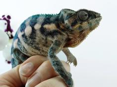

+++
title = "lokana"
date = "2020-12-02"
tags = ["lokana", "kromatisk", "landy"]
categories = ["retired-pardalis"]
banner = "img/ambilobe/lokana/lokana"
+++



Lokana is the half-sister of Loko. They each have a 50% chance of bringing Kromatisk's amazing ybbb into our project, but Lokana also has Landy x Hamy from her dam, Shirley's side. Really can't go wrong with the two possibilities here. We are very excited to see how she proves out over the years :).



mtDNA Haplogroup*
: 3 ([Ambilobe East]())

Filial
: *F9-CG13*

Sire
: [Kromatisk]()

Dam
: [Shirley]()

*preliminary results

---




  

    

      <h1>Ancestral Report for Lokana (F9-CG12)</h1>
    

    <h3>Generation 1</h3>
    
    
1. <strong>Lokana (F9-CG12). </strong>Lokana was born on 2020-12-02 at Chromatic Chameleons.  She is the daughter of Kromatisk (F8-CG11) and Shirley (F9-CG12). 

    
More about Lokana (F9-CG12):

    
Adopted: 2021-03-15, iPardalis.  

    <h3>Generation 2</h3>
    
    
2. <strong>Kromatisk (F8-CG11). </strong>Kromatisk was born on 2018-08-26 at Chromatic Chameleons.  He is the son of JJ (F7-CG10) and Daisy. He had a relationship with Jackie (F4). He also had a relationship with Shirley (F9-CG12). 

    
Children of Jackie (F4) and Kromatisk (F8-CG11)

    
i. Loko (F5-CG12). Loko was born on 2020-04-18 at Chromatic Chameleons.  

    
3. <strong>Shirley (F9-CG12). </strong>Shirley was produced by Kammerflage Kreations.  She is the daughter of Landy (Silk) F8-CG11 and Hamy (Sweetness) F8-CG11. 

    
More about Shirley (F9-CG12):

    
Adopted: Chromatic Chameleons.  

    
Children of Shirley (F9-CG12) and Kromatisk (F8-CG11)

    
i. Lokana (F9-CG12) [1]. Lokana was born on 2020-12-02 at Chromatic Chameleons.  

    <h3>Generation 3</h3>
    
    
4. <strong>JJ (F7-CG10). </strong>JJ  was produced by Kammerflage Kreations.  He is the son of Mavo-ra (Yellow Blood) and Tsara-andro (Good Day). He had a relationship with Blue Bird's daughter. He also had a relationship with Daisy. 

    
Children of Blue Bird's daughter and JJ (F7-CG10)

    
i. Alla (F8-CG11). Alla was born on 2018-01-30 at Panther Creek Chameleons.  

    
5. <strong>Daisy. </strong>She is the daughter of Seventeen and Dio's daughter. 

    
Children of Daisy and JJ (F7-CG10)

    
i. Kromatisk (F8-CG11) [2]. Kromatisk was born on 2018-08-26 at Chromatic Chameleons.  

    
    
6. <strong>Landy (Silk) F8-CG11. </strong>Landy (Silk) F8-CG11 was born on 2018-02-20 at Kammerflage Kreations.  He is the son of Giga-vony (Old Yeller) and Au-sanga (Goldie Locks). He had a relationship with Hamy (Sweetness) F8-CG11. 

    
    
7. <strong>Hamy (Sweetness) F8-CG11. </strong>Hamy (Sweetness) was produced by Kammerflage Kreations.  She is the daughter of Fantara (Falling Star) and Mavo-loha (Blondie). 

    
Children of Hamy (Sweetness) F8-CG11 and Landy (Silk) F8-CG11

    
i. Itso-triombe (Green Giant) F9-CG12. Itso-triombe (Green Giant) was produced by Kammerflage Kreations.  

    
ii. Foxey (F9-CG12). Foxey was produced by Kammerflage Kreations.  

    
iii. Shirley (F9-CG12) [3]. Shirley was produced by Kammerflage Kreations.  

    <h3>Generation 4</h3>
    
    
8. <strong>Mavo-ra (Yellow Blood). </strong>Mavo-ra (Yellow Blood) was produced by Kammerflage Kreations.  He died with Kammerflage Kreations.  He was the son of Mabonika-haboka (Mellow Yellow). He had a relationship with Unknown. He also had a relationship with Tsara-andro (Good Day). 

    
Children of Unknown and Mavo-ra (Yellow Blood)

    
i. Vony-reny. Vony-reny was produced by Kammerflage Kreations.  She died with Kammerflage Kreations.  

    
    
9. <strong>Tsara-andro (Good Day). </strong>Tsara-andro (Good Day) was produced by Kammerflage Kreations.  She was the daughter of Kely-tongotra (Little Foot). 

    
Children of Tsara-andro (Good Day) and Mavo-ra (Yellow Blood)

    
i. Mavo-loha (Blondie). Mavo-loha (Blondie) was born on 2016-02-03 at Kammerflage Kreations.  

    
ii. Giga-vony (Old Yeller). Giga-vony (Old Yeller) was produced by Kammerflage Kreations.  

    
iii. JJ (F7-CG10) [4]. JJ  was produced by Kammerflage Kreations.  

    
    
10. <strong>Seventeen. </strong>He is the son of Paradox. He had a relationship with Dio's daughter. 

    
11. <strong>Dio's daughter. </strong>She is the daughter of Dio. 

    
Children of Dio's daughter and Seventeen

    
i. Daisy [5]. 

    
    
12. <strong>Giga-vony (Old Yeller). </strong>Giga-vony (Old Yeller) was produced by Kammerflage Kreations.  He is the son of Mavo-ra (Yellow Blood) and Tsara-andro (Good Day). He had a relationship with Au-sanga (Goldie Locks). 

    
13. <strong>Au-sanga (Goldie Locks). </strong>

    
Children of Au-sanga (Goldie Locks) and Giga-vony (Old Yeller)

    
i. Landy (Silk) F8-CG11 [6]. Landy (Silk) F8-CG11 was born on 2018-02-20 at Kammerflage Kreations.  

    
More about Au-sanga (Goldie Locks) and Giga-vony (Old Yeller):

    
Birth: 2018-02-20, Kammerflage Kreations.  

    
    
14. <strong>Fantara (Falling Star). </strong>Fantara (Falling Star) was produced by Kammerflage Kreations.  He is the son of Maizina-lanitra (Dark Sky). He had a relationship with Zazabodo-manga (Baby Blue). He also had a relationship with Mavo-loha (Blondie). 

    
Children of Zazabodo-manga (Baby Blue) and Fantara (Falling Star)

    
i. Artemis. 

    
    
15. <strong>Mavo-loha (Blondie). </strong>Mavo-loha (Blondie) was born on 2016-02-03 at Kammerflage Kreations.  She is the daughter of Mavo-ra (Yellow Blood) and Tsara-andro (Good Day). 

    
Children of Mavo-loha (Blondie) and Fantara (Falling Star)

    
i. Hamy (Sweetness) F8-CG11 [7]. Hamy (Sweetness) was produced by Kammerflage Kreations.  

    
ii. Ajax. Ajax was produced by Kammerflage Kreations.  

    
iii. Roa-ony (Two Rivers). Roa-ony (Two Rivers) was produced by Kammerflage Kreations.  

    <h3>Generation 5</h3>
    
    
16. <strong>Mabonika-haboka (Mellow Yellow). </strong>Mabonika-haboka (Mellow Yellow) was produced by Kammerflage Kreations.  He died with Kammerflage Kreations.  He was the son of Maso-vatomamy (Eye Candy). He had a relationship with Unknown. 

    
Children of Unknown and Mabonika-haboka (Mellow Yellow)

    
i. Mavo-ra (Yellow Blood) [8]. Mavo-ra (Yellow Blood) was produced by Kammerflage Kreations.  He died with Kammerflage Kreations.  

    
    
18. <strong>Kely-tongotra (Little Foot). </strong>Kely-tongotra (Little Foot) was produced by Kammerflage Kreations.  He died with Kammerflage Kreations.  He was the son of Hatsikana (Legend). He had a relationship with Unknown. He also had a relationship with Unknown. He also had a relationship with Unknown. He also had a relationship with Eye Candy's daughter. He also had a relationship with Unknown. He also had a relationship with Unknown. 

    
Children of Unknown and Kely-tongotra (Little Foot)

    
i. Little Foot's daughter. Little Foot's daughter was produced by Kammerflage Kreations.  She died with Kammerflage Kreations.  

    
Children of Unknown and Kely-tongotra (Little Foot)

    
i. Faingana (Quick). Faingana (Quick) was produced by Kammerflage Kreations.  He died with Kammerflage Kreations.  

    
Children of Unknown and Kely-tongotra (Little Foot)

    
i. Little Foot's daughter. Little Foot's daughter was produced by Kammerflage Kreations.  She died with Kammerflage Kreations.  

    
Children of Unknown and Kely-tongotra (Little Foot)

    
i. Tsara-andro (Good Day) [9]. Tsara-andro (Good Day) was produced by Kammerflage Kreations.  

    
Children of Unknown and Kely-tongotra (Little Foot)

    
i. Maizina-lanitra (Dark Sky). Maizina-lanitra (Dark Sky) was produced by Kammerflage Kreations.  

    
    
20. <strong>Paradox. </strong>Paradox was produced by Tree Candy Chameleons.  He had a relationship with Unknown. 

    
Children of Unknown and Paradox

    
i. Seventeen [10]. 

    
    
22. <strong>Dio. </strong>He died with Joshua Illencik.  He was the son of Kely-tongotra (Little Foot) and Eye Candy's daughter. He had a relationship with Zeratul's daughter. He also had a relationship with Unknown. 

    
Children of Zeratul's daughter and Dio

    
i. Stryfe. Stryfe was produced by Joshua Illencik.  

    
Children of Unknown and Dio

    
i. Dio's daughter [11]. 

    
    
24. <strong>Mavo-ra (Yellow Blood). </strong>Mavo-ra (Yellow Blood) was produced by Kammerflage Kreations.  He died with Kammerflage Kreations.  He was the son of Mabonika-haboka (Mellow Yellow). He had a relationship with Unknown. He also had a relationship with Tsara-andro (Good Day). 

    
Children of Unknown and Mavo-ra (Yellow Blood)

    
i. Vony-reny. Vony-reny was produced by Kammerflage Kreations.  She died with Kammerflage Kreations.  

    
    
25. <strong>Tsara-andro (Good Day). </strong>Tsara-andro (Good Day) was produced by Kammerflage Kreations.  She was the daughter of Kely-tongotra (Little Foot). 

    
Children of Tsara-andro (Good Day) and Mavo-ra (Yellow Blood)

    
i. Mavo-loha (Blondie) [15]. Mavo-loha (Blondie) was born on 2016-02-03 at Kammerflage Kreations.  

    
ii. Giga-vony (Old Yeller) [12]. Giga-vony (Old Yeller) was produced by Kammerflage Kreations.  

    
iii. JJ (F7-CG10). JJ  was produced by Kammerflage Kreations.  

    
    
28. <strong>Maizina-lanitra (Dark Sky). </strong>Maizina-lanitra (Dark Sky) was produced by Kammerflage Kreations.  He is the son of Kely-tongotra (Little Foot). He had a relationship with Unknown. 

    
Children of Unknown and Maizina-lanitra (Dark Sky)

    
i. Fantara (Falling Star) [14]. Fantara (Falling Star) was produced by Kammerflage Kreations.  

    
    
30. <strong>Mavo-ra (Yellow Blood). </strong>Mavo-ra (Yellow Blood) was produced by Kammerflage Kreations.  He died with Kammerflage Kreations.  He was the son of Mabonika-haboka (Mellow Yellow). He had a relationship with Unknown. He also had a relationship with Tsara-andro (Good Day). 

    
Children of Unknown and Mavo-ra (Yellow Blood)

    
i. Vony-reny. Vony-reny was produced by Kammerflage Kreations.  She died with Kammerflage Kreations.  

    
    
31. <strong>Tsara-andro (Good Day). </strong>Tsara-andro (Good Day) was produced by Kammerflage Kreations.  She was the daughter of Kely-tongotra (Little Foot). 

    
Children of Tsara-andro (Good Day) and Mavo-ra (Yellow Blood)

    
i. Mavo-loha (Blondie) [15]. Mavo-loha (Blondie) was born on 2016-02-03 at Kammerflage Kreations.  

    
ii. Giga-vony (Old Yeller) [12]. Giga-vony (Old Yeller) was produced by Kammerflage Kreations.  

    
iii. JJ (F7-CG10). JJ  was produced by Kammerflage Kreations.  

    <h3>Generation 6</h3>
    
    
32. <strong>Maso-vatomamy (Eye Candy). </strong>Maso-vatomamy (Eye Candy) was produced by Kammerflage Kreations.  He died with Kammerflage Kreations.  He had a relationship with Unknown. He also had a relationship with Unknown. 

    
Children of Unknown and Maso-vatomamy (Eye Candy)

    
i. Eye Candy's daughter. Eye Candy's daughter was produced by Kammerflage Kreations.  She died with Kammerflage Kreations.  

    
Children of Unknown and Maso-vatomamy (Eye Candy)

    
i. Mabonika-haboka (Mellow Yellow) [16]. Mabonika-haboka (Mellow Yellow) was produced by Kammerflage Kreations.  He died with Kammerflage Kreations.  

    
    
36. <strong>Hatsikana (Legend). </strong>Hatsikana (Legend) was produced by Kammerflage Kreations.  He died with Kammerflage Kreations.  He had a relationship with Unknown. 

    
Children of Unknown and Hatsikana (Legend)

    
i. Kely-tongotra (Little Foot) [18]. Kely-tongotra (Little Foot) was produced by Kammerflage Kreations.  He died with Kammerflage Kreations.  

    
    
44. <strong>Kely-tongotra (Little Foot). </strong>Kely-tongotra (Little Foot) was produced by Kammerflage Kreations.  He died with Kammerflage Kreations.  He was the son of Hatsikana (Legend). He had a relationship with Unknown. He also had a relationship with Unknown. He also had a relationship with Unknown. He also had a relationship with Eye Candy's daughter. He also had a relationship with Unknown. He also had a relationship with Unknown. 

    
Children of Unknown and Kely-tongotra (Little Foot)

    
i. Little Foot's daughter. Little Foot's daughter was produced by Kammerflage Kreations.  She died with Kammerflage Kreations.  

    
Children of Unknown and Kely-tongotra (Little Foot)

    
i. Faingana (Quick). Faingana (Quick) was produced by Kammerflage Kreations.  He died with Kammerflage Kreations.  

    
Children of Unknown and Kely-tongotra (Little Foot)

    
i. Little Foot's daughter. Little Foot's daughter was produced by Kammerflage Kreations.  She died with Kammerflage Kreations.  

    
Children of Unknown and Kely-tongotra (Little Foot)

    
i. Tsara-andro (Good Day) [31]. Tsara-andro (Good Day) was produced by Kammerflage Kreations.  

    
Children of Unknown and Kely-tongotra (Little Foot)

    
i. Maizina-lanitra (Dark Sky) [28]. Maizina-lanitra (Dark Sky) was produced by Kammerflage Kreations.  

    
45. <strong>Eye Candy's daughter. </strong>Eye Candy's daughter was produced by Kammerflage Kreations.  She died with Kammerflage Kreations.  She was the daughter of Maso-vatomamy (Eye Candy). 

    
Children of Eye Candy's daughter and Kely-tongotra (Little Foot)

    
i. Dio [22]. He died with Joshua Illencik.  

    
    
48. <strong>Mabonika-haboka (Mellow Yellow). </strong>Mabonika-haboka (Mellow Yellow) was produced by Kammerflage Kreations.  He died with Kammerflage Kreations.  He was the son of Maso-vatomamy (Eye Candy). He had a relationship with Unknown. 

    
Children of Unknown and Mabonika-haboka (Mellow Yellow)

    
i. Mavo-ra (Yellow Blood) [30]. Mavo-ra (Yellow Blood) was produced by Kammerflage Kreations.  He died with Kammerflage Kreations.  

    
    
50. <strong>Kely-tongotra (Little Foot). </strong>Kely-tongotra (Little Foot) was produced by Kammerflage Kreations.  He died with Kammerflage Kreations.  He was the son of Hatsikana (Legend). He had a relationship with Unknown. He also had a relationship with Unknown. He also had a relationship with Unknown. He also had a relationship with Eye Candy's daughter. He also had a relationship with Unknown. He also had a relationship with Unknown. 

    
Children of Unknown and Kely-tongotra (Little Foot)

    
i. Little Foot's daughter. Little Foot's daughter was produced by Kammerflage Kreations.  She died with Kammerflage Kreations.  

    
Children of Unknown and Kely-tongotra (Little Foot)

    
i. Faingana (Quick). Faingana (Quick) was produced by Kammerflage Kreations.  He died with Kammerflage Kreations.  

    
Children of Unknown and Kely-tongotra (Little Foot)

    
i. Little Foot's daughter. Little Foot's daughter was produced by Kammerflage Kreations.  She died with Kammerflage Kreations.  

    
Children of Unknown and Kely-tongotra (Little Foot)

    
i. Tsara-andro (Good Day) [31]. Tsara-andro (Good Day) was produced by Kammerflage Kreations.  

    
Children of Unknown and Kely-tongotra (Little Foot)

    
i. Maizina-lanitra (Dark Sky) [28]. Maizina-lanitra (Dark Sky) was produced by Kammerflage Kreations.  

    
    
56. <strong>Kely-tongotra (Little Foot). </strong>Kely-tongotra (Little Foot) was produced by Kammerflage Kreations.  He died with Kammerflage Kreations.  He was the son of Hatsikana (Legend). He had a relationship with Unknown. He also had a relationship with Unknown. He also had a relationship with Unknown. He also had a relationship with Eye Candy's daughter. He also had a relationship with Unknown. He also had a relationship with Unknown. 

    
Children of Unknown and Kely-tongotra (Little Foot)

    
i. Little Foot's daughter. Little Foot's daughter was produced by Kammerflage Kreations.  She died with Kammerflage Kreations.  

    
Children of Unknown and Kely-tongotra (Little Foot)

    
i. Faingana (Quick). Faingana (Quick) was produced by Kammerflage Kreations.  He died with Kammerflage Kreations.  

    
Children of Unknown and Kely-tongotra (Little Foot)

    
i. Little Foot's daughter. Little Foot's daughter was produced by Kammerflage Kreations.  She died with Kammerflage Kreations.  

    
Children of Unknown and Kely-tongotra (Little Foot)

    
i. Tsara-andro (Good Day) [31]. Tsara-andro (Good Day) was produced by Kammerflage Kreations.  

    
Children of Unknown and Kely-tongotra (Little Foot)

    
i. Maizina-lanitra (Dark Sky) [28]. Maizina-lanitra (Dark Sky) was produced by Kammerflage Kreations.  

    
    
60. <strong>Mabonika-haboka (Mellow Yellow). </strong>Mabonika-haboka (Mellow Yellow) was produced by Kammerflage Kreations.  He died with Kammerflage Kreations.  He was the son of Maso-vatomamy (Eye Candy). He had a relationship with Unknown. 

    
Children of Unknown and Mabonika-haboka (Mellow Yellow)

    
i. Mavo-ra (Yellow Blood) [30]. Mavo-ra (Yellow Blood) was produced by Kammerflage Kreations.  He died with Kammerflage Kreations.  

    
    
62. <strong>Kely-tongotra (Little Foot). </strong>Kely-tongotra (Little Foot) was produced by Kammerflage Kreations.  He died with Kammerflage Kreations.  He was the son of Hatsikana (Legend). He had a relationship with Unknown. He also had a relationship with Unknown. He also had a relationship with Unknown. He also had a relationship with Eye Candy's daughter. He also had a relationship with Unknown. He also had a relationship with Unknown. 

    
Children of Unknown and Kely-tongotra (Little Foot)

    
i. Little Foot's daughter. Little Foot's daughter was produced by Kammerflage Kreations.  She died with Kammerflage Kreations.  

    
Children of Unknown and Kely-tongotra (Little Foot)

    
i. Faingana (Quick). Faingana (Quick) was produced by Kammerflage Kreations.  He died with Kammerflage Kreations.  

    
Children of Unknown and Kely-tongotra (Little Foot)

    
i. Little Foot's daughter. Little Foot's daughter was produced by Kammerflage Kreations.  She died with Kammerflage Kreations.  

    
Children of Unknown and Kely-tongotra (Little Foot)

    
i. Tsara-andro (Good Day) [31]. Tsara-andro (Good Day) was produced by Kammerflage Kreations.  

    
Children of Unknown and Kely-tongotra (Little Foot)

    
i. Maizina-lanitra (Dark Sky) [28]. Maizina-lanitra (Dark Sky) was produced by Kammerflage Kreations.  

    <h3>Generation 7</h3>
    
    
88. <strong>Hatsikana (Legend). </strong>Hatsikana (Legend) was produced by Kammerflage Kreations.  He died with Kammerflage Kreations.  He had a relationship with Unknown. 

    
Children of Unknown and Hatsikana (Legend)

    
i. Kely-tongotra (Little Foot) [62]. Kely-tongotra (Little Foot) was produced by Kammerflage Kreations.  He died with Kammerflage Kreations.  

    
    
90. <strong>Maso-vatomamy (Eye Candy). </strong>Maso-vatomamy (Eye Candy) was produced by Kammerflage Kreations.  He died with Kammerflage Kreations.  He had a relationship with Unknown. He also had a relationship with Unknown. 

    
Children of Unknown and Maso-vatomamy (Eye Candy)

    
i. Eye Candy's daughter [45]. Eye Candy's daughter was produced by Kammerflage Kreations.  She died with Kammerflage Kreations.  

    
Children of Unknown and Maso-vatomamy (Eye Candy)

    
i. Mabonika-haboka (Mellow Yellow) [60]. Mabonika-haboka (Mellow Yellow) was produced by Kammerflage Kreations.  He died with Kammerflage Kreations.  

    
    
96. <strong>Maso-vatomamy (Eye Candy). </strong>Maso-vatomamy (Eye Candy) was produced by Kammerflage Kreations.  He died with Kammerflage Kreations.  He had a relationship with Unknown. He also had a relationship with Unknown. 

    
Children of Unknown and Maso-vatomamy (Eye Candy)

    
i. Eye Candy's daughter [45]. Eye Candy's daughter was produced by Kammerflage Kreations.  She died with Kammerflage Kreations.  

    
Children of Unknown and Maso-vatomamy (Eye Candy)

    
i. Mabonika-haboka (Mellow Yellow) [60]. Mabonika-haboka (Mellow Yellow) was produced by Kammerflage Kreations.  He died with Kammerflage Kreations.  

    
    
100. <strong>Hatsikana (Legend). </strong>Hatsikana (Legend) was produced by Kammerflage Kreations.  He died with Kammerflage Kreations.  He had a relationship with Unknown. 

    
Children of Unknown and Hatsikana (Legend)

    
i. Kely-tongotra (Little Foot) [62]. Kely-tongotra (Little Foot) was produced by Kammerflage Kreations.  He died with Kammerflage Kreations.  

    
    
112. <strong>Hatsikana (Legend). </strong>Hatsikana (Legend) was produced by Kammerflage Kreations.  He died with Kammerflage Kreations.  He had a relationship with Unknown. 

    
Children of Unknown and Hatsikana (Legend)

    
i. Kely-tongotra (Little Foot) [62]. Kely-tongotra (Little Foot) was produced by Kammerflage Kreations.  He died with Kammerflage Kreations.  

    
    
120. <strong>Maso-vatomamy (Eye Candy). </strong>Maso-vatomamy (Eye Candy) was produced by Kammerflage Kreations.  He died with Kammerflage Kreations.  He had a relationship with Unknown. He also had a relationship with Unknown. 

    
Children of Unknown and Maso-vatomamy (Eye Candy)

    
i. Eye Candy's daughter [45]. Eye Candy's daughter was produced by Kammerflage Kreations.  She died with Kammerflage Kreations.  

    
Children of Unknown and Maso-vatomamy (Eye Candy)

    
i. Mabonika-haboka (Mellow Yellow) [60]. Mabonika-haboka (Mellow Yellow) was produced by Kammerflage Kreations.  He died with Kammerflage Kreations.  

    
    
124. <strong>Hatsikana (Legend). </strong>Hatsikana (Legend) was produced by Kammerflage Kreations.  He died with Kammerflage Kreations.  He had a relationship with Unknown. 

    
Children of Unknown and Hatsikana (Legend)

    
i. Kely-tongotra (Little Foot) [62]. Kely-tongotra (Little Foot) was produced by Kammerflage Kreations.  He died with Kammerflage Kreations.  

  



