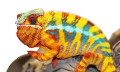
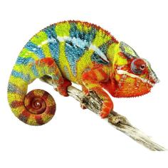
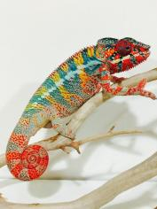

+++
title = "Loko"
date = "2020-04-18"
tags = ["loko", "kromatisk", "jj", "wet dream"]
categories = ["ambilobe-dams"]
banner = "img/ambilobe/loko/loko2"
+++
  


Loko is a premium CB Ambilobe from some of the best lines in the USA. Her sire, [Kromatisk]() from Chromatic Chameleons, is one of my favorite active breeders of the locale. My hope is that we can get some little guys that glow yellow from her and Nugget!



Filial Group
: F5-CG13

Sire
: [Kromatisk]()

Dam
: [Jackie]()
 
---




 

  

    <h1>Ancestral Report for Loko</h1>
  

  <h3>Generation 1</h3>
  
  
1. <strong>Loko. </strong>Loko was born on 2020-04-18 at Chromatic Chameleons.  She is the daughter of Kromatisk and Jackie. 

  
More about Loko:

  
Adopted: 2020-07-18, iPardalis.  

  <h3>Generation 2</h3>
  
  
2. <strong>Kromatisk. </strong>Kromatisk was born on 2018-08-26 at Chromatic Chameleons.  He is the son of JJ and Daisy. He had a relationship with Jackie. 

  
3. <strong>Jackie. </strong>Jackie was produced by Panther Creek Chameleons.  She is the daughter of Wetdream and Marley's daughter. 

  
More about Jackie:

  
Adopted: Chromatic Chameleons.  

  
Children of Jackie and Kromatisk

  
i. Loko [1]. Loko was born on 2020-04-18 at Chromatic Chameleons.  

  <h3>Generation 3</h3>
  
  
4. <strong>JJ. </strong>JJ was produced by Kammerflage Kreations.  He was the son of Mavo-ra (Yellow Blood) and Little Foot's daughter. He had a relationship with Blue Bird's daughter. He also had a relationship with Daisy. 

  
Children of Blue Bird's daughter and JJ

  
i. Alla. Alla was born on 2018-01-30 at Panther Creek Chameleons.  

  
5. <strong>Daisy. </strong>She is the daughter of Seventeen and Dio's daughter. 

  
Children of Daisy and JJ

  
i. Kromatisk [2]. Kromatisk was born on 2018-08-26 at Chromatic Chameleons.  

  
  
6. <strong>Wetdream. </strong>He is the son of Macho (F2) and 24k's daughter. He had a relationship with Marley's daughter. 

  
7. <strong>Marley's daughter. </strong>She is the daughter of Marley and Outline's daughter. 

  
Children of Marley's daughter and Wetdream

  
i. Jackie [3]. Jackie was produced by Panther Creek Chameleons.  

  <h3>Generation 4</h3>
  
  
8. <strong>Mavo-ra (Yellow Blood). </strong>Mavo-ra (Yellow Blood) was produced by Kammerflage Kreations.  He died with Kammerflage Kreations.  He was the son of Mabonika-haboka (Mellow Yellow). He had a relationship with Unknown. He also had a relationship with Little Foot's daughter. 

  
Children of Unknown and Mavo-ra (Yellow Blood)

  
i. Vony-reny. Vony-reny was produced by Kammerflage Kreations.  She died with Kammerflage Kreations.  

  
9. <strong>Little Foot's daughter. </strong>Little Foot's daughter was produced by Kammerflage Kreations.  She died with Kammerflage Kreations.  She was the daughter of Kely-tongotra (Little Foot). 

  
Children of Little Foot's daughter and Mavo-ra (Yellow Blood)

  
i. JJ [4]. JJ was produced by Kammerflage Kreations.  

  
  
10. <strong>Seventeen. </strong>He is the son of Paradox. He had a relationship with Dio's daughter. 

  
11. <strong>Dio's daughter. </strong>She is the daughter of Dio. 

  
Children of Dio's daughter and Seventeen

  
i. Daisy [5]. 

  
  
12. <strong>Macho (F2). </strong>He is the son of Candy Cane (F1) and Cowboy's daughter (F1). He had a relationship with Unknown. He also had a relationship with 24k's daughter. 

  
Children of Unknown and Macho (F2)

  
i. Macho's daughter. 

  
13. <strong>24k's daughter. </strong>24k's daughter was produced by Chameleon's Paradise.  She is the daughter of 24k. 

  
Children of 24k's daughter and Macho (F2)

  
i. Wetdream [6]. 

  
  
14. <strong>Marley. </strong>Marley was produced by Canvas Chameleons.  He had a relationship with Outline's daughter. 

  
15. <strong>Outline's daughter. </strong>She is the daughter of Outline. 

  
Children of Outline's daughter and Marley

  
i. Marley's daughter [7]. 

  <h3>Generation 5</h3>
  
  
16. <strong>Mabonika-haboka (Mellow Yellow). </strong>Mabonika-haboka (Mellow Yellow) was produced by Kammerflage Kreations.  He died with Kammerflage Kreations.  He was the son of Maso-vatomamy (Eye Candy). He had a relationship with Unknown. 

  
Children of Unknown and Mabonika-haboka (Mellow Yellow)

  
i. Mavo-ra (Yellow Blood) [8]. Mavo-ra (Yellow Blood) was produced by Kammerflage Kreations.  He died with Kammerflage Kreations.  

  
  
18. <strong>Kely-tongotra (Little Foot). </strong>Kely-tongotra (Little Foot) was produced by Kammerflage Kreations.  He died with Kammerflage Kreations.  He was the son of Hatsikana (Legend). He had a relationship with Unknown. He also had a relationship with Unknown. He also had a relationship with Unknown. He also had a relationship with Eye Candy's daughter. 

  
Children of Unknown and Kely-tongotra (Little Foot)

  
i. Little Foot's daughter. Little Foot's daughter was produced by Kammerflage Kreations.  She died with Kammerflage Kreations.  

  
Children of Unknown and Kely-tongotra (Little Foot)

  
i. Faingana (Quick). Faingana (Quick) was produced by Kammerflage Kreations.  He died with Kammerflage Kreations.  

  
Children of Unknown and Kely-tongotra (Little Foot)

  
i. Little Foot's daughter [9]. Little Foot's daughter was produced by Kammerflage Kreations.  She died with Kammerflage Kreations.  

  
  
20. <strong>Paradox. </strong>Paradox was produced by Tree Candy Chameleons.  He had a relationship with Unknown. 

  
Children of Unknown and Paradox

  
i. Seventeen [10]. 

  
  
22. <strong>Dio. </strong>He died with Joshua Illencik.  He was the son of Kely-tongotra (Little Foot) and Eye Candy's daughter. He had a relationship with Zeratul's daughter. He also had a relationship with Unknown. 

  
Children of Zeratul's daughter and Dio

  
i. Stryfe. Stryfe was produced by Joshua Illencik.  

  
Children of Unknown and Dio

  
i. Dio's daughter [11]. 

  
  
24. <strong>Candy Cane (F1). </strong>Candy Cane was produced by Chameleon's Paradise.  He died with Chameleon's Paradise.  He had a relationship with Jake's daughter. He also had a relationship with Cowboy's daughter (F1). 

  
Children of Jake's daughter and Candy Cane (F1)

  
i. Judy (F2). Judy was born on 2015-02-11 at Chameleon's Paradise.  She died on 2018-02-15 at iPardalis.  

  
25. <strong>Cowboy's daughter (F1). </strong>She was the daughter of Cowboy (CH). 

  
Children of Cowboy's daughter (F1) and Candy Cane (F1)

  
i. Macho (F2) [12]. 

  
  
26. <strong>24k. </strong>24k was produced by Chameleon's Paradise.  He had a relationship with Unknown. 

  
Children of Unknown and 24k

  
i. 24k's daughter [13]. 24k's daughter was produced by Chameleon's Paradise.  

  
  
30. <strong>Outline. </strong>Outline was produced by Canvas Chameleons.  He had a relationship with Unknown. 

  
Children of Unknown and Outline

  
i. Outline's daughter [15]. 

  <h3>Generation 6</h3>
  
  
32. <strong>Maso-vatomamy (Eye Candy). </strong>Maso-vatomamy (Eye Candy) was produced by Kammerflage Kreations.  He died with Kammerflage Kreations.  He had a relationship with Unknown. He also had a relationship with Unknown. 

  
Children of Unknown and Maso-vatomamy (Eye Candy)

  
i. Eye Candy's daughter. Eye Candy's daughter was produced by Kammerflage Kreations.  She died with Kammerflage Kreations.  

  
Children of Unknown and Maso-vatomamy (Eye Candy)

  
i. Mabonika-haboka (Mellow Yellow) [16]. Mabonika-haboka (Mellow Yellow) was produced by Kammerflage Kreations.  He died with Kammerflage Kreations.  

  
  
36. <strong>Hatsikana (Legend). </strong>Hatsikana (Legend) was produced by Kammerflage Kreations.  He died with Kammerflage Kreations.  He had a relationship with Unknown. 

  
Children of Unknown and Hatsikana (Legend)

  
i. Kely-tongotra (Little Foot) [18]. Kely-tongotra (Little Foot) was produced by Kammerflage Kreations.  He died with Kammerflage Kreations.  

  
  
44. <strong>Kely-tongotra (Little Foot). </strong>Kely-tongotra (Little Foot) was produced by Kammerflage Kreations.  He died with Kammerflage Kreations.  He was the son of Hatsikana (Legend). He had a relationship with Unknown. He also had a relationship with Unknown. He also had a relationship with Unknown. He also had a relationship with Eye Candy's daughter. 

  
Children of Unknown and Kely-tongotra (Little Foot)

  
i. Little Foot's daughter. Little Foot's daughter was produced by Kammerflage Kreations.  She died with Kammerflage Kreations.  

  
Children of Unknown and Kely-tongotra (Little Foot)

  
i. Faingana (Quick). Faingana (Quick) was produced by Kammerflage Kreations.  He died with Kammerflage Kreations.  

  
Children of Unknown and Kely-tongotra (Little Foot)

  
i. Little Foot's daughter. Little Foot's daughter was produced by Kammerflage Kreations.  She died with Kammerflage Kreations.  

  
45. <strong>Eye Candy's daughter. </strong>Eye Candy's daughter was produced by Kammerflage Kreations.  She died with Kammerflage Kreations.  She was the daughter of Maso-vatomamy (Eye Candy). 

  
Children of Eye Candy's daughter and Kely-tongotra (Little Foot)

  
i. Dio [22]. He died with Joshua Illencik.  

  
  
50. <strong>Cowboy (CH). </strong>Cowboy was produced by Chameleon's Paradise.  He died on 2015-01-01 at Chameleon's Paradise.  He had a relationship with King's daughter. He also had a relationship with Unknown. He also had a relationship with Unknown. 

  
More about Cowboy (CH):

  
Description: CH - Ambilobe

  
Children of King's daughter and Cowboy (CH)

  
i. Flash (F1). Flash was born on 2015-01-10 at Chameleon's Paradise.  He died on 2018-06-14 at iPardalis.  

  
Children of Unknown and Cowboy (CH)

  
i. Cowboy's daughter (F1) [25]. 

  
Children of Unknown and Cowboy (CH)

  
i. Cowboy's daughter (F1). Cowboy's daughter was produced by Chameleon's Paradise.  She died with Canvas Chameleons.  

  <h3>Generation 7</h3>
  
  
88. <strong>Hatsikana (Legend). </strong>Hatsikana (Legend) was produced by Kammerflage Kreations.  He died with Kammerflage Kreations.  He had a relationship with Unknown. 

  
Children of Unknown and Hatsikana (Legend)

  
i. Kely-tongotra (Little Foot) [44]. Kely-tongotra (Little Foot) was produced by Kammerflage Kreations.  He died with Kammerflage Kreations.  

  
  
90. <strong>Maso-vatomamy (Eye Candy). </strong>Maso-vatomamy (Eye Candy) was produced by Kammerflage Kreations.  He died with Kammerflage Kreations.  He had a relationship with Unknown. He also had a relationship with Unknown. 

  
Children of Unknown and Maso-vatomamy (Eye Candy)

  
i. Eye Candy's daughter [45]. Eye Candy's daughter was produced by Kammerflage Kreations.  She died with Kammerflage Kreations.  

  
Children of Unknown and Maso-vatomamy (Eye Candy)

  
i. Mabonika-haboka (Mellow Yellow). Mabonika-haboka (Mellow Yellow) was produced by Kammerflage Kreations.  He died with Kammerflage Kreations.  

  

