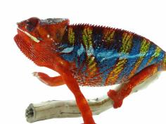

+++
title = "Mainty"
date = "2021-09-05"
tags = ["mainty", "bangheera", "flamethrower", "grape inferno"]
categories = ["retired-pardalis"]
banner = "img/ambilobe/mainty/mainty"
+++



Mainty is one of the nicest RBBB females I could find for Ralph. Her sire, Bangheera, is a classic red body blue bar Ambilobe produced by Highlighter Chameleons and owned by Nature's Van Gogh. After talking to Logan about Mainty's brothers, it looks like many of them proved out to be similar to Grape Inferno or Bangheera, so although Moonclaw's sire is Flamethrower, it seems she took after her dam sire.



Filial
: *Unknown Filial*

Sire
: [Bangheera]()

Dam
: [Moonclaw]()

---




  

    

      <h1>Ancestral Report for Mainty</h1>
    

    <h3>Generation 1</h3>
    
1. <strong>Mainty. </strong>Mainty was born on 2021-09-05 at Nature's Van Gogh.  She is the daughter of Bangheera and Moonclaw. 

    
More about Mainty:

    
Adopted: 2022-01-17, iPardalis. 

    <h3>Generation 2</h3>
    
    
2. <strong>Bangheera. </strong>Bangheera was produced by Highlighter Chameleons.  He is the son of Mango Saphire and Copperhead's daughter. He had a relationship with Moonclaw. 

    
More about Bangheera:

    
Adopted: Nature's Van Gogh. 

    
3. <strong>Moonclaw. </strong>She is the daughter of Flamethrower and Grape Inferno's daughter. 

    
Children of Moonclaw and Bangheera

    
i. Mainty [1]. Mainty was born on 2021-09-05 at Nature's Van Gogh.  

    <h3>Generation 3</h3>
    
    
4. <strong>Mango Saphire. </strong>Mango Saphire was produced by Kammerflage Kreations.  He is the son of Karamba-ady (Cage Combat) and Telo Heny's daughter. He had a relationship with Copperhead's daughter. 

    
More about Mango Saphire:

    
Adopted: Highlighter Chameleons. 

    
5. <strong>Copperhead's daughter. </strong>She is the daughter of Copperhead. 

    
Children of Copperhead's daughter and Mango Saphire

    
i. Bangheera [2]. Bangheera was produced by Highlighter Chameleons.  

    
    
6. <strong>Flamethrower. </strong>He is the son of Tropicali and Arira/Thunder's daughter. He had a relationship with Grape Inferno's daughter. 

    
More about Flamethrower:

    
Adopted: Highlighter Chameleons. 

    
7. <strong>Grape Inferno's daughter. </strong>She is the daughter of Grape Inferno. 

    
Children of Grape Inferno's daughter and Flamethrower

    
i. Moonclaw [3]. 

    <h3>Generation 4</h3>
    
    
8. <strong>Karamba-ady (Cage Combat). </strong>Karamba-ady (Cage Combat) was produced by Kammerflage Kreations.  He had a relationship with Telo Heny's daughter. 

    
9. <strong>Telo Heny's daughter. </strong>She is the daughter of Telo-heny (Triple). 

    
Children of Telo Heny's daughter and Karamba-ady (Cage Combat)

    
i. Mango Saphire [4]. Mango Saphire was produced by Kammerflage Kreations.  

    
    
10. <strong>Copperhead. </strong>He had a relationship with Unknown. 

    
Children of Unknown and Copperhead

    
i. Copperhead's daughter [5]. 

    
    
12. <strong>Tropicali. </strong>He is the son of Malachi and Candy Man's daughter. He had a relationship with Arira/Thunder's daughter. 

    
13. <strong>Arira/Thunder's daughter. </strong>

    
Children of Arira/Thunder's daughter and Tropicali

    
i. Flamethrower [6]. 

    
    
14. <strong>Grape Inferno. </strong>He is the son of Manga-hay (Blue Heat) and Bolitika-zandry (Little Sister). He had a relationship with Unknown. 

    
Children of Unknown and Grape Inferno

    
i. Grape Inferno's daughter [7]. 

    <h3>Generation 5</h3>
    
    
18. <strong>Telo-heny (Triple). </strong>Telo-heny (Triple) was born on 2015-01-15 at Kammerflage Kreations.  He is the son of Dobo (Double). He had a relationship with Unknown. He also had a relationship with Unknown. He also had a relationship with Unknown. 

    
Children of Unknown and Telo-heny (Triple)

    
i. Triple's daughter. Triple's daughter was produced by Kammerflage Kreations.  

    
Children of Unknown and Telo-heny (Triple)

    
i. Zazabodo-manga (Baby Blue). Zazabodo-manga (Baby Blue) was born on 2018-01-01 at Kammerflage Kreations.  

    
Children of Unknown and Telo-heny (Triple)

    
i. Telo Heny's daughter [9]. 

    
24. <strong>Malachi. </strong>He had a relationship with Candy Man's daughter. 

    
25. <strong>Candy Man's daughter. </strong>

    
Children of Candy Man's daughter and Malachi

    
i. Tropicali [12]. 

    
    
28. <strong>Manga-hay (Blue Heat). </strong>Manga-hay (Blue Heat) was produced by Kammerflage Kreations.  He had a relationship with Bolitika-zandry (Little Sister). 

    
29. <strong>Bolitika-zandry (Little Sister). </strong>Bolitika-zandry (Little Sister) was produced by Kammerflage Kreations.  She is the daughter of Maizina-lanitra (Dark Sky). 

    
Children of Bolitika-zandry (Little Sister) and Manga-hay (Blue Heat)

    
i. Polisy-menapina (Agent Orange). Polisy-menapina (Agent Orange) was produced by Kammerflage Kreations.  

    
ii. Grape Inferno [14]. 

    <h3>Generation 6</h3>
    
36. <strong>Dobo (Double). </strong>He had a relationship with Unknown. 

    
Children of Unknown and Dobo (Double)

    
i. Telo-heny (Triple) [18]. Telo-heny (Triple) was born on 2015-01-15 at Kammerflage Kreations.  

    
    
58. <strong>Maizina-lanitra (Dark Sky). </strong>Maizina-lanitra (Dark Sky) was produced by Kammerflage Kreations.  He is the son of Kely-tongotra (Little Foot) (F5-CG8). He had a relationship with Unknown. He also had a relationship with Unknown. 

    
Children of Unknown and Maizina-lanitra (Dark Sky)

    
i. Fantara (Falling Star) (F7-CG10). Fantara (Falling Star) was produced by Kammerflage Kreations.  

    
Children of Unknown and Maizina-lanitra (Dark Sky)

    
i. Bolitika-zandry (Little Sister) [29]. Bolitika-zandry (Little Sister) was produced by Kammerflage Kreations.  

    <h3>Generation 7</h3>
    
    
116. <strong>Kely-tongotra (Little Foot) (F5-CG8). </strong>Kely-tongotra (Little Foot) was produced by Kammerflage Kreations.  He is the son of Hatsikana (Legend). He had a relationship with Unknown. He also had a relationship with Unknown. He also had a relationship with Unknown. He also had a relationship with Eye Candy's daughter. He also had a relationship with Unknown. He also had a relationship with Unknown. He also had a relationship with Unknown. 

    
Children of Unknown and Kely-tongotra (Little Foot) (F5-CG8)

    
i. Little Foot's daughter. Little Foot's daughter was produced by Kammerflage Kreations.  

    
Children of Unknown and Kely-tongotra (Little Foot) (F5-CG8)

    
i. Faingana (Quick). Faingana (Quick) was produced by Kammerflage Kreations.  

    
Children of Unknown and Kely-tongotra (Little Foot) (F5-CG8)

    
i. Little Foot's daughter. Little Foot's daughter was produced by Kammerflage Kreations.  

    
Children of Eye Candy's daughter and Kely-tongotra (Little Foot) (F5-CG8)

    
i. Dio (F6-CG9). 

    
Children of Unknown and Kely-tongotra (Little Foot) (F5-CG8)

    
i. Tsara-andro (Good Day) (F6-CG9). Tsara-andro (Good Day) was produced by Kammerflage Kreations.  

    
Children of Unknown and Kely-tongotra (Little Foot) (F5-CG8)

    
i. Maizina-lanitra (Dark Sky) [58]. Maizina-lanitra (Dark Sky) was produced by Kammerflage Kreations.  

    
Children of Unknown and Kely-tongotra (Little Foot) (F5-CG8)

    
i. Faingana (Quick). Faingana (Quick) was produced by Kammerflage Kreations.  

    <h3>Generation 8</h3>
    
    
232. <strong>Hatsikana (Legend). </strong>Hatsikana (Legend) was produced by Kammerflage Kreations.  He had a relationship with Unknown. 

    
Children of Unknown and Hatsikana (Legend)

    
i. Kely-tongotra (Little Foot) (F5-CG8) [116]. Kely-tongotra (Little Foot) was produced by Kammerflage Kreations.  

  



