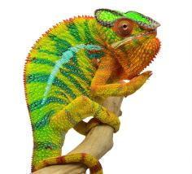

+++
title = "Maitso"
date = "2019-11-13"
tags = ["maitso", "amarillo", "felipe sanchez"]
categories = ["retired-pardalis"]
banner = "img/ambilobe/maitso/maitso"
+++



Maitso's sire, Amarillo, is the top yellow boby blue bar Ambilobe in the USA. He is a vibrant yellow from snout to vent without any red to mess with what he has going on. The only way I could concieve of a way to improve upon him is to get some thicker blue bars on him and get rid of the red on his turrets. We'll see what we can do!



Filial
: F3-CG5

Sire
: [Amarillo]()

Dam
: [Felipe Sanchez's daughter]()

---



 
  

    

      <h1>Ancestral Report for Maitso (F3)</h1>
    

    <h3>Generation 1</h3>
    
    
1. <strong>Maitso (F3). </strong>She is the daughter of Amarillo (F2) and Felipe Sanchez's daughter. She had a relationship with Blossom (F3). 

    
Relationship with: Blossom (F3).

    
Blossom was born on 2019-07-09 at iPardalis.  He is the son of Jude (F2) and Alla. 

    <h3>Generation 2</h3>
    
    
2. <strong>Amarillo (F2). </strong>Amarillo (F2) was produced by Bobby Ruddock.  He is the son of Sparkles (F1) and Leo's daughter. He had a relationship with Felipe Sanchez's daughter. 

    
3. <strong>Felipe Sanchez's daughter. </strong>She is the daughter of Felipe Sanchez (F1) and Macho's daughter. 

    
Children of Felipe Sanchez's daughter and Amarillo (F2)

    
i. Mavokely (F3). Mavokely (F3) was born on 2019-11-12 at Bobby Ruddock.  

    
ii. Maitso (F3) [1]. 

    <h3>Generation 3</h3>
    
    
4. <strong>Sparkles (F1). </strong>Sparkles was produced by Bobby Ruddock.  He was the son of Loki and Unknown - WC. He had a relationship with Leo's daughter. 

    
5. <strong>Leo's daughter. </strong>Leo's daughter was produced by The Panther Company.  She died on 2018-12-23 at Bobby Ruddock.  She was the daughter of Leo. 

    
Children of Leo's daughter and Sparkles (F1)

    
i. Kako (F2). Kako was born on 2017-11-21 at Panther Creek Chameleons.  She died on 2020-02-05 at iPardalis.  

    
ii. Amarillo (F2) [2]. Amarillo (F2) was produced by Bobby Ruddock.  

    
    
6. <strong>Felipe Sanchez (F1). </strong>He is the son of Bolt (WC) and Cowboy's daughter (F1). He had a relationship with Macho's daughter. 

    
7. <strong>Macho's daughter. </strong>She is the daughter of Macho (F2). 

    
Children of Macho's daughter and Felipe Sanchez (F1)

    
i. Emma Frost (F2). Emma Frost was produced by Chromatic Chameleons.  She died with Brightside Chameleons.  

    
ii. Felipe Sanchez's daughter [3]. 

    <h3>Generation 4</h3>
    
    
8. <strong>Loki. </strong>Loki was produced by The Panther Baron.  He died with Bobby Ruddock.  He was the son of Loza and Flaming River's daughter. He had a relationship with Unknown - WC. 

    
9. <strong>Unknown - WC. </strong>Unknown was produced by Bobby Ruddock.  

    
Children of Unknown - WC and Loki

    
i. Sparkles (F1) [4]. Sparkles was produced by Bobby Ruddock.  

    
    
10. <strong>Leo. </strong>Leo was produced by The Panther Company.  He died with The Panther Company.  He had a relationship with Unknown. 

    
Children of Unknown and Leo

    
i. Leo's daughter [5]. Leo's daughter was produced by The Panther Company.  She died on 2018-12-23 at Bobby Ruddock.  

    
    
12. <strong>Bolt (WC). </strong>Bolt was produced by Canvas Chameleons.  He died with Canvas Chameleons.  He had a relationship with Cowboy's daughter (F1). 

    
13. <strong>Cowboy's daughter (F1). </strong>Cowboy's daughter was produced by Chameleon's Paradise.  She died with Canvas Chameleons.  She was the daughter of Cowboy (CH). 

    
Children of Cowboy's daughter (F1) and Bolt (WC)

    
i. Felipe Sanchez (F1) [6]. 

    
    
14. <strong>Macho (F2). </strong>He is the son of Candy Cane (F1) and Cowboy's daughter (F1). He had a relationship with Unknown. 

    
Children of Unknown and Macho (F2)

    
i. Macho's daughter [7]. 

    <h3>Generation 5</h3>
    
    
16. <strong>Loza. </strong>Loza was produced by Kammerflage Kreations.  He died with Kammerflage Kreations.  He had a relationship with Flaming River's daughter. 

    
17. <strong>Flaming River's daughter. </strong>Flaming River's daughter was produced by Kammerflage Kreations.  She died with Kammerflage Kreations.  She was the daughter of Flaming River. 

    
Children of Flaming River's daughter and Loza

    
i. Loki [8]. Loki was produced by The Panther Baron.  He died with Bobby Ruddock.  

    
    
26. <strong>Cowboy (CH). </strong>Cowboy was produced by Chameleon's Paradise.  He died on 2015-01-01 at Chameleon's Paradise.  He had a relationship with King's daughter. He also had a relationship with Unknown. He also had a relationship with Unknown. 

    
More about Cowboy (CH):

    
Description: CH - Ambilobe

    
Children of King's daughter and Cowboy (CH)

    
i. Flash (F1). Flash was born on 2015-01-10 at Chameleon's Paradise.  He died on 2018-06-14 at iPardalis.  

    
Children of Unknown and Cowboy (CH)

    
i. Cowboy's daughter (F1). 

    
Children of Unknown and Cowboy (CH)

    
i. Cowboy's daughter (F1) [13]. Cowboy's daughter was produced by Chameleon's Paradise.  She died with Canvas Chameleons.  

    
    
28. <strong>Candy Cane (F1). </strong>Candy Cane was produced by Chameleon's Paradise.  He died with Chameleon's Paradise.  He had a relationship with Jake's daughter. He also had a relationship with Cowboy's daughter (F1). 

    
Children of Jake's daughter and Candy Cane (F1)

    
i. Judy (F2). Judy was born on 2015-02-11 at Chameleon's Paradise.  She died on 2018-02-15 at iPardalis.  

    
29. <strong>Cowboy's daughter (F1). </strong>She was the daughter of Cowboy (CH). 

    
Children of Cowboy's daughter (F1) and Candy Cane (F1)

    
i. Macho (F2) [14]. 

    <h3>Generation 6</h3>
    
    
34. <strong>Flaming River. </strong>Flaming River was produced by Kammerflage Kreations.  He died with Kammerflage Kreations.  He had a relationship with Unknown. 

    
Children of Unknown and Flaming River

    
i. Flaming River's daughter [17]. Flaming River's daughter was produced by Kammerflage Kreations.  She died with Kammerflage Kreations.  

    
    
58. <strong>Cowboy (CH). </strong>Cowboy was produced by Chameleon's Paradise.  He died on 2015-01-01 at Chameleon's Paradise.  He had a relationship with King's daughter. He also had a relationship with Unknown. He also had a relationship with Unknown. 

    
More about Cowboy (CH):

    
Description: CH - Ambilobe

    
Children of King's daughter and Cowboy (CH)

    
i. Flash (F1). Flash was born on 2015-01-10 at Chameleon's Paradise.  He died on 2018-06-14 at iPardalis.  

    
Children of Unknown and Cowboy (CH)

    
i. Cowboy's daughter (F1) [29]. 

    
Children of Unknown and Cowboy (CH)

    
i. Cowboy's daughter (F1). Cowboy's daughter was produced by Chameleon's Paradise.  She died with Canvas Chameleons.  

  

  


