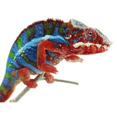

+++
title = "Maize"
date = "2022-01-13"
tags = ["maize", "mcnulty", "artemis"]
categories = ["ambilobe-dams"]
banner = "img/ambilobe/maize/maize2"
+++



Maize is a great YBBB Ambilobe female from our good friend Brian Stewart. McNulty is a male from one of Brian's old projects from the Stryfe line and he paired him up with a female from one of his recent pairings with Artemis from Colorado Chameleons. These should be a lot of fun to prove out because they have three ybbb sires in the closest lineage. Top notch stuff as always!



Filial
: *F4-CG13*

Sire
: [Mcnulty]()

Dam
: [Artemis's Daughter]()

---




  

    

      <h1>Ancestral Report for Maize (F4-CG13)</h1>
    

    <h3>Generation 1</h3>
    
1. <strong>Maize (F4-CG13). </strong>Maize was born on 2022-01-13 at Brian Stewart.  She is the daughter of McNulty (F8-CG11) and Artemis's Daughter (F3-CG12). 

    <h3>Generation 2</h3>
    
2. <strong>McNulty (F8-CG11). </strong>McNulty was produced by Brian Stewart.  He is the son of Stryfe (F7-CG10) and Kammer's Female. He had a relationship with Artemis's Daughter (F3-CG12). 

    
3. <strong>Artemis's Daughter (F3-CG12). </strong>Artemis's Daughter was produced by Brian Stewart.  She is the daughter of Artemis (F8-CG11) and Felipe Sanchez's Daughter (F2-CG3). 

    
Children of Artemis's Daughter (F3-CG12) and McNulty (F8-CG11)

    
i. Maize (F4-CG13) [1]. Maize was born on 2022-01-13 at Brian Stewart.  

    
ii. Beans (F4-CG13). Beans was born on 2022-01-12 at Brian Stewart.  

    
iii. Squash (F4-CG13). Squash was born on 2022-01-14 at Brian Stewart.  

    <h3>Generation 3</h3>
    
    
4. <strong>Stryfe (F7-CG10). </strong>Stryfe was produced by Joshua Illencik.  He is the son of Dio (F6-CG9) and Zeratul's daughter. He had a relationship with Emma Frost (F2-CG4). He also had a relationship with Higgin's daughter. He also had a relationship with Kammer's Female. 

    
More about Stryfe (F7-CG10):

    
Adopted: Brightside Chameleons. 

    
Children of Emma Frost (F2-CG4) and Stryfe (F7-CG10)

    
i. Bleu (F3-CG11). Bleu was born on 2019-07-15 at Brightside Chameleons.  

    
Children of Higgin's daughter and Stryfe (F7-CG10)

    
i. Stryfe's daughter (F8-CG11). 

    
5. <strong>Kammer's Female. </strong>

    
Children of Kammer's Female and Stryfe (F7-CG10)

    
i. McNulty (F8-CG11) [2]. McNulty was produced by Brian Stewart.  

    
    
6. <strong>Artemis (F8-CG11). </strong>He is the son of Fantara (Falling Star) (F7-CG10) and Zazabodo-manga (Baby Blue). He had a relationship with Felipe Sanchez's daughter (F2-CG3). He also had a relationship with Felipe Sanchez's Daughter (F2-CG3). 

    
Children of Felipe Sanchez's daughter (F2-CG3) and Artemis (F8-CG11)

    
i. Arti (F3-CG12). Arti was born on 2020-04-05 at Brian Stewart.  

    
ii. Amara (F3-CG12). Amara was born on 2020-04-05 at Brian Stewart.  

    
7. <strong>Felipe Sanchez's Daughter (F2-CG3). </strong>Felipe Sanchez's Daughter was produced by Chromatic Chameleons.  She is the daughter of Felipe Sanchez (F1-CG2). 

    
Children of Felipe Sanchez's Daughter (F2-CG3) and Artemis (F8-CG11)

    
i. Artemis's Daughter (F3-CG12) [3]. Artemis's Daughter was produced by Brian Stewart.  

    <h3>Generation 4</h3>
    
    
8. <strong>Dio (F6-CG9). </strong>He is the son of Kely-tongotra (Little Foot) (F5-CG8) and Eye Candy's daughter. He had a relationship with Zeratul's daughter. He also had a relationship with Unknown. He also had a relationship with Aphrodite. He also had a relationship with Unknown. 

    
Children of Unknown and Dio (F6-CG9)

    
i. Dio's daughter (F7-CG10. 

    
Children of Aphrodite and Dio (F6-CG9)

    
i. Dio's daughter (F7-CG10). 

    
Children of Unknown and Dio (F6-CG9)

    
i. Dio's Daughter (F7-CG10). 

    
9. <strong>Zeratul's daughter. </strong>She is the daughter of Zeratul and Noki's daughter. 

    
Children of Zeratul's daughter and Dio (F6-CG9)

    
i. Stryfe (F7-CG10) [4]. Stryfe was produced by Joshua Illencik.  

    
    
12. <strong>Fantara (Falling Star) (F7-CG10). </strong>Fantara (Falling Star) was produced by Kammerflage Kreations.  He is the son of Maizina-lanitra (Dark Sky). He had a relationship with Zazabodo-manga (Baby Blue). He also had a relationship with Mavo-loha (Blondie). He also had a relationship with Unknown. 

    
Children of Mavo-loha (Blondie) and Fantara (Falling Star) (F7-CG10)

    
i. Hamy (Sweetness) F8-CG11. Hamy (Sweetness) was produced by Kammerflage Kreations.  

    
ii. Ajax (F8-CG11). Ajax was produced by Kammerflage Kreations.  

    
iii. Roa-ony (Two Rivers) (F8-CG11). Roa-ony (Two Rivers) was produced by Kammerflage Kreations.  

    
Children of Unknown and Fantara (Falling Star) (F7-CG10)

    
i. Fantara's daughter (F8-CG11). 

    
13. <strong>Zazabodo-manga (Baby Blue). </strong>Zazabodo-manga (Baby Blue) was born on 2018-01-01 at Kammerflage Kreations.  She is the daughter of Telo-heny (Triple). 

    
Children of Zazabodo-manga (Baby Blue) and Fantara (Falling Star) (F7-CG10)

    
i. Artemis (F8-CG11) [6]. 

    
    
14. <strong>Felipe Sanchez (F1-CG2). </strong>He is the son of Bolt (WC) and Cowboy's daughter (F1). He had a relationship with Snapjacks (F3-CG3). He also had a relationship with Unknown. 

    
Children of Snapjacks (F3-CG3) and Felipe Sanchez (F1-CG2)

    
i. Emma Frost (F2-CG4). Emma Frost was produced by Chromatic Chameleons.  

    
ii. Felipe Sanchez's daughter (F2-CG4). 

    
iii. Felipe Sanchez's daughter (F2-CG3). Felipe Sanchez's daughter was produced by Chromatic Chameleons.  

    
Children of Unknown and Felipe Sanchez (F1-CG2)

    
i. Felipe Sanchez's Daughter (F2-CG3) [7]. Felipe Sanchez's Daughter was produced by Chromatic Chameleons.  

    <h3>Generation 5</h3>
    
    
16. <strong>Kely-tongotra (Little Foot) (F5-CG8). </strong>Kely-tongotra (Little Foot) was produced by Kammerflage Kreations.  He is the son of Hatsikana (Legend). He had a relationship with Unknown. He also had a relationship with Unknown. He also had a relationship with Unknown. He also had a relationship with Eye Candy's daughter. He also had a relationship with Unknown. He also had a relationship with Unknown. He also had a relationship with Unknown. 

    
Children of Unknown and Kely-tongotra (Little Foot) (F5-CG8)

    
i. Little Foot's daughter. Little Foot's daughter was produced by Kammerflage Kreations.  

    
Children of Unknown and Kely-tongotra (Little Foot) (F5-CG8)

    
i. Faingana (Quick). Faingana (Quick) was produced by Kammerflage Kreations.  

    
Children of Unknown and Kely-tongotra (Little Foot) (F5-CG8)

    
i. Little Foot's daughter. Little Foot's daughter was produced by Kammerflage Kreations.  

    
Children of Unknown and Kely-tongotra (Little Foot) (F5-CG8)

    
i. Tsara-andro (Good Day) (F6-CG9). Tsara-andro (Good Day) was produced by Kammerflage Kreations.  

    
Children of Unknown and Kely-tongotra (Little Foot) (F5-CG8)

    
i. Maizina-lanitra (Dark Sky). Maizina-lanitra (Dark Sky) was produced by Kammerflage Kreations.  

    
Children of Unknown and Kely-tongotra (Little Foot) (F5-CG8)

    
i. Faingana (Quick). Faingana (Quick) was produced by Kammerflage Kreations.  

    
17. <strong>Eye Candy's daughter. </strong>Eye Candy's daughter was produced by Kammerflage Kreations.  She is the daughter of Maso-vatomamy (Eye Candy). 

    
Children of Eye Candy's daughter and Kely-tongotra (Little Foot) (F5-CG8)

    
i. Dio (F6-CG9) [8]. 

    
    
18. <strong>Zeratul. </strong>He had a relationship with Noki's daughter. 

    
19. <strong>Noki's daughter. </strong>She is the daughter of Noki. 

    
Children of Noki's daughter and Zeratul

    
i. Zeratul's daughter [9]. 

    
    
24. <strong>Maizina-lanitra (Dark Sky). </strong>Maizina-lanitra (Dark Sky) was produced by Kammerflage Kreations.  He is the son of Kely-tongotra (Little Foot) (F5-CG8). He had a relationship with Unknown. He also had a relationship with Unknown. 

    
Children of Unknown and Maizina-lanitra (Dark Sky)

    
i. Fantara (Falling Star) (F7-CG10) [12]. Fantara (Falling Star) was produced by Kammerflage Kreations.  

    
Children of Unknown and Maizina-lanitra (Dark Sky)

    
i. Bolitika-zandry (Little Sister). Bolitika-zandry (Little Sister) was produced by Kammerflage Kreations.  

    
    
26. <strong>Telo-heny (Triple). </strong>Telo-heny (Triple) was born on 2015-01-15 at Kammerflage Kreations.  He is the son of Dobo (Double). He had a relationship with Unknown. He also had a relationship with Unknown. He also had a relationship with Unknown. 

    
Children of Unknown and Telo-heny (Triple)

    
i. Triple's daughter. Triple's daughter was produced by Kammerflage Kreations.  

    
Children of Unknown and Telo-heny (Triple)

    
i. Zazabodo-manga (Baby Blue) [13]. Zazabodo-manga (Baby Blue) was born on 2018-01-01 at Kammerflage Kreations.  

    
Children of Unknown and Telo-heny (Triple)

    
i. Telo Heny's daughter. 

    
    
28. <strong>Bolt (WC). </strong>Bolt was produced by Canvas Chameleons.  He had a relationship with Cowboy's daughter (F1). He also had a relationship with Test (F1). 

    
Children of Test (F1) and Bolt (WC)

    
i. Sunkist (F1-CG2). Sunkist was produced by Canvas Chameleons.  

    
29. <strong>Cowboy's daughter (F1). </strong>Cowboy's daughter was produced by Chameleon's Paradise.  She is the daughter of Cowboy (CH). 

    
Children of Cowboy's daughter (F1) and Bolt (WC)

    
i. Felipe Sanchez (F1-CG2) [14]. 

    <h3>Generation 6</h3>
    
    
32. <strong>Hatsikana (Legend). </strong>Hatsikana (Legend) was produced by Kammerflage Kreations.  He had a relationship with Unknown. 

    
Children of Unknown and Hatsikana (Legend)

    
i. Kely-tongotra (Little Foot) (F5-CG8) [16]. Kely-tongotra (Little Foot) was produced by Kammerflage Kreations.  

    
    
34. <strong>Maso-vatomamy (Eye Candy). </strong>Maso-vatomamy (Eye Candy) was produced by Kammerflage Kreations.  He had a relationship with Unknown. He also had a relationship with Unknown. 

    
Children of Unknown and Maso-vatomamy (Eye Candy)

    
i. Eye Candy's daughter [17]. Eye Candy's daughter was produced by Kammerflage Kreations.  

    
Children of Unknown and Maso-vatomamy (Eye Candy)

    
i. Mabonika-haboka (Mellow Yellow). Mabonika-haboka (Mellow Yellow) was produced by Kammerflage Kreations.  

    
    
38. <strong>Noki. </strong>He had a relationship with Unknown. 

    
Children of Unknown and Noki

    
i. Noki's daughter [19]. 

    
    
48. <strong>Kely-tongotra (Little Foot) (F5-CG8). </strong> is the same person as [16].

    
52. <strong>Dobo (Double). </strong>He had a relationship with Unknown. 

    
Children of Unknown and Dobo (Double)

    
i. Telo-heny (Triple) [26]. Telo-heny (Triple) was born on 2015-01-15 at Kammerflage Kreations.  

    
    
58. <strong>Cowboy (CH). </strong>Cowboy was produced by Chameleon's Paradise.  He died on 2015-01-01 at Chameleon's Paradise.  He had a relationship with King's daughter. He also had a relationship with Unknown. He also had a relationship with Unknown. He also had a relationship with Unknown. 

    
Children of King's daughter and Cowboy (CH)

    
i. Flash (F1). Flash was born on 2015-01-10 at Chameleon's Paradise.  He died on 2018-06-14 at iPardalis.  

    
Children of Unknown and Cowboy (CH)

    
i. Cowboy's daughter (F1). 

    
Children of Unknown and Cowboy (CH)

    
i. Cowboy's daughter (F1) [29]. Cowboy's daughter was produced by Chameleon's Paradise.  

    
Children of Unknown and Cowboy (CH)

    
i. Cowboy's daughter (F1). 

    <h3>Generation 7</h3>
    
    
96. <strong>Hatsikana (Legend). </strong> is the same person as [32].

  



