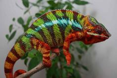
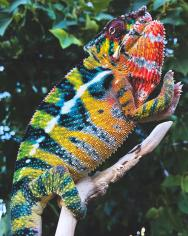
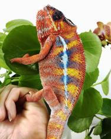

+++
title = "Mami"
date = "2022-05-11"
tags = ["mami", "papafee", "lokana", "kromatisk"]
categories = ["ambilobe-dams"]
banner = "img/ambilobe/mami/mami2"
+++



Mami is one of our 5th generation HB females from Papafee x Lokana. She has more purples and pinks like her mother, Lokana, whereas her two sisters Vaosary and Bumble Bee remind me of their aunts, Papafee's sisters. Her first pairing is with our new WC Ambilobe, so we expect her to produce some absolutely amazing F1 YBBB Ambilobe for us!



Filial
: *F4-CG14*

Sire
: [Papafee]()

Dam
: [Lokana]()

---




  

    

      <h1>Ancestral Report for Mami (F4-CG14)</h1>
    

    <h3>Generation 1</h3>
    
    
1. <strong>Mami (F4-CG14). </strong>Mami was born on 2022-05-11 at iPardalis.  She is the daughter of Papafee (F3-CG12) and Lokana (F9-CG13). 

    <h3>Generation 2</h3>
    
    
2. <strong>Papafee (F3-CG12). </strong>Papafee was born on 2020-07-17 at iPardalis.  He is the son of Zanaka (F2-CG11) and Sunny (F3-CG4). He had a relationship with Lokana (F9-CG13). He also had a relationship with Coco (F3-CG13). 

    
Children of Coco (F3-CG13) and Papafee (F3-CG12)

    
i. Pepita (F4-CG14). Pepita was born on 2021-12-07 at iPardalis.  

    
    
3. <strong>Lokana (F9-CG13). </strong>Lokana was born on 2020-12-02 at Chromatic Chameleons.  She is the daughter of Kromatisk (F8-CG12) and Shirley (F9-CG12). 

    
More about Lokana (F9-CG13):

    
Adopted: 2021-03-15, iPardalis. 

    
Children of Lokana (F9-CG13) and Papafee (F3-CG12)

    
i. Bumble Bee (F4-CG14). Bumble Bee was born on 2022-01-11 at iPardalis.  

    
ii. Vaosary (F4-CG14). Vaosary was born on 2022-01-11 at iPardalis.  

    
iii. Papamavo (F4-CG14). Papamavo was born on 2022-03-01 at iPardalis.  

    
iv. Mami (F4-CG14) [1]. Mami was born on 2022-05-11 at iPardalis.  

    
Children of Lokana (F9-CG13) and Manjaka (F1-CG5)

    
i. Tsara (F2-CG14). Tsara was born on 2022-06-01 at iPardalis.  

    
ii. Tarehy (F2-CG14). Tarehy was born on 2022-05-31 at iPardalis.  

    <h3>Generation 3</h3>
    
    
4. <strong>Zanaka (F2-CG11). </strong>Zanaka was born on 2019-05-14 at Kammerflage Kreations.  He is the son of Manome-toky (Promise Keeper) F8-CG10 and Mitselatra (Stormy Weather) F1-CG10. He had a relationship with Sunny (F3-CG4). He also had a relationship with Unknown. He also had a relationship with Patch (F3-CG4). He also had a relationship with Lilly (F3-CG4). He also had a relationship with Daisy (F3-CG4). 

    
More about Zanaka (F2-CG11):

    
Adopted: iPardalis. 

    
    
5. <strong>Sunny (F3-CG4). </strong>Sunny was born on 2019-06-05 at iPardalis.  She is the daughter of Jude (F2-CG3) and Kako (F2). 

    
Children of Sunny (F3-CG4) and Zanaka (F2-CG11)

    
i. Papafee (F3-CG12) [2]. Papafee was born on 2020-07-17 at iPardalis.  

    
    
6. <strong>Kromatisk (F8-CG12). </strong>Kromatisk was born on 2018-08-26 at Chromatic Chameleons.  He is the son of JJ (F7-CG10) and Daisy (F8-CG11). He had a relationship with Jackie (F4). He also had a relationship with Shirley (F9-CG12). He also had a relationship with Xanthos' daughter. 

    
Children of Jackie (F4) and Kromatisk (F8-CG12)

    
i. Loko (F5-CG13). Loko was born on 2020-04-18 at Chromatic Chameleons.  

    
Children of Xanthos' daughter and Kromatisk (F8-CG12)

    
i. Kromatisk's daughter (F9-CG13). 

    
7. <strong>Shirley (F9-CG12). </strong>Shirley was produced by Kammerflage Kreations.  She is the daughter of Landy (Silk) F8-CG11 and Hamy (Sweetness) F8-CG11. 

    
More about Shirley (F9-CG12):

    
Adopted: Chromatic Chameleons. 

    
Children of Shirley (F9-CG12) and Kromatisk (F8-CG12)

    
i. Lokana (F9-CG13) [3]. Lokana was born on 2020-12-02 at Chromatic Chameleons.  

    <h3>Generation 4</h3>
    
    
8. <strong>Manome-toky (Promise Keeper) F8-CG10. </strong>Manome-toky (Promise Keeper) was produced by Kammerflage Kreations.  He is the son of Bararata-fatio (Bamboo Falcon) and Vony-reny (Yellow Mother). He had a relationship with Mitselatra (Stormy Weather) F1-CG10. 

    
9. <strong>Mitselatra (Stormy Weather) F1-CG10. </strong>She is the daughter of Fanitso (Herb) (WC) and Jaky-fiposohana. 

    
Children of Mitselatra (Stormy Weather) F1-CG10 and Manome-toky (Promise Keeper) F8-CG10

    
i. Zanaka (F2-CG11) [4]. Zanaka was born on 2019-05-14 at Kammerflage Kreations.  

    
ii. Jiona (June) (F2-CG11). Jiona (June) was produced by Kammerflage Kreations.  

    
    
10. <strong>Jude (F2-CG3). </strong>Jude was born on 2017-10-17 at iPardalis.  He is the son of Flash (F1) and Judy (F2). He had a relationship with Kako (F2). He also had a relationship with Alla (F8-CG11). 

    
Children of Alla (F8-CG11) and Jude (F2-CG3)

    
i. Blossom (F3-CG12). Blossom was born on 2019-07-09 at iPardalis.  

    
ii. Clyde (F3-CG12). Clyde was born on 2019-07-09 at iPardalis.  

    
iii. M11. M11 was born on 2019-11-20.  

    
iv. Alfred (F3-CG12). Alfred was born on 2019-10-20 at iPardalis.  

    
v. Jack (F3-CG12). Jack was born on 2019-10-20 at iPardalis.  

    
vi. Button (F3-CG12). Button was born on 2019-07-09 at iPardalis.  

    
vii. Bubbles (F3-CG12). Bubbles (F3-CG12) was born on 2019-07-09 at iPardalis.  

    
viii. Mondrian (F3-CG12). Mondrian was born on 2019-08-16 at iPardalis.  

    
ix. Toby (F3-CG12). Toby was born on 2019-07-09 at iPardalis.  

    
x. Tigravavy (F3-CG12). Tigravavy was born on 2019-12-12 at iPardalis.  

    
    
11. <strong>Kako (F2). </strong>Kako was born on 2017-11-21 at Panther Creek Chameleons.  She died on 2020-02-05 at iPardalis at the age of 2 years, 2 months.  She was the daughter of Sparkles (F1) and Leo's daughter. 

    
Children of Kako (F2) and Jude (F2-CG3)

    
i. Nugget (F3-CG4). Nugget was born on 2019-06-05 at iPardalis.  

    
ii. Patch (F3-CG4). Patch was born on 2019-06-05 at iPardalis.  

    
iii. Sunny (F3-CG4) [5]. Sunny was born on 2019-06-05 at iPardalis.  

    
iv. Zelda (F3-CG4). Zelda was born on 2019-06-05 at iPardalis.  

    
v. Tonka (F3-CG4). Tonka was born on 2019-06-05 at iPardalis.  

    
vi. Lilly (F3-CG4). Lilly was born on 2019-06-05 at iPardalis.  

    
vii. Daisy (F3-CG4). Daisy was born on 2019-06-05 at iPardalis.  

    
viii. Padi. Padi was born on 2019-06-05 at iPardalis.  

    
    
12. <strong>JJ (F7-CG10). </strong>JJ was produced by Kammerflage Kreations.  He is the son of Mavo-ra (Yellow Blood) and Tsara-andro (Good Day) (F6-CG9). He had a relationship with Blue Bird's daughter. He also had a relationship with Daisy (F8-CG11). 

    
Children of Blue Bird's daughter and JJ (F7-CG10)

    
i. Alla (F8-CG11). Alla was born on 2018-01-30 at Panther Creek Chameleons.  

    
13. <strong>Daisy (F8-CG11). </strong>She is the daughter of Seventeen and Dio's daughter (F7-CG10. 

    
Children of Daisy (F8-CG11) and JJ (F7-CG10)

    
i. Kromatisk (F8-CG12) [6]. Kromatisk was born on 2018-08-26 at Chromatic Chameleons.  

    
ii. JJ's daughter (F8-CG12). 

    
    
14. <strong>Landy (Silk) F8-CG11. </strong>Landy (Silk) F8-CG11 was born on 2018-02-20 at Kammerflage Kreations.  He is the son of Giga-vony (Old Yeller) and Au-sanga (Goldie Locks). He had a relationship with Hamy (Sweetness) F8-CG11. He also had a relationship with Batata (Sweet Potato). 

    
Children of Batata (Sweet Potato) and Landy (Silk) F8-CG11

    
i. Ingahy-Mahagaga (Mr. Wonderful). Ingahy-Mahagaga (Mr. Wonderful) was produced by Kammerflage Kreations.  

    
    
15. <strong>Hamy (Sweetness) F8-CG11. </strong>Hamy (Sweetness) was produced by Kammerflage Kreations.  She is the daughter of Fantara (Falling Star) (F7-CG10) and Mavo-loha (Blondie). 

    
Children of Hamy (Sweetness) F8-CG11 and Landy (Silk) F8-CG11

    
i. Itso-triombe (Green Giant) F9-CG12. Itso-triombe (Green Giant) was produced by Kammerflage Kreations.  

    
ii. Foxey (F9-CG12). Foxey was produced by Kammerflage Kreations.  

    
iii. Shirley (F9-CG12) [7]. Shirley was produced by Kammerflage Kreations.  

    
iv. Au-mirongatra (Gold Rush) (F9-CG12). Au-mirongatra (Gold Rush) was produced by Kammerflage Kreations.  

    <h3>Generation 5</h3>
    
    
16. <strong>Bararata-fatio (Bamboo Falcon). </strong>Bararata-fatio (Bamboo Falcon) was produced by Kammerflage Kreations.  He had a relationship with Vony-reny (Yellow Mother). 

    
17. <strong>Vony-reny (Yellow Mother). </strong>Vony-reny (Yellow Mother) was produced by Kammerflage Kreations.  She is the daughter of Mavo-ra (Yellow Blood). 

    
Children of Vony-reny (Yellow Mother) and Bararata-fatio (Bamboo Falcon)

    
i. Manome-toky (Promise Keeper) F8-CG10 [8]. Manome-toky (Promise Keeper) was produced by Kammerflage Kreations.  

    
    
18. <strong>Fanitso (Herb) (WC). </strong>He had a relationship with Jaky-fiposohana. He also had a relationship with Unknown. 

    
Children of Unknown and Fanitso (Herb) (WC)

    
i. Goavy (Guava) (F1). 

    
19. <strong>Jaky-fiposohana. </strong>Jaky-fiposohana was produced by Kammerflage Kreations.  She is the daughter of Miroborobo (Blaze) and Little Foot's daughter. 

    
Children of Jaky-fiposohana and Fanitso (Herb) (WC)

    
i. Mitselatra (Stormy Weather) F1-CG10 [9]. 

    
    
20. <strong>Flash (F1). </strong>Flash was born on 2015-01-10 at Chameleon's Paradise.  He died on 2018-06-14 at iPardalis at the age of 3 years, 5 months.  He was the son of Cowboy (CH) and King's daughter. He had a relationship with Judy (F2). 

    
    
21. <strong>Judy (F2). </strong>Judy was born on 2015-02-11 at Chameleon's Paradise.  She died on 2018-02-15 at iPardalis at the age of 3 years, 4 days.  She was the daughter of Candy Cane (F1) and Jake's daughter. 

    
Children of Judy (F2) and Flash (F1)

    
i. Jude (F2-CG3) [10]. Jude was born on 2017-10-17 at iPardalis.  

    
ii. Bane. Bane was born on 2017-10-17.  

    
iii. Nick. Nick was born on 2017-10-17 at iPardalis.  

    
iv. Giant3. Giant3 was born on 2017-10-17 at iPardalis.  

    
    
22. <strong>Sparkles (F1). </strong>Sparkles was produced by Bobby Ruddock.  He was the son of Loki and Unknown - WC. He had a relationship with Leo's daughter. He also had a relationship with Sasha. 

    
Children of Sasha and Sparkles (F1)

    
i. Perregrin (aka Pyro)(F2). Perregrin (aka Pyro)(F2) was produced by Bobby Ruddock.  

    
23. <strong>Leo's daughter. </strong>Leo's daughter was produced by The Panther Company.  She died on 2018-12-23 at Bobby Ruddock.  She was the daughter of Leo. 

    
Children of Leo's daughter and Sparkles (F1)

    
i. Kako (F2) [11]. Kako was born on 2017-11-21 at Panther Creek Chameleons.  She died on 2020-02-05 at iPardalis.  

    
ii. Amarillo (F2). Amarillo (F2) was produced by Bobby Ruddock.  

    
    
24. <strong>Mavo-ra (Yellow Blood). </strong>Mavo-ra (Yellow Blood) was produced by Kammerflage Kreations.  He is the son of Mabonika-haboka (Mellow Yellow). He had a relationship with Unknown. He also had a relationship with Tsara-andro (Good Day) (F6-CG9). 

    
Children of Unknown and Mavo-ra (Yellow Blood)

    
i. Vony-reny (Yellow Mother). Vony-reny (Yellow Mother) was produced by Kammerflage Kreations.  

    
    
25. <strong>Tsara-andro (Good Day) (F6-CG9). </strong>Tsara-andro (Good Day) was produced by Kammerflage Kreations.  She is the daughter of Kely-tongotra (Little Foot) (F5-CG8). 

    
Children of Tsara-andro (Good Day) (F6-CG9) and Mavo-ra (Yellow Blood)

    
i. Mavo-loha (Blondie). Mavo-loha (Blondie) was born on 2016-02-03 at Kammerflage Kreations.  

    
ii. Giga-vony (Old Yeller). Giga-vony (Old Yeller) was produced by Kammerflage Kreations.  

    
iii. JJ (F7-CG10) [12]. JJ was produced by Kammerflage Kreations.  

    
    
26. <strong>Seventeen. </strong>He is the son of Paradox. He had a relationship with Dio's daughter (F7-CG10. 

    
27. <strong>Dio's daughter (F7-CG10. </strong>She is the daughter of Dio (F6-CG9). 

    
Children of Dio's daughter (F7-CG10 and Seventeen

    
i. Daisy (F8-CG11) [13]. 

    
    
28. <strong>Giga-vony (Old Yeller). </strong>Giga-vony (Old Yeller) was produced by Kammerflage Kreations.  He is the son of Mavo-ra (Yellow Blood) and Tsara-andro (Good Day) (F6-CG9). He had a relationship with Au-sanga (Goldie Locks). He also had a relationship with Fanala-Andriana (Frost Queen). 

    
Children of Fanala-Andriana (Frost Queen) and Giga-vony (Old Yeller)

    
i. Sonny (F8-CG11). 

    
29. <strong>Au-sanga (Goldie Locks). </strong>She is the daughter of Faingana (Quick). 

    
Children of Au-sanga (Goldie Locks) and Giga-vony (Old Yeller)

    
i. Landy (Silk) F8-CG11 [14]. Landy (Silk) F8-CG11 was born on 2018-02-20 at Kammerflage Kreations.  

    
More about Au-sanga (Goldie Locks) and Giga-vony (Old Yeller):

    
Birth: 2018-02-20, Kammerflage Kreations. 

    
    
30. <strong>Fantara (Falling Star) (F7-CG10). </strong>Fantara (Falling Star) was produced by Kammerflage Kreations.  He is the son of Maizina-lanitra (Dark Sky). He had a relationship with Zazabodo-manga (Baby Blue). He also had a relationship with Mavo-loha (Blondie). He also had a relationship with Unknown. 

    
Children of Zazabodo-manga (Baby Blue) and Fantara (Falling Star) (F7-CG10)

    
i. Artemis (F8-CG11). 

    
Children of Unknown and Fantara (Falling Star) (F7-CG10)

    
i. Fantara's daughter (F8-CG11). 

    
    
31. <strong>Mavo-loha (Blondie). </strong>Mavo-loha (Blondie) was born on 2016-02-03 at Kammerflage Kreations.  She is the daughter of Mavo-ra (Yellow Blood) and Tsara-andro (Good Day) (F6-CG9). 

    
Children of Mavo-loha (Blondie) and Fantara (Falling Star) (F7-CG10)

    
i. Hamy (Sweetness) F8-CG11 [15]. Hamy (Sweetness) was produced by Kammerflage Kreations.  

    
ii. Ajax (F8-CG11). Ajax was produced by Kammerflage Kreations.  

    
iii. Roa-ony (Two Rivers) (F8-CG11). Roa-ony (Two Rivers) was produced by Kammerflage Kreations.  

    <h3>Generation 6</h3>
    
    
34. <strong>Mavo-ra (Yellow Blood). </strong> is the same person as [24].

    
    
38. <strong>Miroborobo (Blaze). </strong>Miroborobo (Blaze) was produced by Kammerflage Kreations.  He had a relationship with Little Foot's daughter. He also had a relationship with Haran-dranomasina (Coral). 

    
Children of Haran-dranomasina (Coral) and Miroborobo (Blaze)

    
i. Rambo. Rambo was produced by Kammerflage Kreations.  

    
39. <strong>Little Foot's daughter. </strong>Little Foot's daughter was produced by Kammerflage Kreations.  She is the daughter of Kely-tongotra (Little Foot) (F5-CG8). 

    
Children of Little Foot's daughter and Miroborobo (Blaze)

    
i. Jaky-fiposohana [19]. Jaky-fiposohana was produced by Kammerflage Kreations.  

    
    
40. <strong>Cowboy (CH). </strong>Cowboy was produced by Chameleon's Paradise.  He died on 2015-01-01 at Chameleon's Paradise.  He had a relationship with King's daughter. He also had a relationship with Unknown. He also had a relationship with Unknown. He also had a relationship with Unknown. 

    
Children of Unknown and Cowboy (CH)

    
i. Cowboy's daughter (F1). 

    
Children of Unknown and Cowboy (CH)

    
i. Cowboy's daughter (F1). Cowboy's daughter was produced by Chameleon's Paradise.  

    
Children of Unknown and Cowboy (CH)

    
i. Cowboy's daughter (F1). 

    
41. <strong>King's daughter. </strong>King's daughter was produced by Chameleon's Paradise.  She died with Chameleon's Paradise.  She was the daughter of King. 

    
Children of King's daughter and Cowboy (CH)

    
i. Flash (F1) [20]. Flash was born on 2015-01-10 at Chameleon's Paradise.  He died on 2018-06-14 at iPardalis.  

    
    
42. <strong>Candy Cane (F1). </strong>Candy Cane was produced by Chameleon's Paradise.  He had a relationship with Jake's daughter. He also had a relationship with Cowboy's daughter (F1). He also had a relationship with Unknown. He also had a relationship with Cowboy's daughter (F1). 

    
Children of Cowboy's daughter (F1) and Candy Cane (F1)

    
i. Macho (F2-CG2). 

    
Children of Unknown and Candy Cane (F1)

    
i. Candy Cane's Daughter (F2). 

    
Children of Cowboy's daughter (F1) and Candy Cane (F1)

    
i. Candy Cane's daughter (F2). 

    
43. <strong>Jake's daughter. </strong>Jake's daughter was produced by Chameleon's Paradise.  She is the daughter of Jake (F1). 

    
Children of Jake's daughter and Candy Cane (F1)

    
i. Judy (F2) [21]. Judy was born on 2015-02-11 at Chameleon's Paradise.  She died on 2018-02-15 at iPardalis.  

    
    
44. <strong>Loki. </strong>Loki was produced by The Panther Baron.  He is the son of Loza and Flaming River's daughter. He had a relationship with Unknown - WC. 

    
45. <strong>Unknown - WC. </strong>Unknown was produced by Bobby Ruddock.  

    
Children of Unknown - WC and Loki

    
i. Sparkles (F1) [22]. Sparkles was produced by Bobby Ruddock.  

    
    
46. <strong>Leo. </strong>Leo was produced by The Panther Company.  He had a relationship with Unknown. 

    
Children of Unknown and Leo

    
i. Leo's daughter [23]. Leo's daughter was produced by The Panther Company.  She died on 2018-12-23 at Bobby Ruddock.  

    
    
48. <strong>Mabonika-haboka (Mellow Yellow). </strong>Mabonika-haboka (Mellow Yellow) was produced by Kammerflage Kreations.  He is the son of Maso-vatomamy (Eye Candy). He had a relationship with Unknown. 

    
Children of Unknown and Mabonika-haboka (Mellow Yellow)

    
i. Mavo-ra (Yellow Blood) [24]. Mavo-ra (Yellow Blood) was produced by Kammerflage Kreations.  

    
    
50. <strong>Kely-tongotra (Little Foot) (F5-CG8). </strong>Kely-tongotra (Little Foot) was produced by Kammerflage Kreations.  He is the son of Hatsikana (Legend). He had a relationship with Unknown. He also had a relationship with Unknown. He also had a relationship with Unknown. He also had a relationship with Eye Candy's daughter. He also had a relationship with Unknown. He also had a relationship with Unknown. He also had a relationship with Unknown. 

    
Children of Unknown and Kely-tongotra (Little Foot) (F5-CG8)

    
i. Little Foot's daughter. Little Foot's daughter was produced by Kammerflage Kreations.  

    
Children of Unknown and Kely-tongotra (Little Foot) (F5-CG8)

    
i. Faingana (Quick). Faingana (Quick) was produced by Kammerflage Kreations.  

    
Children of Unknown and Kely-tongotra (Little Foot) (F5-CG8)

    
i. Little Foot's daughter. Little Foot's daughter was produced by Kammerflage Kreations.  

    
Children of Unknown and Kely-tongotra (Little Foot) (F5-CG8)

    
i. Tsara-andro (Good Day) (F6-CG9) [25]. Tsara-andro (Good Day) was produced by Kammerflage Kreations.  

    
Children of Unknown and Kely-tongotra (Little Foot) (F5-CG8)

    
i. Maizina-lanitra (Dark Sky). Maizina-lanitra (Dark Sky) was produced by Kammerflage Kreations.  

    
Children of Unknown and Kely-tongotra (Little Foot) (F5-CG8)

    
i. Faingana (Quick). Faingana (Quick) was produced by Kammerflage Kreations.  

    
    
52. <strong>Paradox. </strong>Paradox was produced by Tree Candy Chameleons.  He had a relationship with Unknown. 

    
Children of Unknown and Paradox

    
i. Seventeen [26]. 

    
    
54. <strong>Dio (F6-CG9). </strong>He is the son of Kely-tongotra (Little Foot) (F5-CG8) and Eye Candy's daughter. He had a relationship with Zeratul's daughter. He also had a relationship with Unknown. He also had a relationship with Aphrodite. He also had a relationship with Unknown. 

    
Children of Zeratul's daughter and Dio (F6-CG9)

    
i. Stryfe (F7-CG10). Stryfe was produced by Joshua Illencik.  

    
Children of Unknown and Dio (F6-CG9)

    
i. Dio's daughter (F7-CG10 [27]. 

    
Children of Aphrodite and Dio (F6-CG9)

    
i. Dio's daughter (F7-CG10). 

    
Children of Unknown and Dio (F6-CG9)

    
i. Dio's Daughter (F7-CG10). 

    
    
56. <strong>Mavo-ra (Yellow Blood). </strong> is the same person as [24].

    
    
57. <strong>Tsara-andro (Good Day) (F6-CG9). </strong> is the same person as [25].

    
    
58. <strong>Faingana (Quick). </strong>Faingana (Quick) was produced by Kammerflage Kreations.  He is the son of Kely-tongotra (Little Foot) (F5-CG8). He had a relationship with Unknown. 

    
Children of Unknown and Faingana (Quick)

    
i. Au-sanga (Goldie Locks) [29]. 

    
    
60. <strong>Maizina-lanitra (Dark Sky). </strong>Maizina-lanitra (Dark Sky) was produced by Kammerflage Kreations.  He is the son of Kely-tongotra (Little Foot) (F5-CG8). He had a relationship with Unknown. He also had a relationship with Unknown. 

    
Children of Unknown and Maizina-lanitra (Dark Sky)

    
i. Fantara (Falling Star) (F7-CG10) [30]. Fantara (Falling Star) was produced by Kammerflage Kreations.  

    
Children of Unknown and Maizina-lanitra (Dark Sky)

    
i. Bolitika-zandry (Little Sister). Bolitika-zandry (Little Sister) was produced by Kammerflage Kreations.  

    
    
62. <strong>Mavo-ra (Yellow Blood). </strong> is the same person as [24].

    
    
63. <strong>Tsara-andro (Good Day) (F6-CG9). </strong> is the same person as [25].

    <h3>Generation 7</h3>
    
    
68. <strong>Mabonika-haboka (Mellow Yellow). </strong> is the same person as [48].

    
    
78. <strong>Kely-tongotra (Little Foot) (F5-CG8). </strong> is the same person as [50].

    
    
82. <strong>King. </strong>He had a relationship with Unknown. 

    
Children of Unknown and King

    
i. King's daughter [41]. King's daughter was produced by Chameleon's Paradise.  She died with Chameleon's Paradise.  

    
    
86. <strong>Jake (F1). </strong>Jake was produced by Chameleon's Paradise.  He had a relationship with Unknown. 

    
Children of Unknown and Jake (F1)

    
i. Jake's daughter [43]. Jake's daughter was produced by Chameleon's Paradise.  

    
    
88. <strong>Loza. </strong>Loza was produced by Kammerflage Kreations.  He had a relationship with Flaming River's daughter. 

    
89. <strong>Flaming River's daughter. </strong>Flaming River's daughter was produced by Kammerflage Kreations.  She is the daughter of Flaming River. 

    
Children of Flaming River's daughter and Loza

    
i. Loki [44]. Loki was produced by The Panther Baron.  

    
    
96. <strong>Maso-vatomamy (Eye Candy). </strong>Maso-vatomamy (Eye Candy) was produced by Kammerflage Kreations.  He had a relationship with Unknown. He also had a relationship with Unknown. 

    
Children of Unknown and Maso-vatomamy (Eye Candy)

    
i. Eye Candy's daughter. Eye Candy's daughter was produced by Kammerflage Kreations.  

    
Children of Unknown and Maso-vatomamy (Eye Candy)

    
i. Mabonika-haboka (Mellow Yellow) [48]. Mabonika-haboka (Mellow Yellow) was produced by Kammerflage Kreations.  

    
    
100. <strong>Hatsikana (Legend). </strong>Hatsikana (Legend) was produced by Kammerflage Kreations.  He had a relationship with Unknown. 

    
Children of Unknown and Hatsikana (Legend)

    
i. Kely-tongotra (Little Foot) (F5-CG8) [50]. Kely-tongotra (Little Foot) was produced by Kammerflage Kreations.  

    
    
108. <strong>Kely-tongotra (Little Foot) (F5-CG8). </strong> is the same person as [50].

    
109. <strong>Eye Candy's daughter. </strong>Eye Candy's daughter was produced by Kammerflage Kreations.  She is the daughter of Maso-vatomamy (Eye Candy). 

    
Children of Eye Candy's daughter and Kely-tongotra (Little Foot) (F5-CG8)

    
i. Dio (F6-CG9) [54]. 

    
    
112. <strong>Mabonika-haboka (Mellow Yellow). </strong> is the same person as [48].

    
    
114. <strong>Kely-tongotra (Little Foot) (F5-CG8). </strong> is the same person as [50].

    
    
116. <strong>Kely-tongotra (Little Foot) (F5-CG8). </strong> is the same person as [50].

    
    
120. <strong>Kely-tongotra (Little Foot) (F5-CG8). </strong> is the same person as [50].

    
    
124. <strong>Mabonika-haboka (Mellow Yellow). </strong> is the same person as [48].

    
    
126. <strong>Kely-tongotra (Little Foot) (F5-CG8). </strong> is the same person as [50].

    <h3>Generation 8</h3>
    
    
136. <strong>Maso-vatomamy (Eye Candy). </strong> is the same person as [96].

    
    
156. <strong>Hatsikana (Legend). </strong> is the same person as [100].

    
    
178. <strong>Flaming River. </strong>Flaming River was produced by Kammerflage Kreations.  He had a relationship with Unknown. 

    
Children of Unknown and Flaming River

    
i. Flaming River's daughter [89]. Flaming River's daughter was produced by Kammerflage Kreations.  

    
    
216. <strong>Hatsikana (Legend). </strong> is the same person as [100].

    
    
218. <strong>Maso-vatomamy (Eye Candy). </strong> is the same person as [96].

    
    
224. <strong>Maso-vatomamy (Eye Candy). </strong> is the same person as [96].

    
    
228. <strong>Hatsikana (Legend). </strong> is the same person as [100].

    
    
232. <strong>Hatsikana (Legend). </strong> is the same person as [100].

    
    
240. <strong>Hatsikana (Legend). </strong> is the same person as [100].

    
    
248. <strong>Maso-vatomamy (Eye Candy). </strong> is the same person as [96].

    
    
252. <strong>Hatsikana (Legend). </strong> is the same person as [100].

  



