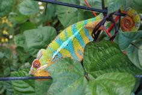
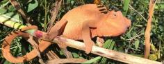
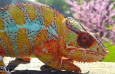

+++
title = "Manga"
date = "2020-10-28"
tags = ["manga", "bleu", "jude", "sparkles"]
categories = ["retired-pardalis"]
banner = "img/ambilobe/manga/manga"
+++



Manga had some of the nicest yellows from all of Bleu and Patch's sons. He has a striking facial pattern and is a classic Ambilobe panther chameleon. We're very lucky to have him in our 4th generation breeding program.



Filial
: F4-CG4

Sire
: [Bleu]()

Dam
: [Patch]()

---





    

      <h1>Ancestral Report for Manga</h1>
    

    <h3>Generation 1</h3>
    
    
1. <strong>Manga. </strong>Manga was born on 2020-10-28 at iPardalis.  He is the son of Bleu (F3) and Patch (F3). 

    <h3>Generation 2</h3>
    
    
2. <strong>Bleu (F3). </strong>Bleu was born on 2019-07-15 at Brightside Chameleons.  He is the son of Stryfe and Emma Frost (F2). He had a relationship with Patch (F3). 

    
More about Bleu (F3):

    
Adopted: 2019-12-15, iPardalis.  

    
    
3. <strong>Patch (F3). </strong>Patch (F3) was born on 2019-06-05 at iPardalis.  She is the daughter of Jude (F2) and Kako (F2). 

    
Children of Patch (F3) and Bleu (F3)

    
i. Manga [1]. Manga was born on 2020-10-28 at iPardalis.  

    <h3>Generation 3</h3>
    
    
4. <strong>Stryfe. </strong>Stryfe was produced by Joshua Illencik.  He was the son of Dio and Zeratul's daughter. He had a relationship with Emma Frost (F2). He also had a relationship with Higgin's daughter. 

    
More about Stryfe:

    
Adopted: Brightside Chameleons.  

    
Children of Higgin's daughter and Stryfe

    
i. Stryfe's daughter. 

    
5. <strong>Emma Frost (F2). </strong>Emma Frost was produced by Chromatic Chameleons.  She died with Brightside Chameleons.  She was the daughter of Felipe Sanchez (F1) and Snapjacks. 

    
Children of Emma Frost (F2) and Stryfe

    
i. Bleu (F3) [2]. Bleu was born on 2019-07-15 at Brightside Chameleons.  

    
    
6. <strong>Jude (F2). </strong>Jude was born on 2017-10-17 at iPardalis.  He is the son of Flash (F1) and Judy (F2). He had a relationship with Kako (F2). He also had a relationship with Alla. 

    
Children of Alla and Jude (F2)

    
i. Blossom (F3). Blossom was born on 2019-07-09 at iPardalis.  

    
ii. Clyde. Clyde was born on 2019-07-09 at iPardalis.  

    
iii. M11. M11 was born on 2019-11-20.  

    
iv. Alfred (F3). Alfred (F3) was born on 2019-10-20 at iPardalis.  

    
v. Jack (F3). Jack (F3) was born on 2019-10-20 at iPardalis.  

    
vi. Button (F3). She was born on 2019-07-09 at iPardalis.  

    
vii. Bubbles (F3). Bubbles (F3) was born on 2019-07-09 at iPardalis.  

    
viii. Mondrian. Mondrian was born on 2019-08-16 at iPardalis.  

    
ix. Toby. Toby was born on 2019-07-09 at iPardalis.  

    
    
7. <strong>Kako (F2). </strong>Kako was born on 2017-11-21 at Panther Creek Chameleons.  She died on 2020-02-05 at iPardalis at the age of 2 years, 2 months.  She was the daughter of Sparkles (F1) and Leo's daughter. 

    
Children of Kako (F2) and Jude (F2)

    
i. Nugget (F3). Nugget was born on 2019-06-05 at iPardalis.  

    
ii. Patch (F3) [3]. Patch (F3) was born on 2019-06-05 at iPardalis.  

    
iii. Sunny (F3). Sunny (F3) was born on 2019-06-05 at iPardalis.  

    
iv. Zelda. Zelda was born on 2019-06-05 at iPardalis.  

    
v. Tonka. Tonka was born on 2019-06-05 at iPardalis.  

    
vi. Lilly (F3). Lilly (F3) was born on 2019-06-05 at iPardalis.  

    
vii. Daisy (F3). Daisy (F3) was born on 2019-06-05 at iPardalis.  

    
viii. Padi. Padi was born on 2019-06-05 at iPardalis.  

    <h3>Generation 4</h3>
    
    
8. <strong>Dio. </strong>He died with Joshua Illencik.  He was the son of Kely-tongotra (Little Foot) and Eye Candy's daughter. He had a relationship with Zeratul's daughter. He also had a relationship with Unknown. 

    
Children of Unknown and Dio

    
i. Dio's daughter. 

    
9. <strong>Zeratul's daughter. </strong>She was the daughter of Zeratul and Noki's daughter. 

    
Children of Zeratul's daughter and Dio

    
i. Stryfe [4]. Stryfe was produced by Joshua Illencik.  

    
    
10. <strong>Felipe Sanchez (F1). </strong>He is the son of Bolt (WC) and Cowboy's daughter (F1). He had a relationship with Snapjacks. 

    
11. <strong>Snapjacks. </strong>She is the daughter of Macho (F2) and 24k's daughter. 

    
Children of Snapjacks and Felipe Sanchez (F1)

    
i. Emma Frost (F2) [5]. Emma Frost was produced by Chromatic Chameleons.  She died with Brightside Chameleons.  

    
ii. Felipe Sanchez's daughter (F3). 

    
iii. Felipe Sanchez's daughter. Felipe Sanchez's daughter was produced by Chromatic Chameleons.  

    
    
12. <strong>Flash (F1). </strong>Flash was born on 2015-01-10 at Chameleon's Paradise.  He died on 2018-06-14 at iPardalis at the age of 3 years, 5 months.  He was the son of Cowboy (CH) and King's daughter. He had a relationship with Judy (F2). 

    
    
13. <strong>Judy (F2). </strong>Judy was born on 2015-02-11 at Chameleon's Paradise.  She died on 2018-02-15 at iPardalis at the age of 3 years, 4 days.  She was the daughter of Candy Cane (F1) and Jake's daughter. 

    
Children of Judy (F2) and Flash (F1)

    
i. Jude (F2) [6]. Jude was born on 2017-10-17 at iPardalis.  

    
ii. Bane. Bane was born on 2017-10-17.  

    
iii. Nick. Nick was born on 2017-10-17 at iPardalis.  

    
iv. Giant3. Giant3 was born on 2017-10-17 at iPardalis.  

    
    
14. <strong>Sparkles (F1). </strong>Sparkles was produced by Bobby Ruddock.  He was the son of Loki and Unknown - WC. He had a relationship with Leo's daughter. 

    
15. <strong>Leo's daughter. </strong>Leo's daughter was produced by The Panther Company.  She died on 2018-12-23 at Bobby Ruddock.  She was the daughter of Leo. 

    
Children of Leo's daughter and Sparkles (F1)

    
i. Kako (F2) [7]. Kako was born on 2017-11-21 at Panther Creek Chameleons.  She died on 2020-02-05 at iPardalis.  

    
ii. Amarillo (F2). Amarillo (F2) was produced by Bobby Ruddock.  

    <h3>Generation 5</h3>
    
    
16. <strong>Kely-tongotra (Little Foot). </strong>Kely-tongotra (Little Foot) was produced by Kammerflage Kreations.  He died with Kammerflage Kreations.  He was the son of Hatsikana (Legend). He had a relationship with Unknown. He also had a relationship with Unknown. He also had a relationship with Unknown. He also had a relationship with Eye Candy's daughter. 

    
Children of Unknown and Kely-tongotra (Little Foot)

    
i. Little Foot's daughter. Little Foot's daughter was produced by Kammerflage Kreations.  She died with Kammerflage Kreations.  

    
Children of Unknown and Kely-tongotra (Little Foot)

    
i. Faingana (Quick). Faingana (Quick) was produced by Kammerflage Kreations.  He died with Kammerflage Kreations.  

    
Children of Unknown and Kely-tongotra (Little Foot)

    
i. Little Foot's daughter. Little Foot's daughter was produced by Kammerflage Kreations.  She died with Kammerflage Kreations.  

    
17. <strong>Eye Candy's daughter. </strong>Eye Candy's daughter was produced by Kammerflage Kreations.  She died with Kammerflage Kreations.  She was the daughter of Maso-vatomamy (Eye Candy). 

    
Children of Eye Candy's daughter and Kely-tongotra (Little Foot)

    
i. Dio [8]. He died with Joshua Illencik.  

    
    
18. <strong>Zeratul. </strong>He died with Joshua Illencik.  He had a relationship with Noki's daughter. 

    
19. <strong>Noki's daughter. </strong>She was the daughter of Noki. 

    
Children of Noki's daughter and Zeratul

    
i. Zeratul's daughter [9]. 

    
    
20. <strong>Bolt (WC). </strong>Bolt was produced by Canvas Chameleons.  He died with Canvas Chameleons.  He had a relationship with Cowboy's daughter (F1). 

    
21. <strong>Cowboy's daughter (F1). </strong>Cowboy's daughter was produced by Chameleon's Paradise.  She died with Canvas Chameleons.  She was the daughter of Cowboy (CH). 

    
Children of Cowboy's daughter (F1) and Bolt (WC)

    
i. Felipe Sanchez (F1) [10]. 

    
    
22. <strong>Macho (F2). </strong>He is the son of Candy Cane (F1) and Cowboy's daughter (F1). He had a relationship with 24k's daughter. 

    
23. <strong>24k's daughter. </strong>24k's daughter was produced by Chameleon's Paradise.  She is the daughter of 24k. 

    
Children of 24k's daughter and Macho (F2)

    
i. Wetdream. 

    
ii. Snapjacks [11]. 

    
    
24. <strong>Cowboy (CH). </strong>Cowboy was produced by Chameleon's Paradise.  He died on 2015-01-01 at Chameleon's Paradise.  He had a relationship with King's daughter. He also had a relationship with Unknown. He also had a relationship with Unknown. 

    
More about Cowboy (CH):

    
Description: CH - Ambilobe

    
Children of Unknown and Cowboy (CH)

    
i. Cowboy's daughter (F1). 

    
Children of Unknown and Cowboy (CH)

    
i. Cowboy's daughter (F1). Cowboy's daughter was produced by Chameleon's Paradise.  She died with Canvas Chameleons.  

    
25. <strong>King's daughter. </strong>King's daughter was produced by Chameleon's Paradise.  She died with Chameleon's Paradise.  She was the daughter of King. 

    
Children of King's daughter and Cowboy (CH)

    
i. Flash (F1) [12]. Flash was born on 2015-01-10 at Chameleon's Paradise.  He died on 2018-06-14 at iPardalis.  

    
    
26. <strong>Candy Cane (F1). </strong>Candy Cane was produced by Chameleon's Paradise.  He died with Chameleon's Paradise.  He had a relationship with Jake's daughter. He also had a relationship with Cowboy's daughter (F1). 

    
27. <strong>Jake's daughter. </strong>Jake's daughter was produced by Chameleon's Paradise.  She died with Chameleon's Paradise.  She was the daughter of Jake (F1). 

    
Children of Jake's daughter and Candy Cane (F1)

    
i. Judy (F2) [13]. Judy was born on 2015-02-11 at Chameleon's Paradise.  She died on 2018-02-15 at iPardalis.  

    
    
28. <strong>Loki. </strong>Loki was produced by The Panther Baron.  He died with Bobby Ruddock.  He was the son of Loza and Flaming River's daughter. He had a relationship with Unknown - WC. 

    
29. <strong>Unknown - WC. </strong>Unknown was produced by Bobby Ruddock.  

    
Children of Unknown - WC and Loki

    
i. Sparkles (F1) [14]. Sparkles was produced by Bobby Ruddock.  

    
    
30. <strong>Leo. </strong>Leo was produced by The Panther Company.  He died with The Panther Company.  He had a relationship with Unknown. 

    
Children of Unknown and Leo

    
i. Leo's daughter [15]. Leo's daughter was produced by The Panther Company.  She died on 2018-12-23 at Bobby Ruddock.  

    <h3>Generation 6</h3>
    
    
32. <strong>Hatsikana (Legend). </strong>Hatsikana (Legend) was produced by Kammerflage Kreations.  He died with Kammerflage Kreations.  He had a relationship with Unknown. 

    
Children of Unknown and Hatsikana (Legend)

    
i. Kely-tongotra (Little Foot) [16]. Kely-tongotra (Little Foot) was produced by Kammerflage Kreations.  He died with Kammerflage Kreations.  

    
    
34. <strong>Maso-vatomamy (Eye Candy). </strong>Maso-vatomamy (Eye Candy) was produced by Kammerflage Kreations.  He died with Kammerflage Kreations.  He had a relationship with Unknown. He also had a relationship with Unknown. 

    
Children of Unknown and Maso-vatomamy (Eye Candy)

    
i. Eye Candy's daughter [17]. Eye Candy's daughter was produced by Kammerflage Kreations.  She died with Kammerflage Kreations.  

    
Children of Unknown and Maso-vatomamy (Eye Candy)

    
i. Mabonika-haboka (Mellow Yellow). Mabonika-haboka (Mellow Yellow) was produced by Kammerflage Kreations.  He died with Kammerflage Kreations.  

    
    
38. <strong>Noki. </strong>He had a relationship with Unknown. 

    
Children of Unknown and Noki

    
i. Noki's daughter [19]. 

    
    
42. <strong>Cowboy (CH). </strong>Cowboy was produced by Chameleon's Paradise.  He died on 2015-01-01 at Chameleon's Paradise.  He had a relationship with King's daughter. He also had a relationship with Unknown. He also had a relationship with Unknown. 

    
More about Cowboy (CH):

    
Description: CH - Ambilobe

    
Children of Unknown and Cowboy (CH)

    
i. Cowboy's daughter (F1). 

    
Children of Unknown and Cowboy (CH)

    
i. Cowboy's daughter (F1) [21]. Cowboy's daughter was produced by Chameleon's Paradise.  She died with Canvas Chameleons.  

    
    
44. <strong>Candy Cane (F1). </strong>Candy Cane was produced by Chameleon's Paradise.  He died with Chameleon's Paradise.  He had a relationship with Jake's daughter. He also had a relationship with Cowboy's daughter (F1). 

    
45. <strong>Cowboy's daughter (F1). </strong>She was the daughter of Cowboy (CH). 

    
Children of Cowboy's daughter (F1) and Candy Cane (F1)

    
i. Macho (F2) [22]. 

    
    
46. <strong>24k. </strong>24k was produced by Chameleon's Paradise.  He had a relationship with Unknown. 

    
Children of Unknown and 24k

    
i. 24k's daughter [23]. 24k's daughter was produced by Chameleon's Paradise.  

    
    
50. <strong>King. </strong>He had a relationship with Unknown. 

    
Children of Unknown and King

    
i. King's daughter [25]. King's daughter was produced by Chameleon's Paradise.  She died with Chameleon's Paradise.  

    
    
54. <strong>Jake (F1). </strong>Jake was produced by Chameleon's Paradise.  He died with Chameleon's Paradise.  He had a relationship with Unknown. 

    
Children of Unknown and Jake (F1)

    
i. Jake's daughter [27]. Jake's daughter was produced by Chameleon's Paradise.  She died with Chameleon's Paradise.  

    
    
56. <strong>Loza. </strong>Loza was produced by Kammerflage Kreations.  He died with Kammerflage Kreations.  He had a relationship with Flaming River's daughter. 

    
57. <strong>Flaming River's daughter. </strong>Flaming River's daughter was produced by Kammerflage Kreations.  She died with Kammerflage Kreations.  She was the daughter of Flaming River. 

    
Children of Flaming River's daughter and Loza

    
i. Loki [28]. Loki was produced by The Panther Baron.  He died with Bobby Ruddock.  

    <h3>Generation 7</h3>
    
    
90. <strong>Cowboy (CH). </strong>Cowboy was produced by Chameleon's Paradise.  He died on 2015-01-01 at Chameleon's Paradise.  He had a relationship with King's daughter. He also had a relationship with Unknown. He also had a relationship with Unknown. 

    
More about Cowboy (CH):

    
Description: CH - Ambilobe

    
Children of Unknown and Cowboy (CH)

    
i. Cowboy's daughter (F1) [45]. 

    
Children of Unknown and Cowboy (CH)

    
i. Cowboy's daughter (F1). Cowboy's daughter was produced by Chameleon's Paradise.  She died with Canvas Chameleons.  

    
    
114. <strong>Flaming River. </strong>Flaming River was produced by Kammerflage Kreations.  He died with Kammerflage Kreations.  He had a relationship with Unknown. 

    
Children of Unknown and Flaming River

    
i. Flaming River's daughter [57]. Flaming River's daughter was produced by Kammerflage Kreations.  She died with Kammerflage Kreations.  

  



