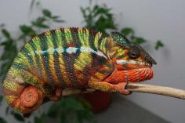
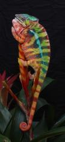
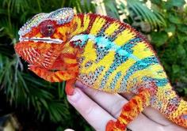

+++
title = "Manjaka"
date = "2020-12-01"
tags = ["manjaka", "arlo", "pyro", "sparkles"]
categories = ["ambilobe-sires"]
banner = "img/ambilobe/manjaka/manjaka2"
+++



Manjaka brings fresh genetics from a new WC sire, Arlo, who was acclimated by Chris Neeley at Colorado Chameleon. Arlo has a distinct look with red sprinkled on blue bars and a nice yellow body. Very cool Ambilobe import and one of the nicer ybbb with red highlights to come in the past few years. We are very lucky to have the opportunity to work with him!



Filial
: F1-CG5

Sire
: [Arlo (WC)]()

Dam
: [Perregrin/Pyro's Daughter]()

---




    

    

      <h1>Ancestral Report for Manjaka (F1-CG4)</h1>
    

    <h3>Generation 1</h3>
    
    
1. <strong>Manjaka (F1-CG4). </strong>Manjaka (F1-CG4) was born on 2020-12-01 at Colorado Chameleon.  He is the son of Arlo (WC) and Perregrin's daugher (F3). 

    
More about Manjaka (F1-CG4):

    
Adopted: 2021-03-07, iPardalis.  

    <h3>Generation 2</h3>
    
    
2. <strong>Arlo (WC). </strong>He had a relationship with Perregrin's daugher (F3). 

    
More about Arlo (WC):

    
Adopted: Colorado Chameleon.  

    
3. <strong>Perregrin's daugher (F3). </strong>Perregrin's daugher (F3) was produced by Modern Day Dragons.  She is the daughter of Perregrin (aka Pyro)(F2) and Miss Piggy (F3). 

    
More about Perregrin's daugher (F3):

    
Adopted: Colorado Chameleon.  

    
Children of Perregrin's daugher (F3) and Arlo (WC)

    
i. Manjaka (F1-CG4) [1]. Manjaka (F1-CG4) was born on 2020-12-01 at Colorado Chameleon.  

    <h3>Generation 3</h3>
    
    
6. <strong>Perregrin (aka Pyro)(F2). </strong>Perregrin (aka Pyro)(F2) was produced by Bobby Ruddock.  He is the son of Sparkles (F1) and Sasha. He had a relationship with Miss Piggy (F3). 

    
More about Perregrin (aka Pyro)(F2):

    
Adopted: Modern Day Dragons.  

    
Adopted: Brightside Chameleons.  

    
7. <strong>Miss Piggy (F3). </strong>Miss Piggy (F3) was produced by Jungle Panthers.  She is the daughter of Higgins and Candy Cane's Daughter (F2). 

    
More about Miss Piggy (F3):

    
Adopted: Modern Day Dragons.  

    
Children of Miss Piggy (F3) and Perregrin (aka Pyro)(F2)

    
i. Perregrin's daugher (F3) [3]. Perregrin's daugher (F3) was produced by Modern Day Dragons.  

    <h3>Generation 4</h3>
    
    
12. <strong>Sparkles (F1). </strong>Sparkles was produced by Bobby Ruddock.  He was the son of Loki and Unknown - WC. He had a relationship with Leo's daughter. He also had a relationship with Sasha. 

    
Children of Leo's daughter and Sparkles (F1)

    
i. Kako (F2). Kako was born on 2017-11-21 at Panther Creek Chameleons.  She died on 2020-02-05 at iPardalis.  

    
ii. Amarillo (F2). Amarillo (F2) was produced by Bobby Ruddock.  

    
13. <strong>Sasha. </strong>Sasha was produced by Canvas Chameleons.  She is the daughter of Sinister. 

    
More about Sasha:

    
Adopted: Bobby Ruddock.  

    
Children of Sasha and Sparkles (F1)

    
i. Perregrin (aka Pyro)(F2) [6]. Perregrin (aka Pyro)(F2) was produced by Bobby Ruddock.  

    
    
14. <strong>Higgins. </strong>He had a relationship with Unknown. He also had a relationship with Candy Cane's Daughter (F2). 

    
Children of Unknown and Higgins

    
i. Higgin's daughter. 

    
15. <strong>Candy Cane's Daughter (F2). </strong>She is the daughter of Candy Cane (F1). 

    
Children of Candy Cane's Daughter (F2) and Higgins

    
i. Miss Piggy (F3) [7]. Miss Piggy (F3) was produced by Jungle Panthers.  

    <h3>Generation 5</h3>
    
    
24. <strong>Loki. </strong>Loki was produced by The Panther Baron.  He died with Bobby Ruddock.  He was the son of Loza and Flaming River's daughter. He had a relationship with Unknown - WC. 

    
25. <strong>Unknown - WC. </strong>Unknown was produced by Bobby Ruddock.  

    
Children of Unknown - WC and Loki

    
i. Sparkles (F1) [12]. Sparkles was produced by Bobby Ruddock.  

    
    
26. <strong>Sinister. </strong>Sinister was produced by Canvas Chameleons.  He had a relationship with Unknown. 

    
Children of Unknown and Sinister

    
i. Sasha [13]. Sasha was produced by Canvas Chameleons.  

    
    
30. <strong>Candy Cane (F1). </strong>Candy Cane was produced by Chameleon's Paradise.  He died with Chameleon's Paradise.  He had a relationship with Jake's daughter. He also had a relationship with Cowboy's daughter (F1). He also had a relationship with Unknown. 

    
Children of Jake's daughter and Candy Cane (F1)

    
i. Judy (F2). Judy was born on 2015-02-11 at Chameleon's Paradise.  She died on 2018-02-15 at iPardalis.  

    
Children of Cowboy's daughter (F1) and Candy Cane (F1)

    
i. Macho (F2). 

    
Children of Unknown and Candy Cane (F1)

    
i. Candy Cane's Daughter (F2) [15]. 

    <h3>Generation 6</h3>
    
    
48. <strong>Loza. </strong>Loza was produced by Kammerflage Kreations.  He died with Kammerflage Kreations.  He had a relationship with Flaming River's daughter. 

    
49. <strong>Flaming River's daughter. </strong>Flaming River's daughter was produced by Kammerflage Kreations.  She died with Kammerflage Kreations.  She was the daughter of Flaming River. 

    
Children of Flaming River's daughter and Loza

    
i. Loki [24]. Loki was produced by The Panther Baron.  He died with Bobby Ruddock.  

    <h3>Generation 7</h3>
    
    
98. <strong>Flaming River. </strong>Flaming River was produced by Kammerflage Kreations.  He died with Kammerflage Kreations.  He had a relationship with Unknown. 

    
Children of Unknown and Flaming River

    
i. Flaming River's daughter [49]. Flaming River's daughter was produced by Kammerflage Kreations.  She died with Kammerflage Kreations.  

  



