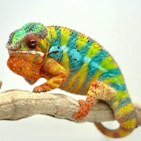

+++
title = "Mara"
date = "2021-07-13"
tags = ["mara", "sammy", "nova", "legion"]
categories = ["ambilobe-dams"]
banner = "img/ambilobe/mara/mara1"
+++



Mara is the beautiful sister of Maro. They are a pair of Ambilobe breeders we acquired from Chi-Town Chameleons from their Sammy x Nova (F1) pairing. It is looking like Maro is taking after Sammy, so it will be interesting to prove out Mara and see who her sons resemble.



Filial
: *F3*

Sire
: [Sammy]()

Dam
: [Storm]()

---




  

    

      <h1>Ancestral Report for Mara (F3)</h1>
    

    <h3>Generation 1</h3>
    
    
1. <strong>Mara (F3). </strong>Mara was born on 2021-07-13 at Chi-Town Chameleons.  She is the daughter of Sammy and Storm (F2). 

    
More about Mara (F3):

    
Adopted: 2021-10-15, iPardalis. 

    <h3>Generation 2</h3>
    
    
2. <strong>Sammy. </strong>He is the son of Tony. He had a relationship with Storm (F2). 

    
    
3. <strong>Storm (F2). </strong>She is the daughter of Nova (F1) and Natasha. 

    
Children of Storm (F2) and Sammy

    
i. Maro (F3). Maro was born on 2021-07-13 at Chi-Town Chameleons.  

    
ii. Mara (F3) [1]. Mara was born on 2021-07-13 at Chi-Town Chameleons.  

    <h3>Generation 3</h3>
    
    
4. <strong>Tony. </strong>He is the son of Rick. He had a relationship with Unknown. 

    
Children of Unknown and Tony

    
i. Sammy [2]. 

    
    
6. <strong>Nova (F1). </strong>Nova was produced by Brightside Chameleons.  He died on 2021-10-05.  He was the son of Legion (WC) and Magik. He had a relationship with Natasha. 

    
More about Nova (F1):

    
Adopted: Chi-Town Chameleons. 

    
    
7. <strong>Natasha. </strong>She was the daughter of Steve. 

    
Children of Natasha and Nova (F1)

    
i. Storm (F2) [3]. 

    <h3>Generation 4</h3>
    
    
8. <strong>Rick. </strong>He died on 2020-02-01 at Strohl's Herptiles.  He had a relationship with Unknown. 

    
Children of Unknown and Rick

    
i. Tony [4]. 

    
    
12. <strong>Legion (WC). </strong>He had a relationship with Magik. 

    
More about Legion (WC):

    
Adopted: Brightside Chameleons. 

    
13. <strong>Magik. </strong>She is the daughter of Marley. 

    
Children of Magik and Legion (WC)

    
i. Nova (F1) [6]. Nova was produced by Brightside Chameleons.  He died on 2021-10-05.  

    
    
14. <strong>Steve. </strong>He had a relationship with Unknown. 

    
Children of Unknown and Steve

    
i. Natasha [7]. 

    <h3>Generation 5</h3>
    
    
26. <strong>Marley. </strong>Marley was produced by Canvas Chameleons.  He had a relationship with Outline's daughter. He also had a relationship with Unknown. He also had a relationship with Unknown. 

    
Children of Outline's daughter and Marley

    
i. Marley's daughter. 

    
Children of Unknown and Marley

    
i. Test (F1). 

    
Children of Unknown and Marley

    
i. Magik [13]. 

  



