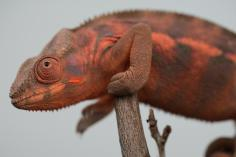

+++
title = "Maria"
header_title = "Maria | Ambanja Panther Chameleon"
date = "2024-05-29"
tags = ["maria", "alamo", "blue bonnet", "titan", "remi"]
categories = ["ambanja-dams"]
banner = "img/ambanja/maria/maria3"
+++



Maria is an absolutely gorgeous Ambanja Panther Chameleon produced by Ready's Rainforest, one of the few pure wild-type Ambanja breeders in the USA. We are honored to carry on their line. If you look at her tree, there are three different wild-caught sires paired against an older cb line from Linda Nickleson's Spunky x Princess Peach line. Very excited to add these to our Ambanja project and create some nice cb animals like this.



Filial
: *F1-CG6*

Sire
: [Alamo]()

Dam
: [Blue Bonnet]()

---




  

    

      <h1>Ancestral Report for Maria (F1-CG6)</h1>
    

    <h3>Generation 1</h3>
    
    
1. <strong>Maria (F1-CG6). </strong>Maria was born on 2024-05-29 at Ready's Rainforest.  She is the daughter of Alamo Ranger (WC) and Blue Bonnet (F1-CG5). 

    
More about Maria (F1-CG6):

    
Adopted: 2024-10-29, iPardalis. 

    <h3>Generation 2</h3>
    
    
2. <strong>Alamo Ranger (WC). </strong>He had a relationship with Blue Bonnet (F1-CG5). 

    
More about Alamo Ranger (WC):

    
Adopted: Ready's Rainforest. 

    
    
3. <strong>Blue Bonnet (F1-CG5). </strong>Blue Bonnet was produced by Brian Stewart.  She is the daughter of Titan (WC) and Remi's daughter (F1-CG4). 

    
More about Blue Bonnet (F1-CG5):

    
Adopted: Ready's Rainforest. 

    
Children of Blue Bonnet (F1-CG5) and Alamo Ranger (WC)

    
i. Bowie (F1-CG6). Bowie was born on 2024-05-29 at Ready's Rainforest.  

    
ii. Maria (F1-CG6) [1]. Maria was born on 2024-05-29 at Ready's Rainforest.  

    <h3>Generation 3</h3>
    
    
6. <strong>Titan (WC). </strong>He had a relationship with Remi's daughter (F1-CG4). 

    
7. <strong>Remi's daughter (F1-CG4). </strong>She is the daughter of Remi (WC) and Knubs (F2-CG3). 

    
Children of Remi's daughter (F1-CG4) and Titan (WC)

    
i. Blue Bonnet (F1-CG5) [3]. Blue Bonnet was produced by Brian Stewart.  

    <h3>Generation 4</h3>
    
    
14. <strong>Remi (WC). </strong>He had a relationship with Knubs (F2-CG3). 

    
More about Remi (WC):

    
Adopted: Busy B's Exotics. 

    
15. <strong>Knubs (F2-CG3). </strong>She is the daughter of Spunky (F1) and Princess Peach (F2). 

    
Children of Knubs (F2-CG3) and Remi (WC)

    
i. Remi's daughter (F1-CG4) [7]. 

    <h3>Generation 5</h3>
    
    
30. <strong>Spunky (F1). </strong>He is the son of Twister (WC) and MJ. He had a relationship with Princess Peach (F2). 

    
31. <strong>Princess Peach (F2). </strong>Princess Peach was produced by Wild Side Chameleons.  She is the daughter of Lincoln (F1) and Millie. 

    
More about Princess Peach (F2):

    
Adopted: Modern Day Dragons. 

    
Children of Princess Peach (F2) and Spunky (F1)

    
i. Knubs (F2-CG3) [15]. 

    <h3>Generation 6</h3>
    
    
60. <strong>Twister (WC). </strong>He had a relationship with MJ. 

    
More about Twister (WC):

    
Adopted: Chamalot Chameleons. 

    
61. <strong>MJ. </strong>MJ was produced by Heroic Chams.  She was the daughter of Spiderman. 

    
More about MJ:

    
Adopted: Chamalot Chameleons. 

    
Children of MJ and Twister (WC)

    
i. Spunky (F1) [30]. 

    
    
62. <strong>Lincoln (F1). </strong>Lincoln was produced by The Panther Company.  He was the son of Josie (WC). He had a relationship with Millie. 

    
More about Lincoln (F1):

    
Adopted: Wild Side Chameleons. 

    
63. <strong>Millie. </strong>Millie was produced by Heroic Chams.  She was the daughter of Ermac and Spiderman's daughter. 

    
More about Millie:

    
Adopted: Wild Side Chameleons. 

    
Children of Millie and Lincoln (F1)

    
i. Princess Peach (F2) [31]. Princess Peach was produced by Wild Side Chameleons.  

    <h3>Generation 7</h3>
    
    
122. <strong>Spiderman. </strong>He had a relationship with Unknown. 

    
More about Spiderman:

    
Adopted: Heroic Chams. 

    
Children of Unknown and Spiderman

    
i. MJ [61]. MJ was produced by Heroic Chams.  

    
    
124. <strong>Josie (WC). </strong>He had a relationship with Unknown. 

    
More about Josie (WC):

    
Adopted: The Panther Company. 

    
Children of Unknown and Josie (WC)

    
i. Lincoln (F1) [62]. Lincoln was produced by The Panther Company.  

    
126. <strong>Ermac. </strong>He had a relationship with Spiderman's daughter. 

    
127. <strong>Spiderman's daughter. </strong>

    
Children of Spiderman's daughter and Ermac

    
i. Millie [63]. Millie was produced by Heroic Chams.  

  



