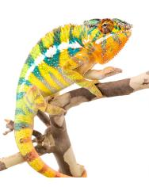

+++
title = "maro"
date = "2021-07-13"
tags = ["maro", "sammy", "nova", "legion"]
categories = ["ambilobe-sires"]
banner = "img/ambilobe/maro/maro"
+++



Maro (F3) is a great edition to our YBBB project. We have been tracking the WC Legion line ever since we saw Jeremy Booker acquire him years ago. This Sammy x Storm pairing finally carries those genetics with nice yellow bodies on both sides.



Filial
: *F3*

Sire
: [Sammy]()

Dam
: [Storm]()

---




  

    

      <h1>Ancestral Report for Maro (F3)</h1>
    

    <h3>Generation 1</h3>
    
    
1. <strong>Maro (F3). </strong>Maro was born on 2021-07-13 at Chi-Town Chameleons.  He is the son of Sammy and Storm (F2). 

    
More about Maro (F3):

    
Adopted: 2021-12-15, iPardalis.  

    <h3>Generation 2</h3>
    
    
2. <strong>Sammy. </strong>He is the son of Tony. He had a relationship with Storm (F2). 

    
    
3. <strong>Storm (F2). </strong>Storm was produced by Chi-Town Chameleons.  She is the daughter of Nova (F1) and Natasha. 

    
Children of Storm (F2) and Sammy

    
i. Maro (F3) [1]. Maro was born on 2021-07-13 at Chi-Town Chameleons.  

    <h3>Generation 3</h3>
    
    
4. <strong>Tony. </strong>Tony was produced by Strohl's Herptiles.  He is the son of Rick. He had a relationship with Unknown. 

    
More about Tony:

    
Adopted: Chi-Town Chameleons.  

    
Children of Unknown and Tony

    
i. Sammy [2]. 

    
    
6. <strong>Nova (F1). </strong>Nova was produced by Brightside Chameleons.  He is the son of Legion (WC) and Magik. He had a relationship with Natasha. 

    
More about Nova (F1):

    
Adopted: Chi-Town Chameleons.  

    
    
7. <strong>Natasha. </strong>Natasha was produced by Chi-Town Chameleons.  She is the daughter of Steve. 

    
Children of Natasha and Nova (F1)

    
i. Storm (F2) [3]. Storm was produced by Chi-Town Chameleons.  

    <h3>Generation 4</h3>
    
    
8. <strong>Rick. </strong>Rick was produced by Strohl's Herptiles.  He died on 2020-02-01 at Strohl's Herptiles.  He had a relationship with Unknown. 

    
Children of Unknown and Rick

    
i. Tony [4]. Tony was produced by Strohl's Herptiles.  

    
    
12. <strong>Legion (WC). </strong>He had a relationship with Magik. 

    
13. <strong>Magik. </strong>Magik was produced by Canvas Chameleons.  She is the daughter of Marley. 

    
More about Magik:

    
Adopted: Brightside Chameleons.  

    
Children of Magik and Legion (WC)

    
i. Nova (F1) [6]. Nova was produced by Brightside Chameleons.  

    
    
14. <strong>Steve. </strong>He had a relationship with Unknown. 

    
Children of Unknown and Steve

    
i. Natasha [7]. Natasha was produced by Chi-Town Chameleons.  

    <h3>Generation 5</h3>
    
    
26. <strong>Marley. </strong>Marley was produced by Canvas Chameleons.  He had a relationship with Outline's daughter. He also had a relationship with Unknown. He also had a relationship with Unknown. 

    
Children of Outline's daughter and Marley

    
i. Marley's daughter. 

    
Children of Unknown and Marley

    
i. Test (F1). 

    
Children of Unknown and Marley

    
i. Magik [13]. Magik was produced by Canvas Chameleons.  

  



