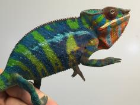
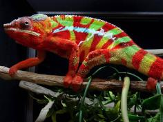

+++
title = "Mena"
date = "2022-07-27"
tags = ["zava", "arlo", "green giant", "pyro"]
categories = ["ambilobe-dams"]
banner = "img/ambilobe/mena/mena"
+++



Mena is our HB from Zava and F1 Manjaya. Zava had a significant amount of red and a few of Mena's brothers got it, too. Manjaya seems to have taken after her WC sire, Arlo. A few of Mena's brothers looked like mini Arlo's. So less of the Perregrin/Pyro side of the lineage, more of the WC Arlo combined with Zava is what she brings to the table.



Filial
: *F2-CG14*

Sire
: [Zava]()

Dam
: [Manjaya]()

---




  

    

      <h1>Ancestral Report for Mena (F2-CG14)</h1>
    

    <h3>Generation 1</h3>
    
    
1. <strong>Mena (F2-CG14). </strong>Mena was born on 2022-07-27 at iPardalis.  She is the daughter of Zava (F3-CG13) and Manjaya (F1-CG5). 

    <h3>Generation 2</h3>
    
    
2. <strong>Zava (F3-CG13). </strong>Zava was born on 2021-03-21 at Kammerflage Kreations.  He is the son of Itso-triombe (Green Giant) F9-CG12 and Jiona (June) (F2-CG11). He had a relationship with Manjaya (F1-CG5). 

    
More about Zava (F3-CG13):

    
Adopted: 2021-05-28, iPardalis. 

    
3. <strong>Manjaya (F1-CG5). </strong>Manjaya was born on 2020-12-01 at Colorado Chameleon.  She is the daughter of Arlo (WC) and Perregrin's daugher (F3-CG4). 

    
More about Manjaya (F1-CG5):

    
Adopted: iPardalis. 

    
Children of Manjaya (F1-CG5) and Zava (F3-CG13)

    
i. Mena (F2-CG14) [1]. Mena was born on 2022-07-27 at iPardalis.  

    <h3>Generation 3</h3>
    
    
4. <strong>Itso-triombe (Green Giant) F9-CG12. </strong>Itso-triombe (Green Giant) was produced by Kammerflage Kreations.  He is the son of Landy (Silk) F8-CG11 and Hamy (Sweetness) F8-CG11. He had a relationship with Jiona (June) (F2-CG11). 

    
5. <strong>Jiona (June) (F2-CG11). </strong>Jiona (June) was produced by Kammerflage Kreations.  She is the daughter of Manome-toky (Promise Keeper) F8-CG10 and Mitselatra (Stormy Weather) F1-CG10. 

    
Children of Jiona (June) (F2-CG11) and Itso-triombe (Green Giant) F9-CG12

    
i. Zava (F3-CG13) [2]. Zava was born on 2021-03-21 at Kammerflage Kreations.  

    
    
6. <strong>Arlo (WC). </strong>He had a relationship with Perregrin's daugher (F3-CG4). 

    
More about Arlo (WC):

    
Adopted: Colorado Chameleon. 

    
7. <strong>Perregrin's daugher (F3-CG4). </strong>Perregrin's daugher was produced by Modern Day Dragons.  She is the daughter of Perregrin (aka Pyro)(F2) and Miss Piggy (F3). 

    
More about Perregrin's daugher (F3-CG4):

    
Adopted: Colorado Chameleon. 

    
Children of Perregrin's daugher (F3-CG4) and Arlo (WC)

    
i. Manjaka (F1-CG5). Manjaka (F1-CG5) was born on 2020-12-01 at Colorado Chameleon.  

    
ii. Manjaya (F1-CG5) [3]. Manjaya was born on 2020-12-01 at Colorado Chameleon.  

    
iii. Manjalla (F1-CG5). Manjalla was born on 2020-12-05 at Colorado Chameleon.  

    
iv. Manjaia (F1-CG5). Manjaia was born on 2020-12-01 at Colorado Chameleon.  

    <h3>Generation 4</h3>
    
    
8. <strong>Landy (Silk) F8-CG11. </strong>Landy (Silk) F8-CG11 was born on 2018-02-20 at Kammerflage Kreations.  He is the son of Giga-vony (Old Yeller) and Au-sanga (Goldie Locks). He had a relationship with Hamy (Sweetness) F8-CG11. He also had a relationship with Batata (Sweet Potato). 

    
Children of Batata (Sweet Potato) and Landy (Silk) F8-CG11

    
i. Ingahy-Mahagaga (Mr. Wonderful). Ingahy-Mahagaga (Mr. Wonderful) was produced by Kammerflage Kreations.  

    
    
9. <strong>Hamy (Sweetness) F8-CG11. </strong>Hamy (Sweetness) was produced by Kammerflage Kreations.  She is the daughter of Fantara (Falling Star) (F7-CG10) and Mavo-loha (Blondie). 

    
Children of Hamy (Sweetness) F8-CG11 and Landy (Silk) F8-CG11

    
i. Itso-triombe (Green Giant) F9-CG12 [4]. Itso-triombe (Green Giant) was produced by Kammerflage Kreations.  

    
ii. Foxey (F9-CG12). Foxey was produced by Kammerflage Kreations.  

    
iii. Shirley (F9-CG12). Shirley was produced by Kammerflage Kreations.  

    
iv. Au-mirongatra (Gold Rush) (F9-CG12). Au-mirongatra (Gold Rush) was produced by Kammerflage Kreations.  

    
    
10. <strong>Manome-toky (Promise Keeper) F8-CG10. </strong>Manome-toky (Promise Keeper) was produced by Kammerflage Kreations.  He is the son of Bararata-fatio (Bamboo Falcon) and Vony-reny (Yellow Mother). He had a relationship with Mitselatra (Stormy Weather) F1-CG10. 

    
11. <strong>Mitselatra (Stormy Weather) F1-CG10. </strong>She is the daughter of Fanitso (Herb) (WC) and Jaky-fiposohana. 

    
Children of Mitselatra (Stormy Weather) F1-CG10 and Manome-toky (Promise Keeper) F8-CG10

    
i. Zanaka (F2-CG11). Zanaka was born on 2019-05-14 at Kammerflage Kreations.  

    
ii. Jiona (June) (F2-CG11) [5]. Jiona (June) was produced by Kammerflage Kreations.  

    
    
14. <strong>Perregrin (aka Pyro)(F2). </strong>Perregrin (aka Pyro)(F2) was produced by Bobby Ruddock.  He is the son of Sparkles (F1) and Sasha. He had a relationship with Miss Piggy (F3). 

    
More about Perregrin (aka Pyro)(F2):

    
Adopted: Modern Day Dragons. 

    
Adopted: Brightside Chameleons. 

    
15. <strong>Miss Piggy (F3). </strong>Miss Piggy (F3) was produced by Jungle Panthers.  She is the daughter of Higgins and Candy Cane's Daughter (F2). 

    
More about Miss Piggy (F3):

    
Adopted: Modern Day Dragons. 

    
Children of Miss Piggy (F3) and Perregrin (aka Pyro)(F2)

    
i. Perregrin's daugher (F3-CG4) [7]. Perregrin's daugher was produced by Modern Day Dragons.  

    
ii. Astoria. Astoria was produced by Modern Day Dragons.  

    
iii. PJ (F3-CG4). PJ was produced by Modern Day Dragons.  

    
iv. Sunshine (F3-CG4). Sunshine was produced by Modern Day Dragons.  

    
v. Perregrin (aka Pyro)'s daughter (F3-CG4). Perregrin (aka Pyro)'s daughter was produced by Modern Day Dragons.  

    <h3>Generation 5</h3>
    
    
16. <strong>Giga-vony (Old Yeller). </strong>Giga-vony (Old Yeller) was produced by Kammerflage Kreations.  He is the son of Mavo-ra (Yellow Blood) and Tsara-andro (Good Day) (F6-CG9). He had a relationship with Au-sanga (Goldie Locks). He also had a relationship with Fanala-Andriana (Frost Queen). 

    
Children of Fanala-Andriana (Frost Queen) and Giga-vony (Old Yeller)

    
i. Sonny (F8-CG11). 

    
17. <strong>Au-sanga (Goldie Locks). </strong>She is the daughter of Faingana (Quick). 

    
Children of Au-sanga (Goldie Locks) and Giga-vony (Old Yeller)

    
i. Landy (Silk) F8-CG11 [8]. Landy (Silk) F8-CG11 was born on 2018-02-20 at Kammerflage Kreations.  

    
More about Au-sanga (Goldie Locks) and Giga-vony (Old Yeller):

    
Birth: 2018-02-20, Kammerflage Kreations. 

    
    
18. <strong>Fantara (Falling Star) (F7-CG10). </strong>Fantara (Falling Star) was produced by Kammerflage Kreations.  He is the son of Maizina-lanitra (Dark Sky). He had a relationship with Zazabodo-manga (Baby Blue). He also had a relationship with Mavo-loha (Blondie). He also had a relationship with Unknown. 

    
Children of Zazabodo-manga (Baby Blue) and Fantara (Falling Star) (F7-CG10)

    
i. Artemis (F8-CG11). 

    
Children of Unknown and Fantara (Falling Star) (F7-CG10)

    
i. Fantara's daughter (F8-CG11). 

    
    
19. <strong>Mavo-loha (Blondie). </strong>Mavo-loha (Blondie) was born on 2016-02-03 at Kammerflage Kreations.  She is the daughter of Mavo-ra (Yellow Blood) and Tsara-andro (Good Day) (F6-CG9). 

    
Children of Mavo-loha (Blondie) and Fantara (Falling Star) (F7-CG10)

    
i. Hamy (Sweetness) F8-CG11 [9]. Hamy (Sweetness) was produced by Kammerflage Kreations.  

    
ii. Ajax (F8-CG11). Ajax was produced by Kammerflage Kreations.  

    
iii. Roa-ony (Two Rivers) (F8-CG11). Roa-ony (Two Rivers) was produced by Kammerflage Kreations.  

    
    
20. <strong>Bararata-fatio (Bamboo Falcon). </strong>Bararata-fatio (Bamboo Falcon) was produced by Kammerflage Kreations.  He had a relationship with Vony-reny (Yellow Mother). 

    
21. <strong>Vony-reny (Yellow Mother). </strong>Vony-reny (Yellow Mother) was produced by Kammerflage Kreations.  She is the daughter of Mavo-ra (Yellow Blood). 

    
Children of Vony-reny (Yellow Mother) and Bararata-fatio (Bamboo Falcon)

    
i. Manome-toky (Promise Keeper) F8-CG10 [10]. Manome-toky (Promise Keeper) was produced by Kammerflage Kreations.  

    
    
22. <strong>Fanitso (Herb) (WC). </strong>He had a relationship with Jaky-fiposohana. He also had a relationship with Unknown. 

    
Children of Unknown and Fanitso (Herb) (WC)

    
i. Goavy (Guava) (F1). 

    
23. <strong>Jaky-fiposohana. </strong>Jaky-fiposohana was produced by Kammerflage Kreations.  She is the daughter of Miroborobo (Blaze) and Little Foot's daughter. 

    
Children of Jaky-fiposohana and Fanitso (Herb) (WC)

    
i. Mitselatra (Stormy Weather) F1-CG10 [11]. 

    
    
28. <strong>Sparkles (F1). </strong>Sparkles was produced by Bobby Ruddock.  He was the son of Loki and Unknown - WC. He had a relationship with Leo's daughter. He also had a relationship with Sasha. 

    
Children of Leo's daughter and Sparkles (F1)

    
i. Kako (F2). Kako was born on 2017-11-21 at Panther Creek Chameleons.  She died on 2020-02-05 at iPardalis.  

    
ii. Amarillo (F2). Amarillo (F2) was produced by Bobby Ruddock.  

    
29. <strong>Sasha. </strong>Sasha was produced by Canvas Chameleons.  She is the daughter of Sinister. 

    
More about Sasha:

    
Adopted: Bobby Ruddock. 

    
Children of Sasha and Sparkles (F1)

    
i. Perregrin (aka Pyro)(F2) [14]. Perregrin (aka Pyro)(F2) was produced by Bobby Ruddock.  

    
    
30. <strong>Higgins. </strong>He had a relationship with Unknown. He also had a relationship with Candy Cane's Daughter (F2). 

    
Children of Unknown and Higgins

    
i. Higgin's daughter. 

    
31. <strong>Candy Cane's Daughter (F2). </strong>She is the daughter of Candy Cane (F1). 

    
Children of Candy Cane's Daughter (F2) and Higgins

    
i. Miss Piggy (F3) [15]. Miss Piggy (F3) was produced by Jungle Panthers.  

    <h3>Generation 6</h3>
    
    
32. <strong>Mavo-ra (Yellow Blood). </strong>Mavo-ra (Yellow Blood) was produced by Kammerflage Kreations.  He is the son of Mabonika-haboka (Mellow Yellow). He had a relationship with Unknown. He also had a relationship with Tsara-andro (Good Day) (F6-CG9). 

    
Children of Unknown and Mavo-ra (Yellow Blood)

    
i. Vony-reny (Yellow Mother) [21]. Vony-reny (Yellow Mother) was produced by Kammerflage Kreations.  

    
    
33. <strong>Tsara-andro (Good Day) (F6-CG9). </strong>Tsara-andro (Good Day) was produced by Kammerflage Kreations.  She is the daughter of Kely-tongotra (Little Foot) (F5-CG8). 

    
Children of Tsara-andro (Good Day) (F6-CG9) and Mavo-ra (Yellow Blood)

    
i. Mavo-loha (Blondie) [19]. Mavo-loha (Blondie) was born on 2016-02-03 at Kammerflage Kreations.  

    
ii. Giga-vony (Old Yeller) [16]. Giga-vony (Old Yeller) was produced by Kammerflage Kreations.  

    
iii. JJ (F7-CG10). JJ was produced by Kammerflage Kreations.  

    
    
34. <strong>Faingana (Quick). </strong>Faingana (Quick) was produced by Kammerflage Kreations.  He is the son of Kely-tongotra (Little Foot) (F5-CG8). He had a relationship with Unknown. 

    
Children of Unknown and Faingana (Quick)

    
i. Au-sanga (Goldie Locks) [17]. 

    
    
36. <strong>Maizina-lanitra (Dark Sky). </strong>Maizina-lanitra (Dark Sky) was produced by Kammerflage Kreations.  He is the son of Kely-tongotra (Little Foot) (F5-CG8). He had a relationship with Unknown. He also had a relationship with Unknown. 

    
Children of Unknown and Maizina-lanitra (Dark Sky)

    
i. Fantara (Falling Star) (F7-CG10) [18]. Fantara (Falling Star) was produced by Kammerflage Kreations.  

    
Children of Unknown and Maizina-lanitra (Dark Sky)

    
i. Bolitika-zandry (Little Sister). Bolitika-zandry (Little Sister) was produced by Kammerflage Kreations.  

    
    
38. <strong>Mavo-ra (Yellow Blood). </strong> is the same person as [32].

    
    
39. <strong>Tsara-andro (Good Day) (F6-CG9). </strong> is the same person as [33].

    
    
42. <strong>Mavo-ra (Yellow Blood). </strong> is the same person as [32].

    
    
46. <strong>Miroborobo (Blaze). </strong>Miroborobo (Blaze) was produced by Kammerflage Kreations.  He had a relationship with Little Foot's daughter. He also had a relationship with Haran-dranomasina (Coral). 

    
Children of Haran-dranomasina (Coral) and Miroborobo (Blaze)

    
i. Rambo. Rambo was produced by Kammerflage Kreations.  

    
47. <strong>Little Foot's daughter. </strong>Little Foot's daughter was produced by Kammerflage Kreations.  She is the daughter of Kely-tongotra (Little Foot) (F5-CG8). 

    
Children of Little Foot's daughter and Miroborobo (Blaze)

    
i. Jaky-fiposohana [23]. Jaky-fiposohana was produced by Kammerflage Kreations.  

    
    
56. <strong>Loki. </strong>Loki was produced by The Panther Baron.  He is the son of Loza and Flaming River's daughter. He had a relationship with Unknown - WC. 

    
57. <strong>Unknown - WC. </strong>Unknown was produced by Bobby Ruddock.  

    
Children of Unknown - WC and Loki

    
i. Sparkles (F1) [28]. Sparkles was produced by Bobby Ruddock.  

    
    
58. <strong>Sinister. </strong>Sinister was produced by Canvas Chameleons.  He had a relationship with Unknown. 

    
Children of Unknown and Sinister

    
i. Sasha [29]. Sasha was produced by Canvas Chameleons.  

    
    
62. <strong>Candy Cane (F1). </strong>Candy Cane was produced by Chameleon's Paradise.  He had a relationship with Jake's daughter. He also had a relationship with Cowboy's daughter (F1). He also had a relationship with Unknown. He also had a relationship with Cowboy's daughter (F1). 

    
Children of Jake's daughter and Candy Cane (F1)

    
i. Judy (F2). Judy was born on 2015-02-11 at Chameleon's Paradise.  She died on 2018-02-15 at iPardalis.  

    
Children of Cowboy's daughter (F1) and Candy Cane (F1)

    
i. Macho (F2-CG2). 

    
Children of Unknown and Candy Cane (F1)

    
i. Candy Cane's Daughter (F2) [31]. 

    
Children of Cowboy's daughter (F1) and Candy Cane (F1)

    
i. Candy Cane's daughter (F2). 

    <h3>Generation 7</h3>
    
    
64. <strong>Mabonika-haboka (Mellow Yellow). </strong>Mabonika-haboka (Mellow Yellow) was produced by Kammerflage Kreations.  He is the son of Maso-vatomamy (Eye Candy). He had a relationship with Unknown. 

    
Children of Unknown and Mabonika-haboka (Mellow Yellow)

    
i. Mavo-ra (Yellow Blood) [42]. Mavo-ra (Yellow Blood) was produced by Kammerflage Kreations.  

    
    
66. <strong>Kely-tongotra (Little Foot) (F5-CG8). </strong>Kely-tongotra (Little Foot) was produced by Kammerflage Kreations.  He is the son of Hatsikana (Legend). He had a relationship with Unknown. He also had a relationship with Unknown. He also had a relationship with Unknown. He also had a relationship with Eye Candy's daughter. He also had a relationship with Unknown. He also had a relationship with Unknown. He also had a relationship with Unknown. 

    
Children of Unknown and Kely-tongotra (Little Foot) (F5-CG8)

    
i. Little Foot's daughter [47]. Little Foot's daughter was produced by Kammerflage Kreations.  

    
Children of Unknown and Kely-tongotra (Little Foot) (F5-CG8)

    
i. Faingana (Quick). Faingana (Quick) was produced by Kammerflage Kreations.  

    
Children of Unknown and Kely-tongotra (Little Foot) (F5-CG8)

    
i. Little Foot's daughter. Little Foot's daughter was produced by Kammerflage Kreations.  

    
Children of Eye Candy's daughter and Kely-tongotra (Little Foot) (F5-CG8)

    
i. Dio (F6-CG9). 

    
Children of Unknown and Kely-tongotra (Little Foot) (F5-CG8)

    
i. Tsara-andro (Good Day) (F6-CG9) [39]. Tsara-andro (Good Day) was produced by Kammerflage Kreations.  

    
Children of Unknown and Kely-tongotra (Little Foot) (F5-CG8)

    
i. Maizina-lanitra (Dark Sky) [36]. Maizina-lanitra (Dark Sky) was produced by Kammerflage Kreations.  

    
Children of Unknown and Kely-tongotra (Little Foot) (F5-CG8)

    
i. Faingana (Quick) [34]. Faingana (Quick) was produced by Kammerflage Kreations.  

    
    
68. <strong>Kely-tongotra (Little Foot) (F5-CG8). </strong> is the same person as [66].

    
    
72. <strong>Kely-tongotra (Little Foot) (F5-CG8). </strong> is the same person as [66].

    
    
76. <strong>Mabonika-haboka (Mellow Yellow). </strong> is the same person as [64].

    
    
78. <strong>Kely-tongotra (Little Foot) (F5-CG8). </strong> is the same person as [66].

    
    
84. <strong>Mabonika-haboka (Mellow Yellow). </strong> is the same person as [64].

    
    
94. <strong>Kely-tongotra (Little Foot) (F5-CG8). </strong> is the same person as [66].

    
    
112. <strong>Loza. </strong>Loza was produced by Kammerflage Kreations.  He had a relationship with Flaming River's daughter. 

    
113. <strong>Flaming River's daughter. </strong>Flaming River's daughter was produced by Kammerflage Kreations.  She is the daughter of Flaming River. 

    
Children of Flaming River's daughter and Loza

    
i. Loki [56]. Loki was produced by The Panther Baron.  

    <h3>Generation 8</h3>
    
    
128. <strong>Maso-vatomamy (Eye Candy). </strong>Maso-vatomamy (Eye Candy) was produced by Kammerflage Kreations.  He had a relationship with Unknown. He also had a relationship with Unknown. 

    
Children of Unknown and Maso-vatomamy (Eye Candy)

    
i. Eye Candy's daughter. Eye Candy's daughter was produced by Kammerflage Kreations.  

    
Children of Unknown and Maso-vatomamy (Eye Candy)

    
i. Mabonika-haboka (Mellow Yellow) [84]. Mabonika-haboka (Mellow Yellow) was produced by Kammerflage Kreations.  

    
    
132. <strong>Hatsikana (Legend). </strong>Hatsikana (Legend) was produced by Kammerflage Kreations.  He had a relationship with Unknown. 

    
Children of Unknown and Hatsikana (Legend)

    
i. Kely-tongotra (Little Foot) (F5-CG8) [94]. Kely-tongotra (Little Foot) was produced by Kammerflage Kreations.  

    
    
136. <strong>Hatsikana (Legend). </strong> is the same person as [132].

    
    
144. <strong>Hatsikana (Legend). </strong> is the same person as [132].

    
    
152. <strong>Maso-vatomamy (Eye Candy). </strong> is the same person as [128].

    
    
156. <strong>Hatsikana (Legend). </strong> is the same person as [132].

    
    
168. <strong>Maso-vatomamy (Eye Candy). </strong> is the same person as [128].

    
    
188. <strong>Hatsikana (Legend). </strong> is the same person as [132].

    
    
226. <strong>Flaming River. </strong>Flaming River was produced by Kammerflage Kreations.  He had a relationship with Unknown. 

    
Children of Unknown and Flaming River

    
i. Flaming River's daughter [113]. Flaming River's daughter was produced by Kammerflage Kreations.  

  



