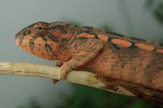
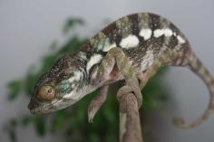

+++
title = "Noko"
date = "2021-06-03"
tags = ["noko", "nugget", "loko", "jude", "kromatisk"]
categories = ["ambilobe-dams"]
banner = "img/ambilobe/noko/noko"
+++



Noko is our HB female from Nugget and Loko. Her brother is Zandrin. She should throw some intense yellow and blue with some interesting red highlighting. Her personality is very calm and photogenic. It was incredibly easy to get some nice profile pictures of her!



Filial
: *F4-CG14*

Sire
: [Nugget]()

Dam
: [Loko]()

---




  

    

      <h1>Ancestral Report for Noko (F4-CG14)</h1>
    

    <h3>Generation 1</h3>
    
    
1. <strong>Noko (F4-CG14). </strong>Noko was born on 2021-06-03 at iPardalis.  She is the daughter of Nugget (F3-CG4) and Loko (F5-CG13). 

    <h3>Generation 2</h3>
    
    
2. <strong>Nugget (F3-CG4). </strong>Nugget was born on 2019-06-05 at iPardalis.  He is the son of Jude (F2-CG3) and Kako (F2). He had a relationship with Alla (F8-CG11). He also had a relationship with Bohana (CH). He also had a relationship with Amara (F3-CG12). He also had a relationship with Loko (F5-CG13). 

    
Children of Amara (F3-CG12) and Nugget (F3-CG4)

    
i. Tiger Lilly (F4-CG13). Tiger Lilly was born on 2021-06-01 at iPardalis.  

    
    
3. <strong>Loko (F5-CG13). </strong>Loko was born on 2020-04-18 at Chromatic Chameleons.  She is the daughter of Kromatisk (F8-CG12) and Jackie (F4). 

    
More about Loko (F5-CG13):

    
Adopted: 2020-07-18, iPardalis. 

    
Children of Loko (F5-CG13) and Nugget (F3-CG4)

    
i. Noko (F4-CG14) [1]. Noko was born on 2021-06-03 at iPardalis.  

    <h3>Generation 3</h3>
    
    
4. <strong>Jude (F2-CG3). </strong>Jude was born on 2017-10-17 at iPardalis.  He is the son of Flash (F1) and Judy (F2). He had a relationship with Kako (F2). He also had a relationship with Alla (F8-CG11). 

    
Children of Alla (F8-CG11) and Jude (F2-CG3)

    
i. Blossom (F3-CG12). Blossom was born on 2019-07-09 at iPardalis.  

    
ii. Clyde (F3-CG12). Clyde was born on 2019-07-09 at iPardalis.  

    
iii. M11. M11 was born on 2019-11-20.  

    
iv. Alfred (F3-CG12). Alfred was born on 2019-10-20 at iPardalis.  

    
v. Jack (F3-CG12). Jack was born on 2019-10-20 at iPardalis.  

    
vi. Button (F3-CG12). Button was born on 2019-07-09 at iPardalis.  

    
vii. Bubbles (F3). Bubbles (F3) was born on 2019-07-09 at iPardalis.  

    
viii. Mondrian (F3-CG12). Mondrian was born on 2019-08-16 at iPardalis.  

    
ix. Toby (F3-CG12). Toby was born on 2019-07-09 at iPardalis.  

    
x. Tigravavy (F3-CG12). Tigravavy was born on 2019-12-12 at iPardalis.  

    
    
5. <strong>Kako (F2). </strong>Kako was born on 2017-11-21 at Panther Creek Chameleons.  She died on 2020-02-05 at iPardalis at the age of 2 years, 2 months.  She was the daughter of Sparkles (F1) and Leo's daughter. 

    
Children of Kako (F2) and Jude (F2-CG3)

    
i. Nugget (F3-CG4) [2]. Nugget was born on 2019-06-05 at iPardalis.  

    
ii. Patch (F3-CG4). Patch was born on 2019-06-05 at iPardalis.  

    
iii. Sunny (F3-CG3). Sunny was born on 2019-06-05 at iPardalis.  

    
iv. Zelda (F3-CG4). Zelda was born on 2019-06-05 at iPardalis.  

    
v. Tonka (F3-CG4). Tonka was born on 2019-06-05 at iPardalis.  

    
vi. Lilly (F3-CG4). Lilly was born on 2019-06-05 at iPardalis.  

    
vii. Daisy (F3-CG4). Daisy was born on 2019-06-05 at iPardalis.  

    
viii. Padi. Padi was born on 2019-06-05 at iPardalis.  

    
    
6. <strong>Kromatisk (F8-CG12). </strong>Kromatisk was born on 2018-08-26 at Chromatic Chameleons.  He is the son of JJ (F7-CG10) and Daisy (F8-CG11). He had a relationship with Jackie (F4). He also had a relationship with Shirley (F9-CG12). 

    
Children of Shirley (F9-CG12) and Kromatisk (F8-CG12)

    
i. Lokana (F9-CG13). Lokana was born on 2020-12-02 at Chromatic Chameleons.  

    
7. <strong>Jackie (F4). </strong>Jackie was produced by Panther Creek Chameleons.  She is the daughter of Wetdream (F3) and Marley's daughter. 

    
More about Jackie (F4):

    
Adopted: Chromatic Chameleons. 

    
Children of Jackie (F4) and Kromatisk (F8-CG12)

    
i. Loko (F5-CG13) [3]. Loko was born on 2020-04-18 at Chromatic Chameleons.  

    <h3>Generation 4</h3>
    
    
8. <strong>Flash (F1). </strong>Flash was born on 2015-01-10 at Chameleon's Paradise.  He died on 2018-06-14 at iPardalis at the age of 3 years, 5 months.  He was the son of Cowboy (CH) and King's daughter. He had a relationship with Judy (F2). 

    
    
9. <strong>Judy (F2). </strong>Judy was born on 2015-02-11 at Chameleon's Paradise.  She died on 2018-02-15 at iPardalis at the age of 3 years, 4 days.  She was the daughter of Candy Cane (F1) and Jake's daughter. 

    
Children of Judy (F2) and Flash (F1)

    
i. Jude (F2-CG3) [4]. Jude was born on 2017-10-17 at iPardalis.  

    
ii. Bane. Bane was born on 2017-10-17.  

    
iii. Nick. Nick was born on 2017-10-17 at iPardalis.  

    
iv. Giant3. Giant3 was born on 2017-10-17 at iPardalis.  

    
    
10. <strong>Sparkles (F1). </strong>Sparkles was produced by Bobby Ruddock.  He was the son of Loki and Unknown - WC. He had a relationship with Leo's daughter. He also had a relationship with Sasha. 

    
Children of Sasha and Sparkles (F1)

    
i. Perregrin (aka Pyro)(F2). Perregrin (aka Pyro)(F2) was produced by Bobby Ruddock.  

    
11. <strong>Leo's daughter. </strong>Leo's daughter was produced by The Panther Company.  She died on 2018-12-23 at Bobby Ruddock.  She was the daughter of Leo. 

    
Children of Leo's daughter and Sparkles (F1)

    
i. Kako (F2) [5]. Kako was born on 2017-11-21 at Panther Creek Chameleons.  She died on 2020-02-05 at iPardalis.  

    
ii. Amarillo (F2). Amarillo (F2) was produced by Bobby Ruddock.  

    
    
12. <strong>JJ (F7-CG10). </strong>JJ was produced by Kammerflage Kreations.  He is the son of Mavo-ra (Yellow Blood) and Tsara-andro (Good Day) (F6-CG9). He had a relationship with Blue Bird's daughter. He also had a relationship with Daisy (F8-CG11). 

    
Children of Blue Bird's daughter and JJ (F7-CG10)

    
i. Alla (F8-CG11). Alla was born on 2018-01-30 at Panther Creek Chameleons.  

    
13. <strong>Daisy (F8-CG11). </strong>She is the daughter of Seventeen and Dio's daughter (F7-CG10. 

    
Children of Daisy (F8-CG11) and JJ (F7-CG10)

    
i. Kromatisk (F8-CG12) [6]. Kromatisk was born on 2018-08-26 at Chromatic Chameleons.  

    
    
14. <strong>Wetdream (F3). </strong>He is the son of Macho (F2-CG2) and 24k's daughter. He had a relationship with Marley's daughter. 

    
15. <strong>Marley's daughter. </strong>She is the daughter of Marley and Outline's daughter. 

    
Children of Marley's daughter and Wetdream (F3)

    
i. Jackie (F4) [7]. Jackie was produced by Panther Creek Chameleons.  

    <h3>Generation 5</h3>
    
    
16. <strong>Cowboy (CH). </strong>Cowboy was produced by Chameleon's Paradise.  He died on 2015-01-01 at Chameleon's Paradise.  He had a relationship with King's daughter. He also had a relationship with Unknown. He also had a relationship with Unknown. He also had a relationship with Unknown. 

    
Children of Unknown and Cowboy (CH)

    
i. Cowboy's daughter (F1). 

    
Children of Unknown and Cowboy (CH)

    
i. Cowboy's daughter (F1). Cowboy's daughter was produced by Chameleon's Paradise.  

    
Children of Unknown and Cowboy (CH)

    
i. Cowboy's daughter (F1). 

    
17. <strong>King's daughter. </strong>King's daughter was produced by Chameleon's Paradise.  She died with Chameleon's Paradise.  She was the daughter of King. 

    
Children of King's daughter and Cowboy (CH)

    
i. Flash (F1) [8]. Flash was born on 2015-01-10 at Chameleon's Paradise.  He died on 2018-06-14 at iPardalis.  

    
    
18. <strong>Candy Cane (F1). </strong>Candy Cane was produced by Chameleon's Paradise.  He had a relationship with Jake's daughter. He also had a relationship with Cowboy's daughter (F1). He also had a relationship with Unknown. He also had a relationship with Cowboy's daughter (F1). 

    
Children of Unknown and Candy Cane (F1)

    
i. Candy Cane's Daughter (F2). 

    
Children of Cowboy's daughter (F1) and Candy Cane (F1)

    
i. Candy Cane's daughter (F2). 

    
19. <strong>Jake's daughter. </strong>Jake's daughter was produced by Chameleon's Paradise.  She is the daughter of Jake (F1). 

    
Children of Jake's daughter and Candy Cane (F1)

    
i. Judy (F2) [9]. Judy was born on 2015-02-11 at Chameleon's Paradise.  She died on 2018-02-15 at iPardalis.  

    
    
20. <strong>Loki. </strong>Loki was produced by The Panther Baron.  He is the son of Loza and Flaming River's daughter. He had a relationship with Unknown - WC. 

    
21. <strong>Unknown - WC. </strong>Unknown was produced by Bobby Ruddock.  

    
Children of Unknown - WC and Loki

    
i. Sparkles (F1) [10]. Sparkles was produced by Bobby Ruddock.  

    
    
22. <strong>Leo. </strong>Leo was produced by The Panther Company.  He had a relationship with Unknown. 

    
Children of Unknown and Leo

    
i. Leo's daughter [11]. Leo's daughter was produced by The Panther Company.  She died on 2018-12-23 at Bobby Ruddock.  

    
    
24. <strong>Mavo-ra (Yellow Blood). </strong>Mavo-ra (Yellow Blood) was produced by Kammerflage Kreations.  He is the son of Mabonika-haboka (Mellow Yellow). He had a relationship with Unknown. He also had a relationship with Tsara-andro (Good Day) (F6-CG9). 

    
Children of Unknown and Mavo-ra (Yellow Blood)

    
i. Vony-reny (Yellow Mother). Vony-reny (Yellow Mother) was produced by Kammerflage Kreations.  

    
    
25. <strong>Tsara-andro (Good Day) (F6-CG9). </strong>Tsara-andro (Good Day) was produced by Kammerflage Kreations.  She is the daughter of Kely-tongotra (Little Foot) (F5-CG8). 

    
Children of Tsara-andro (Good Day) (F6-CG9) and Mavo-ra (Yellow Blood)

    
i. Mavo-loha (Blondie). Mavo-loha (Blondie) was born on 2016-02-03 at Kammerflage Kreations.  

    
ii. Giga-vony (Old Yeller). Giga-vony (Old Yeller) was produced by Kammerflage Kreations.  

    
iii. JJ (F7-CG10) [12]. JJ was produced by Kammerflage Kreations.  

    
    
26. <strong>Seventeen. </strong>He is the son of Paradox. He had a relationship with Dio's daughter (F7-CG10. 

    
27. <strong>Dio's daughter (F7-CG10. </strong>She is the daughter of Dio (F6-CG9). 

    
Children of Dio's daughter (F7-CG10 and Seventeen

    
i. Daisy (F8-CG11) [13]. 

    
    
28. <strong>Macho (F2-CG2). </strong>He is the son of Candy Cane (F1) and Cowboy's daughter (F1). He had a relationship with 24k's daughter. 

    
29. <strong>24k's daughter. </strong>24k's daughter was produced by Chameleon's Paradise.  She is the daughter of 24k. 

    
Children of 24k's daughter and Macho (F2-CG2)

    
i. Wetdream (F3) [14]. 

    
ii. Snapjacks (F3-CG3). 

    
    
30. <strong>Marley. </strong>Marley was produced by Canvas Chameleons.  He had a relationship with Outline's daughter. He also had a relationship with Unknown. 

    
Children of Unknown and Marley

    
i. Test (F1). 

    
31. <strong>Outline's daughter. </strong>She is the daughter of Outline. 

    
Children of Outline's daughter and Marley

    
i. Marley's daughter [15]. 

    <h3>Generation 6</h3>
    
    
34. <strong>King. </strong>He had a relationship with Unknown. 

    
Children of Unknown and King

    
i. King's daughter [17]. King's daughter was produced by Chameleon's Paradise.  She died with Chameleon's Paradise.  

    
    
38. <strong>Jake (F1). </strong>Jake was produced by Chameleon's Paradise.  He had a relationship with Unknown. 

    
Children of Unknown and Jake (F1)

    
i. Jake's daughter [19]. Jake's daughter was produced by Chameleon's Paradise.  

    
    
40. <strong>Loza. </strong>Loza was produced by Kammerflage Kreations.  He had a relationship with Flaming River's daughter. 

    
41. <strong>Flaming River's daughter. </strong>Flaming River's daughter was produced by Kammerflage Kreations.  She is the daughter of Flaming River. 

    
Children of Flaming River's daughter and Loza

    
i. Loki [20]. Loki was produced by The Panther Baron.  

    
    
48. <strong>Mabonika-haboka (Mellow Yellow). </strong>Mabonika-haboka (Mellow Yellow) was produced by Kammerflage Kreations.  He is the son of Maso-vatomamy (Eye Candy). He had a relationship with Unknown. 

    
Children of Unknown and Mabonika-haboka (Mellow Yellow)

    
i. Mavo-ra (Yellow Blood) [24]. Mavo-ra (Yellow Blood) was produced by Kammerflage Kreations.  

    
    
50. <strong>Kely-tongotra (Little Foot) (F5-CG8). </strong>Kely-tongotra (Little Foot) was produced by Kammerflage Kreations.  He is the son of Hatsikana (Legend). He had a relationship with Unknown. He also had a relationship with Unknown. He also had a relationship with Unknown. He also had a relationship with Eye Candy's daughter. He also had a relationship with Unknown. He also had a relationship with Unknown. He also had a relationship with Unknown. 

    
Children of Unknown and Kely-tongotra (Little Foot) (F5-CG8)

    
i. Little Foot's daughter. Little Foot's daughter was produced by Kammerflage Kreations.  

    
Children of Unknown and Kely-tongotra (Little Foot) (F5-CG8)

    
i. Faingana (Quick). Faingana (Quick) was produced by Kammerflage Kreations.  

    
Children of Unknown and Kely-tongotra (Little Foot) (F5-CG8)

    
i. Little Foot's daughter. Little Foot's daughter was produced by Kammerflage Kreations.  

    
Children of Unknown and Kely-tongotra (Little Foot) (F5-CG8)

    
i. Tsara-andro (Good Day) (F6-CG9) [25]. Tsara-andro (Good Day) was produced by Kammerflage Kreations.  

    
Children of Unknown and Kely-tongotra (Little Foot) (F5-CG8)

    
i. Maizina-lanitra (Dark Sky). Maizina-lanitra (Dark Sky) was produced by Kammerflage Kreations.  

    
Children of Unknown and Kely-tongotra (Little Foot) (F5-CG8)

    
i. Faingana (Quick). Faingana (Quick) was produced by Kammerflage Kreations.  

    
    
52. <strong>Paradox. </strong>Paradox was produced by Tree Candy Chameleons.  He had a relationship with Unknown. 

    
Children of Unknown and Paradox

    
i. Seventeen [26]. 

    
    
54. <strong>Dio (F6-CG9). </strong>He is the son of Kely-tongotra (Little Foot) (F5-CG8) and Eye Candy's daughter. He had a relationship with Zeratul's daughter. He also had a relationship with Unknown. He also had a relationship with Aphrodite. 

    
Children of Zeratul's daughter and Dio (F6-CG9)

    
i. Stryfe. Stryfe was produced by Joshua Illencik.  

    
Children of Unknown and Dio (F6-CG9)

    
i. Dio's daughter (F7-CG10 [27]. 

    
Children of Aphrodite and Dio (F6-CG9)

    
i. Dio's daughter (F7-CG10). 

    
    
56. <strong>Candy Cane (F1). </strong> is the same person as [18].

    
57. <strong>Cowboy's daughter (F1). </strong>She is the daughter of Cowboy (CH). 

    
Children of Cowboy's daughter (F1) and Candy Cane (F1)

    
i. Macho (F2-CG2) [28]. 

    
    
58. <strong>24k. </strong>24k was produced by Chameleon's Paradise.  He had a relationship with Unknown. 

    
Children of Unknown and 24k

    
i. 24k's daughter [29]. 24k's daughter was produced by Chameleon's Paradise.  

    
    
62. <strong>Outline. </strong>Outline was produced by Canvas Chameleons.  He had a relationship with Unknown. 

    
Children of Unknown and Outline

    
i. Outline's daughter [31]. 

    <h3>Generation 7</h3>
    
    
82. <strong>Flaming River. </strong>Flaming River was produced by Kammerflage Kreations.  He had a relationship with Unknown. 

    
Children of Unknown and Flaming River

    
i. Flaming River's daughter [41]. Flaming River's daughter was produced by Kammerflage Kreations.  

    
    
96. <strong>Maso-vatomamy (Eye Candy). </strong>Maso-vatomamy (Eye Candy) was produced by Kammerflage Kreations.  He had a relationship with Unknown. He also had a relationship with Unknown. 

    
Children of Unknown and Maso-vatomamy (Eye Candy)

    
i. Eye Candy's daughter. Eye Candy's daughter was produced by Kammerflage Kreations.  

    
Children of Unknown and Maso-vatomamy (Eye Candy)

    
i. Mabonika-haboka (Mellow Yellow) [48]. Mabonika-haboka (Mellow Yellow) was produced by Kammerflage Kreations.  

    
    
100. <strong>Hatsikana (Legend). </strong>Hatsikana (Legend) was produced by Kammerflage Kreations.  He had a relationship with Unknown. 

    
Children of Unknown and Hatsikana (Legend)

    
i. Kely-tongotra (Little Foot) (F5-CG8) [50]. Kely-tongotra (Little Foot) was produced by Kammerflage Kreations.  

    
    
108. <strong>Kely-tongotra (Little Foot) (F5-CG8). </strong> is the same person as [50].

    
109. <strong>Eye Candy's daughter. </strong>Eye Candy's daughter was produced by Kammerflage Kreations.  She is the daughter of Maso-vatomamy (Eye Candy). 

    
Children of Eye Candy's daughter and Kely-tongotra (Little Foot) (F5-CG8)

    
i. Dio (F6-CG9) [54]. 

    
    
114. <strong>Cowboy (CH). </strong> is the same person as [16].

    <h3>Generation 8</h3>
    
    
216. <strong>Hatsikana (Legend). </strong> is the same person as [100].

    
    
218. <strong>Maso-vatomamy (Eye Candy). </strong> is the same person as [96].

  



