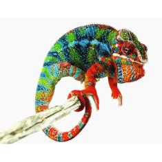

+++
title = "paige"
date = "2021-04-17"
tags = ["paige", "pj", "sonny", "pyro"]
categories = ["retired-pardalis"]
banner = "img/ambilobe/paige/paige2"
+++



Paige is a solid Modern Day Dragons x Tropical Chameleons YBBB female. She has great purples and pinks and a wonderful personality. We are very lucky to have her in our project and comes to us from Tiffany Mallay. Her first pairing will be with our 4th gen sire, Tony.



Filial
: *F4-CG13*

Sire
: [PJ]()

Dam
: [Sonny's Daughter]()

---




  

    

      <h1>Ancestral Report for Paige (F4-CG13)</h1>
    

    <h3>Generation 1</h3>
    
    
1. <strong>Paige (F4-CG13). </strong>Paige was born on 2021-04-17 at Tiffany Mallay.  She is the daughter of PJ (F3-CG4) and Sonny's Daughter (F9-CG12). 

    
More about Paige (F4-CG13):

    
Adopted: 2021-07-27, iPardalis.  

    <h3>Generation 2</h3>
    
    
2. <strong>PJ (F3-CG4). </strong>PJ was produced by Modern Day Dragons.  He is the son of Perregrin (aka Pyro)(F2) and Miss Piggy (F3). He had a relationship with Sonny's Daughter (F9-CG12). 

    
More about PJ (F3-CG4):

    
Adopted: Tiffany Mallay.  

    
3. <strong>Sonny's Daughter (F9-CG12). </strong>She is the daughter of Sonny (F8-CG11). 

    
Children of Sonny's Daughter (F9-CG12) and PJ (F3-CG4)

    
i. Paige (F4-CG13) [1]. Paige was born on 2021-04-17 at Tiffany Mallay.  

    <h3>Generation 3</h3>
    
    
4. <strong>Perregrin (aka Pyro)(F2). </strong>Perregrin (aka Pyro)(F2) was produced by Bobby Ruddock.  He is the son of Sparkles (F1) and Sasha. He had a relationship with Miss Piggy (F3). 

    
More about Perregrin (aka Pyro)(F2):

    
Adopted: Modern Day Dragons.  

    
Adopted: Brightside Chameleons.  

    
5. <strong>Miss Piggy (F3). </strong>Miss Piggy (F3) was produced by Jungle Panthers.  She is the daughter of Higgins and Candy Cane's Daughter (F2). 

    
More about Miss Piggy (F3):

    
Adopted: Modern Day Dragons.  

    
Children of Miss Piggy (F3) and Perregrin (aka Pyro)(F2)

    
i. Perregrin's daugher (F3-CG4). Perregrin's daugher was produced by Modern Day Dragons.  

    
ii. Astoria. Astoria was produced by Modern Day Dragons.  

    
iii. PJ (F3-CG4) [2]. PJ was produced by Modern Day Dragons.  

    
iv. Sunshine (F3-CG4). Sunshine was produced by Modern Day Dragons.  

    
    
6. <strong>Sonny (F8-CG11). </strong>He is the son of Giga-vony (Old Yeller) (F7-CG10) and Fanala-Andriana (Frost Queen). He had a relationship with Unknown. 

    
Children of Unknown and Sonny (F8-CG11)

    
i. Sonny's Daughter (F9-CG12) [3]. 

    <h3>Generation 4</h3>
    
    
8. <strong>Sparkles (F1). </strong>Sparkles was produced by Bobby Ruddock.  He was the son of Loki and Unknown - WC. He had a relationship with Leo's daughter. He also had a relationship with Sasha. 

    
Children of Leo's daughter and Sparkles (F1)

    
i. Kako (F2). Kako was born on 2017-11-21 at Panther Creek Chameleons.  She died on 2020-02-05 at iPardalis.  

    
ii. Amarillo (F2). Amarillo (F2) was produced by Bobby Ruddock.  

    
9. <strong>Sasha. </strong>Sasha was produced by Canvas Chameleons.  She is the daughter of Sinister. 

    
More about Sasha:

    
Adopted: Bobby Ruddock.  

    
Children of Sasha and Sparkles (F1)

    
i. Perregrin (aka Pyro)(F2) [4]. Perregrin (aka Pyro)(F2) was produced by Bobby Ruddock.  

    
    
10. <strong>Higgins. </strong>He had a relationship with Unknown. He also had a relationship with Candy Cane's Daughter (F2). 

    
Children of Unknown and Higgins

    
i. Higgin's daughter. 

    
11. <strong>Candy Cane's Daughter (F2). </strong>She is the daughter of Candy Cane (F1). 

    
Children of Candy Cane's Daughter (F2) and Higgins

    
i. Miss Piggy (F3) [5]. Miss Piggy (F3) was produced by Jungle Panthers.  

    
    
12. <strong>Giga-vony (Old Yeller) (F7-CG10). </strong>Giga-vony (Old Yeller) was produced by Kammerflage Kreations.  He is the son of Mavo-ra (Yellow Blood) and Tsara-andro (Good Day) (F6-CG9). He had a relationship with Au-sanga (Goldie Locks). He also had a relationship with Fanala-Andriana (Frost Queen). 

    
Children of Au-sanga (Goldie Locks) and Giga-vony (Old Yeller) (F7-CG10)

    
i. Landy (Silk) F8-CG11. Landy (Silk) F8-CG11 was born on 2018-02-20 at Kammerflage Kreations.  

    
More about Au-sanga (Goldie Locks) and Giga-vony (Old Yeller) (F7-CG10):

    
Birth: 2018-02-20, Kammerflage Kreations.  

    
13. <strong>Fanala-Andriana (Frost Queen). </strong>She is the daughter of Marina-ge (Real G) and Mazava-ratsy (Twilight). 

    
Children of Fanala-Andriana (Frost Queen) and Giga-vony (Old Yeller) (F7-CG10)

    
i. Sonny (F8-CG11) [6]. 

    <h3>Generation 5</h3>
    
    
16. <strong>Loki. </strong>Loki was produced by The Panther Baron.  He is the son of Loza and Flaming River's daughter. He had a relationship with Unknown - WC. 

    
17. <strong>Unknown - WC. </strong>Unknown was produced by Bobby Ruddock.  

    
Children of Unknown - WC and Loki

    
i. Sparkles (F1) [8]. Sparkles was produced by Bobby Ruddock.  

    
    
18. <strong>Sinister. </strong>Sinister was produced by Canvas Chameleons.  He had a relationship with Unknown. 

    
Children of Unknown and Sinister

    
i. Sasha [9]. Sasha was produced by Canvas Chameleons.  

    
    
22. <strong>Candy Cane (F1). </strong>Candy Cane was produced by Chameleon's Paradise.  He had a relationship with Jake's daughter. He also had a relationship with Cowboy's daughter (F1). He also had a relationship with Unknown. He also had a relationship with Cowboy's daughter (F1). 

    
Children of Jake's daughter and Candy Cane (F1)

    
i. Judy (F2). Judy was born on 2015-02-11 at Chameleon's Paradise.  She died on 2018-02-15 at iPardalis.  

    
Children of Cowboy's daughter (F1) and Candy Cane (F1)

    
i. Macho (F2-CG2). 

    
Children of Unknown and Candy Cane (F1)

    
i. Candy Cane's Daughter (F2) [11]. 

    
Children of Cowboy's daughter (F1) and Candy Cane (F1)

    
i. Candy Cane's daughter (F2). 

    
    
24. <strong>Mavo-ra (Yellow Blood). </strong>Mavo-ra (Yellow Blood) was produced by Kammerflage Kreations.  He is the son of Mabonika-haboka (Mellow Yellow). He had a relationship with Unknown. He also had a relationship with Tsara-andro (Good Day) (F6-CG9). 

    
Children of Unknown and Mavo-ra (Yellow Blood)

    
i. Vony-reny (Yellow Mother). Vony-reny (Yellow Mother) was produced by Kammerflage Kreations.  

    
    
25. <strong>Tsara-andro (Good Day) (F6-CG9). </strong>Tsara-andro (Good Day) was produced by Kammerflage Kreations.  She is the daughter of Kely-tongotra (Little Foot) (F5-CG8). 

    
Children of Tsara-andro (Good Day) (F6-CG9) and Mavo-ra (Yellow Blood)

    
i. Mavo-loha (Blondie). Mavo-loha (Blondie) was born on 2016-02-03 at Kammerflage Kreations.  

    
ii. Giga-vony (Old Yeller) (F7-CG10) [12]. Giga-vony (Old Yeller) was produced by Kammerflage Kreations.  

    
iii. JJ (F7-CG10). JJ  was produced by Kammerflage Kreations.  

    
    
26. <strong>Marina-ge (Real G). </strong>He is the son of Feno-tsoka (Rich). He had a relationship with Mazava-ratsy (Twilight). 

    
27. <strong>Mazava-ratsy (Twilight). </strong>

    
Children of Mazava-ratsy (Twilight) and Marina-ge (Real G)

    
i. Fanala-Andriana (Frost Queen) [13]. 

    <h3>Generation 6</h3>
    
    
32. <strong>Loza. </strong>Loza was produced by Kammerflage Kreations.  He had a relationship with Flaming River's daughter. 

    
33. <strong>Flaming River's daughter. </strong>Flaming River's daughter was produced by Kammerflage Kreations.  She is the daughter of Flaming River. 

    
Children of Flaming River's daughter and Loza

    
i. Loki [16]. Loki was produced by The Panther Baron.  

    
    
48. <strong>Mabonika-haboka (Mellow Yellow). </strong>Mabonika-haboka (Mellow Yellow) was produced by Kammerflage Kreations.  He is the son of Maso-vatomamy (Eye Candy). He had a relationship with Unknown. 

    
Children of Unknown and Mabonika-haboka (Mellow Yellow)

    
i. Mavo-ra (Yellow Blood) [24]. Mavo-ra (Yellow Blood) was produced by Kammerflage Kreations.  

    
    
50. <strong>Kely-tongotra (Little Foot) (F5-CG8). </strong>Kely-tongotra (Little Foot) was produced by Kammerflage Kreations.  He is the son of Hatsikana (Legend). He had a relationship with Unknown. He also had a relationship with Unknown. He also had a relationship with Unknown. He also had a relationship with Eye Candy's daughter. He also had a relationship with Unknown. He also had a relationship with Unknown. He also had a relationship with Unknown. 

    
Children of Unknown and Kely-tongotra (Little Foot) (F5-CG8)

    
i. Little Foot's daughter. Little Foot's daughter was produced by Kammerflage Kreations.  

    
Children of Unknown and Kely-tongotra (Little Foot) (F5-CG8)

    
i. Faingana (Quick). Faingana (Quick) was produced by Kammerflage Kreations.  

    
Children of Unknown and Kely-tongotra (Little Foot) (F5-CG8)

    
i. Little Foot's daughter. Little Foot's daughter was produced by Kammerflage Kreations.  

    
Children of Eye Candy's daughter and Kely-tongotra (Little Foot) (F5-CG8)

    
i. Dio (F6-CG9). 

    
Children of Unknown and Kely-tongotra (Little Foot) (F5-CG8)

    
i. Tsara-andro (Good Day) (F6-CG9) [25]. Tsara-andro (Good Day) was produced by Kammerflage Kreations.  

    
Children of Unknown and Kely-tongotra (Little Foot) (F5-CG8)

    
i. Maizina-lanitra (Dark Sky). Maizina-lanitra (Dark Sky) was produced by Kammerflage Kreations.  

    
Children of Unknown and Kely-tongotra (Little Foot) (F5-CG8)

    
i. Faingana (Quick). Faingana (Quick) was produced by Kammerflage Kreations.  

    
52. <strong>Feno-tsoka (Rich). </strong>He had a relationship with Unknown. 

    
Children of Unknown and Feno-tsoka (Rich)

    
i. Marina-ge (Real G) [26]. 

    <h3>Generation 7</h3>
    
    
66. <strong>Flaming River. </strong>Flaming River was produced by Kammerflage Kreations.  He had a relationship with Unknown. 

    
Children of Unknown and Flaming River

    
i. Flaming River's daughter [33]. Flaming River's daughter was produced by Kammerflage Kreations.  

    
    
96. <strong>Maso-vatomamy (Eye Candy). </strong>Maso-vatomamy (Eye Candy) was produced by Kammerflage Kreations.  He had a relationship with Unknown. He also had a relationship with Unknown. 

    
Children of Unknown and Maso-vatomamy (Eye Candy)

    
i. Eye Candy's daughter. Eye Candy's daughter was produced by Kammerflage Kreations.  

    
Children of Unknown and Maso-vatomamy (Eye Candy)

    
i. Mabonika-haboka (Mellow Yellow) [48]. Mabonika-haboka (Mellow Yellow) was produced by Kammerflage Kreations.  

    
    
100. <strong>Hatsikana (Legend). </strong>Hatsikana (Legend) was produced by Kammerflage Kreations.  He had a relationship with Unknown. 

    
Children of Unknown and Hatsikana (Legend)

    
i. Kely-tongotra (Little Foot) (F5-CG8) [50]. Kely-tongotra (Little Foot) was produced by Kammerflage Kreations.  

  



