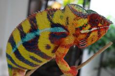
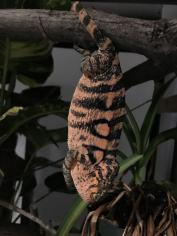

+++
title = "Papafee"
header_title = "Papafee | Yellow Body Blue Bar | Ambilobe Panther Chameleon"
date = "2020-07-17"
tags = ["papafee", "zanaka", "jude", "promise keeper"]
categories = ["retired-pardalis"]
banner = "img/ambilobe/papafee/papafee1"
+++



Papafee is a monster yellow-bodied Ambilobe. He was our sole holdback from Zanaka and Sunny to carry on in our 4th generation of Ambilobe panther chameleons. His yellows are extremely vibrant and were evident at a young age (2 months). He almost has a neon quality to him and he is about 24" head to tail. A very impressive animal.



Filial
: *F3-CG12*

Sire
: [Zanaka]()

Dam
: [Sunny]()

---





    

      <h1>Ancestral Report for Papafee</h1>
    

    <h3>Generation 1</h3>
    
    
1. <strong>Papafee. </strong>Papafee was born on 2020-07-17 at iPardalis.  He is the son of Zanaka (F2) and Sunny (F3). 

    <h3>Generation 2</h3>
    
    
2. <strong>Zanaka (F2). </strong>Zanaka was born on 2019-05-14 at Kammerflage Kreations.  He is the son of Promise Keeper and Mitselatra (Stormy Weather) (F1). He had a relationship with Sunny (F3). He also had a relationship with Unknown. He also had a relationship with Patch (F3). He also had a relationship with Lilly (F3). He also had a relationship with Daisy (F3). 

    
More about Zanaka (F2):

    
Adopted: iPardalis.  

    
    
3. <strong>Sunny (F3). </strong>Sunny (F3) was born on 2019-06-05 at iPardalis.  She is the daughter of Jude (F2) and Kako (F2). 

    
Children of Sunny (F3) and Zanaka (F2)

    
i. Papafee [1]. Papafee was born on 2020-07-17 at iPardalis.  

    <h3>Generation 3</h3>
    
    
4. <strong>Promise Keeper. </strong>Promise Keeper was produced by Kammerflage Kreations.  He is the son of Bararata-fatio (Bamboo Falcon) and Vony-reny. He had a relationship with Mitselatra (Stormy Weather) (F1). 

    
5. <strong>Mitselatra (Stormy Weather) (F1). </strong>She is the daughter of Fanitso (Herb) (WC) and Jaky-fiposohana. 

    
Children of Mitselatra (Stormy Weather) (F1) and Promise Keeper

    
i. Zanaka (F2) [2]. Zanaka was born on 2019-05-14 at Kammerflage Kreations.  

    
    
6. <strong>Jude (F2). </strong>Jude was born on 2017-10-17 at iPardalis.  He is the son of Flash (F1) and Judy (F2). He had a relationship with Kako (F2). He also had a relationship with Alla. 

    
Children of Alla and Jude (F2)

    
i. Blossom (F3). Blossom was born on 2019-07-09 at iPardalis.  

    
ii. Clyde. Clyde was born on 2019-07-09 at iPardalis.  

    
iii. M11. M11 was born on 2019-11-20.  

    
iv. Alfred (F3). Alfred (F3) was born on 2019-10-20 at iPardalis.  

    
v. Jack (F3). Jack (F3) was born on 2019-10-20 at iPardalis.  

    
vi. Button (F3). She was born on 2019-07-09 at iPardalis.  

    
vii. Bubbles (F3). Bubbles (F3) was born on 2019-07-09 at iPardalis.  

    
viii. Mondrian. Mondrian was born on 2019-08-16 at iPardalis.  

    
ix. Toby. Toby was born on 2019-07-09 at iPardalis.  

    
    
7. <strong>Kako (F2). </strong>Kako was born on 2017-11-21 at Panther Creek Chameleons.  She died on 2020-02-05 at iPardalis at the age of 2 years, 2 months.  She was the daughter of Sparkles (F1) and Leo's daughter. 

    
Children of Kako (F2) and Jude (F2)

    
i. Nugget (F3). Nugget was born on 2019-06-05 at iPardalis.  

    
ii. Patch (F3). Patch (F3) was born on 2019-06-05 at iPardalis.  

    
iii. Sunny (F3) [3]. Sunny (F3) was born on 2019-06-05 at iPardalis.  

    
iv. Zelda. Zelda was born on 2019-06-05 at iPardalis.  

    
v. Tonka. Tonka was born on 2019-06-05 at iPardalis.  

    
vi. Lilly (F3). Lilly (F3) was born on 2019-06-05 at iPardalis.  

    
vii. Daisy (F3). Daisy (F3) was born on 2019-06-05 at iPardalis.  

    
viii. Padi. Padi was born on 2019-06-05 at iPardalis.  

    <h3>Generation 4</h3>
    
    
8. <strong>Bararata-fatio (Bamboo Falcon). </strong>Bararata-fatio (Bamboo Falcon) was produced by Kammerflage Kreations.  He died with Kammerflage Kreations.  He had a relationship with Vony-reny. 

    
9. <strong>Vony-reny. </strong>Vony-reny was produced by Kammerflage Kreations.  She died with Kammerflage Kreations.  She was the daughter of Mavo-ra (Yellow Blood). 

    
Children of Vony-reny and Bararata-fatio (Bamboo Falcon)

    
i. Promise Keeper [4]. Promise Keeper was produced by Kammerflage Kreations.  

    
    
10. <strong>Fanitso (Herb) (WC). </strong>He died with Kammerflage Kreations.  He had a relationship with Jaky-fiposohana. 

    
11. <strong>Jaky-fiposohana. </strong>Jaky-fiposohana was produced by Kammerflage Kreations.  She died with Kammerflage Kreations.  She was the daughter of Miroborobo (Blaze) and Little Foot's daughter. 

    
Children of Jaky-fiposohana and Fanitso (Herb) (WC)

    
i. Mitselatra (Stormy Weather) (F1) [5]. 

    
    
12. <strong>Flash (F1). </strong>Flash was born on 2015-01-10 at Chameleon's Paradise.  He died on 2018-06-14 at iPardalis at the age of 3 years, 5 months.  He was the son of Cowboy (CH) and King's daughter. He had a relationship with Judy (F2). 

    
    
13. <strong>Judy (F2). </strong>Judy was born on 2015-02-11 at Chameleon's Paradise.  She died on 2018-02-15 at iPardalis at the age of 3 years, 4 days.  She was the daughter of Candy Cane (F1) and Jake's daughter. 

    
Children of Judy (F2) and Flash (F1)

    
i. Jude (F2) [6]. Jude was born on 2017-10-17 at iPardalis.  

    
ii. Bane. Bane was born on 2017-10-17.  

    
iii. Nick. Nick was born on 2017-10-17 at iPardalis.  

    
iv. Giant3. Giant3 was born on 2017-10-17 at iPardalis.  

    
    
14. <strong>Sparkles (F1). </strong>Sparkles was produced by Bobby Ruddock.  He was the son of Loki and Unknown - WC. He had a relationship with Leo's daughter. 

    
15. <strong>Leo's daughter. </strong>Leo's daughter was produced by The Panther Company.  She died on 2018-12-23 at Bobby Ruddock.  She was the daughter of Leo. 

    
Children of Leo's daughter and Sparkles (F1)

    
i. Kako (F2) [7]. Kako was born on 2017-11-21 at Panther Creek Chameleons.  She died on 2020-02-05 at iPardalis.  

    
ii. Amarillo (F2). Amarillo (F2) was produced by Bobby Ruddock.  

    <h3>Generation 5</h3>
    
    
18. <strong>Mavo-ra (Yellow Blood). </strong>Mavo-ra (Yellow Blood) was produced by Kammerflage Kreations.  He died with Kammerflage Kreations.  He was the son of Mabonika-haboka (Mellow Yellow). He had a relationship with Unknown. He also had a relationship with Little Foot's daughter. 

    
Children of Unknown and Mavo-ra (Yellow Blood)

    
i. Vony-reny [9]. Vony-reny was produced by Kammerflage Kreations.  She died with Kammerflage Kreations.  

    
Children of Little Foot's daughter and Mavo-ra (Yellow Blood)

    
i. JJ. JJ was produced by Kammerflage Kreations.  

    
    
22. <strong>Miroborobo (Blaze). </strong>Miroborobo (Blaze) was produced by Kammerflage Kreations.  He died with Kammerflage Kreations.  He had a relationship with Little Foot's daughter. 

    
23. <strong>Little Foot's daughter. </strong>Little Foot's daughter was produced by Kammerflage Kreations.  She died with Kammerflage Kreations.  She was the daughter of Kely-tongotra (Little Foot). 

    
Children of Little Foot's daughter and Miroborobo (Blaze)

    
i. Jaky-fiposohana [11]. Jaky-fiposohana was produced by Kammerflage Kreations.  She died with Kammerflage Kreations.  

    
    
24. <strong>Cowboy (CH). </strong>Cowboy was produced by Chameleon's Paradise.  He died on 2015-01-01 at Chameleon's Paradise.  He had a relationship with King's daughter. He also had a relationship with Unknown. He also had a relationship with Unknown. 

    
More about Cowboy (CH):

    
Description: CH - Ambilobe

    
Children of Unknown and Cowboy (CH)

    
i. Cowboy's daughter (F1). 

    
Children of Unknown and Cowboy (CH)

    
i. Cowboy's daughter (F1). Cowboy's daughter was produced by Chameleon's Paradise.  She died with Canvas Chameleons.  

    
25. <strong>King's daughter. </strong>King's daughter was produced by Chameleon's Paradise.  She died with Chameleon's Paradise.  She was the daughter of King. 

    
Children of King's daughter and Cowboy (CH)

    
i. Flash (F1) [12]. Flash was born on 2015-01-10 at Chameleon's Paradise.  He died on 2018-06-14 at iPardalis.  

    
    
26. <strong>Candy Cane (F1). </strong>Candy Cane was produced by Chameleon's Paradise.  He died with Chameleon's Paradise.  He had a relationship with Jake's daughter. He also had a relationship with Cowboy's daughter (F1). 

    
Children of Cowboy's daughter (F1) and Candy Cane (F1)

    
i. Macho (F2). 

    
27. <strong>Jake's daughter. </strong>Jake's daughter was produced by Chameleon's Paradise.  She died with Chameleon's Paradise.  She was the daughter of Jake (F1). 

    
Children of Jake's daughter and Candy Cane (F1)

    
i. Judy (F2) [13]. Judy was born on 2015-02-11 at Chameleon's Paradise.  She died on 2018-02-15 at iPardalis.  

    
    
28. <strong>Loki. </strong>Loki was produced by The Panther Baron.  He died with Bobby Ruddock.  He was the son of Loza and Flaming River's daughter. He had a relationship with Unknown - WC. 

    
29. <strong>Unknown - WC. </strong>Unknown was produced by Bobby Ruddock.  

    
Children of Unknown - WC and Loki

    
i. Sparkles (F1) [14]. Sparkles was produced by Bobby Ruddock.  

    
    
30. <strong>Leo. </strong>Leo was produced by The Panther Company.  He died with The Panther Company.  He had a relationship with Unknown. 

    
Children of Unknown and Leo

    
i. Leo's daughter [15]. Leo's daughter was produced by The Panther Company.  She died on 2018-12-23 at Bobby Ruddock.  

    <h3>Generation 6</h3>
    
    
36. <strong>Mabonika-haboka (Mellow Yellow). </strong>Mabonika-haboka (Mellow Yellow) was produced by Kammerflage Kreations.  He died with Kammerflage Kreations.  He was the son of Maso-vatomamy (Eye Candy). He had a relationship with Unknown. 

    
Children of Unknown and Mabonika-haboka (Mellow Yellow)

    
i. Mavo-ra (Yellow Blood) [18]. Mavo-ra (Yellow Blood) was produced by Kammerflage Kreations.  He died with Kammerflage Kreations.  

    
    
46. <strong>Kely-tongotra (Little Foot). </strong>Kely-tongotra (Little Foot) was produced by Kammerflage Kreations.  He died with Kammerflage Kreations.  He was the son of Hatsikana (Legend). He had a relationship with Unknown. He also had a relationship with Unknown. He also had a relationship with Unknown. He also had a relationship with Eye Candy's daughter. 

    
Children of Unknown and Kely-tongotra (Little Foot)

    
i. Little Foot's daughter [23]. Little Foot's daughter was produced by Kammerflage Kreations.  She died with Kammerflage Kreations.  

    
Children of Unknown and Kely-tongotra (Little Foot)

    
i. Faingana (Quick). Faingana (Quick) was produced by Kammerflage Kreations.  He died with Kammerflage Kreations.  

    
Children of Unknown and Kely-tongotra (Little Foot)

    
i. Little Foot's daughter. Little Foot's daughter was produced by Kammerflage Kreations.  She died with Kammerflage Kreations.  

    
Children of Eye Candy's daughter and Kely-tongotra (Little Foot)

    
i. Dio. He died with Joshua Illencik.  

    
    
50. <strong>King. </strong>He had a relationship with Unknown. 

    
Children of Unknown and King

    
i. King's daughter [25]. King's daughter was produced by Chameleon's Paradise.  She died with Chameleon's Paradise.  

    
    
54. <strong>Jake (F1). </strong>Jake was produced by Chameleon's Paradise.  He died with Chameleon's Paradise.  He had a relationship with Unknown. 

    
Children of Unknown and Jake (F1)

    
i. Jake's daughter [27]. Jake's daughter was produced by Chameleon's Paradise.  She died with Chameleon's Paradise.  

    
    
56. <strong>Loza. </strong>Loza was produced by Kammerflage Kreations.  He died with Kammerflage Kreations.  He had a relationship with Flaming River's daughter. 

    
57. <strong>Flaming River's daughter. </strong>Flaming River's daughter was produced by Kammerflage Kreations.  She died with Kammerflage Kreations.  She was the daughter of Flaming River. 

    
Children of Flaming River's daughter and Loza

    
i. Loki [28]. Loki was produced by The Panther Baron.  He died with Bobby Ruddock.  

    <h3>Generation 7</h3>
    
    
72. <strong>Maso-vatomamy (Eye Candy). </strong>Maso-vatomamy (Eye Candy) was produced by Kammerflage Kreations.  He died with Kammerflage Kreations.  He had a relationship with Unknown. He also had a relationship with Unknown. 

    
Children of Unknown and Maso-vatomamy (Eye Candy)

    
i. Eye Candy's daughter. Eye Candy's daughter was produced by Kammerflage Kreations.  She died with Kammerflage Kreations.  

    
Children of Unknown and Maso-vatomamy (Eye Candy)

    
i. Mabonika-haboka (Mellow Yellow) [36]. Mabonika-haboka (Mellow Yellow) was produced by Kammerflage Kreations.  He died with Kammerflage Kreations.  

    
    
92. <strong>Hatsikana (Legend). </strong>Hatsikana (Legend) was produced by Kammerflage Kreations.  He died with Kammerflage Kreations.  He had a relationship with Unknown. 

    
Children of Unknown and Hatsikana (Legend)

    
i. Kely-tongotra (Little Foot) [46]. Kely-tongotra (Little Foot) was produced by Kammerflage Kreations.  He died with Kammerflage Kreations.  

    
    
114. <strong>Flaming River. </strong>Flaming River was produced by Kammerflage Kreations.  He died with Kammerflage Kreations.  He had a relationship with Unknown. 

    
Children of Unknown and Flaming River

    
i. Flaming River's daughter [57]. Flaming River's daughter was produced by Kammerflage Kreations.  She died with Kammerflage Kreations.  

  



