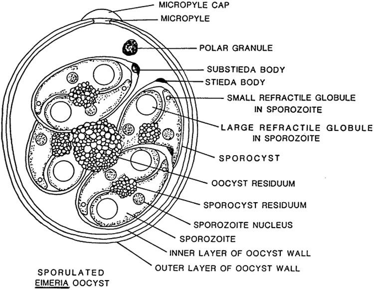
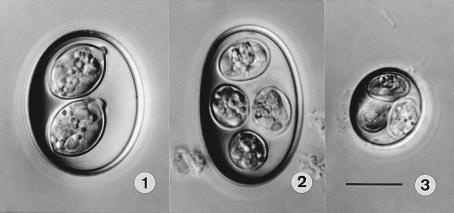

-   [Executive Summary](#executive-summary)
-   [Coccidia Basics](#coccidia-basics)
    -   [Structure](#structure)
    -   [Life Cycle](#life-cycle)
-   [Known Species](#known-species)
    -   [*Isospora brygooi*](#isospora-brygooi)
    -   [*Choleoeimeria glawi*](#choleoeimeria-glawi)
    -   [*Eimeria vencesi*](#eimeria-vencesi)
    -   [Discussion](#discussion)
-   [Reference](#reference)

> **TL;DR**
>
> This article examines three of species of Coccidia which are known to infect *Furcifer pardalis* and poses a theory that *Choleoeimeria glawi* ([Figure 3](#fig-coccidia-3)) are more likely to cause serious illness based on extant literature and our experience. More clinical research is warranted because we are not specialists in parasitology or veterinary microbiology, and we did not attempt to bifurcate our clinical results by Coccidia species.
>
> -   [Strand, Bill (2019)](https://chameleonacademy.com/chameleon-medical-parasites/) is a primer on parasites (start here).
> -   This article is a deep dive into one genera of parasites, *Eimeriidae* (Coccidia), and the potential implications for advanced keepers with larger breeding groups of *Furcifer pardalis* (Panther Chameleons) or an interest in parasitology.
> -   Given the high prevalence of parasitic infections among captive bred and wild caught *Furcifer pardalis*, we would see more life-threatening illnesses if they were the primary cause.
> -   As Strand, Bill (2019) discusses, proper husbandry conditions prevent most illnesses associated with parasites; however, they could be a key reason chameleons are viewed as "fragile" by many herpetoculturists and regular (annual?) fecal screenings should be performed on healthy individuals.
> -   *Eimeriidae* are generally referred to as "Coccidia" among herpetoculturists, but it is one of the most diverse genuses on the planet with an estimated 40,000 - 60,000 species, ~2,000 named species as of 2003 (Duszynski, Donald W. et al. n.d.). *Furcifer pardalis* is the definitive host of at least five different species of Coccidian parasites, and, contrary to what I believed before writing this article, at least one species, *Eimeria sp. 2 of Brygoo*, is known to infect multiple species of chameleons within the *Furcifer* genera (Duszynski, Donald W. et al. n.d.).
> -   Most animals will be infected with Coccidia at least once during their lifetime but show no illness and the disease is self-limiting. Visible signs of illness are more common among the young, old and gravid females. Mild cases result in slower growth rates and dairrhea and more severe cases result in dysentery, dehydration, constipation, secondary infections and death. The prevalence rate and illness severity varies across Coccidia species.

# Executive Summary

Many different species of parasites are regularly identified in captive reptiles. The prevalence rate often exceeds 50%, even among animals that have not been imported for many captive generations (Okulewicz et al. 2015), (Ellerd et al. 2022), (Machin 2015). Chameleons have a very high prevalence rate among reptiles and Panther Chameleons are no exception (Ellerd et al. 2022). Stets (2019) examined 646 *Furcifer pardalis* specimens of both wild caught (WC) and captive bred (CB) origin and found a prevalence rate near 90% in both groups. The CB specimens had less parasite species diversity with no indirect life cycle parasites and a much higher prevalence of direct life cycle parasites such as Nematodes and Coccidia. It is safe to say *Furcifer pardalis* are more likely than not to have at least one parasitic infection, if not multiple parasitic infections, even in CB populations. When we started to do a complete fecal analysis of our collection of *Furcifer pardalis* in 2020 - 2021, it aligned with this literature. We identified *Eimeria vencesi*, *Choleoeimeria glawi*, *Isospora Brygooi* (see [Figure 3](#fig-coccidia-3)) along with a few cases of round worms and one case of pins worms.

As noted in Stets (2019), there are a two kinds of direct life cycle parasites which persist in CB Panther Chameleons: various species of Nematodes and Protozoa in the family *Eimeriidae*. They are not visible to the human eye. The two most common Nematodes are round worms and pin worms, and the most common protozoans of the order *Coccidia* are from the genera *Eimeria*, *Acroeimeria*, *Choleoeimeria*, and *Isospora*. The number of sporocysts is what helps identify the genera - sporulated oocysts of *Isospora* have two sporocysts and Eimerian, Choleoeimerian and Acroeimerian sporulated oocysts have four sporocysts ("Overview of Coccidiosis in Animals - Digestive System" n.d.) (See [Figure 1](#fig-coccidia) for guidance on what a "sporocyst" is). Even though Paperna and Landsberg (1989) correctly argued for a distinction among *Eimeria* between *Acroeimeria* and *Choleoeimeria* in 1989, this taxonomic change was not accepted until 2002. This distinction is useful for veterinarians and herpetoculturists.

*Choleoeimeria* infects the gallbladder. The bile conveying structures become hypertrophic and are displaced to the surface of the epithelial layer where they are more prone to large ruptures and infection. This genera is more difficult to treat with Toltrazuril/Ponazuril given its persistence outside the intestine. These coccidians are also prone to shedding at irregular rates, resulting in more false-negative fecal exams, and are associated with more severe illness (Sloboda and Modrý 2006), (Paperna and Landsberg 1989). The only upside is that they specialize in faster reproduction (extra sporocysts and weaker oocyst wall), so they are easier to eliminate from the environment via proper hygiene and *Eimeria* are not as good at hitching rides on/in spiders, gnats or other insects in a breeding facility as *Isospora* are known to do ("Overview of Coccidiosis in Animals - Digestive System" n.d.). I have observed numerous fatal cases of coccidiosis related to secondary infections of the gallbladder even after treatment with Ponazuril (2 doses over 48 hrs followed by 1 dose after 7 days) and husbandry corrections. In my experience, the *Eimeria* family, especially *Choleoeimeria*, seem to be a serious pathogenic risk in a captive breeding setting, whereas *Isospora* seem to be more persistent and less pathogenic.

# Coccidia Basics

Coccidia are intracellular parasites within the phylum *Apicomplexa*. They infect a wide variety of birds, mammals and reptiles. Most are host-specific but a few are known to infect multiple species of hosts within one genera, i.e *Eimeria sp. 2 of Brygoo* in the *Furcifer* genera (Duszynski, Donald W. et al. n.d.). All complete their life cycle within a single host - often referred to as "direct" life cycle parasites. Most hosts develop immunity to individual species of Coccidia after infection, but some are known to be immunosuppressive and concurrent infections of multiple species of Coccidia are common.

Infection is via oral ingestion of infective sporulated oocysts from a contaminated environment. Most individuals are infected early in life and the infection is self-limiting lasting weeks without any sign of illness. When illness does occur, it often presents as mild diarrhea or slower growth rates. Serious illness is rare, but it can result in dysentery, dehydration, constipation, secondary infections of the gallbladder/liver and death. We found that roughly 90% of our positive cases did not present any sign of illness whatsoever (ideal time to administer treatment).

There are three control measures that should be taken, in this order:
1. Hygiene
2. Husbandry
3. (optionally) Treatment

High risk groups include any animal with a compromised immune system: young, old, gravid females, recently imported WC, and animals under chronic stress. Serious illness is the result of repeated infections before immunity is developed. Treatment decisions should be made with consultation with a veterinarian after husbandry and hygienic changes have been made because available treatments have serious side effects and they have not been properly evaluated in *Furcifer pardalis*. Natural immunity developed in ideal, hygienic husbandry conditions is the long-term solution. Repeated treatment should not be necessary. If it is, the animal has a compromised immune system and that should be addressed before attempting to eliminate the Coccidia.

### Structure

It is useful to become familiar with the life cycle and structure of *Eimeria* for identification purposes. The following diagrams are from McAllister et al. (2017). [Figure 1](#fig-coccidia) shows the anatomy of a sporulated *Eimeria* oocyst.

Figure 1: Structure of Sporulated *Eimeria* oocyst

Each species has a slightly different structure, the main differences being the sporocyst count/shape, presence of micropyle cap/stieda body, and oocyst wall layer and size/shape.

### Life Cycle

All species of *Eimeria* follow a similar life cylce: sporogony (sporulation), merogony, and gametogony. However, each species differs in the way these stages take place and the host cells they utilize. Some species perform merogony in the host's liver, gallbladder, upper or lower intestine and perform gametogony in the lower intestine whereas other complete their entire life cycle outside the intestine. They have different reproductive rates and re-infection rates within a single life cycle. Sporulation can be exogenous or endogenous (inside or outside) to the host. Each of these factors presents different risks from a captive breeding standpoint and it is not very useful to generalize across all species of "Coccidia."

Figure 2: Lifecyle of *Eimeriidae*

Oocysts can remain infective for over 1 year if the conditions are right, and they are resistant to most common cleaning supplies. One of the more beguiling places for sporulation to occur is on a panther chameleon egg shell (Negro and Laube n.d.). It is hard to eliminate without damaging the developing embryo, and it will immediately infect a high-risk hatchling. The long sporulation period along with its resistance to most common cleaning supplies is what makes Coccidia very common in the chameleon keeping community.

# Known Species

Many of the papers before 2002, classified all Eimeria-like Coccidians as *Eimeria*. The most interesting taxonomic change that I found was the acceptance of Paperna and Landsberg (1989)'s argument to break *Eimeria* into *Acroeimeria* and *Choleoeimeria* because this distinction has implications for captive breeding projects. *Eimeria* were already problematic because of their higher reproductive potential, but *Choleoeimeria* specialize in gallbladder infections and cause serious illness while evading treatment (many drugs are more effective in the large and small intestine) and detection (irregular shedding). This taxonomic change is meaningful for herpetoculturists (Sloboda and Modrý 2006). It is definitely worth knowing how to identify species within this high risk genera.

Figure 3: Differential interference contrast (DIC) photographs of the oöcysts of coccidia from Panther Chameleons, all to the same scale. 1. Isospora brygooi n. sp. 2. Choleoeimeria glawi n. sp. 3. E. vencesi n. sp. Scale-bar: 10 µm.(Modry et al. 2001)

Modry et al. (2001) is the main paper I could find identifying species of Coccidia that infect *Furcifer pardalis*. It identifies 5 new species of Coccidia, 3 of which infect *pardalis*. They provide many of the details discussed in this section. I was not able to find an English copy of Brygoo's 1963 PhD Dissertation, *Contribution a la connaissance de la parasitologie des cameleons Malgaches* , so *Eimeria sp. 2 of Brygoo* is not discussed here.

## *Isospora brygooi*

This is an spherical species of Coccidia. There is no oocyst residuum with two sporocysts with distinct dome-like stieda bodies. Sporocyst residuum is irregularly spread among its sporozoites. It sporulates exogenously (outside the infected chameleon), so a mix of unsporulated oocysts should be found with sporulated oocysts. [Figure 4](#fig-isospora) is an example from some of our fecal exams:

Figure 4: Sporulated oocysts have two clear sporocysts and others have an unsporulated mass. Although a stieda body is not evident in these pictures, I believe it is *Isospora brygooi*.

*Isospora brygooi* primarily infects/damages the intestinal wall. The absorptive function of the small intestine is readily compensated by the large intestine, but an infection of the large intestine or cecum can result in more serious illness. The small intestine cannot compensate for a defect in the large intestine/cecum and the tissue does not recover as easily ("Overview of Coccidiosis in Animals - Digestive System" n.d.).

## *Choleoeimeria glawi*

This is a cylindrical to ellipsoidal species of coccidia with four sporocysts. No oocyst residuum or stieda bodies and scattered sporozoite residuum ([Figure 3](#fig-coccidia-3) - 2). They infect the gallbladder where they cause hypertrophic growths during merogony and have an increased risk of secondary infection. They sporulate inside the gallbladder, so, unlike *Isospora brygooi*, few unsporulated oocysts should be found in fecal exams. Originally classified as *Eimeria glawi* in Modry et al. (2001), but re-classified *Choleoeimeria glawi* in Sloboda and Modrý (2006). In Sloboda and Modrý (2006), they observed that "all experimentally infected animals died in various intervals after the inoculation", and "in all cases, significant gall bladder dilation was present during necropsy." Those infections were for *Choleoeimeria hirbayah* in *Chameleo caplyptratus*, but it resonates very well with our experience with *Choleoeimeria glawi* in *Furcifer pardalis* - very high mortality rates and what appear to be gall bladder infections during necropsy.

## *Eimeria vencesi*

This is the smallest species of Coccidia known to infect *Furcifer pardalis*. It is spherical without an oocyst residuum. They have 1-3 polar granules in the oocyst and no stieda bodies on four sporocysts. They infect the small intestine and sporulate exogenously, meaning that fecal samples should contain unsporulated and sporulated oocysts, like *Isospora brygooi* ([Figure 4](#fig-isospora)).

## Discussion

After three years of surveillance and control, we have not been 100% successful in eliminating all species of Coccidia from our breeding facility. I am not sure anyone with more than 10 animals and live plants will ever be able to eliminate *Isospora brygooi* because of its ability to utilize paratenic (transfer) hosts and resistance in the environment. It is theoretically possible with a professional understanding of control measures and surveillance techniques to begin a small project and scale slowly without introducing any Coccidia into a breeding project, but I am not aware of a single breeding facility in the United States which was constituted as such, and I have received CB animals which tested positive for Coccidia from nearly every major breeding facility I am aware of.

Because of its small size and exogenous sporulation, unsporulated *Eimeria vencesi* oocysts are often confused with the genus *Crytposporidium*, but *Crytposporidium* cannot be detected with 1000x magnification. They are smaller and require specific tests such as acid staining and PCR analysis for species determination. Both *Isospora brygooi* and *Eimeria vencesi* can result in serious illness under improper husbandry conditions, such as group-raising babies, which compromise the chameleon's immune system and prevent natural immunity from developing and re-infection to occur. However, both should not result in serious illness if proper husbandry and hygiene are maintained because of their infection location in the small intestine. Serious illness will only occur if an infection is unnaturally severe and affects the large intestine or cecum.

By contrast, *Choleoeimeria glawi* infects the gallbladder and is likely to result in serious secondary infections quite regularly due to its tendency to cause hypertrophic growths which raise to the epithelial layer. It is valuable to know that this species of Coccidia is present because you will need to survey your animals more regularly and exercise extreme caution in order to prevent severe illness. Treatment is less effective, shedding is irregular and elimination should be the goal in a captive setting. We have been able to eliminate this species of Coccidia with control measures we will describe in this series of articles.

I have never heard anyone break down the species of Coccidia from a competing risks standpoint, and I believe species specific knowledge helps provide herpetoculturists and veterinarians derive an accurate estimate of which risks to manage/treat. When you find *Isospora brygooi*, vacuum up those spiders instead of culturing more isopods for your bios. If you find *Eimeria vencesi*, focus on treating your breeding females and eliminating any possibility they are in small groups of hatchlings given their high reproductive rate. If you find *Choleoeimeria glawi*, eliminate them - know that any animal exposed will probably live a shorter lifespan due to secondary gallbladder infections and focus all your effort on eliminating those above all other priorities. On the other hand, *Isospora brygooi* may never be worth eliminating given its persistence in the environment, use of paratenic hosts, lower pathogenicity/reproductive rate and natural immunity.

One last note about "natural immunity": "immune"/healthy animals will shed small numbers of oocysts throughout their lives. All coccidiostats (drugs which treat coccidiosis) reduce but do not entirely eliminate Coccidia infections. Contact between these "immune" or healthy animals and an immunocompromised animal could result in a serious illness in the latter. In our previous [article]() about the ethics of parasite management, this is one of the main reasons we argue it is either ignorance or deceit when someone says "my chameleons don't have parasites." It becomes increasingly unlikely (impossible) as the number of animals in their possession increases.

This article should provide enough information for other herpetoculturists to identify specific species of Coccidia in their collection and to confirm or deny these discussion points with more evidence. In 2020, I had to start from scratch, and I hope some of you join me here at the cutting edge of this challenge.

# Reference

Duszynski, Donald W. et al. n.d. "Coccidia of the World." {{NSF-PEET DEB}} 9521687. https://www.k-state.edu/parasitology/worldcoccidia/. Accessed August 5, 2023.

Ellerd, Rachel, Meriam N. Saleh, Joe L. Luksovsky, and Guilherme G. Verocai. 2022. "Endoparasites of Pet Reptiles and Amphibians from Exotic Pet Shows in Texas, United States." *Veterinary Parasitology: Regional Studies and Reports* 27 (January): 100671. <https://doi.org/10.1016/j.vprsr.2021.100671>.

Machin, Ross. 2015. "Common Gastrointestinal Parasites in Reptiles." *In Practice* 37 (October). <https://doi.org/10.1136/inp.h4914>.

McAllister, Chris, Dagmara Motriuk-Smith, Robert Seville, M Connior, Stanley Trauth, and Henry Robison. 2017. "Coccidian Parasites (Apicomplexa: Eimeriidae) of Arkansas Herpetofauna: A Summary with Two New State Records." *Journal of the Arkansas Academy of Science* 71 (January): 143--52. <https://doi.org/10.54119/jaas.2017.7103>.

Modry, David, Peter Daszak, Jiri Volf, Milan Vesely, Stanley Ball, and Bretislav Koudela. 2001. "Five New Species of Coccidia (Apicomplexa: Eimeriidae) from Madagascan Chameleons (Sauria: Chamaeleonidae)." *Systematic Parasitology* 48 (March): 117--23. <https://doi.org/10.1023/A:1006476325181>.

Negro, Thorsten, and Alex Laube. n.d. "Parasites Madcham.de." https://www.madcham.de/en/parasiten/. Accessed August 4, 2023.

Okulewicz, A., Mikołaj Kaźmierczak, Joanna Hildebrand, and Maja Adamczyk. 2015. "Endoparasites of Lizards (Lacertilia) from Captive Breeding and Trade Networks." *Helminthologia* 52 (March): 34--40. <https://doi.org/10.1515/helmin-2015-0008>.

"Overview of Coccidiosis in Animals - Digestive System." n.d. *Merck Veterinary Manual*. https://www.merckvetmanual.com/digestive-system/coccidiosis/overview-of-coccidiosis-in-animals. Accessed August 4, 2023.

Paperna, I., and J. H. Landsberg. 1989. "Description and Taxonomic Discussion of Eimerian Coccidia from African and Levantine Geckoes." *South African Journal of Zoology* 24 (4): 345--55. <https://doi.org/10.1080/02541858.1989.11448176>.

Sloboda, Michal, and David Modrý. 2006. "New Species of Choleoeimeria (Apicomplexa: Eimeriidae) from the Veiled Chameleon, Chamaeleo Calyptratus (Sauria: Chamaeleonidae), with Taxonomic Revision of Eimerian Coccidia from Chameleons." *Folia Parasitologica* 53 (2): 91--97. <https://doi.org/10.14411/fp.2006.012>.

Stets, O. 2019. "Parasites of Panther Chameleons (Furcifer Pardalis) Grown in Captivity and Brought from the Wild." *Journal for Veterinary Medicine, Biotechnology and Biosafety* 5 (December): 15--17. <https://doi.org/10.36016/JVMBBS-2019-5-4-4>.

Strand, Bill. 2019. "Chameleon Medical: Parasites - Chameleon Academy."
