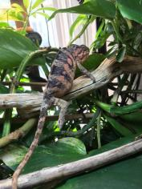
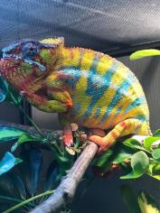

+++
title = "Patch"
date = "2019-06-08"
tags = ["patch", "jude", "sparkles", "kako"]
categories = ["retired pardalis"]
banner = "img/ambilobe/patch/patch"
+++



Patch was my favorite female from Jude and Kako's [first clutch](), hatched 6/5/19. It will be a lot of fun to watch her eggs hatch to see which traits she is carrying. Her line is an extremely strong yellow body blue bar Ambilobe group, so I have high hopes!



Filial
: F3

Sire
: [Jude]()

Dam
: [Kako]()

---




  

    

      <h1>Ancestral Report for Patch (F3)</h1>
    

    <h3>Generation 1</h3>
    
    
1. <strong>Patch (F3). </strong>Patch (F3) was born on 2019-06-05 at iPardalis.  She is the daughter of Jude (F2) and Kako (F2). She had a relationship with Bleu (F3). She also had a relationship with Zanaka (F2). 

    
Relationship with: Bleu (F3).

    
Bleu was born on 2019-07-15 at Brightside Chameleons.  He is the son of Stryfe and Emma Frost (F2). 

    
Relationship with: Zanaka (F2).

    
Zanaka was born on 2019-05-14 at Kammerflage Kreations.  He is the son of Promise Keeper and Mitselatra (Stormy Weather) (F1). 

    <h3>Generation 2</h3>
    
    
2. <strong>Jude (F2). </strong>Jude was born on 2017-10-17 at iPardalis.  He is the son of Flash (F1) and Judy (F2). He had a relationship with Kako (F2). He also had a relationship with Alla. 

    
Children of Alla and Jude (F2)

    
i. Blossom (F3). Blossom was born on 2019-07-09 at iPardalis.  

    
ii. Clyde. Clyde was born on 2019-07-09 at iPardalis.  

    
iii. M11. M11 was born on 2019-11-20.  

    
iv. Alfred (F3). Alfred (F3) was born on 2019-10-20 at iPardalis.  

    
v. Jack (F3). Jack (F3) was born on 2019-10-20 at iPardalis.  

    
    
3. <strong>Kako (F2). </strong>Kako was born on 2017-11-21 at Panther Creek Chameleons.  She died on 2020-02-05 at iPardalis at the age of 2 years, 2 months.  She was the daughter of Sparkles (F1) and Leo's daughter. 

    
Children of Kako (F2) and Jude (F2)

    
i. Nugget (F3). Nugget was born on 2019-06-05 at iPardalis.  

    
ii. Patch (F3) [1]. Patch (F3) was born on 2019-06-05 at iPardalis.  

    
iii. Sunny. Sunny was born on 2019-06-05 at iPardalis.  

    
iv. Zelda. Zelda was born on 2019-06-05 at iPardalis.  

    
v. Tonka. Tonka was born on 2019-06-05 at iPardalis.  

    <h3>Generation 3</h3>
    
    
4. <strong>Flash (F1). </strong>Flash was born on 2015-01-10 at Chameleon's Paradise.  He died on 2018-06-14 at iPardalis at the age of 3 years, 5 months.  He was the son of Cowboy (CH) and King's daughter. He had a relationship with Judy (F2). 

    
    
5. <strong>Judy (F2). </strong>Judy was born on 2015-02-11 at Chameleon's Paradise.  She died on 2018-02-15 at iPardalis at the age of 3 years, 4 days.  She was the daughter of Candy Cane (F1) and Jake's daughter. 

    
Children of Judy (F2) and Flash (F1)

    
i. Jude (F2) [2]. Jude was born on 2017-10-17 at iPardalis.  

    
ii. Bane. Bane was born on 2017-10-17.  

    
iii. Nick. Nick was born on 2017-10-17 at iPardalis.  

    
iv. Giant3. Giant3 was born on 2017-10-17 at iPardalis.  

    
    
6. <strong>Sparkles (F1). </strong>Sparkles was produced by Bobby Ruddock.  He was the son of Loki and Unknown - WC. He had a relationship with Leo's daughter. 

    
7. <strong>Leo's daughter. </strong>Leo's daughter was produced by The Panther Company.  She died on 2018-12-23 at Bobby Ruddock.  She was the daughter of Leo. 

    
Children of Leo's daughter and Sparkles (F1)

    
i. Kako (F2) [3]. Kako was born on 2017-11-21 at Panther Creek Chameleons.  She died on 2020-02-05 at iPardalis.  

    
ii. Amarillo. Amarillo was produced by Bobby Ruddock.  

    <h3>Generation 4</h3>
    
    
8. <strong>Cowboy (CH). </strong>Cowboy was produced by Chameleon's Paradise.  He died on 2015-01-01 at Chameleon's Paradise.  He had a relationship with King's daughter. He also had a relationship with Unknown. He also had a relationship with Unknown. 

    
More about Cowboy (CH):

    
Description: CH - Ambilobe

    
Children of Unknown and Cowboy (CH)

    
i. Cowboy's daughter (F1). 

    
Children of Unknown and Cowboy (CH)

    
i. Cowboy's daughter (F1). Cowboy's daughter was produced by Chameleon's Paradise.  She died with Canvas Chameleons.  

    
9. <strong>King's daughter. </strong>King's daughter was produced by Chameleon's Paradise.  She died with Chameleon's Paradise.  She was the daughter of King. 

    
Children of King's daughter and Cowboy (CH)

    
i. Flash (F1) [4]. Flash was born on 2015-01-10 at Chameleon's Paradise.  He died on 2018-06-14 at iPardalis.  

    
    
10. <strong>Candy Cane (F1). </strong>Candy Cane was produced by Chameleon's Paradise.  He died with Chameleon's Paradise.  He had a relationship with Jake's daughter. He also had a relationship with Cowboy's daughter (F1). 

    
Children of Cowboy's daughter (F1) and Candy Cane (F1)

    
i. Macho (F2). 

    
11. <strong>Jake's daughter. </strong>Jake's daughter was produced by Chameleon's Paradise.  She died with Chameleon's Paradise.  She was the daughter of Jake (F1). 

    
Children of Jake's daughter and Candy Cane (F1)

    
i. Judy (F2) [5]. Judy was born on 2015-02-11 at Chameleon's Paradise.  She died on 2018-02-15 at iPardalis.  

    
    
12. <strong>Loki. </strong>Loki was produced by The Panther Baron.  He died with Bobby Ruddock.  He was the son of Loza and Flaming River's daughter. He had a relationship with Unknown - WC. 

    
13. <strong>Unknown - WC. </strong>Unknown was produced by Bobby Ruddock.  

    
Children of Unknown - WC and Loki

    
i. Sparkles (F1) [6]. Sparkles was produced by Bobby Ruddock.  

    
    
14. <strong>Leo. </strong>Leo was produced by The Panther Company.  He died with The Panther Company.  He had a relationship with Unknown. 

    
Children of Unknown and Leo

    
i. Leo's daughter [7]. Leo's daughter was produced by The Panther Company.  She died on 2018-12-23 at Bobby Ruddock.  

    <h3>Generation 5</h3>
    
    
18. <strong>King. </strong>He had a relationship with Unknown. 

    
Children of Unknown and King

    
i. King's daughter [9]. King's daughter was produced by Chameleon's Paradise.  She died with Chameleon's Paradise.  

    
    
22. <strong>Jake (F1). </strong>Jake was produced by Chameleon's Paradise.  He died with Chameleon's Paradise.  He had a relationship with Unknown. 

    
Children of Unknown and Jake (F1)

    
i. Jake's daughter [11]. Jake's daughter was produced by Chameleon's Paradise.  She died with Chameleon's Paradise.  

    
    
24. <strong>Loza. </strong>Loza was produced by Kammerflage Kreations.  He died with Kammerflage Kreations.  He had a relationship with Flaming River's daughter. 

    
25. <strong>Flaming River's daughter. </strong>Flaming River's daughter was produced by Kammerflage Kreations.  She died with Kammerflage Kreations.  She was the daughter of Flaming River. 

    
Children of Flaming River's daughter and Loza

    
i. Loki [12]. Loki was produced by The Panther Baron.  He died with Bobby Ruddock.  

    <h3>Generation 6</h3>
    
    
50. <strong>Flaming River. </strong>Flaming River was produced by Kammerflage Kreations.  He died with Kammerflage Kreations.  He had a relationship with Unknown. 

    
Children of Unknown and Flaming River

    
i. Flaming River's daughter [25]. Flaming River's daughter was produced by Kammerflage Kreations.  She died with Kammerflage Kreations.  

  



