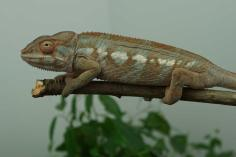
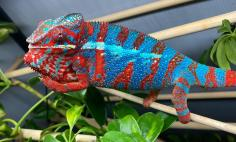
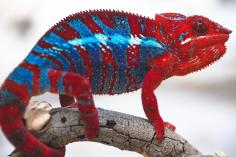
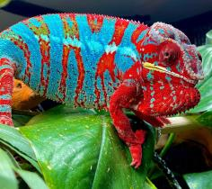
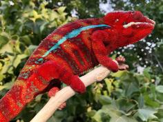
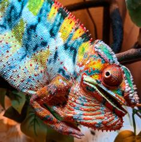
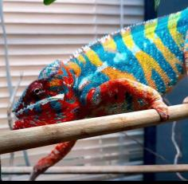
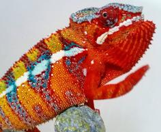
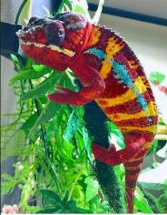
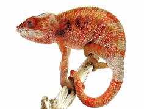

+++
title = "Robina"
date = "2022-03-07"
tags = ["robina", "clapton", "dynamiteTNT"]
categories = ["ambilobe-dams"]
banner = "img/ambilobe/robina/robina2"
+++



Robina is a female we acquired from Ramblin' Exotics Clapton x Layla pairing. Her sire, Clapton, and dam sire, DynamiteTNT, both have phenomenal blue bars which I believe will complement Ralph's really well. With any luck, a few Ralph clones could pop out because Robina is an RBBB x RBBB female. She has some interesting turquoise and subtle differences from most of my other females. She is awesome!



Filial
: *F3-CG14*

Sire
: [Clapton]()

Dam
: [Layla]()

---




  

    

      <h1>Ancestral Report for Robina (F3-CG14)</h1>
    

    <h3>Generation 1</h3>
    
    
1. <strong>Robina (F3-CG14). </strong>Robina was born on 2022-03-07 at Ramblin' Exotics.  She is the daughter of Clapton (F2-CG8) and Layla (F10-CG13). 

    
More about Robina (F3-CG14):

    
Adopted: 2022-06-07, iPardalis. 

    <h3>Generation 2</h3>
    
    
2. <strong>Clapton (F2-CG8). </strong>Clapton was born on 2020-10-18 at Kammerflage Kreations.  He is the son of Varatra (Thunderbolt) (F8) and So-Soa (So Beautiful) (F1). He had a relationship with Layla (F10-CG13). 

    
More about Clapton (F2-CG8):

    
Adopted: Ramblin' Exotics. 

    
3. <strong>Layla (F10-CG13). </strong>Layla was produced by Eye Candy Chameleons.  She is the daughter of Dynamite TNT (F9-CG12) and Mr America Jr's Daughter. 

    
More about Layla (F10-CG13):

    
Adopted: Ramblin' Exotics. 

    
Children of Layla (F10-CG13) and Clapton (F2-CG8)

    
i. Robina (F3-CG14) [1]. Robina was born on 2022-03-07 at Ramblin' Exotics.  

    <h3>Generation 3</h3>
    
    
4. <strong>Varatra (Thunderbolt) (F8). </strong>Varatra (Thunderbolt) was produced by Kammerflage Kreations.  He is the son of Dragona-manapoaka (Dragonfire). He had a relationship with So-Soa (So Beautiful) (F1). 

    
5. <strong>So-Soa (So Beautiful) (F1). </strong>So-Soa (So Beautiful) was produced by Kammerflage Kreations.  She is the daughter of Bakaina (Divergent) (WC). 

    
Children of So-Soa (So Beautiful) (F1) and Varatra (Thunderbolt) (F8)

    
i. Clapton (F2-CG8) [2]. Clapton was born on 2020-10-18 at Kammerflage Kreations.  

    
    
6. <strong>Dynamite TNT (F9-CG12). </strong>He is the son of (s)AINT (F8-CG11) and Rambo's Daughter. He had a relationship with Mr America Jr's Daughter. 

    
7. <strong>Mr America Jr's Daughter. </strong>Mr America Jr's Daughter was produced by Rose Exotic Reptiles.  She is the daughter of Mr America Jr and RBBB female. 

    
More about Mr America Jr's Daughter:

    
Adopted: Eye Candy Chameleons. 

    
Children of Mr America Jr's Daughter and Dynamite TNT (F9-CG12)

    
i. Layla (F10-CG13) [3]. Layla was produced by Eye Candy Chameleons.  

    <h3>Generation 4</h3>
    
    
8. <strong>Dragona-manapoaka (Dragonfire). </strong>Dragona-manapoaka (Dragonfire) was produced by Kammerflage Kreations.  He had a relationship with Unknown. 

    
Children of Unknown and Dragona-manapoaka (Dragonfire)

    
i. Varatra (Thunderbolt) (F8) [4]. Varatra (Thunderbolt) was produced by Kammerflage Kreations.  

    
    
10. <strong>Bakaina (Divergent) (WC). </strong>He had a relationship with Goavy (Guava) (F1). He also had a relationship with Unknown. 

    
More about Bakaina (Divergent) (WC):

    
Adopted: Kammerflage Kreations. 

    
Children of Goavy (Guava) (F1) and Bakaina (Divergent) (WC)

    
i. Hay-vao (Novel) (F1). Hay-vao (Novel) was produced by Kammerflage Kreations.  

    
Children of Unknown and Bakaina (Divergent) (WC)

    
i. So-Soa (So Beautiful) (F1) [5]. So-Soa (So Beautiful) was produced by Kammerflage Kreations.  

    
    
12. <strong>(s)AINT (F8-CG11). </strong>(s)AINT was produced by Joshua Illencik.  He is the son of Nergal and Dio's Daughter (F7-CG10). He had a relationship with Rambo's Daughter. 

    
13. <strong>Rambo's Daughter. </strong>Rambo's Daughter was produced by Joshua Illencik.  She is the daughter of Rambo. 

    
Children of Rambo's Daughter and (s)AINT (F8-CG11)

    
i. Dynamite TNT (F9-CG12) [6]. 

    
    
14. <strong>Mr America Jr. </strong>Mr America Jr was produced by Rose Exotic Reptiles.  He had a relationship with RBBB female. 

    
15. <strong>RBBB female. </strong>

    
Children of RBBB female and Mr America Jr

    
i. Mr America Jr's Daughter [7]. Mr America Jr's Daughter was produced by Rose Exotic Reptiles.  

    <h3>Generation 5</h3>
    
    
24. <strong>Nergal. </strong>He had a relationship with Dio's Daughter (F7-CG10). 

    
25. <strong>Dio's Daughter (F7-CG10). </strong>She is the daughter of Dio (F6-CG9). 

    
Children of Dio's Daughter (F7-CG10) and Nergal

    
i. (s)AINT (F8-CG11) [12]. (s)AINT was produced by Joshua Illencik.  

    
    
26. <strong>Rambo. </strong>Rambo was produced by Kammerflage Kreations.  He is the son of Miroborobo (Blaze) and Haran-dranomasina (Coral). He had a relationship with Candy Cane's daughter (F2). He also had a relationship with Unknown. 

    
More about Rambo:

    
Adopted: Kaz Chameleons. 

    
Children of Candy Cane's daughter (F2) and Rambo

    
i. Odin (F3). Odin was produced by Kaz Chameleons.  

    
Children of Unknown and Rambo

    
i. Rambo's Daughter [13]. Rambo's Daughter was produced by Joshua Illencik.  

    <h3>Generation 6</h3>
    
    
50. <strong>Dio (F6-CG9). </strong>He is the son of Kely-tongotra (Little Foot) (F5-CG8) and Eye Candy's daughter. He had a relationship with Zeratul's daughter. He also had a relationship with Unknown. He also had a relationship with Aphrodite. He also had a relationship with Unknown. 

    
Children of Zeratul's daughter and Dio (F6-CG9)

    
i. Stryfe (F7-CG10). Stryfe was produced by Joshua Illencik.  

    
Children of Unknown and Dio (F6-CG9)

    
i. Dio's daughter (F7-CG10. 

    
Children of Aphrodite and Dio (F6-CG9)

    
i. Dio's daughter (F7-CG10). 

    
Children of Unknown and Dio (F6-CG9)

    
i. Dio's Daughter (F7-CG10) [25]. 

    
    
52. <strong>Miroborobo (Blaze). </strong>Miroborobo (Blaze) was produced by Kammerflage Kreations.  He had a relationship with Little Foot's daughter. He also had a relationship with Haran-dranomasina (Coral). 

    
Children of Little Foot's daughter and Miroborobo (Blaze)

    
i. Jaky-fiposohana. Jaky-fiposohana was produced by Kammerflage Kreations.  

    
    
53. <strong>Haran-dranomasina (Coral). </strong>Haran-dranomasina (Coral) was produced by Kammerflage Kreations.  

    
Children of Haran-dranomasina (Coral) and Miroborobo (Blaze)

    
i. Rambo [26]. Rambo was produced by Kammerflage Kreations.  

    <h3>Generation 7</h3>
    
    
100. <strong>Kely-tongotra (Little Foot) (F5-CG8). </strong>Kely-tongotra (Little Foot) was produced by Kammerflage Kreations.  He is the son of Hatsikana (Legend). He had a relationship with Unknown. He also had a relationship with Unknown. He also had a relationship with Unknown. He also had a relationship with Eye Candy's daughter. He also had a relationship with Unknown. He also had a relationship with Unknown. He also had a relationship with Unknown. 

    
Children of Unknown and Kely-tongotra (Little Foot) (F5-CG8)

    
i. Little Foot's daughter. Little Foot's daughter was produced by Kammerflage Kreations.  

    
Children of Unknown and Kely-tongotra (Little Foot) (F5-CG8)

    
i. Faingana (Quick). Faingana (Quick) was produced by Kammerflage Kreations.  

    
Children of Unknown and Kely-tongotra (Little Foot) (F5-CG8)

    
i. Little Foot's daughter. Little Foot's daughter was produced by Kammerflage Kreations.  

    
Children of Unknown and Kely-tongotra (Little Foot) (F5-CG8)

    
i. Tsara-andro (Good Day) (F6-CG9). Tsara-andro (Good Day) was produced by Kammerflage Kreations.  

    
Children of Unknown and Kely-tongotra (Little Foot) (F5-CG8)

    
i. Maizina-lanitra (Dark Sky). Maizina-lanitra (Dark Sky) was produced by Kammerflage Kreations.  

    
Children of Unknown and Kely-tongotra (Little Foot) (F5-CG8)

    
i. Faingana (Quick). Faingana (Quick) was produced by Kammerflage Kreations.  

    
101. <strong>Eye Candy's daughter. </strong>Eye Candy's daughter was produced by Kammerflage Kreations.  She is the daughter of Maso-vatomamy (Eye Candy). 

    
Children of Eye Candy's daughter and Kely-tongotra (Little Foot) (F5-CG8)

    
i. Dio (F6-CG9) [50]. 

    <h3>Generation 8</h3>
    
    
200. <strong>Hatsikana (Legend). </strong>Hatsikana (Legend) was produced by Kammerflage Kreations.  He had a relationship with Unknown. 

    
Children of Unknown and Hatsikana (Legend)

    
i. Kely-tongotra (Little Foot) (F5-CG8) [100]. Kely-tongotra (Little Foot) was produced by Kammerflage Kreations.  

    
    
202. <strong>Maso-vatomamy (Eye Candy). </strong>Maso-vatomamy (Eye Candy) was produced by Kammerflage Kreations.  He had a relationship with Unknown. He also had a relationship with Unknown. 

    
Children of Unknown and Maso-vatomamy (Eye Candy)

    
i. Eye Candy's daughter [101]. Eye Candy's daughter was produced by Kammerflage Kreations.  

    
Children of Unknown and Maso-vatomamy (Eye Candy)

    
i. Mabonika-haboka (Mellow Yellow). Mabonika-haboka (Mellow Yellow) was produced by Kammerflage Kreations.  

  



