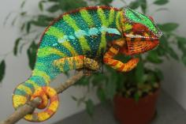

+++
title = "sideshow"
header_title = "sideshow | Yellow Body Blue Bar | Ambilobe Panther Chameleon"
date = "2023-03-17"
tags = ["sideshow", "cadillac", "atlas", "amarillo"]
categories = ["ambilobe-sires"]
banner = "img/ambilobe/sideshow/sideshow"
+++



Sideshow is one of the most vibrant YBBB Ambilobe I have ever seen. He has clean yellows and electric blues. His personality is also quite quirky, and I am not surprised when he tries to bite a branch that he is perched on. Gotta keep your wits about you when handling Sideshow lol... Longshot Chameleons hit on a jackpot with this guy and we are very lucky to work him into our lineup. Can't wait to see what he produces for us!



Filial
: *F5-CG14*

Sire
: [Cadillac]()

Dam
: [Jane]()

---




  

    

      <h1>Ancestral Report for Sideshow (F5-CG14)</h1>
    

    <h3>Generation 1</h3>
    
    
1. <strong>Sideshow (F5-CG14). </strong>Sideshow was born on 2023-03-17 at Longshot Chameleons.  He is the son of Cadillac (F4-CG13) and Jane (F4-CG6). 

    
More about Sideshow (F5-CG14):

    
Adopted: iPardalis. 

    <h3>Generation 2</h3>
    
    
2. <strong>Cadillac (F4-CG13). </strong>Cadillac was born on 2021-10-17 at iPardalis.  He is the son of Arti (F3-CG12) and Daisy (F3-CG4). He had a relationship with Jane (F4-CG6). 

    
More about Cadillac (F4-CG13):

    
Adopted: Longshot Chameleons. 

    
3. <strong>Jane (F4-CG6). </strong>She is the daughter of Atlas and Medusa (F3-CG5). 

    
Children of Jane (F4-CG6) and Cadillac (F4-CG13)

    
i. Cadi (F5-CG14). Cadi was born on 2023-03-17 at Longshot Chameleons.  

    
ii. Smiles (F5-CG14). Smiles was born on 2023-03-17 at Longshot Chameleons.  

    
iii. Sideshow (F5-CG14) [1]. Sideshow was born on 2023-03-17 at Longshot Chameleons.  

    <h3>Generation 3</h3>
    
    
4. <strong>Arti (F3-CG12). </strong>Arti was born on 2020-04-05 at Brian Stewart.  He is the son of Artemis (F8-CG11) and Felipe Sanchez's daughter (F2-CG3). He had a relationship with Alla (F8-CG11). He also had a relationship with Daisy (F3-CG4). He also had a relationship with Lilly (F3-CG4). 

    
Children of Alla (F8-CG11) and Arti (F3-CG12)

    
i. Dehibe (F4-CG13). Dehibe was born on 2021-10-15 at iPardalis.  

    
ii. Artalla (F4-CG13). Artalla was born on 2021-10-15 at iPardalis.  

    
Children of Lilly (F3-CG4) and Arti (F3-CG12)

    
i. Artilly (F4-CG13). Artilly was born on 2022-02-03 at iPardalis.  

    
    
5. <strong>Daisy (F3-CG4). </strong>Daisy was born on 2019-06-05 at iPardalis.  She is the daughter of Jude (F2-CG3) and Kako (F2). 

    
Children of Daisy (F3-CG4) and Arti (F3-CG12)

    
i. Ghost (F4-CG13). Ghost was born on 2021-10-17 at iPardalis.  

    
ii. Cadillac (F4-CG13) [2]. Cadillac was born on 2021-10-17 at iPardalis.  

    
    
6. <strong>Atlas. </strong>Atlas was produced by Sunset Chameleons.  He is the son of Waldo and Dora. He had a relationship with Medusa (F3-CG5). 

    
    
7. <strong>Medusa (F3-CG5). </strong>She is the daughter of Amarillo (F2) and Felipe Sanchez's daughter (F2-CG4). 

    
Children of Medusa (F3-CG5) and Atlas

    
i. Jane (F4-CG6) [3]. 

    <h3>Generation 4</h3>
    
    
8. <strong>Artemis (F8-CG11). </strong>He is the son of Fantara (Falling Star) (F7-CG10) and Zazabodo-manga (Baby Blue). He had a relationship with Felipe Sanchez's daughter (F2-CG3). He also had a relationship with Felipe Sanchez's Daughter (F2-CG3). 

    
Children of Felipe Sanchez's Daughter (F2-CG3) and Artemis (F8-CG11)

    
i. Artemis's Daughter (F3-CG12). Artemis's Daughter was produced by Brian Stewart.  

    
9. <strong>Felipe Sanchez's daughter (F2-CG3). </strong>Felipe Sanchez's daughter was produced by Chromatic Chameleons.  She is the daughter of Felipe Sanchez (F1-CG2) and Snapjacks (F3-CG3). 

    
Children of Felipe Sanchez's daughter (F2-CG3) and Artemis (F8-CG11)

    
i. Arti (F3-CG12) [4]. Arti was born on 2020-04-05 at Brian Stewart.  

    
ii. Amara (F3-CG12). Amara was born on 2020-04-05 at Brian Stewart.  

    
    
10. <strong>Jude (F2-CG3). </strong>Jude was born on 2017-10-17 at iPardalis.  He is the son of Flash (F1) and Judy (F2). He had a relationship with Kako (F2). He also had a relationship with Alla (F8-CG11). 

    
Children of Alla (F8-CG11) and Jude (F2-CG3)

    
i. Blossom (F3-CG12). Blossom was born on 2019-07-09 at iPardalis.  

    
ii. Clyde (F3-CG12). Clyde was born on 2019-07-09 at iPardalis.  

    
iii. M11. M11 was born on 2019-11-20.  

    
iv. Alfred (F3-CG12). Alfred was born on 2019-10-20 at iPardalis.  

    
v. Jack (F3-CG12). Jack was born on 2019-10-20 at iPardalis.  

    
vi. Button (F3-CG12). Button was born on 2019-07-09 at iPardalis.  

    
vii. Bubbles (F3-CG12). Bubbles (F3-CG12) was born on 2019-07-09 at iPardalis.  

    
viii. Mondrian (F3-CG12). Mondrian was born on 2019-08-16 at iPardalis.  

    
ix. Toby (F3-CG12). Toby was born on 2019-07-09 at iPardalis.  

    
x. Tigravavy (F3-CG12). Tigravavy was born on 2019-12-12 at iPardalis.  

    
    
11. <strong>Kako (F2). </strong>Kako was born on 2017-11-21 at Panther Creek Chameleons.  She died on 2020-02-05 at iPardalis at the age of 2 years, 2 months.  She was the daughter of Sparkles (F1) and Leo's daughter. 

    
Children of Kako (F2) and Jude (F2-CG3)

    
i. Nugget (F3-CG4). Nugget was born on 2019-06-05 at iPardalis.  

    
ii. Patch (F3-CG4). Patch was born on 2019-06-05 at iPardalis.  

    
iii. Sunny (F3-CG4). Sunny was born on 2019-06-05 at iPardalis.  

    
iv. Zelda (F3-CG4). Zelda was born on 2019-06-05 at iPardalis.  

    
v. Tonka (F3-CG4). Tonka was born on 2019-06-05 at iPardalis.  

    
vi. Lilly (F3-CG4). Lilly was born on 2019-06-05 at iPardalis.  

    
vii. Daisy (F3-CG4) [5]. Daisy was born on 2019-06-05 at iPardalis.  

    
viii. Padi. Padi was born on 2019-06-05 at iPardalis.  

    
    
12. <strong>Waldo. </strong>He is the son of Higgins and Bentley's daughter. He had a relationship with Dora. 

    
    
13. <strong>Dora. </strong>She is the daughter of Magneto. 

    
Children of Dora and Waldo

    
i. Atlas [6]. Atlas was produced by Sunset Chameleons.  

    
    
14. <strong>Amarillo (F2). </strong>Amarillo (F2) was produced by Bobby Ruddock.  He is the son of Sparkles (F1) and Leo's daughter. He had a relationship with Felipe Sanchez's daughter (F2-CG4). 

    
15. <strong>Felipe Sanchez's daughter (F2-CG4). </strong>She is the daughter of Felipe Sanchez (F1-CG2) and Snapjacks (F3-CG3). 

    
Children of Felipe Sanchez's daughter (F2-CG4) and Amarillo (F2)

    
i. Mavokely (F3-CG5). Mavokely was born on 2019-11-12 at Bobby Ruddock.  

    
ii. Maitso (F3-CG5). 

    
iii. Medusa (F3-CG5) [7]. 

    <h3>Generation 5</h3>
    
    
16. <strong>Fantara (Falling Star) (F7-CG10). </strong>Fantara (Falling Star) was produced by Kammerflage Kreations.  He is the son of Maizina-lanitra (Dark Sky). He had a relationship with Zazabodo-manga (Baby Blue). He also had a relationship with Mavo-loha (Blondie). He also had a relationship with Unknown. 

    
Children of Mavo-loha (Blondie) and Fantara (Falling Star) (F7-CG10)

    
i. Hamy (Sweetness) F8-CG11. Hamy (Sweetness) was produced by Kammerflage Kreations.  

    
ii. Ajax (F8-CG11). Ajax was produced by Kammerflage Kreations.  

    
iii. Roa-ony (Two Rivers) (F8-CG11). Roa-ony (Two Rivers) was produced by Kammerflage Kreations.  

    
Children of Unknown and Fantara (Falling Star) (F7-CG10)

    
i. Fantara's daughter (F8-CG11). 

    
17. <strong>Zazabodo-manga (Baby Blue). </strong>Zazabodo-manga (Baby Blue) was born on 2018-01-01 at Kammerflage Kreations.  She is the daughter of Telo-heny (Triple). 

    
Children of Zazabodo-manga (Baby Blue) and Fantara (Falling Star) (F7-CG10)

    
i. Artemis (F8-CG11) [8]. 

    
    
18. <strong>Felipe Sanchez (F1-CG2). </strong>He is the son of Bolt (WC) and Cowboy's daughter (F1). He had a relationship with Snapjacks (F3-CG3). He also had a relationship with Unknown. He also had a relationship with JJ's daughter (F8-CG12). 

    
Children of Unknown and Felipe Sanchez (F1-CG2)

    
i. Felipe Sanchez's Daughter (F2-CG3). Felipe Sanchez's Daughter was produced by Chromatic Chameleons.  

    
Children of JJ's daughter (F8-CG12) and Felipe Sanchez (F1-CG2)

    
i. Capella (F2-CG13). Capella was produced by Chromatic Chameleons.  

    
19. <strong>Snapjacks (F3-CG3). </strong>She is the daughter of Macho (F2-CG2) and 24k's daughter. 

    
Children of Snapjacks (F3-CG3) and Felipe Sanchez (F1-CG2)

    
i. Emma Frost (F2-CG4). Emma Frost was produced by Chromatic Chameleons.  

    
ii. Felipe Sanchez's daughter (F2-CG4) [15]. 

    
iii. Felipe Sanchez's daughter (F2-CG3) [9]. Felipe Sanchez's daughter was produced by Chromatic Chameleons.  

    
    
20. <strong>Flash (F1). </strong>Flash was born on 2015-01-10 at Chameleon's Paradise.  He died on 2018-06-14 at iPardalis at the age of 3 years, 5 months.  He was the son of Cowboy (CH) and King's daughter. He had a relationship with Judy (F2). 

    
    
21. <strong>Judy (F2). </strong>Judy was born on 2015-02-11 at Chameleon's Paradise.  She died on 2018-02-15 at iPardalis at the age of 3 years, 4 days.  She was the daughter of Candy Cane (F1) and Jake's daughter. 

    
Children of Judy (F2) and Flash (F1)

    
i. Jude (F2-CG3) [10]. Jude was born on 2017-10-17 at iPardalis.  

    
ii. Bane. Bane was born on 2017-10-17.  

    
iii. Nick. Nick was born on 2017-10-17 at iPardalis.  

    
iv. Giant3. Giant3 was born on 2017-10-17 at iPardalis.  

    
    
22. <strong>Sparkles (F1). </strong>Sparkles was produced by Bobby Ruddock.  He was the son of Loki and Unknown - WC. He had a relationship with Leo's daughter. He also had a relationship with Sasha. 

    
Children of Sasha and Sparkles (F1)

    
i. Perregrin (aka Pyro)(F2). Perregrin (aka Pyro)(F2) was produced by Bobby Ruddock.  

    
23. <strong>Leo's daughter. </strong>Leo's daughter was produced by The Panther Company.  She died on 2018-12-23 at Bobby Ruddock.  She was the daughter of Leo. 

    
Children of Leo's daughter and Sparkles (F1)

    
i. Kako (F2) [11]. Kako was born on 2017-11-21 at Panther Creek Chameleons.  She died on 2020-02-05 at iPardalis.  

    
ii. Amarillo (F2) [14]. Amarillo (F2) was produced by Bobby Ruddock.  

    
    
24. <strong>Higgins. </strong>He had a relationship with Unknown. He also had a relationship with Candy Cane's Daughter (F2). He also had a relationship with Bentley's daughter. 

    
Children of Unknown and Higgins

    
i. Higgin's daughter. 

    
Children of Candy Cane's Daughter (F2) and Higgins

    
i. Miss Piggy (F3). Miss Piggy (F3) was produced by Jungle Panthers.  

    
25. <strong>Bentley's daughter. </strong>She is the daughter of Bentley. 

    
Children of Bentley's daughter and Higgins

    
i. Waldo [12]. 

    
    
26. <strong>Magneto. </strong>He had a relationship with Unknown. 

    
Children of Unknown and Magneto

    
i. Dora [13]. 

    
    
28. <strong>Sparkles (F1). </strong> is the same person as [22].

    
29. <strong>Leo's daughter. </strong> is the same person as [23].

    
    
30. <strong>Felipe Sanchez (F1-CG2). </strong> is the same person as [18].

    
31. <strong>Snapjacks (F3-CG3). </strong> is the same person as [19].

    <h3>Generation 6</h3>
    
    
32. <strong>Maizina-lanitra (Dark Sky). </strong>Maizina-lanitra (Dark Sky) was produced by Kammerflage Kreations.  He is the son of Kely-tongotra (Little Foot) (F5-CG8). He had a relationship with Unknown. He also had a relationship with Unknown. 

    
Children of Unknown and Maizina-lanitra (Dark Sky)

    
i. Fantara (Falling Star) (F7-CG10) [16]. Fantara (Falling Star) was produced by Kammerflage Kreations.  

    
Children of Unknown and Maizina-lanitra (Dark Sky)

    
i. Bolitika-zandry (Little Sister). Bolitika-zandry (Little Sister) was produced by Kammerflage Kreations.  

    
    
34. <strong>Telo-heny (Triple). </strong>Telo-heny (Triple) was born on 2015-01-15 at Kammerflage Kreations.  He is the son of Dobo (Double). He had a relationship with Unknown. He also had a relationship with Unknown. He also had a relationship with Unknown. 

    
Children of Unknown and Telo-heny (Triple)

    
i. Triple's daughter. Triple's daughter was produced by Kammerflage Kreations.  

    
Children of Unknown and Telo-heny (Triple)

    
i. Zazabodo-manga (Baby Blue) [17]. Zazabodo-manga (Baby Blue) was born on 2018-01-01 at Kammerflage Kreations.  

    
Children of Unknown and Telo-heny (Triple)

    
i. Telo Heny's daughter. 

    
    
36. <strong>Bolt (WC). </strong>Bolt was produced by Canvas Chameleons.  He had a relationship with Cowboy's daughter (F1). He also had a relationship with Test (F1). 

    
Children of Test (F1) and Bolt (WC)

    
i. Sunkist (F1-CG2). Sunkist was produced by Canvas Chameleons.  

    
37. <strong>Cowboy's daughter (F1). </strong>Cowboy's daughter was produced by Chameleon's Paradise.  She is the daughter of Cowboy (CH). 

    
Children of Cowboy's daughter (F1) and Bolt (WC)

    
i. Felipe Sanchez (F1-CG2) [30]. 

    
    
38. <strong>Macho (F2-CG2). </strong>He is the son of Candy Cane (F1) and Cowboy's daughter (F1). He had a relationship with 24k's daughter. 

    
39. <strong>24k's daughter. </strong>24k's daughter was produced by Chameleon's Paradise.  She is the daughter of 24k. 

    
Children of 24k's daughter and Macho (F2-CG2)

    
i. Wetdream (F3). 

    
ii. Snapjacks (F3-CG3) [31]. 

    
    
40. <strong>Cowboy (CH). </strong>Cowboy was produced by Chameleon's Paradise.  He died on 2015-01-01 at Chameleon's Paradise.  He had a relationship with King's daughter. He also had a relationship with Unknown. He also had a relationship with Unknown. He also had a relationship with Unknown. 

    
Children of Unknown and Cowboy (CH)

    
i. Cowboy's daughter (F1). 

    
Children of Unknown and Cowboy (CH)

    
i. Cowboy's daughter (F1). Cowboy's daughter was produced by Chameleon's Paradise.  

    
Children of Unknown and Cowboy (CH)

    
i. Cowboy's daughter (F1). 

    
41. <strong>King's daughter. </strong>King's daughter was produced by Chameleon's Paradise.  She died with Chameleon's Paradise.  She was the daughter of King. 

    
Children of King's daughter and Cowboy (CH)

    
i. Flash (F1) [20]. Flash was born on 2015-01-10 at Chameleon's Paradise.  He died on 2018-06-14 at iPardalis.  

    
    
42. <strong>Candy Cane (F1). </strong>Candy Cane was produced by Chameleon's Paradise.  He had a relationship with Jake's daughter. He also had a relationship with Cowboy's daughter (F1). He also had a relationship with Unknown. He also had a relationship with Cowboy's daughter (F1). 

    
Children of Unknown and Candy Cane (F1)

    
i. Candy Cane's Daughter (F2). 

    
Children of Cowboy's daughter (F1) and Candy Cane (F1)

    
i. Candy Cane's daughter (F2). 

    
43. <strong>Jake's daughter. </strong>Jake's daughter was produced by Chameleon's Paradise.  She is the daughter of Jake (F1). 

    
Children of Jake's daughter and Candy Cane (F1)

    
i. Judy (F2) [21]. Judy was born on 2015-02-11 at Chameleon's Paradise.  She died on 2018-02-15 at iPardalis.  

    
    
44. <strong>Loki. </strong>Loki was produced by The Panther Baron.  He is the son of Loza and Flaming River's daughter. He had a relationship with Unknown - WC. 

    
45. <strong>Unknown - WC. </strong>Unknown was produced by Bobby Ruddock.  

    
Children of Unknown - WC and Loki

    
i. Sparkles (F1) [28]. Sparkles was produced by Bobby Ruddock.  

    
    
46. <strong>Leo. </strong>Leo was produced by The Panther Company.  He had a relationship with Unknown. 

    
Children of Unknown and Leo

    
i. Leo's daughter [29]. Leo's daughter was produced by The Panther Company.  She died on 2018-12-23 at Bobby Ruddock.  

    
    
50. <strong>Bentley. </strong>He had a relationship with Unknown. 

    
Children of Unknown and Bentley

    
i. Bentley's daughter [25]. 

    
    
56. <strong>Loki. </strong> is the same person as [44].

    
57. <strong>Unknown - WC. </strong> is the same person as [45].

    
    
58. <strong>Leo. </strong> is the same person as [46].

    
    
60. <strong>Bolt (WC). </strong> is the same person as [36].

    
61. <strong>Cowboy's daughter (F1). </strong> is the same person as [37].

    
    
62. <strong>Macho (F2-CG2). </strong> is the same person as [38].

    
63. <strong>24k's daughter. </strong> is the same person as [39].

    <h3>Generation 7</h3>
    
    
64. <strong>Kely-tongotra (Little Foot) (F5-CG8). </strong>Kely-tongotra (Little Foot) was produced by Kammerflage Kreations.  He is the son of Hatsikana (Legend). He had a relationship with Unknown. He also had a relationship with Unknown. He also had a relationship with Unknown. He also had a relationship with Eye Candy's daughter. He also had a relationship with Unknown. He also had a relationship with Unknown. He also had a relationship with Unknown. 

    
Children of Unknown and Kely-tongotra (Little Foot) (F5-CG8)

    
i. Little Foot's daughter. Little Foot's daughter was produced by Kammerflage Kreations.  

    
Children of Unknown and Kely-tongotra (Little Foot) (F5-CG8)

    
i. Faingana (Quick). Faingana (Quick) was produced by Kammerflage Kreations.  

    
Children of Unknown and Kely-tongotra (Little Foot) (F5-CG8)

    
i. Little Foot's daughter. Little Foot's daughter was produced by Kammerflage Kreations.  

    
Children of Eye Candy's daughter and Kely-tongotra (Little Foot) (F5-CG8)

    
i. Dio (F6-CG9). 

    
Children of Unknown and Kely-tongotra (Little Foot) (F5-CG8)

    
i. Tsara-andro (Good Day) (F6-CG9). Tsara-andro (Good Day) was produced by Kammerflage Kreations.  

    
Children of Unknown and Kely-tongotra (Little Foot) (F5-CG8)

    
i. Maizina-lanitra (Dark Sky) [32]. Maizina-lanitra (Dark Sky) was produced by Kammerflage Kreations.  

    
Children of Unknown and Kely-tongotra (Little Foot) (F5-CG8)

    
i. Faingana (Quick). Faingana (Quick) was produced by Kammerflage Kreations.  

    
68. <strong>Dobo (Double). </strong>He had a relationship with Unknown. 

    
Children of Unknown and Dobo (Double)

    
i. Telo-heny (Triple) [34]. Telo-heny (Triple) was born on 2015-01-15 at Kammerflage Kreations.  

    
    
74. <strong>Cowboy (CH). </strong> is the same person as [40].

    
    
76. <strong>Candy Cane (F1). </strong> is the same person as [42].

    
77. <strong>Cowboy's daughter (F1). </strong>She is the daughter of Cowboy (CH). 

    
Children of Cowboy's daughter (F1) and Candy Cane (F1)

    
i. Macho (F2-CG2) [62]. 

    
    
78. <strong>24k. </strong>24k was produced by Chameleon's Paradise.  He had a relationship with Unknown. 

    
Children of Unknown and 24k

    
i. 24k's daughter [63]. 24k's daughter was produced by Chameleon's Paradise.  

    
    
82. <strong>King. </strong>He had a relationship with Unknown. 

    
Children of Unknown and King

    
i. King's daughter [41]. King's daughter was produced by Chameleon's Paradise.  She died with Chameleon's Paradise.  

    
    
86. <strong>Jake (F1). </strong>Jake was produced by Chameleon's Paradise.  He had a relationship with Unknown. 

    
Children of Unknown and Jake (F1)

    
i. Jake's daughter [43]. Jake's daughter was produced by Chameleon's Paradise.  

    
    
88. <strong>Loza. </strong>Loza was produced by Kammerflage Kreations.  He had a relationship with Flaming River's daughter. 

    
89. <strong>Flaming River's daughter. </strong>Flaming River's daughter was produced by Kammerflage Kreations.  She is the daughter of Flaming River. 

    
Children of Flaming River's daughter and Loza

    
i. Loki [56]. Loki was produced by The Panther Baron.  

    
    
112. <strong>Loza. </strong> is the same person as [88].

    
113. <strong>Flaming River's daughter. </strong> is the same person as [89].

    
    
122. <strong>Cowboy (CH). </strong> is the same person as [40].

    
    
124. <strong>Candy Cane (F1). </strong> is the same person as [42].

    
125. <strong>Cowboy's daughter (F1). </strong> is the same person as [77].

    
    
126. <strong>24k. </strong> is the same person as [78].

    <h3>Generation 8</h3>
    
    
128. <strong>Hatsikana (Legend). </strong>Hatsikana (Legend) was produced by Kammerflage Kreations.  He had a relationship with Unknown. 

    
Children of Unknown and Hatsikana (Legend)

    
i. Kely-tongotra (Little Foot) (F5-CG8) [64]. Kely-tongotra (Little Foot) was produced by Kammerflage Kreations.  

    
    
154. <strong>Cowboy (CH). </strong> is the same person as [40].

    
    
178. <strong>Flaming River. </strong>Flaming River was produced by Kammerflage Kreations.  He had a relationship with Unknown. 

    
Children of Unknown and Flaming River

    
i. Flaming River's daughter [113]. Flaming River's daughter was produced by Kammerflage Kreations.  

    
    
226. <strong>Flaming River. </strong> is the same person as [178].

    
    
250. <strong>Cowboy (CH). </strong> is the same person as [40].

  



