+++
title = "tana"
header_title = "tana | Yellow Body Blue Bar | Ambilobe Panther Chameleon"
date = "2023-10-09"
tags = ["tana", "jimanga", "capella", "kintana", "manga"]
categories = ["ambilobe-dams"]
banner = "img/ambilobe/tana/tana2"
+++



Tana is a gorgeous female Ambilobe Panther Chameleon with nice purples and a body structure which reminds me of Manga and Jimanga. Her dam, Kintana, had a lot more orange so we selected for the purples which originated back in our 2019 female named Patch. We're very excited to see the YBBB potential in her - she has an amazing pedigree!x



Filial
: *F4-CG15*

Sire
: [Jimanga]()

Dam
: [Kintana]()

---




  

    

      <h1>Ancestral Report for Tana (F4-CG15)</h1>
    

    <h3>Generation 1</h3>
    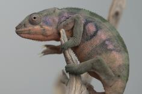
    
1. <strong>Tana (F4-CG15). </strong>Tana was born on 2023-10-09 at iPardalis.  She is the daughter of Jimanga (F4-CG14) and Kintana (F3-CG14). 

    <h3>Generation 2</h3>
    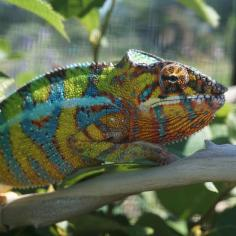
    
2. <strong>Jimanga (F4-CG14). </strong>Jimanga was born on 2021-12-03 at iPardalis.  He is the son of Manga (F4-CG12) and Imelda (F3-CG13). He had a relationship with Kintana (F3-CG14). 

    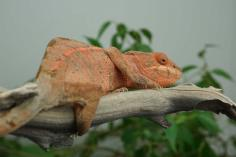
    
3. <strong>Kintana (F3-CG14). </strong>Kintana was born on 2022-07-31 at Chromatic Chameleons.  She is the daughter of Capella (F2-CG13) and Kromatisk's daughter (F9-CG13). 

    
More about Kintana (F3-CG14):

    
Adopted: 2022-11-29, iPardalis. 

    
Children of Kintana (F3-CG14) and Jimanga (F4-CG14)

    
i. Tana (F4-CG15) [1]. Tana was born on 2023-10-09 at iPardalis.  

    <h3>Generation 3</h3>
    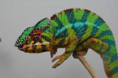
    
4. <strong>Manga (F4-CG12). </strong>Manga was born on 2020-10-28 at iPardalis.  He is the son of Bleu (F3-CG11) and Patch (F3-CG4). He had a relationship with Imelda (F3-CG13). 

    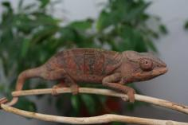
    
5. <strong>Imelda (F3-CG13). </strong>Imelda was born on 2020-12-03 at Ramblin' Exotics.  She is the daughter of Hendrix (F2-CG4) and Foxey (F9-CG12). 

    
More about Imelda (F3-CG13):

    
Adopted: 2021-03-15, iPardalis. 

    
Children of Imelda (F3-CG13) and Manga (F4-CG12)

    
i. Jimanga (F4-CG14) [2]. Jimanga was born on 2021-12-03 at iPardalis.  

    
ii. Jimelda (F4-CG14). Jimelda was born on 2021-12-03 at iPardalis.  

    
Children of Imelda (F3-CG13) and Jackson (F4-CG13)

    
i. Mr. Pickles. Mr. Pickles was born on 2022-11-14 at iPardalis.  

    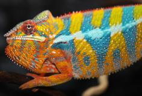
    
6. <strong>Capella (F2-CG13). </strong>Capella was produced by Chromatic Chameleons.  He is the son of Felipe Sanchez (F1-CG2) and JJ's daughter (F8-CG12). He had a relationship with Kromatisk's daughter (F9-CG13). 

    
7. <strong>Kromatisk's daughter (F9-CG13). </strong>She is the daughter of Kromatisk (F8-CG12) and Xanthos' daughter. 

    
Children of Kromatisk's daughter (F9-CG13) and Capella (F2-CG13)

    
i. Kintana (F3-CG14) [3]. Kintana was born on 2022-07-31 at Chromatic Chameleons.  

    <h3>Generation 4</h3>
    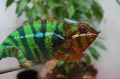
    
8. <strong>Bleu (F3-CG11). </strong>Bleu was born on 2019-07-15 at Brightside Chameleons.  He is the son of Stryfe (F7-CG10) and Emma Frost (F2-CG4). He had a relationship with Patch (F3-CG4). 

    
More about Bleu (F3-CG11):

    
Adopted: 2019-12-15, iPardalis. 

    
    
9. <strong>Patch (F3-CG4). </strong>Patch was born on 2019-06-05 at iPardalis.  She is the daughter of Jude (F2-CG3) and Kako (F2). 

    
Children of Patch (F3-CG4) and Bleu (F3-CG11)

    
i. Manga (F4-CG12) [4]. Manga was born on 2020-10-28 at iPardalis.  

    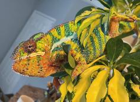
    
10. <strong>Hendrix (F2-CG4). </strong>Hendrix was produced by Tropical Chameleons.  He is the son of Dante (F1-CG3) and Sunkist (F1-CG2). He had a relationship with Foxey (F9-CG12). 

    
More about Hendrix (F2-CG4):

    
Adopted: Ramblin' Exotics. 

    
    
11. <strong>Foxey (F9-CG12). </strong>Foxey was produced by Kammerflage Kreations.  She is the daughter of Landy (Silk) F8-CG11 and Hamy (Sweetness) F8-CG11. 

    
More about Foxey (F9-CG12):

    
Adopted: Ramblin' Exotics. 

    
Children of Foxey (F9-CG12) and Hendrix (F2-CG4)

    
i. Coco (F3-CG13). Coco was born on 2020-12-03 at Ramblin' Exotics.  

    
ii. Imelda (F3-CG13) [5]. Imelda was born on 2020-12-03 at Ramblin' Exotics.  

    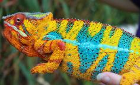
    
12. <strong>Felipe Sanchez (F1-CG2). </strong>He is the son of Bolt (WC) and Cowboy's daughter (F1). He had a relationship with Snapjacks (F3-CG3). He also had a relationship with Unknown. He also had a relationship with JJ's daughter (F8-CG12). 

    
Children of Unknown and Felipe Sanchez (F1-CG2)

    
i. Felipe Sanchez's Daughter (F2-CG3). Felipe Sanchez's Daughter was produced by Chromatic Chameleons.  

    
13. <strong>JJ's daughter (F8-CG12). </strong>She is the daughter of JJ (F7-CG10) and Daisy (F8-CG11). 

    
Children of JJ's daughter (F8-CG12) and Felipe Sanchez (F1-CG2)

    
i. Capella (F2-CG13) [6]. Capella was produced by Chromatic Chameleons.  

    
    
14. <strong>Kromatisk (F8-CG12). </strong>Kromatisk was born on 2018-08-26 at Chromatic Chameleons.  He is the son of JJ (F7-CG10) and Daisy (F8-CG11). He had a relationship with Jackie (F4). He also had a relationship with Shirley (F9-CG12). He also had a relationship with Xanthos' daughter. 

    
Children of Jackie (F4) and Kromatisk (F8-CG12)

    
i. Loko (F5-CG13). Loko was born on 2020-04-18 at Chromatic Chameleons.  

    
Children of Shirley (F9-CG12) and Kromatisk (F8-CG12)

    
i. Lokana (F9-CG13). Lokana was born on 2020-12-02 at Chromatic Chameleons.  

    
15. <strong>Xanthos' daughter. </strong>Xanthos' daughter was produced by Chromatic Chameleons.  She is the daughter of Xanthos and Sienna. 

    
Children of Xanthos' daughter and Kromatisk (F8-CG12)

    
i. Kromatisk's daughter (F9-CG13) [7]. 

    <h3>Generation 5</h3>
    
    
16. <strong>Stryfe (F7-CG10). </strong>Stryfe was produced by Joshua Illencik.  He is the son of Dio (F6-CG9) and Zeratul's daughter. He had a relationship with Emma Frost (F2-CG4). He also had a relationship with Higgin's daughter. He also had a relationship with Kammer's Female. 

    
More about Stryfe (F7-CG10):

    
Adopted: Brightside Chameleons. 

    
Children of Higgin's daughter and Stryfe (F7-CG10)

    
i. Stryfe's daughter (F8-CG11). 

    
Children of Kammer's Female and Stryfe (F7-CG10)

    
i. McNulty (F8-CG11). McNulty was produced by Brian Stewart.  

    
17. <strong>Emma Frost (F2-CG4). </strong>Emma Frost was produced by Chromatic Chameleons.  She is the daughter of Felipe Sanchez (F1-CG2) and Snapjacks (F3-CG3). 

    
Children of Emma Frost (F2-CG4) and Stryfe (F7-CG10)

    
i. Bleu (F3-CG11) [8]. Bleu was born on 2019-07-15 at Brightside Chameleons.  

    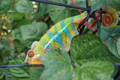
    
18. <strong>Jude (F2-CG3). </strong>Jude was born on 2017-10-17 at iPardalis.  He is the son of Flash (F1) and Judy (F2). He had a relationship with Kako (F2). He also had a relationship with Alla (F8-CG11). 

    
Children of Alla (F8-CG11) and Jude (F2-CG3)

    
i. Blossom (F3-CG12). Blossom was born on 2019-07-09 at iPardalis.  

    
ii. Clyde (F3-CG12). Clyde was born on 2019-07-09 at iPardalis.  

    
iii. M11. M11 was born on 2019-11-20.  

    
iv. Alfred (F3-CG12). Alfred was born on 2019-10-20 at iPardalis.  

    
v. Jack (F3-CG12). Jack was born on 2019-10-20 at iPardalis.  

    
vi. Button (F3-CG12). Button was born on 2019-07-09 at iPardalis.  

    
vii. Bubbles (F3-CG12). Bubbles (F3-CG12) was born on 2019-07-09 at iPardalis.  

    
viii. Mondrian (F3-CG12). Mondrian was born on 2019-08-16 at iPardalis.  

    
ix. Toby (F3-CG12). Toby was born on 2019-07-09 at iPardalis.  

    
x. Tigravavy (F3-CG12). Tigravavy was born on 2019-12-12 at iPardalis.  

    
    
19. <strong>Kako (F2). </strong>Kako was born on 2017-11-21 at Panther Creek Chameleons.  She died on 2020-02-05 at iPardalis at the age of 2 years, 2 months.  She was the daughter of Sparkles (F1) and Leo's daughter. 

    
Children of Kako (F2) and Jude (F2-CG3)

    
i. Nugget (F3-CG4). Nugget was born on 2019-06-05 at iPardalis.  

    
ii. Patch (F3-CG4) [9]. Patch was born on 2019-06-05 at iPardalis.  

    
iii. Sunny (F3-CG4). Sunny was born on 2019-06-05 at iPardalis.  

    
iv. Zelda (F3-CG4). Zelda was born on 2019-06-05 at iPardalis.  

    
v. Tonka (F3-CG4). Tonka was born on 2019-06-05 at iPardalis.  

    
vi. Lilly (F3-CG4). Lilly was born on 2019-06-05 at iPardalis.  

    
vii. Daisy (F3-CG4). Daisy was born on 2019-06-05 at iPardalis.  

    
viii. Padi. Padi was born on 2019-06-05 at iPardalis.  

    
    
20. <strong>Dante (F1-CG3). </strong>Dante was produced by Brightside Chameleons.  He is the son of Gambit (WC) and Polaris (F1-CG2). He had a relationship with Sunkist (F1-CG2). 

    
More about Dante (F1-CG3):

    
Adopted: Tropical Chameleons. 

    
21. <strong>Sunkist (F1-CG2). </strong>Sunkist was produced by Canvas Chameleons.  She is the daughter of Bolt (WC) and Test (F1). 

    
More about Sunkist (F1-CG2):

    
Adopted: Tropical Chameleons. 

    
Children of Sunkist (F1-CG2) and Dante (F1-CG3)

    
i. Hendrix (F2-CG4) [10]. Hendrix was produced by Tropical Chameleons.  

    
    
22. <strong>Landy (Silk) F8-CG11. </strong>Landy (Silk) F8-CG11 was born on 2018-02-20 at Kammerflage Kreations.  He is the son of Giga-vony (Old Yeller) and Au-sanga (Goldie Locks). He had a relationship with Hamy (Sweetness) F8-CG11. He also had a relationship with Batata (Sweet Potato). 

    
Children of Batata (Sweet Potato) and Landy (Silk) F8-CG11

    
i. Ingahy-Mahagaga (Mr. Wonderful). Ingahy-Mahagaga (Mr. Wonderful) was produced by Kammerflage Kreations.  

    
    
23. <strong>Hamy (Sweetness) F8-CG11. </strong>Hamy (Sweetness) was produced by Kammerflage Kreations.  She is the daughter of Fantara (Falling Star) (F7-CG10) and Mavo-loha (Blondie). 

    
Children of Hamy (Sweetness) F8-CG11 and Landy (Silk) F8-CG11

    
i. Itso-triombe (Green Giant) F9-CG12. Itso-triombe (Green Giant) was produced by Kammerflage Kreations.  

    
ii. Foxey (F9-CG12) [11]. Foxey was produced by Kammerflage Kreations.  

    
iii. Shirley (F9-CG12). Shirley was produced by Kammerflage Kreations.  

    
iv. Au-mirongatra (Gold Rush) (F9-CG12). Au-mirongatra (Gold Rush) was produced by Kammerflage Kreations.  

    
    
24. <strong>Bolt (WC). </strong>Bolt was produced by Canvas Chameleons.  He had a relationship with Cowboy's daughter (F1). He also had a relationship with Test (F1). 

    
25. <strong>Cowboy's daughter (F1). </strong>Cowboy's daughter was produced by Chameleon's Paradise.  She is the daughter of Cowboy (CH). 

    
Children of Cowboy's daughter (F1) and Bolt (WC)

    
i. Felipe Sanchez (F1-CG2) [12]. 

    
    
26. <strong>JJ (F7-CG10). </strong>JJ was produced by Kammerflage Kreations.  He is the son of Mavo-ra (Yellow Blood) and Tsara-andro (Good Day) (F6-CG9). He had a relationship with Blue Bird's daughter. He also had a relationship with Daisy (F8-CG11). 

    
Children of Blue Bird's daughter and JJ (F7-CG10)

    
i. Alla (F8-CG11). Alla was born on 2018-01-30 at Panther Creek Chameleons.  

    
27. <strong>Daisy (F8-CG11). </strong>She is the daughter of Seventeen and Dio's daughter (F7-CG10. 

    
Children of Daisy (F8-CG11) and JJ (F7-CG10)

    
i. Kromatisk (F8-CG12) [14]. Kromatisk was born on 2018-08-26 at Chromatic Chameleons.  

    
ii. JJ's daughter (F8-CG12) [13]. 

    
    
28. <strong>JJ (F7-CG10). </strong> is the same person as [26].

    
29. <strong>Daisy (F8-CG11). </strong> is the same person as [27].

    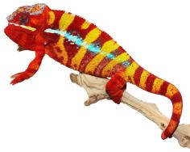
    
30. <strong>Xanthos. </strong>He had a relationship with Sienna. 

    
31. <strong>Sienna. </strong>

    
Children of Sienna and Xanthos

    
i. Xanthos' daughter [15]. Xanthos' daughter was produced by Chromatic Chameleons.  

    <h3>Generation 6</h3>
    
    
32. <strong>Dio (F6-CG9). </strong>He is the son of Kely-tongotra (Little Foot) (F5-CG8) and Eye Candy's daughter. He had a relationship with Zeratul's daughter. He also had a relationship with Unknown. He also had a relationship with Aphrodite. He also had a relationship with Unknown. 

    
Children of Unknown and Dio (F6-CG9)

    
i. Dio's daughter (F7-CG10. 

    
Children of Aphrodite and Dio (F6-CG9)

    
i. Dio's daughter (F7-CG10). 

    
Children of Unknown and Dio (F6-CG9)

    
i. Dio's Daughter (F7-CG10). 

    
33. <strong>Zeratul's daughter. </strong>She is the daughter of Zeratul and Noki's daughter. 

    
Children of Zeratul's daughter and Dio (F6-CG9)

    
i. Stryfe (F7-CG10) [16]. Stryfe was produced by Joshua Illencik.  

    
    
34. <strong>Felipe Sanchez (F1-CG2). </strong> is the same person as [12].

    
35. <strong>Snapjacks (F3-CG3). </strong>She is the daughter of Macho (F2-CG2) and 24k's daughter. 

    
Children of Snapjacks (F3-CG3) and Felipe Sanchez (F1-CG2)

    
i. Emma Frost (F2-CG4) [17]. Emma Frost was produced by Chromatic Chameleons.  

    
ii. Felipe Sanchez's daughter (F2-CG4). 

    
iii. Felipe Sanchez's daughter (F2-CG3). Felipe Sanchez's daughter was produced by Chromatic Chameleons.  

    
    
36. <strong>Flash (F1). </strong>Flash was born on 2015-01-10 at Chameleon's Paradise.  He died on 2018-06-14 at iPardalis at the age of 3 years, 5 months.  He was the son of Cowboy (CH) and King's daughter. He had a relationship with Judy (F2). 

    
    
37. <strong>Judy (F2). </strong>Judy was born on 2015-02-11 at Chameleon's Paradise.  She died on 2018-02-15 at iPardalis at the age of 3 years, 4 days.  She was the daughter of Candy Cane (F1) and Jake's daughter. 

    
Children of Judy (F2) and Flash (F1)

    
i. Jude (F2-CG3) [18]. Jude was born on 2017-10-17 at iPardalis.  

    
ii. Bane. Bane was born on 2017-10-17.  

    
iii. Nick. Nick was born on 2017-10-17 at iPardalis.  

    
iv. Giant3. Giant3 was born on 2017-10-17 at iPardalis.  

    
    
38. <strong>Sparkles (F1). </strong>Sparkles was produced by Bobby Ruddock.  He was the son of Loki and Unknown - WC. He had a relationship with Leo's daughter. He also had a relationship with Sasha. 

    
Children of Sasha and Sparkles (F1)

    
i. Perregrin (aka Pyro)(F2). Perregrin (aka Pyro)(F2) was produced by Bobby Ruddock.  

    
39. <strong>Leo's daughter. </strong>Leo's daughter was produced by The Panther Company.  She died on 2018-12-23 at Bobby Ruddock.  She was the daughter of Leo. 

    
Children of Leo's daughter and Sparkles (F1)

    
i. Kako (F2) [19]. Kako was born on 2017-11-21 at Panther Creek Chameleons.  She died on 2020-02-05 at iPardalis.  

    
ii. Amarillo (F2). Amarillo (F2) was produced by Bobby Ruddock.  

    
    
40. <strong>Gambit (WC). </strong>He had a relationship with Polaris (F1-CG2). 

    
More about Gambit (WC):

    
Adopted: Brightside Chameleons. 

    
41. <strong>Polaris (F1-CG2). </strong>Polaris was produced by Brightside Chameleons.  She is the daughter of Cyclops and Pheonix (F1). 

    
Children of Polaris (F1-CG2) and Gambit (WC)

    
i. Dante (F1-CG3) [20]. Dante was produced by Brightside Chameleons.  

    
    
42. <strong>Bolt (WC). </strong> is the same person as [24].

    
43. <strong>Test (F1). </strong>She is the daughter of Marley. 

    
Children of Test (F1) and Bolt (WC)

    
i. Sunkist (F1-CG2) [21]. Sunkist was produced by Canvas Chameleons.  

    
    
44. <strong>Giga-vony (Old Yeller). </strong>Giga-vony (Old Yeller) was produced by Kammerflage Kreations.  He is the son of Mavo-ra (Yellow Blood) and Tsara-andro (Good Day) (F6-CG9). He had a relationship with Au-sanga (Goldie Locks). He also had a relationship with Fanala-Andriana (Frost Queen). 

    
Children of Fanala-Andriana (Frost Queen) and Giga-vony (Old Yeller)

    
i. Sonny (F8-CG11). 

    
45. <strong>Au-sanga (Goldie Locks). </strong>She is the daughter of Faingana (Quick). 

    
Children of Au-sanga (Goldie Locks) and Giga-vony (Old Yeller)

    
i. Landy (Silk) F8-CG11 [22]. Landy (Silk) F8-CG11 was born on 2018-02-20 at Kammerflage Kreations.  

    
More about Au-sanga (Goldie Locks) and Giga-vony (Old Yeller):

    
Birth: 2018-02-20, Kammerflage Kreations. 

    
    
46. <strong>Fantara (Falling Star) (F7-CG10). </strong>Fantara (Falling Star) was produced by Kammerflage Kreations.  He is the son of Maizina-lanitra (Dark Sky). He had a relationship with Zazabodo-manga (Baby Blue). He also had a relationship with Mavo-loha (Blondie). He also had a relationship with Unknown. He also had a relationship with Maditra (AKA Miscreant). 

    
Children of Zazabodo-manga (Baby Blue) and Fantara (Falling Star) (F7-CG10)

    
i. Artemis (F8-CG11). 

    
Children of Unknown and Fantara (Falling Star) (F7-CG10)

    
i. Fantara's daughter (F8-CG11). 

    
Children of Maditra (AKA Miscreant) and Fantara (Falling Star) (F7-CG10)

    
i. Fajiry-mangaka (Star Lite) (F8 - CG11). 

    
    
47. <strong>Mavo-loha (Blondie). </strong>Mavo-loha (Blondie) was born on 2016-02-03 at Kammerflage Kreations.  She is the daughter of Mavo-ra (Yellow Blood) and Tsara-andro (Good Day) (F6-CG9). 

    
Children of Mavo-loha (Blondie) and Fantara (Falling Star) (F7-CG10)

    
i. Hamy (Sweetness) F8-CG11 [23]. Hamy (Sweetness) was produced by Kammerflage Kreations.  

    
ii. Ajax (F8-CG11). Ajax was produced by Kammerflage Kreations.  

    
iii. Roa-ony (Two Rivers) (F8-CG11). Roa-ony (Two Rivers) was produced by Kammerflage Kreations.  

    
    
50. <strong>Cowboy (CH). </strong>Cowboy was produced by Chameleon's Paradise.  He died on 2015-01-01 at Chameleon's Paradise.  He had a relationship with King's daughter. He also had a relationship with Unknown. He also had a relationship with Unknown. He also had a relationship with Unknown. 

    
Children of Unknown and Cowboy (CH)

    
i. Cowboy's daughter (F1). 

    
Children of Unknown and Cowboy (CH)

    
i. Cowboy's daughter (F1) [25]. Cowboy's daughter was produced by Chameleon's Paradise.  

    
Children of Unknown and Cowboy (CH)

    
i. Cowboy's daughter (F1). 

    
    
52. <strong>Mavo-ra (Yellow Blood). </strong>Mavo-ra (Yellow Blood) was produced by Kammerflage Kreations.  He is the son of Mabonika-haboka (Mellow Yellow). He had a relationship with Unknown. He also had a relationship with Tsara-andro (Good Day) (F6-CG9). 

    
Children of Unknown and Mavo-ra (Yellow Blood)

    
i. Vony-reny (Yellow Mother). Vony-reny (Yellow Mother) was produced by Kammerflage Kreations.  

    
    
53. <strong>Tsara-andro (Good Day) (F6-CG9). </strong>Tsara-andro (Good Day) was produced by Kammerflage Kreations.  She is the daughter of Kely-tongotra (Little Foot) (F5-CG8). 

    
Children of Tsara-andro (Good Day) (F6-CG9) and Mavo-ra (Yellow Blood)

    
i. Mavo-loha (Blondie). Mavo-loha (Blondie) was born on 2016-02-03 at Kammerflage Kreations.  

    
ii. Giga-vony (Old Yeller). Giga-vony (Old Yeller) was produced by Kammerflage Kreations.  

    
iii. JJ (F7-CG10) [28]. JJ was produced by Kammerflage Kreations.  

    
    
54. <strong>Seventeen. </strong>He is the son of Paradox. He had a relationship with Dio's daughter (F7-CG10. 

    
55. <strong>Dio's daughter (F7-CG10. </strong>She is the daughter of Dio (F6-CG9). 

    
Children of Dio's daughter (F7-CG10 and Seventeen

    
i. Daisy (F8-CG11) [29]. 

    
    
56. <strong>Mavo-ra (Yellow Blood). </strong> is the same person as [52].

    
    
57. <strong>Tsara-andro (Good Day) (F6-CG9). </strong> is the same person as [53].

    
    
58. <strong>Seventeen. </strong> is the same person as [54].

    
59. <strong>Dio's daughter (F7-CG10. </strong> is the same person as [55].

    <h3>Generation 7</h3>
    
    
64. <strong>Kely-tongotra (Little Foot) (F5-CG8). </strong>Kely-tongotra (Little Foot) was produced by Kammerflage Kreations.  He is the son of Hatsikana (Legend). He had a relationship with Unknown. He also had a relationship with Unknown. He also had a relationship with Unknown. He also had a relationship with Eye Candy's daughter. He also had a relationship with Unknown. He also had a relationship with Unknown. He also had a relationship with Unknown. 

    
Children of Unknown and Kely-tongotra (Little Foot) (F5-CG8)

    
i. Little Foot's daughter. Little Foot's daughter was produced by Kammerflage Kreations.  

    
Children of Unknown and Kely-tongotra (Little Foot) (F5-CG8)

    
i. Faingana (Quick). Faingana (Quick) was produced by Kammerflage Kreations.  

    
Children of Unknown and Kely-tongotra (Little Foot) (F5-CG8)

    
i. Little Foot's daughter. Little Foot's daughter was produced by Kammerflage Kreations.  

    
Children of Unknown and Kely-tongotra (Little Foot) (F5-CG8)

    
i. Tsara-andro (Good Day) (F6-CG9) [57]. Tsara-andro (Good Day) was produced by Kammerflage Kreations.  

    
Children of Unknown and Kely-tongotra (Little Foot) (F5-CG8)

    
i. Maizina-lanitra (Dark Sky). Maizina-lanitra (Dark Sky) was produced by Kammerflage Kreations.  

    
Children of Unknown and Kely-tongotra (Little Foot) (F5-CG8)

    
i. Faingana (Quick). Faingana (Quick) was produced by Kammerflage Kreations.  

    
65. <strong>Eye Candy's daughter. </strong>Eye Candy's daughter was produced by Kammerflage Kreations.  She is the daughter of Maso-vatomamy (Eye Candy). 

    
Children of Eye Candy's daughter and Kely-tongotra (Little Foot) (F5-CG8)

    
i. Dio (F6-CG9) [32]. 

    
    
66. <strong>Zeratul. </strong>He had a relationship with Noki's daughter. 

    
67. <strong>Noki's daughter. </strong>She is the daughter of Noki. 

    
Children of Noki's daughter and Zeratul

    
i. Zeratul's daughter [33]. 

    
    
68. <strong>Bolt (WC). </strong> is the same person as [24].

    
69. <strong>Cowboy's daughter (F1). </strong> is the same person as [25].

    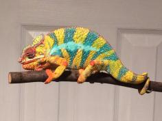
    
70. <strong>Macho (F2-CG2). </strong>He is the son of Candy Cane (F1) and Cowboy's daughter (F1). He had a relationship with 24k's daughter. 

    
71. <strong>24k's daughter. </strong>24k's daughter was produced by Chameleon's Paradise.  She is the daughter of 24k. 

    
Children of 24k's daughter and Macho (F2-CG2)

    
i. Wetdream (F3). 

    
ii. Snapjacks (F3-CG3) [35]. 

    
    
72. <strong>Cowboy (CH). </strong> is the same person as [50].

    
73. <strong>King's daughter. </strong>King's daughter was produced by Chameleon's Paradise.  She died with Chameleon's Paradise.  She was the daughter of King. 

    
Children of King's daughter and Cowboy (CH)

    
i. Flash (F1) [36]. Flash was born on 2015-01-10 at Chameleon's Paradise.  He died on 2018-06-14 at iPardalis.  

    
    
74. <strong>Candy Cane (F1). </strong>Candy Cane was produced by Chameleon's Paradise.  He had a relationship with Jake's daughter. He also had a relationship with Cowboy's daughter (F1). He also had a relationship with Unknown. He also had a relationship with Cowboy's daughter (F1). 

    
Children of Unknown and Candy Cane (F1)

    
i. Candy Cane's Daughter (F2). 

    
Children of Cowboy's daughter (F1) and Candy Cane (F1)

    
i. Candy Cane's daughter (F2). 

    
75. <strong>Jake's daughter. </strong>Jake's daughter was produced by Chameleon's Paradise.  She is the daughter of Jake (F1). 

    
Children of Jake's daughter and Candy Cane (F1)

    
i. Judy (F2) [37]. Judy was born on 2015-02-11 at Chameleon's Paradise.  She died on 2018-02-15 at iPardalis.  

    
    
76. <strong>Loki. </strong>Loki was produced by The Panther Baron.  He is the son of Loza and Flaming River's daughter. He had a relationship with Unknown - WC. 

    
77. <strong>Unknown - WC. </strong>Unknown was produced by Bobby Ruddock.  

    
Children of Unknown - WC and Loki

    
i. Sparkles (F1) [38]. Sparkles was produced by Bobby Ruddock.  

    
    
78. <strong>Leo. </strong>Leo was produced by The Panther Company.  He had a relationship with Unknown. 

    
Children of Unknown and Leo

    
i. Leo's daughter [39]. Leo's daughter was produced by The Panther Company.  She died on 2018-12-23 at Bobby Ruddock.  

    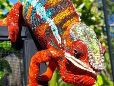
    
82. <strong>Cyclops. </strong>Cyclops was produced by Brightside Chameleons.  He had a relationship with Pheonix (F1). 

    
83. <strong>Pheonix (F1). </strong>She is the daughter of Zephyros. 

    
Children of Pheonix (F1) and Cyclops

    
i. Polaris (F1-CG2) [41]. Polaris was produced by Brightside Chameleons.  

    
    
86. <strong>Marley. </strong>Marley was produced by Canvas Chameleons.  He had a relationship with Outline's daughter. He also had a relationship with Unknown. He also had a relationship with Unknown. 

    
Children of Outline's daughter and Marley

    
i. Marley's daughter. 

    
Children of Unknown and Marley

    
i. Test (F1) [43]. 

    
Children of Unknown and Marley

    
i. Magik. 

    
    
88. <strong>Mavo-ra (Yellow Blood). </strong> is the same person as [52].

    
    
89. <strong>Tsara-andro (Good Day) (F6-CG9). </strong> is the same person as [53].

    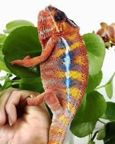
    
90. <strong>Faingana (Quick). </strong>Faingana (Quick) was produced by Kammerflage Kreations.  He is the son of Kely-tongotra (Little Foot) (F5-CG8). He had a relationship with Unknown. 

    
Children of Unknown and Faingana (Quick)

    
i. Au-sanga (Goldie Locks) [45]. 

    
    
92. <strong>Maizina-lanitra (Dark Sky). </strong>Maizina-lanitra (Dark Sky) was produced by Kammerflage Kreations.  He is the son of Kely-tongotra (Little Foot) (F5-CG8). He had a relationship with Unknown. He also had a relationship with Unknown. 

    
Children of Unknown and Maizina-lanitra (Dark Sky)

    
i. Fantara (Falling Star) (F7-CG10) [46]. Fantara (Falling Star) was produced by Kammerflage Kreations.  

    
Children of Unknown and Maizina-lanitra (Dark Sky)

    
i. Bolitika-zandry (Little Sister). Bolitika-zandry (Little Sister) was produced by Kammerflage Kreations.  

    
    
94. <strong>Mavo-ra (Yellow Blood). </strong> is the same person as [52].

    
    
95. <strong>Tsara-andro (Good Day) (F6-CG9). </strong> is the same person as [53].

    
    
104. <strong>Mabonika-haboka (Mellow Yellow). </strong>Mabonika-haboka (Mellow Yellow) was produced by Kammerflage Kreations.  He is the son of Maso-vatomamy (Eye Candy). He had a relationship with Unknown. 

    
Children of Unknown and Mabonika-haboka (Mellow Yellow)

    
i. Mavo-ra (Yellow Blood) [56]. Mavo-ra (Yellow Blood) was produced by Kammerflage Kreations.  

    
    
106. <strong>Kely-tongotra (Little Foot) (F5-CG8). </strong> is the same person as [64].

    
    
108. <strong>Paradox. </strong>Paradox was produced by Tree Candy Chameleons.  He had a relationship with Unknown. 

    
Children of Unknown and Paradox

    
i. Seventeen [58]. 

    
    
110. <strong>Dio (F6-CG9). </strong> is the same person as [32].

    
    
112. <strong>Mabonika-haboka (Mellow Yellow). </strong> is the same person as [104].

    
    
114. <strong>Kely-tongotra (Little Foot) (F5-CG8). </strong> is the same person as [64].

    
    
116. <strong>Paradox. </strong> is the same person as [108].

    
    
118. <strong>Dio (F6-CG9). </strong> is the same person as [32].

    <h3>Generation 8</h3>
    
    
128. <strong>Hatsikana (Legend). </strong>Hatsikana (Legend) was produced by Kammerflage Kreations.  He had a relationship with Unknown. 

    
Children of Unknown and Hatsikana (Legend)

    
i. Kely-tongotra (Little Foot) (F5-CG8) [114]. Kely-tongotra (Little Foot) was produced by Kammerflage Kreations.  

    
    
130. <strong>Maso-vatomamy (Eye Candy). </strong>Maso-vatomamy (Eye Candy) was produced by Kammerflage Kreations.  He had a relationship with Unknown. He also had a relationship with Unknown. 

    
Children of Unknown and Maso-vatomamy (Eye Candy)

    
i. Eye Candy's daughter [65]. Eye Candy's daughter was produced by Kammerflage Kreations.  

    
Children of Unknown and Maso-vatomamy (Eye Candy)

    
i. Mabonika-haboka (Mellow Yellow) [112]. Mabonika-haboka (Mellow Yellow) was produced by Kammerflage Kreations.  

    
    
134. <strong>Noki. </strong>He had a relationship with Unknown. 

    
Children of Unknown and Noki

    
i. Noki's daughter [67]. 

    
    
138. <strong>Cowboy (CH). </strong> is the same person as [50].

    
    
140. <strong>Candy Cane (F1). </strong> is the same person as [74].

    
141. <strong>Cowboy's daughter (F1). </strong>She is the daughter of Cowboy (CH). 

    
Children of Cowboy's daughter (F1) and Candy Cane (F1)

    
i. Macho (F2-CG2) [70]. 

    
    
142. <strong>24k. </strong>24k was produced by Chameleon's Paradise.  He had a relationship with Unknown. 

    
Children of Unknown and 24k

    
i. 24k's daughter [71]. 24k's daughter was produced by Chameleon's Paradise.  

    
    
146. <strong>King. </strong>He had a relationship with Unknown. 

    
Children of Unknown and King

    
i. King's daughter [73]. King's daughter was produced by Chameleon's Paradise.  She died with Chameleon's Paradise.  

    
    
150. <strong>Jake (F1). </strong>Jake was produced by Chameleon's Paradise.  He had a relationship with Unknown. 

    
Children of Unknown and Jake (F1)

    
i. Jake's daughter [75]. Jake's daughter was produced by Chameleon's Paradise.  

    
    
152. <strong>Loza. </strong>Loza was produced by Kammerflage Kreations.  He had a relationship with Flaming River's daughter. 

    
153. <strong>Flaming River's daughter. </strong>Flaming River's daughter was produced by Kammerflage Kreations.  She is the daughter of Flaming River. 

    
Children of Flaming River's daughter and Loza

    
i. Loki [76]. Loki was produced by The Panther Baron.  

    
166. <strong>Zephyros. </strong>Zephyros was produced by Mythical Exotics.  He had a relationship with Unknown. 

    
Children of Unknown and Zephyros

    
i. Pheonix (F1) [83]. 

    
    
176. <strong>Mabonika-haboka (Mellow Yellow). </strong> is the same person as [104].

    
    
178. <strong>Kely-tongotra (Little Foot) (F5-CG8). </strong> is the same person as [64].

    
    
180. <strong>Kely-tongotra (Little Foot) (F5-CG8). </strong> is the same person as [64].

    
    
184. <strong>Kely-tongotra (Little Foot) (F5-CG8). </strong> is the same person as [64].

    
    
188. <strong>Mabonika-haboka (Mellow Yellow). </strong> is the same person as [104].

    
    
190. <strong>Kely-tongotra (Little Foot) (F5-CG8). </strong> is the same person as [64].

    
    
208. <strong>Maso-vatomamy (Eye Candy). </strong> is the same person as [130].

    
    
212. <strong>Hatsikana (Legend). </strong> is the same person as [128].

    
    
220. <strong>Kely-tongotra (Little Foot) (F5-CG8). </strong> is the same person as [64].

    
221. <strong>Eye Candy's daughter. </strong> is the same person as [65].

    
    
224. <strong>Maso-vatomamy (Eye Candy). </strong> is the same person as [130].

    
    
228. <strong>Hatsikana (Legend). </strong> is the same person as [128].

    
    
236. <strong>Kely-tongotra (Little Foot) (F5-CG8). </strong> is the same person as [64].

    
237. <strong>Eye Candy's daughter. </strong> is the same person as [65].

    <h3>Generation 9</h3>
    
    
282. <strong>Cowboy (CH). </strong> is the same person as [50].

    
    
306. <strong>Flaming River. </strong>Flaming River was produced by Kammerflage Kreations.  He had a relationship with Unknown. 

    
Children of Unknown and Flaming River

    
i. Flaming River's daughter [153]. Flaming River's daughter was produced by Kammerflage Kreations.  

    
    
352. <strong>Maso-vatomamy (Eye Candy). </strong> is the same person as [130].

    
    
356. <strong>Hatsikana (Legend). </strong> is the same person as [128].

    
    
360. <strong>Hatsikana (Legend). </strong> is the same person as [128].

    
    
368. <strong>Hatsikana (Legend). </strong> is the same person as [128].

    
    
376. <strong>Maso-vatomamy (Eye Candy). </strong> is the same person as [130].

    
    
380. <strong>Hatsikana (Legend). </strong> is the same person as [128].

    
    
440. <strong>Hatsikana (Legend). </strong> is the same person as [128].

    
    
442. <strong>Maso-vatomamy (Eye Candy). </strong> is the same person as [130].

    
    
472. <strong>Hatsikana (Legend). </strong> is the same person as [128].

    
    
474. <strong>Maso-vatomamy (Eye Candy). </strong> is the same person as [130].

  



