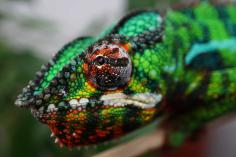
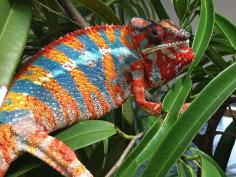
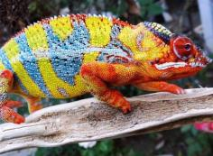

+++
title = "Tarehy"
date = "2022-05-31"
tags = ["tarehy", "manjaka", "lokana", "arlo", "kromatisk", "landy"]
categories = ["ambilobe-dams"]
banner = "img/ambilobe/tarehy/tarehy"
+++



Tarehy's name comes from "Tsara Tarehy" which means attractive in Malagasy. We named the two sisters from [Manjaka x Lokana]() Tsara and Tarehy :). Check out that clutch to see how consistent their YBBB phenotypes were. It is a very good proxy for what these two sisters bring to the table: great yellows and bars that shift from Landy to Manjaka's blues. Very good complement to our existing lines!



Filial
: *F2-CG14*

Sire
: [Manjaka]()

Dam
: [Lokana]()

---




  

    

      <h1>Ancestral Report for Tarehy (F2-CG14)</h1>
    

    <h3>Generation 1</h3>
    
    
1. <strong>Tarehy (F2-CG14). </strong>Tarehy was born on 2022-05-31 at iPardalis.  She is the daughter of Manjaka (F1-CG5) and Lokana (F9-CG13). 

    <h3>Generation 2</h3>
    
    
2. <strong>Manjaka (F1-CG5). </strong>Manjaka (F1-CG5) was born on 2020-12-01 at Colorado Chameleon.  He is the son of Arlo (WC) and Perregrin's daugher (F3-CG4). He had a relationship with Lokana (F9-CG13). 

    
More about Manjaka (F1-CG5):

    
Adopted: 2021-03-07, iPardalis. 

    
    
3. <strong>Lokana (F9-CG13). </strong>Lokana was born on 2020-12-02 at Chromatic Chameleons.  She is the daughter of Kromatisk (F8-CG12) and Shirley (F9-CG12). 

    
More about Lokana (F9-CG13):

    
Adopted: 2021-03-15, iPardalis. 

    
Children of Lokana (F9-CG13) and Papafee (F3-CG12)

    
i. Bumble Bee (F4-CG14). Bumble Bee was born on 2022-01-11 at iPardalis.  

    
ii. Vaosary (F4-CG14). Vaosary was born on 2022-01-11 at iPardalis.  

    
iii. Papamavo (F4-CG14). Papamavo was born on 2022-03-01 at iPardalis.  

    
Children of Lokana (F9-CG13) and Manjaka (F1-CG5)

    
i. Tsara (F2-CG14). Tsara was born on 2022-06-01 at iPardalis.  

    
ii. Tarehy (F2-CG14) [1]. Tarehy was born on 2022-05-31 at iPardalis.  

    <h3>Generation 3</h3>
    
    
4. <strong>Arlo (WC). </strong>He had a relationship with Perregrin's daugher (F3-CG4). 

    
More about Arlo (WC):

    
Adopted: Colorado Chameleon. 

    
5. <strong>Perregrin's daugher (F3-CG4). </strong>Perregrin's daugher was produced by Modern Day Dragons.  She is the daughter of Perregrin (aka Pyro)(F2) and Miss Piggy (F3). 

    
More about Perregrin's daugher (F3-CG4):

    
Adopted: Colorado Chameleon. 

    
Children of Perregrin's daugher (F3-CG4) and Arlo (WC)

    
i. Manjaka (F1-CG5) [2]. Manjaka (F1-CG5) was born on 2020-12-01 at Colorado Chameleon.  

    
ii. Manjaya (F1-CG5). Manjaya was born on 2020-12-01 at Colorado Chameleon.  

    
iii. Manjalla (F1-CG5). Manjalla was born on 2020-12-05 at Colorado Chameleon.  

    
iv. Manjaia (F1-CG5). Manjaia was born on 2020-12-01 at Colorado Chameleon.  

    
    
6. <strong>Kromatisk (F8-CG12). </strong>Kromatisk was born on 2018-08-26 at Chromatic Chameleons.  He is the son of JJ (F7-CG10) and Daisy (F8-CG11). He had a relationship with Jackie (F4). He also had a relationship with Shirley (F9-CG12). He also had a relationship with Xanthos' daughter. 

    
Children of Jackie (F4) and Kromatisk (F8-CG12)

    
i. Loko (F5-CG13). Loko was born on 2020-04-18 at Chromatic Chameleons.  

    
Children of Xanthos' daughter and Kromatisk (F8-CG12)

    
i. Kromatisk's daughter (F9-CG13). 

    
7. <strong>Shirley (F9-CG12). </strong>Shirley was produced by Kammerflage Kreations.  She is the daughter of Landy (Silk) F8-CG11 and Hamy (Sweetness) F8-CG11. 

    
More about Shirley (F9-CG12):

    
Adopted: Chromatic Chameleons. 

    
Children of Shirley (F9-CG12) and Kromatisk (F8-CG12)

    
i. Lokana (F9-CG13) [3]. Lokana was born on 2020-12-02 at Chromatic Chameleons.  

    <h3>Generation 4</h3>
    
    
10. <strong>Perregrin (aka Pyro)(F2). </strong>Perregrin (aka Pyro)(F2) was produced by Bobby Ruddock.  He is the son of Sparkles (F1) and Sasha. He had a relationship with Miss Piggy (F3). 

    
More about Perregrin (aka Pyro)(F2):

    
Adopted: Modern Day Dragons. 

    
Adopted: Brightside Chameleons. 

    
11. <strong>Miss Piggy (F3). </strong>Miss Piggy (F3) was produced by Jungle Panthers.  She is the daughter of Higgins and Candy Cane's Daughter (F2). 

    
More about Miss Piggy (F3):

    
Adopted: Modern Day Dragons. 

    
Children of Miss Piggy (F3) and Perregrin (aka Pyro)(F2)

    
i. Perregrin's daugher (F3-CG4) [5]. Perregrin's daugher was produced by Modern Day Dragons.  

    
ii. Astoria. Astoria was produced by Modern Day Dragons.  

    
iii. PJ (F3-CG4). PJ was produced by Modern Day Dragons.  

    
iv. Sunshine (F3-CG4). Sunshine was produced by Modern Day Dragons.  

    
v. Perregrin (aka Pyro)'s daughter (F3-CG4). Perregrin (aka Pyro)'s daughter was produced by Modern Day Dragons.  

    
    
12. <strong>JJ (F7-CG10). </strong>JJ was produced by Kammerflage Kreations.  He is the son of Mavo-ra (Yellow Blood) and Tsara-andro (Good Day) (F6-CG9). He had a relationship with Blue Bird's daughter. He also had a relationship with Daisy (F8-CG11). 

    
Children of Blue Bird's daughter and JJ (F7-CG10)

    
i. Alla (F8-CG11). Alla was born on 2018-01-30 at Panther Creek Chameleons.  

    
13. <strong>Daisy (F8-CG11). </strong>She is the daughter of Seventeen and Dio's daughter (F7-CG10. 

    
Children of Daisy (F8-CG11) and JJ (F7-CG10)

    
i. Kromatisk (F8-CG12) [6]. Kromatisk was born on 2018-08-26 at Chromatic Chameleons.  

    
ii. JJ's daughter (F8-CG12). 

    
    
14. <strong>Landy (Silk) F8-CG11. </strong>Landy (Silk) F8-CG11 was born on 2018-02-20 at Kammerflage Kreations.  He is the son of Giga-vony (Old Yeller) and Au-sanga (Goldie Locks). He had a relationship with Hamy (Sweetness) F8-CG11. He also had a relationship with Batata (Sweet Potato). 

    
Children of Batata (Sweet Potato) and Landy (Silk) F8-CG11

    
i. Ingahy-Mahagaga (Mr. Wonderful). Ingahy-Mahagaga (Mr. Wonderful) was produced by Kammerflage Kreations.  

    
    
15. <strong>Hamy (Sweetness) F8-CG11. </strong>Hamy (Sweetness) was produced by Kammerflage Kreations.  She is the daughter of Fantara (Falling Star) (F7-CG10) and Mavo-loha (Blondie). 

    
Children of Hamy (Sweetness) F8-CG11 and Landy (Silk) F8-CG11

    
i. Itso-triombe (Green Giant) F9-CG12. Itso-triombe (Green Giant) was produced by Kammerflage Kreations.  

    
ii. Foxey (F9-CG12). Foxey was produced by Kammerflage Kreations.  

    
iii. Shirley (F9-CG12) [7]. Shirley was produced by Kammerflage Kreations.  

    
iv. Au-mirongatra (Gold Rush) (F9-CG12). Au-mirongatra (Gold Rush) was produced by Kammerflage Kreations.  

    <h3>Generation 5</h3>
    
    
20. <strong>Sparkles (F1). </strong>Sparkles was produced by Bobby Ruddock.  He was the son of Loki and Unknown - WC. He had a relationship with Leo's daughter. He also had a relationship with Sasha. 

    
Children of Leo's daughter and Sparkles (F1)

    
i. Kako (F2). Kako was born on 2017-11-21 at Panther Creek Chameleons.  She died on 2020-02-05 at iPardalis.  

    
ii. Amarillo (F2). Amarillo (F2) was produced by Bobby Ruddock.  

    
21. <strong>Sasha. </strong>Sasha was produced by Canvas Chameleons.  She is the daughter of Sinister. 

    
More about Sasha:

    
Adopted: Bobby Ruddock. 

    
Children of Sasha and Sparkles (F1)

    
i. Perregrin (aka Pyro)(F2) [10]. Perregrin (aka Pyro)(F2) was produced by Bobby Ruddock.  

    
    
22. <strong>Higgins. </strong>He had a relationship with Unknown. He also had a relationship with Candy Cane's Daughter (F2). 

    
Children of Unknown and Higgins

    
i. Higgin's daughter. 

    
23. <strong>Candy Cane's Daughter (F2). </strong>She is the daughter of Candy Cane (F1). 

    
Children of Candy Cane's Daughter (F2) and Higgins

    
i. Miss Piggy (F3) [11]. Miss Piggy (F3) was produced by Jungle Panthers.  

    
    
24. <strong>Mavo-ra (Yellow Blood). </strong>Mavo-ra (Yellow Blood) was produced by Kammerflage Kreations.  He is the son of Mabonika-haboka (Mellow Yellow). He had a relationship with Unknown. He also had a relationship with Tsara-andro (Good Day) (F6-CG9). 

    
Children of Unknown and Mavo-ra (Yellow Blood)

    
i. Vony-reny (Yellow Mother). Vony-reny (Yellow Mother) was produced by Kammerflage Kreations.  

    
    
25. <strong>Tsara-andro (Good Day) (F6-CG9). </strong>Tsara-andro (Good Day) was produced by Kammerflage Kreations.  She is the daughter of Kely-tongotra (Little Foot) (F5-CG8). 

    
Children of Tsara-andro (Good Day) (F6-CG9) and Mavo-ra (Yellow Blood)

    
i. Mavo-loha (Blondie). Mavo-loha (Blondie) was born on 2016-02-03 at Kammerflage Kreations.  

    
ii. Giga-vony (Old Yeller). Giga-vony (Old Yeller) was produced by Kammerflage Kreations.  

    
iii. JJ (F7-CG10) [12]. JJ was produced by Kammerflage Kreations.  

    
    
26. <strong>Seventeen. </strong>He is the son of Paradox. He had a relationship with Dio's daughter (F7-CG10. 

    
27. <strong>Dio's daughter (F7-CG10. </strong>She is the daughter of Dio (F6-CG9). 

    
Children of Dio's daughter (F7-CG10 and Seventeen

    
i. Daisy (F8-CG11) [13]. 

    
    
28. <strong>Giga-vony (Old Yeller). </strong>Giga-vony (Old Yeller) was produced by Kammerflage Kreations.  He is the son of Mavo-ra (Yellow Blood) and Tsara-andro (Good Day) (F6-CG9). He had a relationship with Au-sanga (Goldie Locks). He also had a relationship with Fanala-Andriana (Frost Queen). 

    
Children of Fanala-Andriana (Frost Queen) and Giga-vony (Old Yeller)

    
i. Sonny (F8-CG11). 

    
29. <strong>Au-sanga (Goldie Locks). </strong>She is the daughter of Faingana (Quick). 

    
Children of Au-sanga (Goldie Locks) and Giga-vony (Old Yeller)

    
i. Landy (Silk) F8-CG11 [14]. Landy (Silk) F8-CG11 was born on 2018-02-20 at Kammerflage Kreations.  

    
More about Au-sanga (Goldie Locks) and Giga-vony (Old Yeller):

    
Birth: 2018-02-20, Kammerflage Kreations. 

    
    
30. <strong>Fantara (Falling Star) (F7-CG10). </strong>Fantara (Falling Star) was produced by Kammerflage Kreations.  He is the son of Maizina-lanitra (Dark Sky). He had a relationship with Zazabodo-manga (Baby Blue). He also had a relationship with Mavo-loha (Blondie). He also had a relationship with Unknown. 

    
Children of Zazabodo-manga (Baby Blue) and Fantara (Falling Star) (F7-CG10)

    
i. Artemis (F8-CG11). 

    
Children of Unknown and Fantara (Falling Star) (F7-CG10)

    
i. Fantara's daughter (F8-CG11). 

    
    
31. <strong>Mavo-loha (Blondie). </strong>Mavo-loha (Blondie) was born on 2016-02-03 at Kammerflage Kreations.  She is the daughter of Mavo-ra (Yellow Blood) and Tsara-andro (Good Day) (F6-CG9). 

    
Children of Mavo-loha (Blondie) and Fantara (Falling Star) (F7-CG10)

    
i. Hamy (Sweetness) F8-CG11 [15]. Hamy (Sweetness) was produced by Kammerflage Kreations.  

    
ii. Ajax (F8-CG11). Ajax was produced by Kammerflage Kreations.  

    
iii. Roa-ony (Two Rivers) (F8-CG11). Roa-ony (Two Rivers) was produced by Kammerflage Kreations.  

    <h3>Generation 6</h3>
    
    
40. <strong>Loki. </strong>Loki was produced by The Panther Baron.  He is the son of Loza and Flaming River's daughter. He had a relationship with Unknown - WC. 

    
41. <strong>Unknown - WC. </strong>Unknown was produced by Bobby Ruddock.  

    
Children of Unknown - WC and Loki

    
i. Sparkles (F1) [20]. Sparkles was produced by Bobby Ruddock.  

    
    
42. <strong>Sinister. </strong>Sinister was produced by Canvas Chameleons.  He had a relationship with Unknown. 

    
Children of Unknown and Sinister

    
i. Sasha [21]. Sasha was produced by Canvas Chameleons.  

    
    
46. <strong>Candy Cane (F1). </strong>Candy Cane was produced by Chameleon's Paradise.  He had a relationship with Jake's daughter. He also had a relationship with Cowboy's daughter (F1). He also had a relationship with Unknown. He also had a relationship with Cowboy's daughter (F1). 

    
Children of Jake's daughter and Candy Cane (F1)

    
i. Judy (F2). Judy was born on 2015-02-11 at Chameleon's Paradise.  She died on 2018-02-15 at iPardalis.  

    
Children of Cowboy's daughter (F1) and Candy Cane (F1)

    
i. Macho (F2-CG2). 

    
Children of Unknown and Candy Cane (F1)

    
i. Candy Cane's Daughter (F2) [23]. 

    
Children of Cowboy's daughter (F1) and Candy Cane (F1)

    
i. Candy Cane's daughter (F2). 

    
    
48. <strong>Mabonika-haboka (Mellow Yellow). </strong>Mabonika-haboka (Mellow Yellow) was produced by Kammerflage Kreations.  He is the son of Maso-vatomamy (Eye Candy). He had a relationship with Unknown. 

    
Children of Unknown and Mabonika-haboka (Mellow Yellow)

    
i. Mavo-ra (Yellow Blood) [24]. Mavo-ra (Yellow Blood) was produced by Kammerflage Kreations.  

    
    
50. <strong>Kely-tongotra (Little Foot) (F5-CG8). </strong>Kely-tongotra (Little Foot) was produced by Kammerflage Kreations.  He is the son of Hatsikana (Legend). He had a relationship with Unknown. He also had a relationship with Unknown. He also had a relationship with Unknown. He also had a relationship with Eye Candy's daughter. He also had a relationship with Unknown. He also had a relationship with Unknown. He also had a relationship with Unknown. 

    
Children of Unknown and Kely-tongotra (Little Foot) (F5-CG8)

    
i. Little Foot's daughter. Little Foot's daughter was produced by Kammerflage Kreations.  

    
Children of Unknown and Kely-tongotra (Little Foot) (F5-CG8)

    
i. Faingana (Quick). Faingana (Quick) was produced by Kammerflage Kreations.  

    
Children of Unknown and Kely-tongotra (Little Foot) (F5-CG8)

    
i. Little Foot's daughter. Little Foot's daughter was produced by Kammerflage Kreations.  

    
Children of Unknown and Kely-tongotra (Little Foot) (F5-CG8)

    
i. Tsara-andro (Good Day) (F6-CG9) [25]. Tsara-andro (Good Day) was produced by Kammerflage Kreations.  

    
Children of Unknown and Kely-tongotra (Little Foot) (F5-CG8)

    
i. Maizina-lanitra (Dark Sky). Maizina-lanitra (Dark Sky) was produced by Kammerflage Kreations.  

    
Children of Unknown and Kely-tongotra (Little Foot) (F5-CG8)

    
i. Faingana (Quick). Faingana (Quick) was produced by Kammerflage Kreations.  

    
    
52. <strong>Paradox. </strong>Paradox was produced by Tree Candy Chameleons.  He had a relationship with Unknown. 

    
Children of Unknown and Paradox

    
i. Seventeen [26]. 

    
    
54. <strong>Dio (F6-CG9). </strong>He is the son of Kely-tongotra (Little Foot) (F5-CG8) and Eye Candy's daughter. He had a relationship with Zeratul's daughter. He also had a relationship with Unknown. He also had a relationship with Aphrodite. He also had a relationship with Unknown. 

    
Children of Zeratul's daughter and Dio (F6-CG9)

    
i. Stryfe (F7-CG10). Stryfe was produced by Joshua Illencik.  

    
Children of Unknown and Dio (F6-CG9)

    
i. Dio's daughter (F7-CG10 [27]. 

    
Children of Aphrodite and Dio (F6-CG9)

    
i. Dio's daughter (F7-CG10). 

    
Children of Unknown and Dio (F6-CG9)

    
i. Dio's Daughter (F7-CG10). 

    
    
56. <strong>Mavo-ra (Yellow Blood). </strong> is the same person as [24].

    
    
57. <strong>Tsara-andro (Good Day) (F6-CG9). </strong> is the same person as [25].

    
    
58. <strong>Faingana (Quick). </strong>Faingana (Quick) was produced by Kammerflage Kreations.  He is the son of Kely-tongotra (Little Foot) (F5-CG8). He had a relationship with Unknown. 

    
Children of Unknown and Faingana (Quick)

    
i. Au-sanga (Goldie Locks) [29]. 

    
    
60. <strong>Maizina-lanitra (Dark Sky). </strong>Maizina-lanitra (Dark Sky) was produced by Kammerflage Kreations.  He is the son of Kely-tongotra (Little Foot) (F5-CG8). He had a relationship with Unknown. He also had a relationship with Unknown. 

    
Children of Unknown and Maizina-lanitra (Dark Sky)

    
i. Fantara (Falling Star) (F7-CG10) [30]. Fantara (Falling Star) was produced by Kammerflage Kreations.  

    
Children of Unknown and Maizina-lanitra (Dark Sky)

    
i. Bolitika-zandry (Little Sister). Bolitika-zandry (Little Sister) was produced by Kammerflage Kreations.  

    
    
62. <strong>Mavo-ra (Yellow Blood). </strong> is the same person as [24].

    
    
63. <strong>Tsara-andro (Good Day) (F6-CG9). </strong> is the same person as [25].

    <h3>Generation 7</h3>
    
    
80. <strong>Loza. </strong>Loza was produced by Kammerflage Kreations.  He had a relationship with Flaming River's daughter. 

    
81. <strong>Flaming River's daughter. </strong>Flaming River's daughter was produced by Kammerflage Kreations.  She is the daughter of Flaming River. 

    
Children of Flaming River's daughter and Loza

    
i. Loki [40]. Loki was produced by The Panther Baron.  

    
    
96. <strong>Maso-vatomamy (Eye Candy). </strong>Maso-vatomamy (Eye Candy) was produced by Kammerflage Kreations.  He had a relationship with Unknown. He also had a relationship with Unknown. 

    
Children of Unknown and Maso-vatomamy (Eye Candy)

    
i. Eye Candy's daughter. Eye Candy's daughter was produced by Kammerflage Kreations.  

    
Children of Unknown and Maso-vatomamy (Eye Candy)

    
i. Mabonika-haboka (Mellow Yellow) [48]. Mabonika-haboka (Mellow Yellow) was produced by Kammerflage Kreations.  

    
    
100. <strong>Hatsikana (Legend). </strong>Hatsikana (Legend) was produced by Kammerflage Kreations.  He had a relationship with Unknown. 

    
Children of Unknown and Hatsikana (Legend)

    
i. Kely-tongotra (Little Foot) (F5-CG8) [50]. Kely-tongotra (Little Foot) was produced by Kammerflage Kreations.  

    
    
108. <strong>Kely-tongotra (Little Foot) (F5-CG8). </strong> is the same person as [50].

    
109. <strong>Eye Candy's daughter. </strong>Eye Candy's daughter was produced by Kammerflage Kreations.  She is the daughter of Maso-vatomamy (Eye Candy). 

    
Children of Eye Candy's daughter and Kely-tongotra (Little Foot) (F5-CG8)

    
i. Dio (F6-CG9) [54]. 

    
    
112. <strong>Mabonika-haboka (Mellow Yellow). </strong> is the same person as [48].

    
    
114. <strong>Kely-tongotra (Little Foot) (F5-CG8). </strong> is the same person as [50].

    
    
116. <strong>Kely-tongotra (Little Foot) (F5-CG8). </strong> is the same person as [50].

    
    
120. <strong>Kely-tongotra (Little Foot) (F5-CG8). </strong> is the same person as [50].

    
    
124. <strong>Mabonika-haboka (Mellow Yellow). </strong> is the same person as [48].

    
    
126. <strong>Kely-tongotra (Little Foot) (F5-CG8). </strong> is the same person as [50].

    <h3>Generation 8</h3>
    
    
162. <strong>Flaming River. </strong>Flaming River was produced by Kammerflage Kreations.  He had a relationship with Unknown. 

    
Children of Unknown and Flaming River

    
i. Flaming River's daughter [81]. Flaming River's daughter was produced by Kammerflage Kreations.  

    
    
216. <strong>Hatsikana (Legend). </strong> is the same person as [100].

    
    
218. <strong>Maso-vatomamy (Eye Candy). </strong> is the same person as [96].

    
    
224. <strong>Maso-vatomamy (Eye Candy). </strong> is the same person as [96].

    
    
228. <strong>Hatsikana (Legend). </strong> is the same person as [100].

    
    
232. <strong>Hatsikana (Legend). </strong> is the same person as [100].

    
    
240. <strong>Hatsikana (Legend). </strong> is the same person as [100].

    
    
248. <strong>Maso-vatomamy (Eye Candy). </strong> is the same person as [96].

    
    
252. <strong>Hatsikana (Legend). </strong> is the same person as [100].

  



