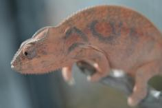
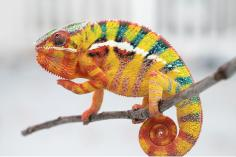
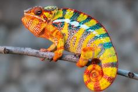
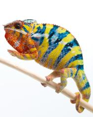
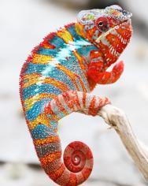
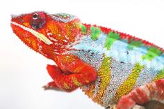

+++
title = "Volana"
header_title = "Volana | Yellow Body Blue Bar | Ambilobe Panther Chameleon"
date = "2024-02-28"
tags = ["volana", "secret weapon", "night owl"]
categories = ["ambilobe-dams"]
banner = "img/ambilobe/volana/volana1"
+++



Volana is a great YBBB from the Kammerflage Fantara line produced by Brian Stewart in partnership with Colorado Chameleons. He brings some great deep blue bars and a yellow body. We are very excited to see what he produces in concert with our existing lines!



Filial
: *F10-CG14*

Sire
: [Night Owl]()

Dam
: [Pollen]()

---




  

    

      <h1>Ancestral Report for Volana (F10-CG14)</h1>
    

    <h3>Generation 1</h3>
    
    
1. <strong>Volana (F10-CG14). </strong>Volana was born on 2024-02-28 at Kammerflage Kreations.  She is the daughter of Manalina-vorombozaka (Nite Owl) (F10-CG13) and Kinja (Pollen) (F9-CG13). 

    
More about Volana (F10-CG14):

    
Adopted: 2024-05-28, iPardalis. 

    <h3>Generation 2</h3>
    
    
2. <strong>Manalina-vorombozaka (Nite Owl) (F10-CG13). </strong>Manalina-vorombozaka (Nite Owl) was produced by Kammerflage Kreations.  He is the son of Mpiambina (Watchman) (F9-CG12) and Area 51's Daughter. He married Kinja (Pollen) (F9-CG13). 

    
3. <strong>Kinja (Pollen) (F9-CG13). </strong>Kinja (Pollen) was produced by Kammerflage Kreations.  She is the daughter of Bisike-fitaovana (Secret Weapon) (F8-CG12) and Tintely (Honey). 

    
Children of Kinja (Pollen) (F9-CG13) and Manalina-vorombozaka (Nite Owl) (F10-CG13)

    
i. Volana (F10-CG14) [1]. Volana was born on 2024-02-28 at Kammerflage Kreations.  

    
ii. Zoltar (F10-CG14). Zoltar was produced by Kammerflage Kreations.  

    <h3>Generation 3</h3>
    
    
4. <strong>Mpiambina (Watchman) (F9-CG12). </strong>Mpiambina (Watchman) was produced by Kammerflage Kreations.  He is the son of Manome-toky (Promise Keeper) F8-CG10. He had a relationship with Area 51's Daughter. 

    
5. <strong>Area 51's Daughter. </strong>Area 51's Daughter was produced by Kammerflage Kreations.  She is the daughter of Velarana Dimampolo-isa (Area 51). 

    
Children of Area 51's Daughter and Mpiambina (Watchman) (F9-CG12)

    
i. Manalina-vorombozaka (Nite Owl) (F10-CG13) [2]. Manalina-vorombozaka (Nite Owl) was produced by Kammerflage Kreations.  

    
    
6. <strong>Bisike-fitaovana (Secret Weapon) (F8-CG12). </strong>Bisike-fitaovana (Secret Weapon) was produced by Kammerflage Kreations.  He is the son of Fajiry-mangaka (Star Lite) (F8 - CG11). He had a relationship with Tintely (Honey). 

    
7. <strong>Tintely (Honey). </strong>

    
Children of Tintely (Honey) and Bisike-fitaovana (Secret Weapon) (F8-CG12)

    
i. Kinja (Pollen) (F9-CG13) [3]. Kinja (Pollen) was produced by Kammerflage Kreations.  

    <h3>Generation 4</h3>
    
    
8. <strong>Manome-toky (Promise Keeper) F8-CG10. </strong>Manome-toky (Promise Keeper) was produced by Kammerflage Kreations.  He is the son of Bararata-fatio (Bamboo Falcon) and Vony-reny (Yellow Mother). He had a relationship with Mitselatra (Stormy Weather) F1-CG10. He also had a relationship with Unknown. 

    
Children of Mitselatra (Stormy Weather) F1-CG10 and Manome-toky (Promise Keeper) F8-CG10

    
i. Zanaka (F2-CG11). Zanaka was born on 2019-05-14 at Kammerflage Kreations.  

    
ii. Jiona (June) (F2-CG11). Jiona (June) was produced by Kammerflage Kreations.  

    
Children of Unknown and Manome-toky (Promise Keeper) F8-CG10

    
i. Mpiambina (Watchman) (F9-CG12) [4]. Mpiambina (Watchman) was produced by Kammerflage Kreations.  

    
    
10. <strong>Velarana Dimampolo-isa (Area 51). </strong>Velarana Dimampolo-isa (Area 51) was produced by Kammerflage Kreations.  He had a relationship with Unknown. 

    
Children of Unknown and Velarana Dimampolo-isa (Area 51)

    
i. Area 51's Daughter [5]. Area 51's Daughter was produced by Kammerflage Kreations.  

    
    
12. <strong>Fajiry-mangaka (Star Lite) (F8 - CG11). </strong>He is the son of Fantara (Falling Star) (F7-CG10) and Maditra (AKA Miscreant). He had a relationship with Unknown. 

    
Children of Unknown and Fajiry-mangaka (Star Lite) (F8 - CG11)

    
i. Bisike-fitaovana (Secret Weapon) (F8-CG12) [6]. Bisike-fitaovana (Secret Weapon) was produced by Kammerflage Kreations.  

    <h3>Generation 5</h3>
    
    
16. <strong>Bararata-fatio (Bamboo Falcon). </strong>Bararata-fatio (Bamboo Falcon) was produced by Kammerflage Kreations.  He had a relationship with Vony-reny (Yellow Mother). 

    
17. <strong>Vony-reny (Yellow Mother). </strong>Vony-reny (Yellow Mother) was produced by Kammerflage Kreations.  She is the daughter of Mavo-ra (Yellow Blood). 

    
Children of Vony-reny (Yellow Mother) and Bararata-fatio (Bamboo Falcon)

    
i. Manome-toky (Promise Keeper) F8-CG10 [8]. Manome-toky (Promise Keeper) was produced by Kammerflage Kreations.  

    
    
24. <strong>Fantara (Falling Star) (F7-CG10). </strong>Fantara (Falling Star) was produced by Kammerflage Kreations.  He is the son of Maizina-lanitra (Dark Sky). He had a relationship with Zazabodo-manga (Baby Blue). He also had a relationship with Mavo-loha (Blondie). He also had a relationship with Unknown. He also had a relationship with Maditra (AKA Miscreant). 

    
Children of Zazabodo-manga (Baby Blue) and Fantara (Falling Star) (F7-CG10)

    
i. Artemis (F8-CG11). 

    
Children of Mavo-loha (Blondie) and Fantara (Falling Star) (F7-CG10)

    
i. Hamy (Sweetness) F8-CG11. Hamy (Sweetness) was produced by Kammerflage Kreations.  

    
ii. Ajax (F8-CG11). Ajax was produced by Kammerflage Kreations.  

    
iii. Roa-ony (Two Rivers) (F8-CG11). Roa-ony (Two Rivers) was produced by Kammerflage Kreations.  

    
Children of Unknown and Fantara (Falling Star) (F7-CG10)

    
i. Fantara's daughter (F8-CG11). 

    
25. <strong>Maditra (AKA Miscreant). </strong>

    
Children of Maditra (AKA Miscreant) and Fantara (Falling Star) (F7-CG10)

    
i. Fajiry-mangaka (Star Lite) (F8 - CG11) [12]. 

    <h3>Generation 6</h3>
    
    
34. <strong>Mavo-ra (Yellow Blood). </strong>Mavo-ra (Yellow Blood) was produced by Kammerflage Kreations.  He is the son of Mabonika-haboka (Mellow Yellow). He had a relationship with Unknown. He also had a relationship with Tsara-andro (Good Day) (F6-CG9). 

    
Children of Unknown and Mavo-ra (Yellow Blood)

    
i. Vony-reny (Yellow Mother) [17]. Vony-reny (Yellow Mother) was produced by Kammerflage Kreations.  

    
Children of Tsara-andro (Good Day) (F6-CG9) and Mavo-ra (Yellow Blood)

    
i. Mavo-loha (Blondie). Mavo-loha (Blondie) was born on 2016-02-03 at Kammerflage Kreations.  

    
ii. Giga-vony (Old Yeller). Giga-vony (Old Yeller) was produced by Kammerflage Kreations.  

    
iii. JJ (F7-CG10). JJ was produced by Kammerflage Kreations.  

    
    
48. <strong>Maizina-lanitra (Dark Sky). </strong>Maizina-lanitra (Dark Sky) was produced by Kammerflage Kreations.  He is the son of Kely-tongotra (Little Foot) (F5-CG8). He had a relationship with Unknown. He also had a relationship with Unknown. 

    
Children of Unknown and Maizina-lanitra (Dark Sky)

    
i. Fantara (Falling Star) (F7-CG10) [24]. Fantara (Falling Star) was produced by Kammerflage Kreations.  

    
Children of Unknown and Maizina-lanitra (Dark Sky)

    
i. Bolitika-zandry (Little Sister). Bolitika-zandry (Little Sister) was produced by Kammerflage Kreations.  

    <h3>Generation 7</h3>
    
    
68. <strong>Mabonika-haboka (Mellow Yellow). </strong>Mabonika-haboka (Mellow Yellow) was produced by Kammerflage Kreations.  He is the son of Maso-vatomamy (Eye Candy). He had a relationship with Unknown. 

    
Children of Unknown and Mabonika-haboka (Mellow Yellow)

    
i. Mavo-ra (Yellow Blood) [34]. Mavo-ra (Yellow Blood) was produced by Kammerflage Kreations.  

    
    
96. <strong>Kely-tongotra (Little Foot) (F5-CG8). </strong>Kely-tongotra (Little Foot) was produced by Kammerflage Kreations.  He is the son of Hatsikana (Legend). He had a relationship with Unknown. He also had a relationship with Unknown. He also had a relationship with Unknown. He also had a relationship with Eye Candy's daughter. He also had a relationship with Unknown. He also had a relationship with Unknown. He also had a relationship with Unknown. 

    
Children of Unknown and Kely-tongotra (Little Foot) (F5-CG8)

    
i. Little Foot's daughter. Little Foot's daughter was produced by Kammerflage Kreations.  

    
Children of Unknown and Kely-tongotra (Little Foot) (F5-CG8)

    
i. Faingana (Quick). Faingana (Quick) was produced by Kammerflage Kreations.  

    
Children of Unknown and Kely-tongotra (Little Foot) (F5-CG8)

    
i. Little Foot's daughter. Little Foot's daughter was produced by Kammerflage Kreations.  

    
Children of Eye Candy's daughter and Kely-tongotra (Little Foot) (F5-CG8)

    
i. Dio (F6-CG9). 

    
Children of Unknown and Kely-tongotra (Little Foot) (F5-CG8)

    
i. Tsara-andro (Good Day) (F6-CG9). Tsara-andro (Good Day) was produced by Kammerflage Kreations.  

    
Children of Unknown and Kely-tongotra (Little Foot) (F5-CG8)

    
i. Maizina-lanitra (Dark Sky) [48]. Maizina-lanitra (Dark Sky) was produced by Kammerflage Kreations.  

    
Children of Unknown and Kely-tongotra (Little Foot) (F5-CG8)

    
i. Faingana (Quick). Faingana (Quick) was produced by Kammerflage Kreations.  

    <h3>Generation 8</h3>
    
    
136. <strong>Maso-vatomamy (Eye Candy). </strong>Maso-vatomamy (Eye Candy) was produced by Kammerflage Kreations.  He had a relationship with Unknown. He also had a relationship with Unknown. 

    
Children of Unknown and Maso-vatomamy (Eye Candy)

    
i. Eye Candy's daughter. Eye Candy's daughter was produced by Kammerflage Kreations.  

    
Children of Unknown and Maso-vatomamy (Eye Candy)

    
i. Mabonika-haboka (Mellow Yellow) [68]. Mabonika-haboka (Mellow Yellow) was produced by Kammerflage Kreations.  

    
    
192. <strong>Hatsikana (Legend). </strong>Hatsikana (Legend) was produced by Kammerflage Kreations.  He had a relationship with Unknown. 

    
Children of Unknown and Hatsikana (Legend)

    
i. Kely-tongotra (Little Foot) (F5-CG8) [96]. Kely-tongotra (Little Foot) was produced by Kammerflage Kreations.  

  



