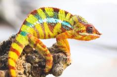

+++
title = "zava"
date = "2021-03-21"
tags = ["green giant", "promise keeper", "herb"]
categories = ["retired-pardalis"]
banner = "img/ambilobe/zava/zava"
+++



Zava is a great YBBB from the Kammerflage Kreations Green Giant x Promise Keeper pairing, produced by Ed Kammer. He brings some great deep blue bars and a yellow body with a significant amount of red highlighting. We were really hoping he'd have less red and more yellow, so we only did a few clutches with him.



Filial
: *F3-CG13*

Sire
: [Itso-triombe (Green Giant)]()

Dam
: [Jiona (June)]()

---




  

    

      <h1>Ancestral Report for Zava (F3-CG13)</h1>
    

    <h3>Generation 1</h3>
    
    
1. <strong>Zava (F3-CG13). </strong>Zava was born on 2021-03-21 at Kammerflage Kreations.  He is the son of Itso-triombe (Green Giant) F9-CG12 and Jiona (June) (F2-CG11). 

    
More about Zava (F3-CG13):

    
Adopted: 2021-05-28, iPardalis.  

    <h3>Generation 2</h3>
    
    
2. <strong>Itso-triombe (Green Giant) F9-CG12. </strong>Itso-triombe (Green Giant) was produced by Kammerflage Kreations.  He is the son of Landy (Silk) F8-CG11 and Hamy (Sweetness) F8-CG11. He had a relationship with Jiona (June) (F2-CG11). 

    
3. <strong>Jiona (June) (F2-CG11). </strong>Jiona (June) was produced by Kammerflage Kreations.  She is the daughter of Manome-toky (Promise Keeper) F8-CG10 and Mitselatra (Stormy Weather) F1-CG10. 

    
Children of Jiona (June) (F2-CG11) and Itso-triombe (Green Giant) F9-CG12

    
i. Zava (F3-CG13) [1]. Zava was born on 2021-03-21 at Kammerflage Kreations.  

    <h3>Generation 3</h3>
    
    
4. <strong>Landy (Silk) F8-CG11. </strong>Landy (Silk) F8-CG11 was born on 2018-02-20 at Kammerflage Kreations.  He is the son of Giga-vony (Old Yeller) and Au-sanga (Goldie Locks). He had a relationship with Hamy (Sweetness) F8-CG11. He also had a relationship with Batata (Sweet Potato). 

    
Children of Batata (Sweet Potato) and Landy (Silk) F8-CG11

    
i. Ingahy-Mahagaga (Mr. Wonderful). Ingahy-Mahagaga (Mr. Wonderful) was produced by Kammerflage Kreations.  

    
    
5. <strong>Hamy (Sweetness) F8-CG11. </strong>Hamy (Sweetness) was produced by Kammerflage Kreations.  She is the daughter of Fantara (Falling Star) and Mavo-loha (Blondie). 

    
Children of Hamy (Sweetness) F8-CG11 and Landy (Silk) F8-CG11

    
i. Itso-triombe (Green Giant) F9-CG12 [2]. Itso-triombe (Green Giant) was produced by Kammerflage Kreations.  

    
ii. Foxey (F9-CG12). Foxey was produced by Kammerflage Kreations.  

    
iii. Shirley (F9-CG12). Shirley was produced by Kammerflage Kreations.  

    
    
6. <strong>Manome-toky (Promise Keeper) F8-CG10. </strong>Manome-toky (Promise Keeper) was produced by Kammerflage Kreations.  He is the son of Bararata-fatio (Bamboo Falcon) and Vony-reny (Yellow Mother). He had a relationship with Mitselatra (Stormy Weather) F1-CG10. 

    
7. <strong>Mitselatra (Stormy Weather) F1-CG10. </strong>She is the daughter of Fanitso (Herb) (WC) and Jaky-fiposohana. 

    
Children of Mitselatra (Stormy Weather) F1-CG10 and Manome-toky (Promise Keeper) F8-CG10

    
i. Zanaka (F2-CG9). Zanaka was born on 2019-05-14 at Kammerflage Kreations.  

    
ii. Jiona (June) (F2-CG11) [3]. Jiona (June) was produced by Kammerflage Kreations.  

    <h3>Generation 4</h3>
    
    
8. <strong>Giga-vony (Old Yeller). </strong>Giga-vony (Old Yeller) was produced by Kammerflage Kreations.  He is the son of Mavo-ra (Yellow Blood) and Tsara-andro (Good Day). He had a relationship with Au-sanga (Goldie Locks). 

    
9. <strong>Au-sanga (Goldie Locks). </strong>She is the daughter of Faingana (Quick). 

    
Children of Au-sanga (Goldie Locks) and Giga-vony (Old Yeller)

    
i. Landy (Silk) F8-CG11 [4]. Landy (Silk) F8-CG11 was born on 2018-02-20 at Kammerflage Kreations.  

    
More about Au-sanga (Goldie Locks) and Giga-vony (Old Yeller):

    
Birth: 2018-02-20, Kammerflage Kreations.  

    
    
10. <strong>Fantara (Falling Star). </strong>Fantara (Falling Star) was produced by Kammerflage Kreations.  He is the son of Maizina-lanitra (Dark Sky). He had a relationship with Zazabodo-manga (Baby Blue). He also had a relationship with Mavo-loha (Blondie). 

    
Children of Zazabodo-manga (Baby Blue) and Fantara (Falling Star)

    
i. Artemis. 

    
    
11. <strong>Mavo-loha (Blondie). </strong>Mavo-loha (Blondie) was born on 2016-02-03 at Kammerflage Kreations.  She is the daughter of Mavo-ra (Yellow Blood) and Tsara-andro (Good Day). 

    
Children of Mavo-loha (Blondie) and Fantara (Falling Star)

    
i. Hamy (Sweetness) F8-CG11 [5]. Hamy (Sweetness) was produced by Kammerflage Kreations.  

    
ii. Ajax. Ajax was produced by Kammerflage Kreations.  

    
iii. Roa-ony (Two Rivers). Roa-ony (Two Rivers) was produced by Kammerflage Kreations.  

    
    
12. <strong>Bararata-fatio (Bamboo Falcon). </strong>Bararata-fatio (Bamboo Falcon) was produced by Kammerflage Kreations.  He died with Kammerflage Kreations.  He had a relationship with Vony-reny (Yellow Mother). 

    
13. <strong>Vony-reny (Yellow Mother). </strong>Vony-reny (Yellow Mother) was produced by Kammerflage Kreations.  She died with Kammerflage Kreations.  She was the daughter of Mavo-ra (Yellow Blood). 

    
Children of Vony-reny (Yellow Mother) and Bararata-fatio (Bamboo Falcon)

    
i. Manome-toky (Promise Keeper) F8-CG10 [6]. Manome-toky (Promise Keeper) was produced by Kammerflage Kreations.  

    
    
14. <strong>Fanitso (Herb) (WC). </strong>He died with Kammerflage Kreations.  He had a relationship with Jaky-fiposohana. 

    
15. <strong>Jaky-fiposohana. </strong>Jaky-fiposohana was produced by Kammerflage Kreations.  She died with Kammerflage Kreations.  She was the daughter of Miroborobo (Blaze) and Little Foot's daughter. 

    
Children of Jaky-fiposohana and Fanitso (Herb) (WC)

    
i. Mitselatra (Stormy Weather) F1-CG10 [7]. 

    <h3>Generation 5</h3>
    
    
16. <strong>Mavo-ra (Yellow Blood). </strong>Mavo-ra (Yellow Blood) was produced by Kammerflage Kreations.  He died with Kammerflage Kreations.  He was the son of Mabonika-haboka (Mellow Yellow). He had a relationship with Unknown. He also had a relationship with Tsara-andro (Good Day). 

    
Children of Unknown and Mavo-ra (Yellow Blood)

    
i. Vony-reny (Yellow Mother) [13]. Vony-reny (Yellow Mother) was produced by Kammerflage Kreations.  She died with Kammerflage Kreations.  

    
    
17. <strong>Tsara-andro (Good Day). </strong>Tsara-andro (Good Day) was produced by Kammerflage Kreations.  She was the daughter of Kely-tongotra (Little Foot). 

    
Children of Tsara-andro (Good Day) and Mavo-ra (Yellow Blood)

    
i. Mavo-loha (Blondie) [11]. Mavo-loha (Blondie) was born on 2016-02-03 at Kammerflage Kreations.  

    
ii. Giga-vony (Old Yeller) [8]. Giga-vony (Old Yeller) was produced by Kammerflage Kreations.  

    
iii. JJ (F7-CG10). JJ  was produced by Kammerflage Kreations.  

    
    
18. <strong>Faingana (Quick). </strong>Faingana (Quick) was produced by Kammerflage Kreations.  He is the son of Kely-tongotra (Little Foot). He had a relationship with Unknown. 

    
Children of Unknown and Faingana (Quick)

    
i. Au-sanga (Goldie Locks) [9]. 

    
    
20. <strong>Maizina-lanitra (Dark Sky). </strong>Maizina-lanitra (Dark Sky) was produced by Kammerflage Kreations.  He is the son of Kely-tongotra (Little Foot). He had a relationship with Unknown. 

    
Children of Unknown and Maizina-lanitra (Dark Sky)

    
i. Fantara (Falling Star) [10]. Fantara (Falling Star) was produced by Kammerflage Kreations.  

    
    
22. <strong>Mavo-ra (Yellow Blood). </strong>Mavo-ra (Yellow Blood) was produced by Kammerflage Kreations.  He died with Kammerflage Kreations.  He was the son of Mabonika-haboka (Mellow Yellow). He had a relationship with Unknown. He also had a relationship with Tsara-andro (Good Day). 

    
Children of Unknown and Mavo-ra (Yellow Blood)

    
i. Vony-reny (Yellow Mother) [13]. Vony-reny (Yellow Mother) was produced by Kammerflage Kreations.  She died with Kammerflage Kreations.  

    
    
23. <strong>Tsara-andro (Good Day). </strong>Tsara-andro (Good Day) was produced by Kammerflage Kreations.  She was the daughter of Kely-tongotra (Little Foot). 

    
Children of Tsara-andro (Good Day) and Mavo-ra (Yellow Blood)

    
i. Mavo-loha (Blondie) [11]. Mavo-loha (Blondie) was born on 2016-02-03 at Kammerflage Kreations.  

    
ii. Giga-vony (Old Yeller) [8]. Giga-vony (Old Yeller) was produced by Kammerflage Kreations.  

    
iii. JJ (F7-CG10). JJ  was produced by Kammerflage Kreations.  

    
    
26. <strong>Mavo-ra (Yellow Blood). </strong>Mavo-ra (Yellow Blood) was produced by Kammerflage Kreations.  He died with Kammerflage Kreations.  He was the son of Mabonika-haboka (Mellow Yellow). He had a relationship with Unknown. He also had a relationship with Tsara-andro (Good Day). 

    
Children of Unknown and Mavo-ra (Yellow Blood)

    
i. Vony-reny (Yellow Mother) [13]. Vony-reny (Yellow Mother) was produced by Kammerflage Kreations.  She died with Kammerflage Kreations.  

    
    
30. <strong>Miroborobo (Blaze). </strong>Miroborobo (Blaze) was produced by Kammerflage Kreations.  He died with Kammerflage Kreations.  He had a relationship with Little Foot's daughter. 

    
31. <strong>Little Foot's daughter. </strong>Little Foot's daughter was produced by Kammerflage Kreations.  She died with Kammerflage Kreations.  She was the daughter of Kely-tongotra (Little Foot). 

    
Children of Little Foot's daughter and Miroborobo (Blaze)

    
i. Jaky-fiposohana [15]. Jaky-fiposohana was produced by Kammerflage Kreations.  She died with Kammerflage Kreations.  

    <h3>Generation 6</h3>
    
    
32. <strong>Mabonika-haboka (Mellow Yellow). </strong>Mabonika-haboka (Mellow Yellow) was produced by Kammerflage Kreations.  He died with Kammerflage Kreations.  He was the son of Maso-vatomamy (Eye Candy). He had a relationship with Unknown. 

    
Children of Unknown and Mabonika-haboka (Mellow Yellow)

    
i. Mavo-ra (Yellow Blood) [26]. Mavo-ra (Yellow Blood) was produced by Kammerflage Kreations.  He died with Kammerflage Kreations.  

    
    
34. <strong>Kely-tongotra (Little Foot). </strong>Kely-tongotra (Little Foot) was produced by Kammerflage Kreations.  He died with Kammerflage Kreations.  He was the son of Hatsikana (Legend). He had a relationship with Unknown. He also had a relationship with Unknown. He also had a relationship with Unknown. He also had a relationship with Eye Candy's daughter. He also had a relationship with Unknown. He also had a relationship with Unknown. He also had a relationship with Unknown. 

    
Children of Unknown and Kely-tongotra (Little Foot)

    
i. Little Foot's daughter [31]. Little Foot's daughter was produced by Kammerflage Kreations.  She died with Kammerflage Kreations.  

    
Children of Unknown and Kely-tongotra (Little Foot)

    
i. Faingana (Quick). Faingana (Quick) was produced by Kammerflage Kreations.  He died with Kammerflage Kreations.  

    
Children of Unknown and Kely-tongotra (Little Foot)

    
i. Little Foot's daughter. Little Foot's daughter was produced by Kammerflage Kreations.  She died with Kammerflage Kreations.  

    
Children of Eye Candy's daughter and Kely-tongotra (Little Foot)

    
i. Dio. He died with Joshua Illencik.  

    
Children of Unknown and Kely-tongotra (Little Foot)

    
i. Tsara-andro (Good Day) [23]. Tsara-andro (Good Day) was produced by Kammerflage Kreations.  

    
Children of Unknown and Kely-tongotra (Little Foot)

    
i. Maizina-lanitra (Dark Sky) [20]. Maizina-lanitra (Dark Sky) was produced by Kammerflage Kreations.  

    
Children of Unknown and Kely-tongotra (Little Foot)

    
i. Faingana (Quick) [18]. Faingana (Quick) was produced by Kammerflage Kreations.  

    
    
36. <strong>Kely-tongotra (Little Foot). </strong>Kely-tongotra (Little Foot) was produced by Kammerflage Kreations.  He died with Kammerflage Kreations.  He was the son of Hatsikana (Legend). He had a relationship with Unknown. He also had a relationship with Unknown. He also had a relationship with Unknown. He also had a relationship with Eye Candy's daughter. He also had a relationship with Unknown. He also had a relationship with Unknown. He also had a relationship with Unknown. 

    
Children of Unknown and Kely-tongotra (Little Foot)

    
i. Little Foot's daughter [31]. Little Foot's daughter was produced by Kammerflage Kreations.  She died with Kammerflage Kreations.  

    
Children of Unknown and Kely-tongotra (Little Foot)

    
i. Faingana (Quick). Faingana (Quick) was produced by Kammerflage Kreations.  He died with Kammerflage Kreations.  

    
Children of Unknown and Kely-tongotra (Little Foot)

    
i. Little Foot's daughter. Little Foot's daughter was produced by Kammerflage Kreations.  She died with Kammerflage Kreations.  

    
Children of Eye Candy's daughter and Kely-tongotra (Little Foot)

    
i. Dio. He died with Joshua Illencik.  

    
Children of Unknown and Kely-tongotra (Little Foot)

    
i. Tsara-andro (Good Day) [23]. Tsara-andro (Good Day) was produced by Kammerflage Kreations.  

    
Children of Unknown and Kely-tongotra (Little Foot)

    
i. Maizina-lanitra (Dark Sky) [20]. Maizina-lanitra (Dark Sky) was produced by Kammerflage Kreations.  

    
Children of Unknown and Kely-tongotra (Little Foot)

    
i. Faingana (Quick) [18]. Faingana (Quick) was produced by Kammerflage Kreations.  

    
    
40. <strong>Kely-tongotra (Little Foot). </strong>Kely-tongotra (Little Foot) was produced by Kammerflage Kreations.  He died with Kammerflage Kreations.  He was the son of Hatsikana (Legend). He had a relationship with Unknown. He also had a relationship with Unknown. He also had a relationship with Unknown. He also had a relationship with Eye Candy's daughter. He also had a relationship with Unknown. He also had a relationship with Unknown. He also had a relationship with Unknown. 

    
Children of Unknown and Kely-tongotra (Little Foot)

    
i. Little Foot's daughter [31]. Little Foot's daughter was produced by Kammerflage Kreations.  She died with Kammerflage Kreations.  

    
Children of Unknown and Kely-tongotra (Little Foot)

    
i. Faingana (Quick). Faingana (Quick) was produced by Kammerflage Kreations.  He died with Kammerflage Kreations.  

    
Children of Unknown and Kely-tongotra (Little Foot)

    
i. Little Foot's daughter. Little Foot's daughter was produced by Kammerflage Kreations.  She died with Kammerflage Kreations.  

    
Children of Eye Candy's daughter and Kely-tongotra (Little Foot)

    
i. Dio. He died with Joshua Illencik.  

    
Children of Unknown and Kely-tongotra (Little Foot)

    
i. Tsara-andro (Good Day) [23]. Tsara-andro (Good Day) was produced by Kammerflage Kreations.  

    
Children of Unknown and Kely-tongotra (Little Foot)

    
i. Maizina-lanitra (Dark Sky) [20]. Maizina-lanitra (Dark Sky) was produced by Kammerflage Kreations.  

    
Children of Unknown and Kely-tongotra (Little Foot)

    
i. Faingana (Quick) [18]. Faingana (Quick) was produced by Kammerflage Kreations.  

    
    
44. <strong>Mabonika-haboka (Mellow Yellow). </strong>Mabonika-haboka (Mellow Yellow) was produced by Kammerflage Kreations.  He died with Kammerflage Kreations.  He was the son of Maso-vatomamy (Eye Candy). He had a relationship with Unknown. 

    
Children of Unknown and Mabonika-haboka (Mellow Yellow)

    
i. Mavo-ra (Yellow Blood) [26]. Mavo-ra (Yellow Blood) was produced by Kammerflage Kreations.  He died with Kammerflage Kreations.  

    
    
46. <strong>Kely-tongotra (Little Foot). </strong>Kely-tongotra (Little Foot) was produced by Kammerflage Kreations.  He died with Kammerflage Kreations.  He was the son of Hatsikana (Legend). He had a relationship with Unknown. He also had a relationship with Unknown. He also had a relationship with Unknown. He also had a relationship with Eye Candy's daughter. He also had a relationship with Unknown. He also had a relationship with Unknown. He also had a relationship with Unknown. 

    
Children of Unknown and Kely-tongotra (Little Foot)

    
i. Little Foot's daughter [31]. Little Foot's daughter was produced by Kammerflage Kreations.  She died with Kammerflage Kreations.  

    
Children of Unknown and Kely-tongotra (Little Foot)

    
i. Faingana (Quick). Faingana (Quick) was produced by Kammerflage Kreations.  He died with Kammerflage Kreations.  

    
Children of Unknown and Kely-tongotra (Little Foot)

    
i. Little Foot's daughter. Little Foot's daughter was produced by Kammerflage Kreations.  She died with Kammerflage Kreations.  

    
Children of Eye Candy's daughter and Kely-tongotra (Little Foot)

    
i. Dio. He died with Joshua Illencik.  

    
Children of Unknown and Kely-tongotra (Little Foot)

    
i. Tsara-andro (Good Day) [23]. Tsara-andro (Good Day) was produced by Kammerflage Kreations.  

    
Children of Unknown and Kely-tongotra (Little Foot)

    
i. Maizina-lanitra (Dark Sky) [20]. Maizina-lanitra (Dark Sky) was produced by Kammerflage Kreations.  

    
Children of Unknown and Kely-tongotra (Little Foot)

    
i. Faingana (Quick) [18]. Faingana (Quick) was produced by Kammerflage Kreations.  

    
    
52. <strong>Mabonika-haboka (Mellow Yellow). </strong>Mabonika-haboka (Mellow Yellow) was produced by Kammerflage Kreations.  He died with Kammerflage Kreations.  He was the son of Maso-vatomamy (Eye Candy). He had a relationship with Unknown. 

    
Children of Unknown and Mabonika-haboka (Mellow Yellow)

    
i. Mavo-ra (Yellow Blood) [26]. Mavo-ra (Yellow Blood) was produced by Kammerflage Kreations.  He died with Kammerflage Kreations.  

    
    
62. <strong>Kely-tongotra (Little Foot). </strong>Kely-tongotra (Little Foot) was produced by Kammerflage Kreations.  He died with Kammerflage Kreations.  He was the son of Hatsikana (Legend). He had a relationship with Unknown. He also had a relationship with Unknown. He also had a relationship with Unknown. He also had a relationship with Eye Candy's daughter. He also had a relationship with Unknown. He also had a relationship with Unknown. He also had a relationship with Unknown. 

    
Children of Unknown and Kely-tongotra (Little Foot)

    
i. Little Foot's daughter [31]. Little Foot's daughter was produced by Kammerflage Kreations.  She died with Kammerflage Kreations.  

    
Children of Unknown and Kely-tongotra (Little Foot)

    
i. Faingana (Quick). Faingana (Quick) was produced by Kammerflage Kreations.  He died with Kammerflage Kreations.  

    
Children of Unknown and Kely-tongotra (Little Foot)

    
i. Little Foot's daughter. Little Foot's daughter was produced by Kammerflage Kreations.  She died with Kammerflage Kreations.  

    
Children of Eye Candy's daughter and Kely-tongotra (Little Foot)

    
i. Dio. He died with Joshua Illencik.  

    
Children of Unknown and Kely-tongotra (Little Foot)

    
i. Tsara-andro (Good Day) [23]. Tsara-andro (Good Day) was produced by Kammerflage Kreations.  

    
Children of Unknown and Kely-tongotra (Little Foot)

    
i. Maizina-lanitra (Dark Sky) [20]. Maizina-lanitra (Dark Sky) was produced by Kammerflage Kreations.  

    
Children of Unknown and Kely-tongotra (Little Foot)

    
i. Faingana (Quick) [18]. Faingana (Quick) was produced by Kammerflage Kreations.  

    <h3>Generation 7</h3>
    
    
64. <strong>Maso-vatomamy (Eye Candy). </strong>Maso-vatomamy (Eye Candy) was produced by Kammerflage Kreations.  He died with Kammerflage Kreations.  He had a relationship with Unknown. He also had a relationship with Unknown. 

    
Children of Unknown and Maso-vatomamy (Eye Candy)

    
i. Eye Candy's daughter. Eye Candy's daughter was produced by Kammerflage Kreations.  She died with Kammerflage Kreations.  

    
Children of Unknown and Maso-vatomamy (Eye Candy)

    
i. Mabonika-haboka (Mellow Yellow) [52]. Mabonika-haboka (Mellow Yellow) was produced by Kammerflage Kreations.  He died with Kammerflage Kreations.  

    
    
68. <strong>Hatsikana (Legend). </strong>Hatsikana (Legend) was produced by Kammerflage Kreations.  He died with Kammerflage Kreations.  He had a relationship with Unknown. 

    
Children of Unknown and Hatsikana (Legend)

    
i. Kely-tongotra (Little Foot) [62]. Kely-tongotra (Little Foot) was produced by Kammerflage Kreations.  He died with Kammerflage Kreations.  

    
    
72. <strong>Hatsikana (Legend). </strong>Hatsikana (Legend) was produced by Kammerflage Kreations.  He died with Kammerflage Kreations.  He had a relationship with Unknown. 

    
Children of Unknown and Hatsikana (Legend)

    
i. Kely-tongotra (Little Foot) [62]. Kely-tongotra (Little Foot) was produced by Kammerflage Kreations.  He died with Kammerflage Kreations.  

    
    
80. <strong>Hatsikana (Legend). </strong>Hatsikana (Legend) was produced by Kammerflage Kreations.  He died with Kammerflage Kreations.  He had a relationship with Unknown. 

    
Children of Unknown and Hatsikana (Legend)

    
i. Kely-tongotra (Little Foot) [62]. Kely-tongotra (Little Foot) was produced by Kammerflage Kreations.  He died with Kammerflage Kreations.  

    
    
88. <strong>Maso-vatomamy (Eye Candy). </strong>Maso-vatomamy (Eye Candy) was produced by Kammerflage Kreations.  He died with Kammerflage Kreations.  He had a relationship with Unknown. He also had a relationship with Unknown. 

    
Children of Unknown and Maso-vatomamy (Eye Candy)

    
i. Eye Candy's daughter. Eye Candy's daughter was produced by Kammerflage Kreations.  She died with Kammerflage Kreations.  

    
Children of Unknown and Maso-vatomamy (Eye Candy)

    
i. Mabonika-haboka (Mellow Yellow) [52]. Mabonika-haboka (Mellow Yellow) was produced by Kammerflage Kreations.  He died with Kammerflage Kreations.  

    
    
92. <strong>Hatsikana (Legend). </strong>Hatsikana (Legend) was produced by Kammerflage Kreations.  He died with Kammerflage Kreations.  He had a relationship with Unknown. 

    
Children of Unknown and Hatsikana (Legend)

    
i. Kely-tongotra (Little Foot) [62]. Kely-tongotra (Little Foot) was produced by Kammerflage Kreations.  He died with Kammerflage Kreations.  

    
    
104. <strong>Maso-vatomamy (Eye Candy). </strong>Maso-vatomamy (Eye Candy) was produced by Kammerflage Kreations.  He died with Kammerflage Kreations.  He had a relationship with Unknown. He also had a relationship with Unknown. 

    
Children of Unknown and Maso-vatomamy (Eye Candy)

    
i. Eye Candy's daughter. Eye Candy's daughter was produced by Kammerflage Kreations.  She died with Kammerflage Kreations.  

    
Children of Unknown and Maso-vatomamy (Eye Candy)

    
i. Mabonika-haboka (Mellow Yellow) [52]. Mabonika-haboka (Mellow Yellow) was produced by Kammerflage Kreations.  He died with Kammerflage Kreations.  

    
    
124. <strong>Hatsikana (Legend). </strong>Hatsikana (Legend) was produced by Kammerflage Kreations.  He died with Kammerflage Kreations.  He had a relationship with Unknown. 

    
Children of Unknown and Hatsikana (Legend)

    
i. Kely-tongotra (Little Foot) [62]. Kely-tongotra (Little Foot) was produced by Kammerflage Kreations.  He died with Kammerflage Kreations.  

  



