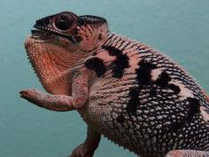

+++
title = "Zozoro"
date = "2021-10-06"
tags = ["gold rush", "my friend", "divergent"]
categories = ["retired-pardalis"]
banner = "img/ambilobe/zozoro/zozoro"
+++



Zozoro is a great YBBB from the Kammerflage sire Gold Rush. His father is my favorite YBBB produced over the past few years and his mother is the combination of a vibrant YBBB named My Friend and a true F1 from two different WC that the Kammer's acclimated recently. Very excited to work this guy into our 4th/5th generation of Ambilobe!



Filial
: *F3-CG13*

Sire
: [Au-Mirongatra (Gold Rush)]()

Dam
: [Ankoso-Bolamena (Goldie)]()

---




  

    

      <h1>Ancestral Report for Zozoro (F3-CG13)</h1>
    

    <h3>Generation 1</h3>
    
    
1. <strong>Zozoro (F3-CG13). </strong>Zozoro was born on 2021-10-06 at Kammerflage Kreations.  He is the son of Au-mirongatra (Gold Rush) (F9-CG12) and Ankoso-bolamena (Goldie) (F2-CG12). 

    
More about Zozoro (F3-CG13):

    
Adopted: 2021-01-28, iPardalis. 

    <h3>Generation 2</h3>
    
    
2. <strong>Au-mirongatra (Gold Rush) (F9-CG12). </strong>Au-mirongatra (Gold Rush) was produced by Kammerflage Kreations.  He is the son of Landy (Silk) F8-CG11 and Hamy (Sweetness) F8-CG11. He had a relationship with Ankoso-bolamena (Goldie) (F2-CG12). 

    
3. <strong>Ankoso-bolamena (Goldie) (F2-CG12). </strong>Ankoso-bolamena (Goldie) was produced by Kammerflage Kreations.  She is the daughter of Ihany-drako (My Friend) (F8-CG11) and Hay-vao (Novel) (F1). 

    
Children of Ankoso-bolamena (Goldie) (F2-CG12) and Au-mirongatra (Gold Rush) (F9-CG12)

    
i. Zozoro (F3-CG13) [1]. Zozoro was born on 2021-10-06 at Kammerflage Kreations.  

    <h3>Generation 3</h3>
    
    
4. <strong>Landy (Silk) F8-CG11. </strong>Landy (Silk) F8-CG11 was born on 2018-02-20 at Kammerflage Kreations.  He is the son of Giga-vony (Old Yeller) and Au-sanga (Goldie Locks). He had a relationship with Hamy (Sweetness) F8-CG11. He also had a relationship with Batata (Sweet Potato). 

    
Children of Batata (Sweet Potato) and Landy (Silk) F8-CG11

    
i. Ingahy-Mahagaga (Mr. Wonderful). Ingahy-Mahagaga (Mr. Wonderful) was produced by Kammerflage Kreations.  

    
    
5. <strong>Hamy (Sweetness) F8-CG11. </strong>Hamy (Sweetness) was produced by Kammerflage Kreations.  She is the daughter of Fantara (Falling Star) (F7-CG10) and Mavo-loha (Blondie). 

    
Children of Hamy (Sweetness) F8-CG11 and Landy (Silk) F8-CG11

    
i. Itso-triombe (Green Giant) F9-CG12. Itso-triombe (Green Giant) was produced by Kammerflage Kreations.  

    
ii. Foxey (F9-CG12). Foxey was produced by Kammerflage Kreations.  

    
iii. Shirley (F9-CG12). Shirley was produced by Kammerflage Kreations.  

    
iv. Au-mirongatra (Gold Rush) (F9-CG12) [2]. Au-mirongatra (Gold Rush) was produced by Kammerflage Kreations.  

    
    
6. <strong>Ihany-drako (My Friend) (F8-CG11). </strong>Ihany-drako (My Friend) was produced by Kammerflage Kreations.  He is the son of Ampiosonga-fantatra (Also Known As) (F7-CG10). He had a relationship with Hay-vao (Novel) (F1). 

    
7. <strong>Hay-vao (Novel) (F1). </strong>Hay-vao (Novel) was produced by Kammerflage Kreations.  She is the daughter of Bakaina (Divergent) (WC) and Goavy (Guava) (F1). 

    
Children of Hay-vao (Novel) (F1) and Ihany-drako (My Friend) (F8-CG11)

    
i. Ankoso-bolamena (Goldie) (F2-CG12) [3]. Ankoso-bolamena (Goldie) was produced by Kammerflage Kreations.  

    <h3>Generation 4</h3>
    
    
8. <strong>Giga-vony (Old Yeller). </strong>Giga-vony (Old Yeller) was produced by Kammerflage Kreations.  He is the son of Mavo-ra (Yellow Blood) and Tsara-andro (Good Day) (F6-CG9). He had a relationship with Au-sanga (Goldie Locks). He also had a relationship with Fanala-Andriana (Frost Queen). 

    
Children of Fanala-Andriana (Frost Queen) and Giga-vony (Old Yeller)

    
i. Sonny (F8-CG11). 

    
9. <strong>Au-sanga (Goldie Locks). </strong>She is the daughter of Faingana (Quick). 

    
Children of Au-sanga (Goldie Locks) and Giga-vony (Old Yeller)

    
i. Landy (Silk) F8-CG11 [4]. Landy (Silk) F8-CG11 was born on 2018-02-20 at Kammerflage Kreations.  

    
More about Au-sanga (Goldie Locks) and Giga-vony (Old Yeller):

    
Birth: 2018-02-20, Kammerflage Kreations. 

    
    
10. <strong>Fantara (Falling Star) (F7-CG10). </strong>Fantara (Falling Star) was produced by Kammerflage Kreations.  He is the son of Maizina-lanitra (Dark Sky). He had a relationship with Zazabodo-manga (Baby Blue). He also had a relationship with Mavo-loha (Blondie). He also had a relationship with Unknown. 

    
Children of Zazabodo-manga (Baby Blue) and Fantara (Falling Star) (F7-CG10)

    
i. Artemis (F8-CG11). 

    
Children of Unknown and Fantara (Falling Star) (F7-CG10)

    
i. Fantara's daughter (F8-CG11). 

    
    
11. <strong>Mavo-loha (Blondie). </strong>Mavo-loha (Blondie) was born on 2016-02-03 at Kammerflage Kreations.  She is the daughter of Mavo-ra (Yellow Blood) and Tsara-andro (Good Day) (F6-CG9). 

    
Children of Mavo-loha (Blondie) and Fantara (Falling Star) (F7-CG10)

    
i. Hamy (Sweetness) F8-CG11 [5]. Hamy (Sweetness) was produced by Kammerflage Kreations.  

    
ii. Ajax (F8-CG11). Ajax was produced by Kammerflage Kreations.  

    
iii. Roa-ony (Two Rivers) (F8-CG11). Roa-ony (Two Rivers) was produced by Kammerflage Kreations.  

    
    
12. <strong>Ampiosonga-fantatra (Also Known As) (F7-CG10). </strong>Ampiosonga-fantatra (Also Known As) was produced by Kammerflage Kreations.  He had a relationship with Unknown. He also had a relationship with Unknown. 

    
Children of Unknown and Ampiosonga-fantatra (Also Known As) (F7-CG10)

    
i. Koa-mbola (And Still!) (F8-CG11). Koa-mbola (And Still!) was produced by Kammerflage Kreations.  

    
Children of Unknown and Ampiosonga-fantatra (Also Known As) (F7-CG10)

    
i. Ihany-drako (My Friend) (F8-CG11) [6]. Ihany-drako (My Friend) was produced by Kammerflage Kreations.  

    
    
14. <strong>Bakaina (Divergent) (WC). </strong>He had a relationship with Goavy (Guava) (F1). 

    
More about Bakaina (Divergent) (WC):

    
Adopted: Kammerflage Kreations. 

    
15. <strong>Goavy (Guava) (F1). </strong>She is the daughter of Fanitso (Herb) (WC). 

    
Children of Goavy (Guava) (F1) and Bakaina (Divergent) (WC)

    
i. Hay-vao (Novel) (F1) [7]. Hay-vao (Novel) was produced by Kammerflage Kreations.  

    <h3>Generation 5</h3>
    
    
16. <strong>Mavo-ra (Yellow Blood). </strong>Mavo-ra (Yellow Blood) was produced by Kammerflage Kreations.  He is the son of Mabonika-haboka (Mellow Yellow). He had a relationship with Unknown. He also had a relationship with Tsara-andro (Good Day) (F6-CG9). 

    
Children of Unknown and Mavo-ra (Yellow Blood)

    
i. Vony-reny (Yellow Mother). Vony-reny (Yellow Mother) was produced by Kammerflage Kreations.  

    
    
17. <strong>Tsara-andro (Good Day) (F6-CG9). </strong>Tsara-andro (Good Day) was produced by Kammerflage Kreations.  She is the daughter of Kely-tongotra (Little Foot) (F5-CG8). 

    
Children of Tsara-andro (Good Day) (F6-CG9) and Mavo-ra (Yellow Blood)

    
i. Mavo-loha (Blondie) [11]. Mavo-loha (Blondie) was born on 2016-02-03 at Kammerflage Kreations.  

    
ii. Giga-vony (Old Yeller) [8]. Giga-vony (Old Yeller) was produced by Kammerflage Kreations.  

    
iii. JJ (F7-CG10). JJ was produced by Kammerflage Kreations.  

    
    
18. <strong>Faingana (Quick). </strong>Faingana (Quick) was produced by Kammerflage Kreations.  He is the son of Kely-tongotra (Little Foot) (F5-CG8). He had a relationship with Unknown. 

    
Children of Unknown and Faingana (Quick)

    
i. Au-sanga (Goldie Locks) [9]. 

    
    
20. <strong>Maizina-lanitra (Dark Sky). </strong>Maizina-lanitra (Dark Sky) was produced by Kammerflage Kreations.  He is the son of Kely-tongotra (Little Foot) (F5-CG8). He had a relationship with Unknown. He also had a relationship with Unknown. 

    
Children of Unknown and Maizina-lanitra (Dark Sky)

    
i. Fantara (Falling Star) (F7-CG10) [10]. Fantara (Falling Star) was produced by Kammerflage Kreations.  

    
Children of Unknown and Maizina-lanitra (Dark Sky)

    
i. Bolitika-zandry (Little Sister). Bolitika-zandry (Little Sister) was produced by Kammerflage Kreations.  

    
    
22. <strong>Mavo-ra (Yellow Blood). </strong> is the same person as [16].

    
    
23. <strong>Tsara-andro (Good Day) (F6-CG9). </strong> is the same person as [17].

    
    
30. <strong>Fanitso (Herb) (WC). </strong>He had a relationship with Jaky-fiposohana. He also had a relationship with Unknown. 

    
Children of Jaky-fiposohana and Fanitso (Herb) (WC)

    
i. Mitselatra (Stormy Weather) F1-CG10. 

    
Children of Unknown and Fanitso (Herb) (WC)

    
i. Goavy (Guava) (F1) [15]. 

    <h3>Generation 6</h3>
    
    
32. <strong>Mabonika-haboka (Mellow Yellow). </strong>Mabonika-haboka (Mellow Yellow) was produced by Kammerflage Kreations.  He is the son of Maso-vatomamy (Eye Candy). He had a relationship with Unknown. 

    
Children of Unknown and Mabonika-haboka (Mellow Yellow)

    
i. Mavo-ra (Yellow Blood) [22]. Mavo-ra (Yellow Blood) was produced by Kammerflage Kreations.  

    
    
34. <strong>Kely-tongotra (Little Foot) (F5-CG8). </strong>Kely-tongotra (Little Foot) was produced by Kammerflage Kreations.  He is the son of Hatsikana (Legend). He had a relationship with Unknown. He also had a relationship with Unknown. He also had a relationship with Unknown. He also had a relationship with Eye Candy's daughter. He also had a relationship with Unknown. He also had a relationship with Unknown. He also had a relationship with Unknown. 

    
Children of Unknown and Kely-tongotra (Little Foot) (F5-CG8)

    
i. Little Foot's daughter. Little Foot's daughter was produced by Kammerflage Kreations.  

    
Children of Unknown and Kely-tongotra (Little Foot) (F5-CG8)

    
i. Faingana (Quick). Faingana (Quick) was produced by Kammerflage Kreations.  

    
Children of Unknown and Kely-tongotra (Little Foot) (F5-CG8)

    
i. Little Foot's daughter. Little Foot's daughter was produced by Kammerflage Kreations.  

    
Children of Eye Candy's daughter and Kely-tongotra (Little Foot) (F5-CG8)

    
i. Dio (F6-CG9). 

    
Children of Unknown and Kely-tongotra (Little Foot) (F5-CG8)

    
i. Tsara-andro (Good Day) (F6-CG9) [23]. Tsara-andro (Good Day) was produced by Kammerflage Kreations.  

    
Children of Unknown and Kely-tongotra (Little Foot) (F5-CG8)

    
i. Maizina-lanitra (Dark Sky) [20]. Maizina-lanitra (Dark Sky) was produced by Kammerflage Kreations.  

    
Children of Unknown and Kely-tongotra (Little Foot) (F5-CG8)

    
i. Faingana (Quick) [18]. Faingana (Quick) was produced by Kammerflage Kreations.  

    
    
36. <strong>Kely-tongotra (Little Foot) (F5-CG8). </strong> is the same person as [34].

    
    
40. <strong>Kely-tongotra (Little Foot) (F5-CG8). </strong> is the same person as [34].

    
    
44. <strong>Mabonika-haboka (Mellow Yellow). </strong> is the same person as [32].

    
    
46. <strong>Kely-tongotra (Little Foot) (F5-CG8). </strong> is the same person as [34].

    <h3>Generation 7</h3>
    
    
64. <strong>Maso-vatomamy (Eye Candy). </strong>Maso-vatomamy (Eye Candy) was produced by Kammerflage Kreations.  He had a relationship with Unknown. He also had a relationship with Unknown. 

    
Children of Unknown and Maso-vatomamy (Eye Candy)

    
i. Eye Candy's daughter. Eye Candy's daughter was produced by Kammerflage Kreations.  

    
Children of Unknown and Maso-vatomamy (Eye Candy)

    
i. Mabonika-haboka (Mellow Yellow) [44]. Mabonika-haboka (Mellow Yellow) was produced by Kammerflage Kreations.  

    
    
68. <strong>Hatsikana (Legend). </strong>Hatsikana (Legend) was produced by Kammerflage Kreations.  He had a relationship with Unknown. 

    
Children of Unknown and Hatsikana (Legend)

    
i. Kely-tongotra (Little Foot) (F5-CG8) [46]. Kely-tongotra (Little Foot) was produced by Kammerflage Kreations.  

    
    
72. <strong>Hatsikana (Legend). </strong> is the same person as [68].

    
    
80. <strong>Hatsikana (Legend). </strong> is the same person as [68].

    
    
88. <strong>Maso-vatomamy (Eye Candy). </strong> is the same person as [64].

    
    
92. <strong>Hatsikana (Legend). </strong> is the same person as [68].

  



